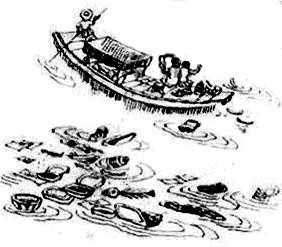

# 2011 年全国硕士研究生招生考试英语（一）试题

> 科目代码 201 ｜ 满分 100 分 ｜ 考试时间 180 分钟

> 说明：本文件由历年真题整理生成，供个人备考使用。**参考答案在文末**。

---

## Section I Use of English

> Read the following text. Choose the best word(s) for each numbered blank and mark A, B, C or D on ANSWER SHEET 1.

Ancient Greek philosopher Aristotle viewed laughter as “a bodily exercise precious to health.” But \_\_\_(1)\_\_\_ some claims to the contrary, laughing probably has little influence on physical fitness. Laughter does \_\_\_(2)\_\_\_ short-term changes in the function of the heart and its blood vessels, \_\_\_(3)\_\_\_ heart rate and oxygen consumption. But because hard laughter is difficult to \_\_\_(4)\_\_\_, a good laugh is unlikely to have \_\_\_(5)\_\_\_ benefits the way, say, walking or jogging does.

\_\_\_(6)\_\_\_, instead of straining muscles to build them, as exercise does, laughter apparently accomplishes the \_\_\_(7)\_\_\_. Studies dating back to the 1930s indicate that laughter \_\_\_(8)\_\_\_ muscles, decreasing muscle tone for up to 45 minutes after the laugh dies down.

Such bodily reaction might conceivably help \_\_\_(9)\_\_\_ the effects of psychological stress. Anyway, the act of laughing probably does produce other types of \_\_\_(10)\_\_\_ feedback that improve an individual’s emotional state. \_\_\_(11)\_\_\_ one classical theory of emotion, our feelings are partially rooted \_\_\_(12)\_\_\_ physical reactions. It was argued at the end of the 19th century that humans do not cry \_\_\_(13)\_\_\_ they are sad but they become sad when the tears begin to flow.

Although sadness also \_\_\_(14)\_\_\_ tears, evidence suggests that emotions can flow \_\_\_(15)\_\_\_ muscular responses. In an experiment published in 1988, social psychologist Fritz Strack of the University of Würzburg in Germany asked volunteers to \_\_\_(16)\_\_\_ a pen either with their teeth – thereby creating an artificial smile – or with their lips, which would produce a(n) \_\_\_(17)\_\_\_ expression. Those forced to exercise their smiling muscles \_\_\_(18)\_\_\_ more enthusiastically to funny cartoons than did those whose mouths were contracted in a frown, \_\_\_(19)\_\_\_ that expressions may influence emotions rather than just the other way around. \_\_\_(20)\_\_\_, the physical act of laughter could improve mood.

**1.** **A.** among&nbsp;&nbsp;&nbsp;&nbsp;**B.** except&nbsp;&nbsp;&nbsp;&nbsp;**C.** despite&nbsp;&nbsp;&nbsp;&nbsp;**D.** like

**2.** **A.** reflect&nbsp;&nbsp;&nbsp;&nbsp;**B.** demand&nbsp;&nbsp;&nbsp;&nbsp;**C.** indicate&nbsp;&nbsp;&nbsp;&nbsp;**D.** produce

**3.** **A.** stabilizing&nbsp;&nbsp;&nbsp;&nbsp;**B.** boosting&nbsp;&nbsp;&nbsp;&nbsp;**C.** impairing&nbsp;&nbsp;&nbsp;&nbsp;**D.** determining

**4.** **A.** transmit&nbsp;&nbsp;&nbsp;&nbsp;**B.** sustain&nbsp;&nbsp;&nbsp;&nbsp;**C.** evaluate&nbsp;&nbsp;&nbsp;&nbsp;**D.** observe

**5.** **A.** measurable&nbsp;&nbsp;&nbsp;&nbsp;**B.** manageable&nbsp;&nbsp;&nbsp;&nbsp;**C.** affordable&nbsp;&nbsp;&nbsp;&nbsp;**D.** renewable

**6.** **A.** In turn&nbsp;&nbsp;&nbsp;&nbsp;**B.** In fact&nbsp;&nbsp;&nbsp;&nbsp;**C.** In addition&nbsp;&nbsp;&nbsp;&nbsp;**D.** In brief

**7.** **A.** opposite&nbsp;&nbsp;&nbsp;&nbsp;**B.** impossible&nbsp;&nbsp;&nbsp;&nbsp;**C.** average&nbsp;&nbsp;&nbsp;&nbsp;**D.** expected

**8.** **A.** hardens&nbsp;&nbsp;&nbsp;&nbsp;**B.** weakens&nbsp;&nbsp;&nbsp;&nbsp;**C.** tightens&nbsp;&nbsp;&nbsp;&nbsp;**D.** relaxes

**9.** **A.** aggravate&nbsp;&nbsp;&nbsp;&nbsp;**B.** generate&nbsp;&nbsp;&nbsp;&nbsp;**C.** moderate&nbsp;&nbsp;&nbsp;&nbsp;**D.** enhance

**10.** **A.** physical&nbsp;&nbsp;&nbsp;&nbsp;**B.** mental&nbsp;&nbsp;&nbsp;&nbsp;**C.** subconscious&nbsp;&nbsp;&nbsp;&nbsp;**D.** internal

**11.** **A.** Except for&nbsp;&nbsp;&nbsp;&nbsp;**B.** According to&nbsp;&nbsp;&nbsp;&nbsp;**C.** Due to&nbsp;&nbsp;&nbsp;&nbsp;**D.** As for

**12.** **A.** with&nbsp;&nbsp;&nbsp;&nbsp;**B.** on&nbsp;&nbsp;&nbsp;&nbsp;**C.** in&nbsp;&nbsp;&nbsp;&nbsp;**D.** at

**13.** **A.** unless&nbsp;&nbsp;&nbsp;&nbsp;**B.** until&nbsp;&nbsp;&nbsp;&nbsp;**C.** if&nbsp;&nbsp;&nbsp;&nbsp;**D.** because

**14.** **A.** exhausts&nbsp;&nbsp;&nbsp;&nbsp;**B.** follows&nbsp;&nbsp;&nbsp;&nbsp;**C.** precedes&nbsp;&nbsp;&nbsp;&nbsp;**D.** suppresses

**15.** **A.** into&nbsp;&nbsp;&nbsp;&nbsp;**B.** from&nbsp;&nbsp;&nbsp;&nbsp;**C.** towards&nbsp;&nbsp;&nbsp;&nbsp;**D.** beyond

**16.** **A.** fetch&nbsp;&nbsp;&nbsp;&nbsp;**B.** bite&nbsp;&nbsp;&nbsp;&nbsp;**C.** pick&nbsp;&nbsp;&nbsp;&nbsp;**D.** hold

**17.** **A.** disappointed&nbsp;&nbsp;&nbsp;&nbsp;**B.** excited&nbsp;&nbsp;&nbsp;&nbsp;**C.** joyful&nbsp;&nbsp;&nbsp;&nbsp;**D.** indifferent

**18.** **A.** adapted&nbsp;&nbsp;&nbsp;&nbsp;**B.** catered&nbsp;&nbsp;&nbsp;&nbsp;**C.** turned&nbsp;&nbsp;&nbsp;&nbsp;**D.** reacted

**19.** **A.** suggesting&nbsp;&nbsp;&nbsp;&nbsp;**B.** requiring&nbsp;&nbsp;&nbsp;&nbsp;**C.** mentioning&nbsp;&nbsp;&nbsp;&nbsp;**D.** supposing

**20.** **A.** Eventually&nbsp;&nbsp;&nbsp;&nbsp;**B.** Consequently&nbsp;&nbsp;&nbsp;&nbsp;**C.** Similarly&nbsp;&nbsp;&nbsp;&nbsp;**D.** Conversely

## Section II Reading Comprehension — Part A

> Read the following four texts. Answer the questions below each text by choosing A, B, C or D. Mark your answers on ANSWER SHEET 1.

### Text 1

The decision of the New York Philharmonic to hire Alan Gilbert as its next music director has been the talk of the classical-music world ever since the sudden announcement of his appointment in 2009. For the most part, the response has been favorable, to say the least. “Hooray! At last!” wrote Anthony Tommasini, a sober-sided classical-music critic.

One of the reasons why the appointment came as such a surprise, however, is that Gilbert is comparatively little known. Even Tommasini, who had advocated Gilbert’s appointment in the Times, calls him “an unpretentious musician with no air of the formidable conductor about him.” As a description of the next music director of an orchestra that has hitherto been led by musicians like Gustav Mahler and Pierre Boulez, that seems likely to have struck at least some Times readers as faint praise.

For my part, I have no idea whether Gilbert is a great conductor or even a good one. To be sure, he performs an impressive variety of interesting compositions, but it is not necessary for me to visit Avery Fisher Hall, or anywhere else, to hear interesting orchestral music. All I have to do is to go to my CD shelf, or boot up my computer and download still more recorded music from iTunes.

Devoted concertgoers who reply that recordings are no substitute for live performance are missing the point. For the time, attention, and money of the art-loving public, classical instrumentalists must compete not only with opera houses, dance troupes, theater companies, and museums, but also with the recorded performances of the great classical musicians of the 20th century. These recordings are cheap, available everywhere, and very often much higher in artistic quality than today’s live performances; moreover, they can be “consumed” at a time and place of the listener’s choosing. The widespread availability of such recordings has thus brought about a crisis in the institution of the traditional classical concert.

One possible response is for classical performers to program attractive new music that is not yet available on record. Gilbert’s own interest in new music has been widely noted: Alex Ross, a classical-music critic, has described him as a man who is capable of turning the Philharmonic into “a markedly different, more vibrant organization.” But what will be the nature of that difference? Merely expanding the orchestra’s repertoire will not be enough. If Gilbert and the Philharmonic are to succeed, they must first change the relationship between America’s oldest orchestra and the new audience it hopes to attract.

**21.** We learn from Paragraph 1 that Gilbert’s appointment has

- **A.** incurred criticism.
- **B.** raised suspicion.
- **C.** received acclaim.
- **D.** aroused curiosity.

**22.** Tommasini regards Gilbert as an artist who is

- **A.** influential.
- **B.** modest.
- **C.** respectable.
- **D.** talented.

**23.** The author believes that the devoted concertgoers

- **A.** ignore the expenses of live performances.
- **B.** reject most kinds of recorded performances.
- **C.** exaggerate the variety of live performances.
- **D.** overestimate the value of live performances.

**24.** According to the text, which of the following is true of recordings?

- **A.** They are often inferior to live concerts in quality.
- **B.** They are easily accessible to the general public.
- **C.** They help improve the quality of music.
- **D.** They have only covered masterpieces.

**25.** Regarding Gilbert’s role in revitalizing the Philharmonic, the author feels

- **A.** doubtful.
- **B.** enthusiastic.
- **C.** confident.
- **D.** puzzled.

### Text 2

When Liam McGee departed as president of Bank of America in August, his explanation was surprisingly straight up. Rather than cloaking his exit in the usual vague excuses, he came right out and said he was leaving “to pursue my goal of running a company.” Broadcasting his ambition was “very much my decision,” McGee says. Within two weeks, he was talking for the first time with the board of Hartford Financial Services Group, which named him CEO and chairman on September 29.

McGee says leaving without a position lined up gave him time to reflect on what kind of company he wanted to run. It also sent a clear message to the outside world about his aspirations. And McGee isn’t alone. In recent weeks the No.2 executives at Avon and American Express quit with the explanation that they were looking for a CEO post. As boards scrutinize succession plans in response to shareholder pressure, executives who don’t get the nod also may wish to move on. A turbulent business environment also has senior managers cautious of letting vague pronouncements cloud their reputations.

As the first signs of recovery begin to take hold, deputy chiefs may be more willing to make the jump without a net. In the third quarter, CEO turnover was down 23% from a year ago as nervous boards stuck with the leaders they had, according to Liberum Research. As the economy picks up, opportunities will abound for aspiring leaders.

The decision to quit a senior position to look for a better one is unconventional. For years executives and headhunters have adhered to the rule that the most attractive CEO candidates are the ones who must be poached. Says Korn/Ferry senior partner Dennis Carey: “I can’t think of a single search I’ve done where a board has not instructed me to look at sitting CEOs first.”

Those who jumped without a job haven’t always landed in top positions quickly. Ellen Marram quit as chief of Tropicana a decade ago, saying she wanted to be a CEO. It was a year before she became head of a tiny Internet-based commodities exchange. Robert Willumstad left Citigroup in 2005 with ambitions to be a CEO. He finally took that post at a major financial institution three years later.

Many recruiters say the old disgrace is fading for top performers. The financial crisis has made it more acceptable to be between jobs or to leave a bad one. “The traditional rule was it’s safer to stay where you are, but that’s been fundamentally inverted,” says one headhunter. “The people who’ve been hurt the worst are those who’ve stayed too long.”

**26.** When McGee announced his departure, his manner can best be described as being

- **A.** arrogant.
- **B.** frank.
- **C.** self-centered.
- **D.** impulsive.

**27.** According to Paragraph 2, senior executives’ quitting may be spurred by

- **A.** their expectation of better financial status.
- **B.** their need to reflect on their private life.
- **C.** their strained relations with the boards.
- **D.** their pursuit of new career goals.

**28.** The word “poached” (Line 3, Paragraph 4) most probably means

- **A.** approved of.
- **B.** attended to.
- **C.** hunted for.
- **D.** guarded against.

**29.** It can be inferred from the last paragraph that

- **A.** top performers used to cling to their posts.
- **B.** loyalty of top performers is getting out-dated.
- **C.** top performers care more about reputations.
- **D.** it’s safer to stick to the traditional rules.

**30.** Which of the following is the best title for the text?

- **A.** CEOs: Where to Go?
- **B.** CEOs: All the Way Up?
- **C.** Top Managers Jump without a Net
- **D.** The Only Way Out for Top Performers

### Text 3

The rough guide to marketing success used to be that you got what you paid for. No longer. While traditional “paid” media – such as television commercials and print advertisements – still play a major role, companies today can exploit many alternative forms of media. Consumers passionate about a product may create “earned” media by willingly promoting it to friends, and a company may leverage “owned” media by sending e-mail alerts about products and sales to customers registered with its Web site. The way consumers now approach the process of making purchase decisions means that marketing’s impact stems from a broad range of factors beyond conventional paid media.

Paid and owned media are controlled by marketers promoting their own products. For earned media, such marketers act as the initiator for users’ responses. But in some cases, one marketer’s owned media become another marketer’s paid media – for instance, when an e-commerce retailer sells ad space on its Web site. We define such sold media as owned media whose traffic is so strong that other organizations place their content or e-commerce engines within that environment. This trend, which we believe is still in its infancy, effectively began with retailers and travel providers such as airlines and hotels and will no doubt go further. Johnson & Johnson, for example, has created BabyCenter, a stand-alone media property that promotes complementary and even competitive products. Besides generating income, the presence of other marketers makes the site seem objective, gives companies opportunities to learn valuable information about the appeal of other companies’ marketing, and may help expand user traffic for all companies concerned.

The same dramatic technological changes that have provided marketers with more (and more diverse) communications choices have also increased the risk that passionate consumers will voice their opinions in quicker, more visible, and much more damaging ways. Such hijacked media are the opposite of earned media: an asset or campaign becomes hostage to consumers, other stakeholders, or activists who make negative allegations about a brand or product. Members of social networks, for instance, are learning that they can hijack media to apply pressure on the businesses that originally created them.

If that happens, passionate consumers would try to persuade others to boycott products, putting the reputation of the target company at risk. In such a case, the company’s response may not be sufficiently quick or thoughtful, and the learning curve has been steep. Toyota Motor, for example, alleviated some of the damage from its recall crisis earlier this year with a relatively quick and well-orchestrated social-media response campaign, which included efforts to engage with consumers directly on sites such as Twitter and the social-news site Digg.

**31.** Consumers may create “earned” media when they are

- **A.** obsessed with online shopping at certain Web sites.
- **B.** inspired by product-promoting e-mails sent to them.
- **C.** eager to help their friends promote quality products.
- **D.** enthusiastic about recommending their favorite products.

**32.** According to Paragraph 2, sold media feature

- **A.** a safe business environment.
- **B.** random competition.
- **C.** strong user traffic.
- **D.** flexibility in organization.

**33.** The author indicates in Paragraph 3 that earned media

- **A.** invite constant conflicts with passionate consumers.
- **B.** can be used to produce negative effects in marketing.
- **C.** may be responsible for fiercer competition.
- **D.** deserve all the negative comments about them.

**34.** Toyota Motor’s experience is cited as an example of

- **A.** responding effectively to hijacked media.
- **B.** persuading customers into boycotting products.
- **C.** cooperating with supportive consumers.
- **D.** taking advantage of hijacked media.

**35.** Which of the following is the text mainly about?

- **A.** Alternatives to conventional paid media.
- **B.** Conflict between hijacked and earned media.
- **C.** Dominance of hijacked media.
- **D.** Popularity of owned media.

### Text 4

It’s no surprise that Jennifer Senior’s insightful, provocative magazine cover story, “I love My Children, I Hate My Life, ” is arousing much chatter – nothing gets people talking like the suggestion that child rearing is anything less than a completely fulfilling, life-enriching experience. Rather than concluding that children make parents either happy or miserable, Senior suggests we need to redefine happiness: instead of thinking of it as something that can be measured by moment-to-moment joy, we should consider being happy as a past-tense condition. Even though the day-to-day experience of raising kids can be soul-crushingly hard, Senior writes that “the very things that in the moment dampen our moods can later be sources of intense gratification and delight.”

The magazine cover showing an attractive mother holding a cute baby is hardly the only Madonna-and-child image on newsstands this week. There are also stories about newly adoptive – and newly single – mom Sandra Bullock, as well as the usual “Jennifer Aniston is pregnant” news. Practically every week features at least one celebrity mom, or mom-to-be, smiling on the newsstands.

In a society that so persistently celebrates procreation, is it any wonder that admitting you regret having children is equivalent to admitting you support kitten-killing? It doesn’t seem quite fair, then, to compare the regrets of parents to the regrets of the childless. Unhappy parents rarely are provoked to wonder if they shouldn’t have had kids, but unhappy childless folks are bothered with the message that children are the single most important thing in the world: obviously their misery must be a direct result of the gaping baby-size holes in their lives.

Of course, the image of parenthood that celebrity magazines like Us Weekly and People present is hugely unrealistic, especially when the parents are single mothers like Bullock. According to several studies concluding that parents are less happy than childless couples, single parents are the least happy of all. No shock there, considering how much work it is to raise a kid without a partner to lean on; yet to hear Sandra and Britney tell it, raising a kid on their “own” (read: with round-the-clock help) is a piece of cake.

It’s hard to imagine that many people are dumb enough to want children just because Reese and Angelina make it look so glamorous: most adults understand that a baby is not a haircut. But it’s interesting to wonder if the images we see every week of stress-free, happiness-enhancing parenthood aren’t in some small, subconscious way contributing to our own dissatisfactions with the actual experience, in the same way that a small part of us hoped getting “the Rachel” might make us look just a little bit like Jennifer Aniston.

**36.** Jennifer Senior suggests in her article that raising a child can bring

- **A.** temporary delight.
- **B.** enjoyment in progress.
- **C.** happiness in retrospect.
- **D.** lasting reward.

**37.** We learn from Paragraph 2 that

- **A.** celebrity moms are a permanent source for gossip.
- **B.** single mothers with babies deserve greater attention.
- **C.** news about pregnant celebrities is entertaining.
- **D.** having children is highly valued by the public.

**38.** It is suggested in Paragraph 3 that childless folks

- **A.** are constantly exposed to criticism.
- **B.** are largely ignored by the media.
- **C.** fail to fulfill their social responsibilities.
- **D.** are less likely to be satisfied with their life.

**39.** According to Paragraph 4, the message conveyed by celebrity magazines is

- **A.** soothing.
- **B.** ambiguous.
- **C.** compensatory.
- **D.** misleading.

**40.** Which of the following can be inferred from the last paragraph?

- **A.** Having children contributes little to the glamour of celebrity moms.
- **B.** Celebrity moms have influenced our attitude towards child rearing.
- **C.** Having children intensifies our dissatisfaction with life.
- **D.** We sometimes neglect the happiness from child rearing.

## Section II Reading Comprehension — Part B

> The following paragraphs are given in a wrong order. For questions 41-45, you are required to reorganize these paragraphs into a coherent text by choosing from the list A-G and filling them into the numbered boxes. Paragraphs E and G have been correctly placed. Mark your answers on ANSWER SHEET 1.

**文章顺序（方框处需从 A–G 中择段填入）**

> **[已给出段落 G]** The subtle and intelligent little book The Marketplace of Ideas: Reform and Resistance in the American University should be read by every student thinking of applying to take a doctoral degree. They may then decide to go elsewhere. For something curious has been happening in American universities, and Louis Menand, a professor of English at Harvard University, captured it skillfully.

**(41)** &nbsp;\_\_\_\_\_\_\_\_\_\_\_\_\_\_\_\_\_\_

**(42)** &nbsp;\_\_\_\_\_\_\_\_\_\_\_\_\_\_\_\_\_\_

> **[已给出段落 E]** Besides professionalising the professions by this separation, top American universities have professionalised the professor. The growth in public money for academic research has speeded the process: federal research grants rose fourfold between 1960 and 1990, but faculty teaching hours fell by half as research took its toll. Professionalism has turned the acquisition of a doctoral degree into a prerequisite for a successful academic career: as late as 1969 a third of American professors did not possess one. But the key idea behind professionalisation, argues Mr. Menand, is that “the knowledge and skills needed for a particular specialisation are transmissible but not transferable.” So disciplines acquire a monopoly not just over the production of knowledge, but also over the production of the producers of knowledge.

**(43)** &nbsp;\_\_\_\_\_\_\_\_\_\_\_\_\_\_\_\_\_\_

**(44)** &nbsp;\_\_\_\_\_\_\_\_\_\_\_\_\_\_\_\_\_\_

**(45)** &nbsp;\_\_\_\_\_\_\_\_\_\_\_\_\_\_\_\_\_\_

**待选段落**

- **A.** No disciplines have seized on professionalism with as much enthusiasm as the humanities. You can, Mr. Menand points out, become a lawyer in three years and a medical doctor in four. But the regular time it takes to get a doctoral degree in the humanities is nine years. Not surprisingly, up to half of all doctoral students in English drop out before getting their degrees.
- **B.** His concern is mainly with the humanities: literature, languages, philosophy and so on. These are disciplines that are going out of style: 22% of American college graduates now major in business compared with only 2% in history and 4% in English. However, many leading American universities want their undergraduates to have a grounding in the basic canon of ideas that every educated person should possess. But most find it difficult to agree on what a “general education” should look like. At Harvard, Mr. Menand notes, “the great books are read because they have been read” – they form a sort of social glue.
- **C.** Equally unsurprisingly, only about half end up with professorships for which they entered graduate school. There are simply too few posts. This is partly because universities continue to produce ever more PhDs. But fewer students want to study humanities subjects: English departments awarded more bachelor’s degrees in 1970-71 than they did 20 years later. Fewer students require fewer teachers. So, at the end of a decade of thesis-writing, many humanities students leave the profession to do something for which they have not been trained.
- **D.** One reason why it is hard to design and teach such courses is that they cut across the insistence by top American universities that liberal-arts education and professional education should be kept separate, taught in different schools. Many students experience both varieties. Although more than half of Harvard undergraduates end up in law, medicine or business, future doctors and lawyers must study a non-specialist liberal-arts degree before embarking on a professional qualification.
- **F.** The key to reforming higher education, concludes Mr. Menand, is to alter the way in which “the producers of knowledge are produced”. Otherwise, academics will continue to think dangerously alike, increasingly detached from the societies which they study, investigate and criticise. “Academic inquiry, at least in some fields, may need to become less exclusionary and more holistic.” Yet quite how that happens, Mr. Menand does not say.

## Section II Reading Comprehension — Part C

> Read the following text carefully and then translate the underlined segments into Chinese. Your translation should be written neatly on ANSWER SHEET 2.

With its theme that “Mind is the master weaver,” creating our inner character and outer circumstances, the book As a Man Thinketh by James Allen is an in-depth exploration of the central idea of self-help writing.

<u>Allen’s contribution was to take an assumption we all share – that because we are not robots we therefore control our thoughts – and reveal its erroneous nature.</u> Because most of us believe that mind is separate from matter, we think that thoughts can be hidden and made powerless; this allows us to think one way and act another. However, Allen believed that the unconscious mind generates as much action as the conscious mind, and <u>while we may be able to sustain the illusion of control through the conscious mind alone, in reality we are continually faced with a question: “Why cannot I make myself do this or achieve that?”</u>

Since desire and will are damaged by the presence of thoughts that do not accord with desire, Allen concluded: “We do not attract what we want, but what we are.” Achievement happens because you as a person embody the external achievement; you don’t “get” success but become it. There is no gap between mind and matter.

Part of the fame of Allen’s book is its contention that “Circumstances do not make a person, they reveal him.” <u>This seems a justification for neglect of those in need, and a rationalization of exploitation, of the superiority of those at the top and the inferiority of those at the bottom .</u>

This, however, would be a knee-jerk reaction to a subtle argument. Each set of circumstances, however bad, offers a unique opportunity for growth. If circumstances always determined the life and prospects of people, then humanity would never have progressed. In fact, <u>circumstances seem to be designed to bring out the best in us, and if we feel that we have been “wronged” then we are unlikely to begin a conscious effort to escape from our situation.</u> Nevertheless, as any biographer knows, a person’s early life and its conditions are often the greatest gift to an individual.

The sobering aspect of Allen’s book is that we have no one else to blame for our present condition except ourselves. <u>The upside is the possibilities contained in knowing that everything is up to us; where before we were experts in the array of limitations, now we become authorities of what is possible.</u>

**46.** Allen’s contribution was to take an assumption we all share – that because we are not robots we therefore control our thoughts – and reveal its erroneous nature.

**47.** while we may be able to sustain the illusion of control through the conscious mind alone, in reality we are continually faced with a question: “Why cannot I make myself do this or achieve that?”

**48.** This seems a justification for neglect of those in need, and a rationalization of exploitation, of the superiority of those at the top and the inferiority of those at the bottom.

**49.** circumstances seem to be designed to bring out the best in us, and if we feel that we have been “wronged” then we are unlikely to begin a conscious effort to escape from our situation.

**50.** The upside is the possibilities contained in knowing that everything is up to us; where before we were experts in the array of limitations, now we become authorities of what is possible.

## Section III Writing — Part A

51. Directions:
Write a letter to a friend of yours to
1) recommend one of your favorite movies and
2) give reasons for your recommendation.
You should write about 100 words on ANSWER SHEET 2.
Do not sign your own name at the end of the letter. Use “Li Ming” instead.
Do not write the address.

## Section III Writing — Part B

52. Directions:
Write an essay of 160-200 words based on the following drawing. In your essay, you should
1) describe the drawing briefly,
2) explain its intended meaning, and
3) give your comments.
You should write neatly on ANSWER SHEET 2.
旅程之“余”

---

## 参考答案

### Section I Use of English

**1.** C · despite
**2.** D · produce
**3.** B · boosting
**4.** B · sustain
**5.** A · measurable
**6.** B · In fact
**7.** A · opposite
**8.** D · relaxes
**9.** C · moderate
**10.** A · physical
**11.** B · According to
**12.** C · in
**13.** D · because
**14.** C · precedes
**15.** B · from
**16.** D · hold
**17.** A · disappointed
**18.** D · reacted
**19.** A · suggesting
**20.** C · Similarly

### Section II Reading Comprehension — Part A

*Text 1*

**21.** C · received acclaim.
**22.** B · modest.
**23.** D · overestimate the value of live performances.
**24.** B · They are easily accessible to the general public.
**25.** A · doubtful.

*Text 2*

**26.** B · frank.
**27.** D · their pursuit of new career goals.
**28.** C · hunted for.
**29.** A · top performers used to cling to their posts.
**30.** C · Top Managers Jump without a Net

*Text 3*

**31.** D · enthusiastic about recommending their favorite products.
**32.** C · strong user traffic.
**33.** B · can be used to produce negative effects in marketing.
**34.** A · responding effectively to hijacked media.
**35.** A · Alternatives to conventional paid media.

*Text 4*

**36.** C · happiness in retrospect.
**37.** D · having children is highly valued by the public.
**38.** A · are constantly exposed to criticism.
**39.** D · misleading.
**40.** B · Celebrity moms have influenced our attitude towards child rearing.

### Section II Reading Comprehension — Part B

**41–45**：B  D  A  C  F

### Section II Reading Comprehension — Part C

**46.** 爱伦的贡献在于，他拿出“我们并非机器人，因此能掌控自己的思想”这一公认的假设，并揭示了其谬误所在。
> **采分点**：`Allen's contribution was to take an assumption`（0.5） ｜ `we all share`（0.5） ｜ `that because we are not robots we therefore control our thoughts——`（0.5） ｜ `and reveal its erroneous nature`（0.5）

**47.** 尽管我们或许可以仅凭意识来维系“控制”这种错觉，现实中我们还是不断要面对一个问题：“我为什么不能让自己做这个或实现那个？”
> **采分点**：`while we may be able to sustain the illusion of control`（0.5） ｜ `through the conscious mind alone`（0.5） ｜ `in reality we are continually faced with a question`（0.5） ｜ `Why cannot I make myself do this or achieve that?”`（0.5）

**48.** 这似乎是在为忽视贫困者的行为作辩护，为剥削、为社会上层人群的优越及社会底层人群的卑微找理由。
> **采分点**：`This seems a justification for neglect of those in need`（0.5） ｜ `and a rationalization of exploitation`（0.5） ｜ `of the superiority of those at the top and the inferiority of those at the bottom`（1）

**49.** 环境仿佛就是为了激发我们的最大潜能而设，如果我们觉得自己遭受了“不公”，就不太可能有意识地去努力摆脱自己的处境。
> **采分点**：`circumstances seem to be designed to bring out the best in us`（0.5） ｜ `and if we feel that we have`（0.5） ｜ `then we are unlikely to begin a conscious effort`（0.5） ｜ `to escape from our situation`（0.5）

**50.** 其正面意义在于，了解了一切都取决于我们自己，即有了诸多可能；此前我们是谙熟各种局限的专家，现在我们成了驾驭各种可能性的权威。
> **采分点**：`The upside is the possibilities`（0.5） ｜ `contained in knowing that everything is up to us`（0.5） ｜ `where before we were experts in the array of limitations`（0.5） ｜ `now we become authorities of what is possible`（0.5）

### Section III Writing — Part A

**51 参考范文**

Dear Jane,
I'm so glad to hear from you as it has been a long time since we met last time. You told me in your letter that you loved to watch inspirational movies, so I'm writing to recommend one of my favorite movies to you, which is called The Devil Wears Prada.
I love it for two reasons. To begin with, the film explores the theme of growth and self-discovery in the workplace, which could easily strike a chord with young people. The aspirant heroine undergoes an “ugly duckling-swan” phase in the workplace and finally returns to her initial ideal, inspiring us to be true to ourselves. In addition, the glamour of fashion industry also adds appeal to the film.
Hope you enjoy the movie and look forward to your reply.
Yours truly,
Li Ming

### Section III Writing — Part B

**52 参考范文**

In the picture, two tourists, enjoying a delightful boat trip on the lake, are dropping litter recklessly into the lake — a behavior that makes themselves as well as the scenery not beautiful at all. And unfortunately, the lake is already littered with a clutter of garbage, which has spoiled the previously scenic lake. Just as the caption “What’s ‘Left’ after the Travel” implies, the cartoon is a poignant criticism of tourists with uncivil conducts that lead to environmental damage.
What is reflected in the picture is troubling many scenic spots today. Such behavior comes primarily from tourists' lack of environmental awareness, thinking of just casually littering garbage as no big deal. They regard themselves merely as passers-by, who need not assume the responsibility of protecting the environment of the scenic spots. However, if everyone lacked environmental awareness, standing by and seeing environment hurt, the beautiful spots, even our whole country, would be swallowed up by rubbish one day.
To avoid this kind of tragedy, the whole society should take actions to protect our home. For one thing, everyone should realize the importance of protecting the environment and start small by no littering at will and stopping others from doing that timely. For another, relevant authorities should establish sound and efficient laws and regulations on environmental protection, supervise effectively and punish law breakers severely. Hopefully through shared efforts, we can make ourselves behave better, make the landscape of our homeland more magnificent, and fulfill the dream of “green China” sooner.
