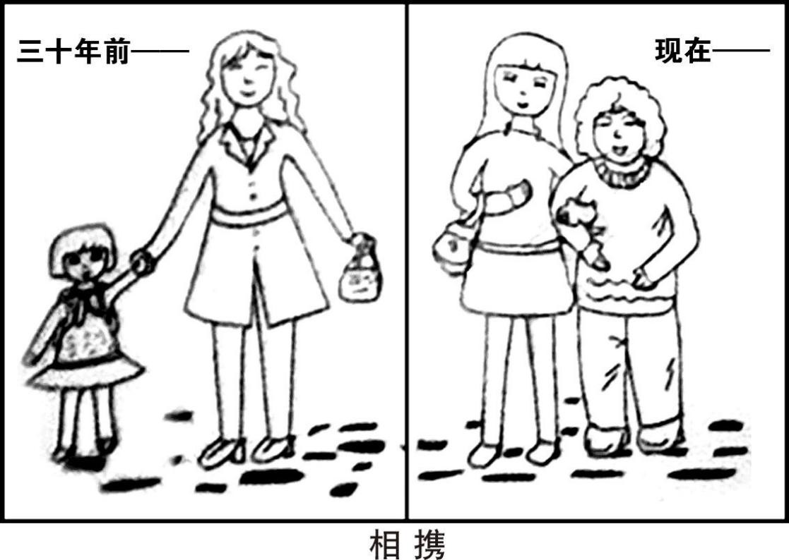

# 2014 年全国硕士研究生招生考试英语（一）试题

> 科目代码 201 ｜ 满分 100 分 ｜ 考试时间 180 分钟

> 说明：本文件由历年真题整理生成，供个人备考使用。**参考答案在文末**。

---

## Section I Use of English

> Directions:
> Read the following text. Choose the best word(s) for each numbered blank and mark
> A, B, C or D on the ANSWER SHEET. (10 points)

As many people hit middle age, they often start to notice that their memory
and mental clarity are not what they used to be. We suddenly can’t remember
\_\_\_(1)\_\_\_ we put the keys just a moment ago, or an old acquaintance’s name, or the
name of an old band we used to love. As the brain \_\_\_(2)\_\_\_ , we refer to these
occurrences as “senior moments.” \_\_\_(3)\_\_\_ seemingly innocent, this loss of mental
focus can potentially have a(n) \_\_\_(4)\_\_\_ impact on our professional, social, and
personal \_\_\_(5)\_\_\_ .

Neuroscientists, experts who study the nervous system, are increasingly
showing that there’s actually a lot that can be done. It \_\_\_(6)\_\_\_ out that the brain
needs exercise in much the same way our muscles do, and the right mental
\_\_\_(7)\_\_\_ can significantly improve our basic cognitive \_\_\_(8)\_\_\_ . Thinking is
essentially a \_\_\_(9)\_\_\_ of making connections in the brain. To a certain extent, our
ability to \_\_\_(10)\_\_\_ in making the connections that drive intelligence is
inherited.

\_\_\_(11)\_\_\_ , because these connections are made through effort and practice,
scientists believe that intelligence can expand and fluctuate \_\_\_(12)\_\_\_ mental
effort.

Now, a new Web-based company has taken it a step \_\_\_(13)\_\_\_ and developed
the first “brain training program” designed to actually help people improve and regain
their mental \_\_\_(14)\_\_\_ .

The Web-based program \_\_\_(15)\_\_\_ you to systematically improve your
memory and attention skills. The program keeps \_\_\_(16)\_\_\_ of your progress and
provides detailed feedback \_\_\_(17)\_\_\_ your performance and improvement. Most
importantly, it \_\_\_(18)\_\_\_ modifies and enhances the games you play to \_\_\_(19)\_\_\_ on
the strengths you are developing – much like a(n) \_\_\_(20)\_\_\_ exercise routine
requires you to increase resistance and vary your muscle use.

**1.** **A.** that&nbsp;&nbsp;&nbsp;&nbsp;**B.** when&nbsp;&nbsp;&nbsp;&nbsp;**C.** why&nbsp;&nbsp;&nbsp;&nbsp;**D.** where

**2.** **A.** fades&nbsp;&nbsp;&nbsp;&nbsp;**B.** improves&nbsp;&nbsp;&nbsp;&nbsp;**C.** collapses&nbsp;&nbsp;&nbsp;&nbsp;**D.** recovers

**3.** **A.** Unless&nbsp;&nbsp;&nbsp;&nbsp;**B.** While&nbsp;&nbsp;&nbsp;&nbsp;**C.** Once&nbsp;&nbsp;&nbsp;&nbsp;**D.** If

**4.** **A.** damaging&nbsp;&nbsp;&nbsp;&nbsp;**B.** limited&nbsp;&nbsp;&nbsp;&nbsp;**C.** uneven&nbsp;&nbsp;&nbsp;&nbsp;**D.** obscure

**5.** **A.** relationship&nbsp;&nbsp;&nbsp;&nbsp;**B.** environment&nbsp;&nbsp;&nbsp;&nbsp;**C.** wellbeing&nbsp;&nbsp;&nbsp;&nbsp;**D.** outlook

**6.** **A.** figures&nbsp;&nbsp;&nbsp;&nbsp;**B.** finds&nbsp;&nbsp;&nbsp;&nbsp;**C.** points&nbsp;&nbsp;&nbsp;&nbsp;**D.** turns

**7.** **A.** responses&nbsp;&nbsp;&nbsp;&nbsp;**B.** associations&nbsp;&nbsp;&nbsp;&nbsp;**C.** workouts&nbsp;&nbsp;&nbsp;&nbsp;**D.** roundabouts

**8.** **A.** genre&nbsp;&nbsp;&nbsp;&nbsp;**B.** criterion&nbsp;&nbsp;&nbsp;&nbsp;**C.** circumstances&nbsp;&nbsp;&nbsp;&nbsp;**D.** functions

**9.** **A.** channel&nbsp;&nbsp;&nbsp;&nbsp;**B.** process&nbsp;&nbsp;&nbsp;&nbsp;**C.** condition&nbsp;&nbsp;&nbsp;&nbsp;**D.** sequence

**10.** **A.** persist&nbsp;&nbsp;&nbsp;&nbsp;**B.** feature&nbsp;&nbsp;&nbsp;&nbsp;**C.** excel&nbsp;&nbsp;&nbsp;&nbsp;**D.** believe

**11.** **A.** However&nbsp;&nbsp;&nbsp;&nbsp;**B.** Moreover&nbsp;&nbsp;&nbsp;&nbsp;**C.** Otherwise&nbsp;&nbsp;&nbsp;&nbsp;**D.** Therefore

**12.** **A.** according to&nbsp;&nbsp;&nbsp;&nbsp;**B.** regardless of&nbsp;&nbsp;&nbsp;&nbsp;**C.** apart from&nbsp;&nbsp;&nbsp;&nbsp;**D.** instead of

**13.** **A.** back&nbsp;&nbsp;&nbsp;&nbsp;**B.** further&nbsp;&nbsp;&nbsp;&nbsp;**C.** aside&nbsp;&nbsp;&nbsp;&nbsp;**D.** around

**14.** **A.** framework&nbsp;&nbsp;&nbsp;&nbsp;**B.** stability&nbsp;&nbsp;&nbsp;&nbsp;**C.** flexibility&nbsp;&nbsp;&nbsp;&nbsp;**D.** sharpness

**15.** **A.** hurries&nbsp;&nbsp;&nbsp;&nbsp;**B.** reminds&nbsp;&nbsp;&nbsp;&nbsp;**C.** allows&nbsp;&nbsp;&nbsp;&nbsp;**D.** forces

**16.** **A.** order&nbsp;&nbsp;&nbsp;&nbsp;**B.** track&nbsp;&nbsp;&nbsp;&nbsp;**C.** pace&nbsp;&nbsp;&nbsp;&nbsp;**D.** hold

**17.** **A.** on&nbsp;&nbsp;&nbsp;&nbsp;**B.** to&nbsp;&nbsp;&nbsp;&nbsp;**C.** for&nbsp;&nbsp;&nbsp;&nbsp;**D.** with

**18.** **A.** habitually&nbsp;&nbsp;&nbsp;&nbsp;**B.** constantly&nbsp;&nbsp;&nbsp;&nbsp;**C.** irregularly&nbsp;&nbsp;&nbsp;&nbsp;**D.** unusually

**19.** **A.** carry&nbsp;&nbsp;&nbsp;&nbsp;**B.** put&nbsp;&nbsp;&nbsp;&nbsp;**C.** build&nbsp;&nbsp;&nbsp;&nbsp;**D.** take

**20.** **A.** idle&nbsp;&nbsp;&nbsp;&nbsp;**B.** risky&nbsp;&nbsp;&nbsp;&nbsp;**C.** familiar&nbsp;&nbsp;&nbsp;&nbsp;**D.** effective

## Section II Reading Comprehension — Part A

> Part A
> Directions:
> Read the following four texts. Answer the questions below each text by choosing
> A, B, C or D. Mark your answers on the ANSWER SHEET. (40 points)

### Text 1

In order to “change lives for the better” and reduce “dependency”, George
Osborne, Chancellor of the Exchequer, introduced the “upfront work search”
scheme. Only if the jobless arrive at the jobcentre with a CV, register for online job
search, and start looking for work will they be eligible for benefit – and then they
should report weekly rather than fortnightly. What could be more reasonable?

More apparent reasonableness followed. There will now be a seven-day wait
for the jobseeker’s allowance. “Those first few days should be spent looking for
work, not looking to sign on ,” he claimed. “We’re doing these things because we
know they help people stay off benefits and help those on benefits get into work
faster.” Help? Really? On first hearing, this was the socially concerned chancellor,
trying to change lives for the better, complete with “reforms” to an obviously
indulgent system that demands too little effort from the newly unemployed to find
work, and subsidises laziness. What motivated him, we were to understand, was his
zeal for “fundamental fairness” – protecting the taxpayer, controlling spending and
ensuring that only the most deserving claimants received their benefits.

Losing a job is hurting: you don’t skip down to the jobcentre with a song in your
heart, delighted at the prospect of doubling your income from the generous state. It is
financially terrifying, psychologically embarrassing and you know that support is
minimal and extraordinarily hard to get. You are now not wanted; you are now
excluded from the work environment that offers purpose and structure in your life.
Worse, the crucial income to feed yourself and your family and pay the bills has
disappeared. Ask anyone newly unemployed what they want and the answer is
always: a job.

But in Osborneland, your first instinct is to fall into dependency – permanent
dependency if you can get it – supported by a state only too ready to indulge your
falsehood. It is as though 20 years of ever-tougher reforms of the job search and
benefit administration system never happened. The principle of British welfare
is no longer that you can insure yourself against the risk of unemployment and
receive unconditional payments if the disaster happens. Even the very phrase
“jobseeker’s allowance” is about redefining the unemployed as a “jobseeker” who
had no fundamental right to a benefit he or she has earned through making
national insurance contributions. Instead, the claimant receives a time-limited
“allowance,” conditional on actively seeking a job; no entitlement and no
insurance, at £71.70 a week, one of the least generous in the EU.

**21.** George Osborne’s scheme was intended to

- **A.** encourage jobseekers’ active engagement in job seeking.
- **B.** provide the unemployed with easier access to benefits.
- **C.** guarantee jobseekers’ legitimate right to benefits.
- **D.** motivate the unemployed to report voluntarily.

**22.** The phrase “to sign on” (Line 3, Para. 2) most probably means

- **A.** to check on the availability of jobs at the jobcentre.
- **B.** to accept the government’s restrictions on the allowance.
- **C.** to register for an allowance from the government.
- **D.** to attend a governmental job-training program.

**23.** What prompted the chancellor to develop his scheme?

- **A.** A desire to secure a better life for all.
- **B.** An eagerness to protect the unemployed.
- **C.** An urge to be generous to the claimants.
- **D.** A passion to ensure fairness for taxpayers.

**24.** According to Paragraph 3, being unemployed makes one feel

- **A.** uneasy.
- **B.** insulted.
- **C.** enraged.
- **D.** guilty.

**25.** To which of the following would the author most probably agree?

- **A.** Unemployment benefits should not be made conditional.
- **B.** The British welfare system indulges jobseekers’ laziness.
- **C.** The jobseekers’ allowance has met their actual needs.
- **D.** Osborne’s reforms will reduce the risk of unemployment.

### Text 2

All around the world, lawyers generate more hostility than the members of
any other profession – with the possible exception of journalism. But there are
few places where clients have more grounds for complaint than America.

During the decade before the economic crisis, spending on legal services in
America grew twice as fast as inflation. The best lawyers made skyscrapers-full of
money, tempting ever more students to pile into law schools. But most law
graduates never get a big-firm job. Many of them instead become the kind of
nuisance-lawsuit filer that makes the tort system a costly nightmare.

There are many reasons for this. One is the excessive costs of a legal
education. There is just one path for a lawyer in most American states: a four-year
undergraduate degree in some unrelated subject, then a three-year law degree at
one of 200 law schools authorized by the American Bar Association and an
expensive preparation for the bar exam. This leaves today’s average law-school
graduate with $100,000 of debt on top of undergraduate debts. Law-school debt
means that they have to work fearsomely hard.

Reforming the system would help both lawyers and their customers. Sensible
ideas have been around for a long time, but the state-level bodies that govern the
profession have been too conservative to implement them. One idea is to allow people
to study law as an undergraduate degree. Another is to let students sit for the bar after
only two years of law school. If the bar exam is truly a stern enough test for a would-
be lawyer, those who can sit it earlier should be allowed to do so. Students who do not
need the extra training could cut their debt mountain by a third.

The other reason why costs are so high is the restrictive guild-like ownership
structure of the business. Except in the District of Columbia, non-lawyers may not
own any share of a law firm. This keeps fees high and innovation slow. There is
pressure for change from within the profession, but opponents of change among the
regulators insist that keeping outsiders out of a law firm isolates lawyers from the
pressure to make money rather than serve clients ethically.

In fact, allowing non-lawyers to own shares in law firms would reduce costs
and improve services to customers, by encouraging law firms to use technology
and to employ professional managers to focus on improving firms’ efficiency. After
all, other countries, such as Australia and Britain, have started liberalizing their legal
professions. America should follow.

**26.** A lot of students take up law as their profession due to

- **A.** the growing demand from clients.
- **B.** the increasing pressure of inflation.
- **C.** the prospect of working in big firms.
- **D.** the attraction of financial rewards.

**27.** Which of the following adds to the costs of legal education in most American
states?

- **A.** Higher tuition fees for undergraduate studies.
- **B.** Receiving training by professional associations.
- **C.** Admissions approval from the bar association.
- **D.** Pursuing a bachelor’s degree in another major.

**28.** Hindrance to the reform of the legal system originates from

- **A.** the rigid bodies governing the profession.
- **B.** lawyers’ and clients’ strong resistance.
- **C.** the stern exam for would-be lawyers.
- **D.** non-professionals’ sharp criticism.

**29.** The guild-like ownership structure is considered “restrictive” partly because it

- **A.** prevents lawyers from gaining due profits.
- **B.** bans outsiders’ involvement in the profession.
- **C.** aggravates the ethical situation in the trade.
- **D.** keeps lawyers from holding law-firm shares.

**30.** In this text, the author mainly discusses

- **A.** the factors that help make a successful lawyer in America.
- **B.** a problem in America’s legal profession and solutions to it.
- **C.** the role of undergraduate studies in America’s legal education.
- **D.** flawed ownership of America’s law firms and its causes.

### Text 3

The US$3-million Fundamental Physics Prize is indeed an interesting
experiment, as Alexander Polyakov said when he accepted this year’s award in
March. And it is far from the only one of its type. As a News Feature article in
Nature discusses, a string of lucrative awards for researchers have joined the
Nobel Prizes in recent years. Many, like the Fundamental Physics Prize, are funded
from the telephone-number-sized bank accounts of Internet entrepreneurs.These
benefactors have succeeded in their chosen fields, they say, and they want to use
their wealth to draw attention to those who have succeeded in science.

What’s not to like? Quite a lot, according to a handful of scientists quoted in the
News Feature. You cannot buy class, as the old saying goes, and these upstart
entrepreneurs cannot buy their prizes the prestige of the Nobels. The new awards
are an exercise in self-promotion for those behind them, say scientists. They could
distort the achievement-based system of peer-review-led research. They could cement
the status quo of peer-reviewed research. They do not fund peer-reviewed research.
They perpetuate the myth of the lone genius.

The goals of the prize-givers seem as scattered as the criticism. Some want to
shock, others to draw people into science, or to better reward those who have
made their careers in research.

As Nature has pointed out before, there are some legitimate concerns about
how science prizes – both new and old – are distributed. The Breakthrough Prize
in Life Sciences, launched this year, takes an unrepresentative view of what the
life sciences include. But the Nobel Foundation’s limit of three recipients per
prize, each of whom must still be living, has long been outgrown by the
collaborative nature of modern research – as will be demonstrated by the
inevitable row over who is ignored when it comes to acknowledging the discovery
of the Higgs boson. The Nobels were, of course, themselves set up by a very rich
individual who had decided what he wanted to do with his own money. Time,
rather than intention, has given them legitimacy.

As much as some scientists may complain about the new awards, two things
seem clear. First, most researchers would accept such a prize if they were offered
one. Second, it is surely a good thing that the money and attention come to science
rather than go elsewhere. It is fair to criticize and question the mechanism – that
is the culture of research, after all – but it is the prize-givers’ money to do with as they
please. It is wise to take such gifts with gratitude and grace.

**31.** The Fundamental Physics Prize is seen as

- **A.** a symbol of the entrepreneurs’ wealth.
- **B.** a handsome reward for researchers.
- **C.** a possible replacement of the Nobel Prizes.
- **D.** an example of bankers’ investments.

**32.** The critics think that the new awards will most benefit

- **A.** the profit-oriented scientists.
- **B.** the achievement-based system.
- **C.** the founders of the new awards.
- **D.** peer-review-led research.

**33.** The discovery of the Higgs boson is a typical case which involves

- **A.** legitimate concerns over the new prizes.
- **B.** controversies over the recipients’ status.
- **C.** the joint effort of modern researchers.
- **D.** the demonstration of research findings.

**34.** According to Paragraph 4, which of the following is true of the Nobels?

- **A.** History has never cast doubt on them.
- **B.** Their endurance has done justice to them.
- **C.** They are the most representative honor.
- **D.** Their legitimacy has long been in dispute.

**35.** The author believes that the new awards are

- **A.** unworthy of public attention.
- **B.** subject to undesirable changes.
- **C.** harmful to the culture of research.
- **D.** acceptable despite the criticism.

### Text 4

“The Heart of the Matter,” the just-released report by the American Academy
of Arts and Sciences (AAAS), deserves praise for affirming the importance of the
humanities and social sciences to the prosperity and security of liberal democracy
in America. Regrettably, however, the report’s failure to address the true nature of
the crisis facing liberal education may cause more harm than good.

In 2010, leading congressional Democrats and Republicans sent letters to the
AAAS asking that it identify actions that could be taken by “federal, state and local
governments, universities, foundations, educators, individual benefactors and others”
to “maintain national excellence in humanities and social scientific scholarship
and education.” In response, the American Academy formed the Commission
on the Humanities and Social Sciences. Among the commission’s 51 members are
top-tier-university presidents, scholars, lawyers, judges, and business executives,
as well as prominent figures from diplomacy, filmmaking, music and journalism.

The goals identified in the report are generally admirable. Because
representative government presupposes an informed citizenry, the report supports
full literacy; stresses the study of history and government, particularly American
history and American government; and encourages the use of new digital
technologies. To encourage innovation and competition, the report calls for
increased investment in research, the crafting of coherent curricula that improve
students’ ability to solve problems and communicate effectively in the 21st century,
increased funding for teachers and the encouragement of scholars to bring their
learning to bear on the great challenges of the day. The report also advocates greater
study of foreign languages, international affairs and the expansion of study abroad
programs.

Unfortunately, despite 21/2 years in the making, “The Heart of the Matter”
never gets to the heart of the matter: the illiberal nature of liberal education at our
leading colleges and universities. The commission ignores that for several decades
America’s colleges and universities have produced graduates who don’t know the
content and character of liberal education and are thus deprived of its benefits.
Sadly, the spirit of inquiry once at home on campus has been replaced by the use
of the humanities and social sciences as vehicles for publicizing “progressive,” or
left-liberal propaganda.

Today, professors routinely treat the progressive interpretation of history and
progressive public policy as the proper subject of study while portraying conservative
or classical liberal ideas – such as free markets and self-reliance – as falling
outside the boundaries of routine, and sometimes legitimate, intellectual investigation.

The AAAS displays great enthusiasm for liberal education. Yet its report may
well set back reform by obscuring the depth and breadth of the challenge that
Congress asked it to illuminate.

**36.** According to Paragraph 1, what is the author’s attitude toward the AAAS’s report?

- **A.** Critical.
- **B.** Appreciative.
- **C.** Contemptuous.
- **D.** Tolerant.

**37.** Influential figures in the Congress required that the AAAS report on how to

- **A.** define the government’s role in education.
- **B.** safeguard individuals’ rights to education.
- **C.** retain people’s interest in liberal education.
- **D.** keep a leading position in liberal education.

**38.** According to Paragraph 3, the report suggests

- **A.** an exclusive study of American history.
- **B.** a greater emphasis on theoretical subjects.
- **C.** the application of emerging technologies.
- **D.** funding for the study of foreign languages.

**39.** The author implies in Paragraph 5 that professors are

- **A.** supportive of free markets.
- **B.** conservative about public policy.
- **C.** biased against classical liberal ideas.
- **D.** cautious about intellectual investigation.

**40.** Which of the following would be the best title for the text?

- **A.** Ways to Grasp “The Heart of the Matter”
- **B.** Illiberal Education and “The Heart of the Matter”
- **C.** The AAAS’s Contribution to Liberal Education
- **D.** Progressive Policy vs. Liberal Education

## Section II Reading Comprehension — Part B

> Part B
> Directions:
> The following paragraphs are given in a wrong order. For Questions 41-45, you
> are required to reorganize these paragraphs into a coherent text by choosing from
> the list A-G and filling them into the numbered boxes. Paragraphs A and E have
> been correctly placed. Mark your answers on the ANSWER SHEET. (10 points)

**文章顺序（方框处需从 A–G 中择段填入）**

**(41)** &nbsp;\_\_\_\_\_\_\_\_\_\_\_\_\_\_\_\_\_\_

> **[已给出段落 A]** Some archaeological sites have always been easily observable – for example,
the Parthenon in Athens, Greece; the pyramids of Giza in Egypt; and the
megaliths of Stonehenge in southern England. But these sites are exceptions
to the norm. Most archaeological sites have been located by means of careful
searching, while many others have been discovered by accident. Olduvai Gorge,
an early hominid site in Tanzania, was found by a butterfly hunter who literally
fell into its deep valley in 1911. Thousands of Aztec artifacts came to light
during the digging of the Mexico City subway in the 1970s.

**(42)** &nbsp;\_\_\_\_\_\_\_\_\_\_\_\_\_\_\_\_\_\_

> **[已给出段落 E]** To find their sites, archaeologists today rely heavily on systematic survey
methods and a variety of high-technology tools and techniques. Airborne
technologies, such as different types of radar and photographic equipment
carried by airplanes or spacecraft, allow archaeologists to learn about what
lies beneath the ground without digging. Aerial surveys locate general areas
of interest or larger buried features, such as ancient buildings or fields.

**(43)** &nbsp;\_\_\_\_\_\_\_\_\_\_\_\_\_\_\_\_\_\_

**(44)** &nbsp;\_\_\_\_\_\_\_\_\_\_\_\_\_\_\_\_\_\_

**(45)** &nbsp;\_\_\_\_\_\_\_\_\_\_\_\_\_\_\_\_\_\_

**待选段落**

- **B.** In another case, American archaeologists René Million and George Cowgill
spent years systematically mapping the entire city of Teotihuacán in the
Valley of Mexico near what is now Mexico City. At its peak around AD 600,
this city was one of the largest human settlements in the world. The
researchers mapped not only the city’s vast and ornate ceremonial areas, but
also hundreds of simpler apartment complexes where common people lived.
- **C.** How do archaeologists know where to find what they are looking for when
there is nothing visible on the surface of the ground? Typically, they survey
and sample (make test excavations on) large areas of terrain to determine
where excavation will yield useful information. Surveys and test samples have
also become important for understanding the larger landscapes that contain
archaeological sites.
- **D.** Surveys can cover a single large settlement or entire landscapes. In one case,
many researchers working around the ancient Maya city of Copán, Honduras,
have located hundreds of small rural villages and individual dwellings by
using aerial photographs and by making surveys on foot. The resulting
settlement maps show how the distribution and density of the rural population
around the city changed dramatically between AD 500 and 850, when Copán
collapsed.
- **F.** Most archaeological sites, however, are discovered by archaeologists who
have set out to look for them. Such searches can take years. British
archaeologist Howard Carter knew that the tomb of the Egyptian pharaoh
Tutankhamun existed from information found in other sites. Carter sifted
through rubble in the Valley of the Kings for seven years before he located
the tomb in 1922. In the late 1800s British archaeologist Sir Arthur Evans
combed antique dealers’ stores in Athens, Greece. He was searching for tiny
engraved seals attributed to the ancient Mycenaean culture that dominated
Greece from the 1400s to 1200s BC. Evans’s interpretations of these
engravings eventually led him to find the Minoan palace at Knossos (Knosós),
on the island of Crete, in 1900.
- **G.** Ground surveys allow archaeologists to pinpoint the places where digs will be
successful. Most ground surveys involve a lot of walking, looking for surface
clues such as small fragments of pottery. They often include a certain amount
of digging to test for buried materials at selected points across a landscape.
Archaeologists also may locate buried remains by using such technologies as
ground radar, magnetic-field recording, and metal detectors. Archaeologists
commonly use computers to map sites and the landscapes around sites. Two-
and three-dimensional maps are helpful tools in planning excavations,
illustrating how sites look, and presenting the results of archaeological
research.

## Section II Reading Comprehension — Part C

> Part C
> Directions:
> Read the following text carefully and then translate the underlined segments into
> Chinese. Your translation should be written neatly on the ANSWER SHEET. (10
> points)

Music means different things to different people and sometimes even different things to the same person at different moments of his life. It might be poetic, philosophical, sensual, or mathematical, but in any case it must, in my view, have something to do with the soul of the human being. Hence it is metaphysical; but the means of expression is purely and exclusively physical: sound. I believe it is precisely this permanent coexistence of metaphysical message through physical means that is the strength of music. (46) <u>It is also the reason why when we try to describe music with words, all we can do is articulate our reactions to it , and not grasp music itself .</u>

Beethoven’s importance in music has been principally defined by the revolutionary nature of his compositions. He freed music from hitherto prevailing conventions of harmony and structure. Sometimes I feel in his late works a will to break all signs of continuity. The music is abrupt and seemingly disconnected, as in the last piano sonata. In musical expression, he did not feel restrained by the weight of convention. (47) <u>By all accounts he was a freethinking person, and a courageous one, and I find courage an essential quality for the understanding, let alone the performance, of his works .</u>

This courageous attitude in fact becomes a requirement for the performers of Beethoven’s music. His compositions demand the performer to show courage, for example in the use of dynamics. (48) <u>Beethoven’s habit of increasing the volume with an extreme intensity and then abruptly following it with a sudden soft passage was only rarely used by composers before him .</u>

Beethoven was a deeply political man in the broadest sense of the word. He was not interested in daily politics, but concerned with questions of moral behavior and the larger questions of right and wrong affecting the entire society. (49) <u>Especially significant was his view of freedom, which, for him, was associated with the rights and responsibilities of the individual: he advocated freedom of thought and of personal expression.</u>

Beethoven’s music tends to move from chaos to order as if order were an imperative of human existence. For him, order does not result from forgetting or ignoring the disorders that plague our existence; order is a necessary development, an improvement that may lead to the Greek ideal of spiritual elevation. It is not by chance that the Funeral March is not the last movement of the Eroica Symphony, but the second, so that suffering does not have the last word. (50) <u>One could interpret much of the work of Beethoven by saying that suffering is inevitable, but the courage to fight it renders life worth living .</u>

**46.** It is also the reason why when we try to describe music with words, all we can do is articulate our reactions to it , and not grasp music itself .

**47.** By all accounts he was a freethinking person, and a courageous one, and I find courage an essential quality for the understanding, let alone the performance, of his works .

**48.** Beethoven’s habit of increasing the volume with an extreme intensity and then abruptly following it with a sudden soft passage was only rarely used by composers before him .

**49.** Especially significant was his view of freedom, which, for him, was associated with the rights and responsibilities of the individual: he advocated freedom of thought and of personal expression.

**50.** One could interpret much of the work of Beethoven by saying that suffering is inevitable, but the courage to fight it renders life worth living .

## Section III Writing — Part A

51. Directions:
Write a letter of about 100 words to the president of your university,
suggesting how to improve students’ physical condition.
You should include the details you think necessary.
You should write neatly on the ANSWER SHEET.
Do not sign your own name at the end of the letter. Use “Li Ming” instead.
Do not write the address. (10 points)

## Section III Writing — Part B

52. Directions:
Write an essay of 160-200 words based on the following drawing. In your
essay, you should
1) describe the drawing briefly,
2) interpret its intended meaning, and
3) give your comments.
You should write neatly on the ANSWER SHEET. (20 points)

---

## 参考答案

### Section I Use of English

**1.** D · where
**2.** A · fades
**3.** B · While
**4.** A · damaging
**5.** C · wellbeing
**6.** D · turns
**7.** C · workouts
**8.** D · functions
**9.** B · process
**10.** C · excel
**11.** A · However
**12.** A · according to
**13.** B · further
**14.** D · sharpness
**15.** C · allows
**16.** B · track
**17.** A · on
**18.** B · constantly
**19.** C · build
**20.** D · effective

### Section II Reading Comprehension — Part A

*Text 1*

**21.** A · encourage jobseekers’ active engagement in job seeking.
**22.** C · to register for an allowance from the government.
**23.** D · A passion to ensure fairness for taxpayers.
**24.** A · uneasy.
**25.** A · Unemployment benefits should not be made conditional.

*Text 2*

**26.** D · the attraction of financial rewards.
**27.** D · Pursuing a bachelor’s degree in another major.
**28.** A · the rigid bodies governing the profession.
**29.** B · bans outsiders’ involvement in the profession.
**30.** B · a problem in America’s legal profession and solutions to it.

*Text 3*

**31.** B · a handsome reward for researchers.
**32.** C · the founders of the new awards.
**33.** C · the joint effort of modern researchers.
**34.** B · Their endurance has done justice to them.
**35.** D · acceptable despite the criticism.

*Text 4*

**36.** A · Critical.
**37.** D · keep a leading position in liberal education.
**38.** C · the application of emerging technologies.
**39.** C · biased against classical liberal ideas.
**40.** B · Illiberal Education and “The Heart of the Matter”

### Section II Reading Comprehension — Part B

**41–45**：C  F  G  D  B

### Section II Reading Comprehension — Part C

**46.** 这也解释了为什么当我们试图用语言去描述音乐的时候，充其量只能是说清楚自己的感受，而无法抓住音乐本身。
> **采分点**：`It is also the reason why`（0.5） ｜ `when we try to describe music with words`（0.5） ｜ `all we can do is articulate our reactions to it, and not grasp music itself`（1）

**47.** 总而言之，他是一个思想不受束缚的人，而且是一个富有勇气的人。我认为勇气是理解——更是演奏——其作品不可或缺的品格。
> **采分点**：`By all accounts`（0.5） ｜ `he was a freethinking person, and a courageous one`（0.5） ｜ `and I find courage an essential quality for the understanding`（0.5） ｜ `let alone the performance, of his works`（0.5）

**48.** 贝多芬惯以超凡的力度加大音响，随后突然进入一个意想不到的柔和乐段，这种手法在前人的作品中极为罕见。
> **采分点**：`Beethoven's habit of`（0.5） ｜ `increasing the volume with an extreme intensity and then abruptly following it with a sudden soft passage`（1） ｜ `was only rarely used by composers before him`（0.5）

**49.** 尤具深意的是他的自由观，在他看来自由关系到个人的权利和责任：他主张思想和个人表达的自由。
> **采分点**：`Especially significant was his view of freedom`（0.5） ｜ `which, for him, was associated with the rights and responsibilities of the individual`（1） ｜ `he advocated freedom of thought and of personal expression`（0.5）

**50.** 苦难是不可避免的，但与之抗争的勇气正是生活的意义所在。对贝多芬的诸多作品，我们都可做此解读。
> **采分点**：`One could interpret much of the work of Beethoven`（0.5） ｜ `by saying that suffering is inevitable`（0.5） ｜ `but the courage to fight it renders life worth living`（1）

### Section III Writing — Part A

**51 参考范文**

Dear Sir,
I am a senior student in this university. I'm writing to express my humble opinions about physical health problem among college students.
Students' deteriorating physical condition has become a burning issue. A recent report mentions that there are stunningly 6000 times of medical treatment for 3500 students in one new students' military training. The root of the problem, I think, lies in the over-emphasis on test scores. So it is imperative that the exam-driven system be reformed and the value of health be stressed. Physical education should be compulsory for all students. Meanwhile, opportunities for students to exercise, such as sports meeting, would be of great value for students.
I hope you find the above suggestions helpful and utilize them in our university.
Yours faithfully,
Li Ming

### Section III Writing — Part B

**52 参考范文**

There are two photos of a mother and a daughter.
One was taken 30 years ago showing the young mother holding her daughter's hand and the other has been recently gotten recording the daughter supporting her mother with hand.  Scenes have changed; but what remains unchanged is their sweet and contented smile.
The two photos reflect the deep love between the mother and the daughter, bringing comforting relief from frequently reported stay-at-home children and elder mistreatment cases.  As the world becomes materially rich, wealth accumulation and pursuit of comfort have become a fashion trend.  Many young adults influenced have become irresponsible parents or unfilial children.  Some leave their children at hometown where living cost is lower and their parents can help deal with tiring child raising.  They intentionally or unintentionally ignore the detrimental effects of the lack of parental involvement on their children.  Some turn a blind eye to their responsibility towards parents.  They selfishly think taking care of parents will disturb their vibrant personal life and increase their economic burden.
These young people discard the most important element for happiness—the mutual love within a family and unwisely get temporary comfort at the expense of long-term happiness.  A person of wisdom should place experiencing family love at the top of his life's priorities.
