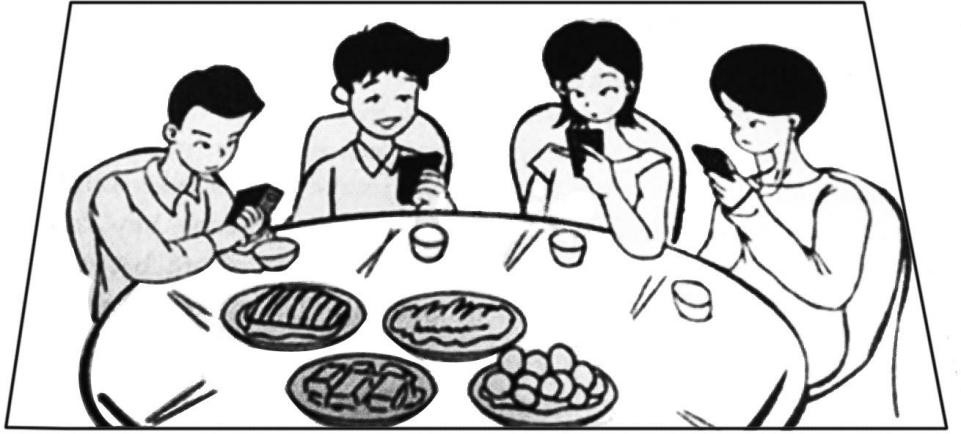

# 2015 年全国硕士研究生招生考试英语（一）试题

> 科目代码 201 ｜ 满分 100 分 ｜ 考试时间 180 分钟

> 说明：本文件由历年真题整理生成，供个人备考使用。**参考答案在文末**。

---

## Section I Use of English

> Directions:
> Read the following text. Choose the best word(s) for each numbered blank and mark
> A, B, C or D on the ANSWER SHEET. (10 points)

Though not biologically related, friends are as “related” as fourth cousins,
sharing about 1% of genes. That is \_\_\_(1)\_\_\_ a study, published from the University
of California and Yale University in the Proceedings of the National Academy of
Sciences, has \_\_\_(2)\_\_\_ .

The study is a genome-wide analysis conducted \_\_\_(3)\_\_\_ 1,932 unique subjects
which \_\_\_(4)\_\_\_ pairs of unrelated friends and unrelated strangers. The same people
were used in both \_\_\_(5)\_\_\_ .

While 1% may seem \_\_\_(6)\_\_\_ , it is not so to a geneticist. As James Fowler,
professor of medical genetics at UC San Diego, says, “Most people do not even
\_\_\_(7)\_\_\_ their fourth cousins but somehow manage to select as friends the people
who \_\_\_(8)\_\_\_ our kin.”

The study \_\_\_(9)\_\_\_ found that the genes for smell were something shared in
friends but not genes for immunity. Why this similarity exists in smell genes is
difficult to explain, for now. \_\_\_(10)\_\_\_ , as the team suggests, it draws us to similar
environments but there is more \_\_\_(11)\_\_\_ it. There could be many mechanisms
working together that \_\_\_(12)\_\_\_ us in choosing genetically similar friends \_\_\_(13)\_\_\_
“functional kinship” of being friends with \_\_\_(14)\_\_\_ !

One of the remarkable findings of the study was that the similar genes seem
to be evolving \_\_\_(15)\_\_\_ than other genes. Studying this could help \_\_\_(16)\_\_\_ why
human evolution picked pace in the last 30,000 years, with social environment
being a major \_\_\_(17)\_\_\_ factor.

The findings do not simply explain people’s \_\_\_(18)\_\_\_ to befriend those of
similar \_\_\_(19)\_\_\_ backgrounds, say the researchers. Though all the subjects were
drawn from a population of European extraction, care was taken to \_\_\_(20)\_\_\_ that
all subjects, friends and strangers, were taken from the same population.

**1.** **A.** when&nbsp;&nbsp;&nbsp;&nbsp;**B.** why&nbsp;&nbsp;&nbsp;&nbsp;**C.** how&nbsp;&nbsp;&nbsp;&nbsp;**D.** what

**2.** **A.** defended&nbsp;&nbsp;&nbsp;&nbsp;**B.** concluded&nbsp;&nbsp;&nbsp;&nbsp;**C.** withdrawn&nbsp;&nbsp;&nbsp;&nbsp;**D.** advised

**3.** **A.** for&nbsp;&nbsp;&nbsp;&nbsp;**B.** with&nbsp;&nbsp;&nbsp;&nbsp;**C.** on&nbsp;&nbsp;&nbsp;&nbsp;**D.** by

**4.** **A.** compared&nbsp;&nbsp;&nbsp;&nbsp;**B.** sought&nbsp;&nbsp;&nbsp;&nbsp;**C.** separated&nbsp;&nbsp;&nbsp;&nbsp;**D.** connected

**5.** **A.** tests&nbsp;&nbsp;&nbsp;&nbsp;**B.** objects&nbsp;&nbsp;&nbsp;&nbsp;**C.** samples&nbsp;&nbsp;&nbsp;&nbsp;**D.** examples

**6.** **A.** insignificant&nbsp;&nbsp;&nbsp;&nbsp;**B.** unexpected&nbsp;&nbsp;&nbsp;&nbsp;**C.** unreliable&nbsp;&nbsp;&nbsp;&nbsp;**D.** incredible

**7.** **A.** visit&nbsp;&nbsp;&nbsp;&nbsp;**B.** miss&nbsp;&nbsp;&nbsp;&nbsp;**C.** seek&nbsp;&nbsp;&nbsp;&nbsp;**D.** know

**8.** **A.** resemble&nbsp;&nbsp;&nbsp;&nbsp;**B.** influence&nbsp;&nbsp;&nbsp;&nbsp;**C.** favor&nbsp;&nbsp;&nbsp;&nbsp;**D.** surpass

**9.** **A.** again&nbsp;&nbsp;&nbsp;&nbsp;**B.** also&nbsp;&nbsp;&nbsp;&nbsp;**C.** instead&nbsp;&nbsp;&nbsp;&nbsp;**D.** thus

**10.** **A.** Meanwhile&nbsp;&nbsp;&nbsp;&nbsp;**B.** Furthermore&nbsp;&nbsp;&nbsp;&nbsp;**C.** Likewise&nbsp;&nbsp;&nbsp;&nbsp;**D.** Perhaps

**11.** **A.** about&nbsp;&nbsp;&nbsp;&nbsp;**B.** to&nbsp;&nbsp;&nbsp;&nbsp;**C.** from&nbsp;&nbsp;&nbsp;&nbsp;**D.** like

**12.** **A.** drive&nbsp;&nbsp;&nbsp;&nbsp;**B.** observe&nbsp;&nbsp;&nbsp;&nbsp;**C.** confuse&nbsp;&nbsp;&nbsp;&nbsp;**D.** limit

**13.** **A.** according to&nbsp;&nbsp;&nbsp;&nbsp;**B.** rather than&nbsp;&nbsp;&nbsp;&nbsp;**C.** regardless of&nbsp;&nbsp;&nbsp;&nbsp;**D.** along with

**14.** **A.** chances&nbsp;&nbsp;&nbsp;&nbsp;**B.** responses&nbsp;&nbsp;&nbsp;&nbsp;**C.** missions&nbsp;&nbsp;&nbsp;&nbsp;**D.** benefits

**15.** **A.** later&nbsp;&nbsp;&nbsp;&nbsp;**B.** slower&nbsp;&nbsp;&nbsp;&nbsp;**C.** faster&nbsp;&nbsp;&nbsp;&nbsp;**D.** earlier

**16.** **A.** forecast&nbsp;&nbsp;&nbsp;&nbsp;**B.** remember&nbsp;&nbsp;&nbsp;&nbsp;**C.** understand&nbsp;&nbsp;&nbsp;&nbsp;**D.** express

**17.** **A.** unpredictable&nbsp;&nbsp;&nbsp;&nbsp;**B.** contributory&nbsp;&nbsp;&nbsp;&nbsp;**C.** controllable&nbsp;&nbsp;&nbsp;&nbsp;**D.** disruptive

**18.** **A.** endeavor&nbsp;&nbsp;&nbsp;&nbsp;**B.** decision&nbsp;&nbsp;&nbsp;&nbsp;**C.** arrangement&nbsp;&nbsp;&nbsp;&nbsp;**D.** tendency

**19.** **A.** political&nbsp;&nbsp;&nbsp;&nbsp;**B.** religious&nbsp;&nbsp;&nbsp;&nbsp;**C.** ethnic&nbsp;&nbsp;&nbsp;&nbsp;**D.** economic

**20.** **A.** see&nbsp;&nbsp;&nbsp;&nbsp;**B.** show&nbsp;&nbsp;&nbsp;&nbsp;**C.** prove&nbsp;&nbsp;&nbsp;&nbsp;**D.** tell

## Section II Reading Comprehension — Part A

> Part A
> Directions:
> Read the following four texts. Answer the questions below each text by choosing A,
> B, C or D. Mark your answers on the ANSWER SHEET. (40 points)

### Text 1

King Juan Carlos of Spain once insisted “kings don’t abdicate, they die in
their sleep.” But embarrassing scandals and the popularity of the republican left in
the recent Euro-elections have forced him to eat his words and stand down. So,
does the Spanish crisis suggest that monarchy is seeing its last days? Does that
mean the writing is on the wall for all European royals, with their magnificent
uniforms and majestic lifestyles?

The Spanish case provides arguments both for and against monarchy. When
public opinion is particularly polarised, as it was following the end of the Franco
regime, monarchs can rise above “mere” politics and “embody” a spirit of national
unity.

It is this apparent transcendence of politics that explains monarchs’ continuing
popularity as heads of state. And so, the Middle East excepted, Europe is the most
monarch-infested region in the world, with 10 kingdoms (not counting Vatican city
and Andorra). But unlike their absolutist counterparts in the Gulf and Asia, most
royal families have survived because they allow voters to avoid the difficult search
for a non-controversial but respected public figure.

Even so, kings and queens undoubtedly have a downside. Symbolic of
national unity as they claim to be, their very history – and sometimes the way they
behave today – embodies outdated and indefensible privileges and inequalities. At a
time when Thomas Piketty and other economists are warning of rising inequality
and the increasing power of inherited wealth, it is bizarre that wealthy aristocratic
families should still be the symbolic heart of modern democratic states.

The most successful monarchies strive to abandon or hide their old aristocratic
ways. Princes and princesses have day-jobs and ride bicycles, not horses (or
helicopters). Even so, these are wealthy families who party with the international
1%, and media intrusiveness makes it increasingly difficult to maintain the right
image.

While Europe’s monarchies will no doubt be smart enough to survive for some
time to come, it is the British royals who have most to fear from the Spanish example.
It is only the Queen who has preserved the monarchy’s reputation with her
rather ordinary (if well-heeled) granny style. The danger will come with Charles,
who has both an expensive taste of lifestyle and a pretty hierarchical view of the
world. He has failed to understand that monarchies have largely survived because
they provide a service –as non-controversial and non-political heads of state.
Charles ought to know that as English history shows, it is kings, not republicans,
who are the monarchy’s worst enemies.

**21.** According to the first two paragraphs, King Juan Carl of Spain

- **A.** eased his relationship with his rivals.
- **B.** used to enjoy high public support.
- **C.** was unpopular among European royals.
- **D.** ended his reign in embarrassment.

**22.** Monarchs are kept as heads of state in Europe mostly

- **A.** to give voters more public figures to look up to.
- **B.** to achieve a balance between tradition and reality.
- **C.** owing to their undoubted and respectable status.
- **D.** due to their everlasting political embodiment.

**23.** Which of the following is shown to be odd, according to Paragraph 4?

- **A.** Aristocrats’ excessive reliance on inherited wealth.
- **B.** The role of the nobility in modern democracies.
- **C.** The simple lifestyle of the aristocratic families.
- **D.** The nobility’s adherence to their privileges.

**24.** The British royals “have most to fear” because Charles

- **A.** fails to adapt himself to his future role.
- **B.** fails to change his lifestyle as advised.
- **C.** takes republicans as his potential allies.
- **D.** takes a tough line on political issues.

**25.** Which of the following is the best title of the text?

- **A.** Carlos, Glory and Disgrace Combined
- **B.** Charles, Anxious to Succeed to the Throne
- **C.** Carlos, a Lesson for All European Monarchs
- **D.** Charles, Slow to React to the Coming Threats

### Text 2

Just how much does the Constitution protect your digital data? The Supreme
Court will now consider whether police can search the contents of a mobile phone
without a warrant if the phone is on or around a person during an arrest.

California has asked the justices to refrain from a sweeping ruling, particularly
one that upsets the old assumption that authorities may search through the
possessions of suspects at the time of their arrest. It is hard, the state argues, for
judges to assess the implications of new and rapidly changing technologies.

The court would be recklessly modest if it followed California’s advice.
Enough of the implications are discernable, even obvious, so that the justices can
and should provide updated guidelines to police, lawyers and defendants.

They should start by discarding California’s lame argument that exploring the
contents of a smartphone – a vast storehouse of digital information – is similar to,
say, going through a suspect’s purse. The court has ruled that police don’t violate
the Fourth Amendment when they go through the wallet or pocketbook of an
arrestee without a warrant. But exploring one’s smartphone is more like entering
his or her home. A smartphone may contain an arrestee’s reading history, financial
history, medical history and comprehensive records of recent correspondence. The
development of “cloud computing”, meanwhile, has made that exploration so
much the easier.

Americans should take steps to protect their digital privacy. But keeping
sensitive information on these devices is increasingly a requirement of normal life.
Citizens still have a right to expect private documents to remain private and
protected by the Constitution’s prohibition on unreasonable searches.

As so often is the case, stating that principle doesn’t ease the challenge of line-
drawing. In many cases, it would not be overly burdensome for authorities to obtain
a warrant to search through phone contents. They could still invalidate Fourth
Amendment protections when facing severe, urgent circumstances, and they could
take reasonable measures to ensure that phone data are not erased or altered while
waiting for a warrant. The court, though, may want to allow room for police to cite
situations where they are entitled to more freedom.

But the justices should not swallow California’s argument whole. New,
disruptive technology sometimes demands novel applications of the Constitution’s
protections. Orin Kerr, a law professor, compares the explosion and accessibility
of digital information in the 21st century with the establishment of automobile use
as a virtual necessity of life in the 20th: The justices had to specify novel rules for
the new personal domain of the passenger car then; they must sort out how the
Fourth Amendment applies to digital information now.

**26.** The Supreme Court will work out whether, during an arrest, it is legitimate to

- **A.** prevent suspects from deleting their phone contents.
- **B.** search for suspects’ mobile phones without a warrant.
- **C.** check suspects’ phone contents without being authorized.
- **D.** prohibit suspects from using their mobile phones.

**27.** The author’s attitude toward California’s argument is one of

- **A.** disapproval.
- **B.** indifference.
- **C.** tolerance.
- **D.** cautiousness.

**28.** The author believes that exploring one’s phone contents is comparable to

- **A.** going through one’s wallet.
- **B.** handling one’s historical records.
- **C.** scanning one’s correspondences.
- **D.** getting into one’s residence.

**29.** In Paragraphs 5 and 6, the author shows his concern that

- **A.** principles are hard to be clearly expressed.
- **B.** the court is giving police less room for action.
- **C.** phones are used to store sensitive information.
- **D.** citizens’ privacy is not effectively protected.

**30.** Orin Kerr’s comparison is quoted to indicate that

- **A.** the Constitution should be implemented flexibly.
- **B.** principles of the Constitution should never be altered.
- **C.** California’s argument violates principles of the Constitution.
- **D.** new technology requires reinterpretation of the Constitution.

### Text 3

The journal Science is adding an extra round of statistical checks to its
peer-review process, editor-in-chief Marcia McNutt announced today. The policy
follows similar efforts from other journals, after widespread concern that basic
mistakes in data analysis are contributing to the irreproducibility of many published
research findings.

“ Readers must have confidence in the conclusions published in our journal,”
writes McNutt in an editorial. Working with the American Statistical Association, the
journal has appointed seven experts to a statistics board of reviewing editors (SBoRE).
Manuscripts will be flagged up for additional scrutiny by the journal’s internal
editors, or by its existing Board of Reviewing Editors or by outside peer reviewers.
The SBoRE panel will then find external statisticians to review these manuscripts.

Asked whether any particular papers had impelled the change, McNutt said:
“The creation of the ‘statistics board’ was motivated by concerns broadly with the
application of statistics and data analysis in scientific research and is part of
Science’s overall drive to increase reproducibility in the research we publish.”

Giovanni Parmigiani, a biostatistician at the Harvard School of Public Health,
a member of the SBoRE group, says he expects the board to “play primarily an
advisory role.” He agreed to join because he “found the foresight behind the
establishment of the SBoRE to be novel, unique and likely to have a lasting
impact. This impact will not only be through the publications in Science itself, but
hopefully through a larger group of publishing places that may want to model
their approach after Science.”

John Ioannidis, a physician who studies research methodology, says that the
policy is “a most welcome step forward” and “long overdue”. “Most journals are
weak in statistical review, and this damages the quality of what they publish. I
think that, for the majority of scientific papers nowadays, statistical review is
more essential than expert review,” he says, but he noted that biomedical journals
such as Annals of Internal Medicine, the Journal of the American Medical
Association and The Lancet pay strong attention to statistical review.

Professional scientists are expected to know how to analyse data, but
statistical errors are alarmingly common in published research, according to
David Vaux, a cell biologist. Researchers should improve their standards, he wrote
in 2012, but journals should also take a tougher line, “engaging reviewers who are
statistically literate and editors who can verify the process”. Vaux says that
Science’s idea to pass some papers to statisticians “has some merit, but a
weakness is that it relies on the board of reviewing editors to identify ‘the papers
that need scrutiny’ in the first place”.

**31.** It can be learned from Paragraph 1 that

- **A.** Science intends to simplify its peer-review process.
- **B.** journals are strengthening their statistical checks.
- **C.** few journals are blamed for mistakes in data analysis.
- **D.** lack of data analysis is common in research projects.

**32.** The phrase “flagged up” (Para. 2) is the closest in meaning to

- **A.** found.
- **B.** revised.
- **C.** marked.
- **D.** stored.

**33.** Giovanni Parmigiani believes that the establishment of the SBoRE may

- **A.** pose a threat to all its peers.
- **B.** meet with strong opposition.
- **C.** increase Science’s circulation.
- **D.** set an example for other journals.

**34.** David Vaux holds that what Science is doing now

- **A.** adds to researchers’ workload.
- **B.** diminishes the role of reviewers.
- **C.** has room for further improvement.
- **D.** is to fail in the foreseeable future.

**35.** Which of the following is the best title of the text?

- **A.** Science Joins Push to Screen Statistics in Papers
- **B.** Professional Statisticians Deserve More Respect
- **C.** Data Analysis Finds Its Way onto Editors’ Desks
- **D.** Statisticians Are Coming Back with Science

### Text 4

Two years ago, Rupert Murdoch’s daughter, Elisabeth, spoke of the
“unsettling dearth of integrity across so many of our institutions”. Integrity had
collapsed, she argued, because of a collective acceptance that the only “sorting
mechanism” in society should be profit and the market. But “it’s us, human beings,
we the people who create the society we want, not profit.”

Driving her point home, she continued: “It’s increasingly apparent that the
absence of purpose, of a moral language within government, media or business
could become one of the most dangerous goals for capitalism and freedom.” This
same absence of moral purpose was wounding companies such as News
International, she thought, making it more likely that it would lose its way as it
had with widespread illegal telephone hacking.

As the hacking trial concludes – finding guilty one ex-editor of the News of the
World, Andy Coulson, for conspiring to hack phones, and finding his predecessor,
Rebekah Brooks, innocent of the same charge – the wider issue of dearth of integrity
still stands. Journalists are known to have hacked the phones of up to 5,500 people.
This is hacking on an industrial scale, as was acknowledged by Glenn Mulcaire,
the man hired by the News of the World in 2001 to be the point person for phone
hacking. Others await trial. This long story still unfolds.

In many respects, the dearth of moral purpose frames not only the fact of such
widespread phone hacking but the terms on which the trial took place. One of the
astonishing revelations was how little Rebekah Brooks knew of what went on in
her newsroom, how little she thought to ask and the fact that she never inquired
how the stories arrived. The core of her successful defence was that she knew
nothing.

In today’s world, it has become normal that well-paid executives should not
be accountable for what happens in the organisations that they run. Perhaps we
should not be so surprised. For a generation, the collective doctrine has been that
the sorting mechanism of society should be profit. The words that have mattered
are efficiency, flexibility, shareholder value, business-friendly, wealth generation,
sales, impact and, in newspapers, circulation. Words degraded to the margin have
been justice, fairness, tolerance, proportionality and accountability.

The purpose of editing the News of the World was not to promote reader
understanding, to be fair in what was written or to betray any common humanity.
It was to ruin lives in the quest for circulation and impact. Ms Brooks may or may
not have had suspicions about how her journalists got their stories, but she asked
no questions, gave no instructions – nor received traceable, recorded answers.

**36.** According to the first two paragraphs, Elisabeth was upset by

- **A.** the consequences of the current sorting mechanism.
- **B.** companies’ financial loss due to immoral practices.
- **C.** governmental ineffectiveness on moral issues.
- **D.** the wide misuse of integrity among institutions.

**37.** It can be inferred from Paragraph 3 that

- **A.** Glenn Mulcaire may deny phone hacking as a crime.
- **B.** more journalists may be found guilty of phone hacking.
- **C.** Andy Coulson should be held innocent of the charge.
- **D.** phone hacking will be accepted on certain occasions.

**38.** The author believes that Rebekah Brooks’s defence

- **A.** was hardly convincing.
- **B.** centered on trivial issues.
- **C.** revealed a cunning personality.
- **D.** was part of a conspiracy.

**39.** The author holds that the current collective doctrine shows

- **A.** a marginalized lifestyle.
- **B.** unfair wealth distribution.
- **C.** generally distorted values.
- **D.** a rigid moral code.

**40.** Which of the following is suggested in the last paragraph?

- **A.** The quality of writings is of primary importance.
- **B.** Moral awareness matters in editing a newspaper.
- **C.** Common humanity is central to news reporting.
- **D.** Journalists need stricter industrial regulations.

## Section II Reading Comprehension — Part B

> Part B
> Directions:
> In the following text, some sentences have been removed. For Questions 41-45,
> choose the most suitable one from the list A-G to fit into each of the numbered
> blanks. There are two extra choices, which do not fit in any of the blanks. Mark
> your answers on the ANSWER SHEET. (10 points)

How does your reading proceed? Clearly you try to comprehend, in the
sense of identifying meanings for individual words and working out
relationships between them, drawing on your implicit knowledge of English
grammar. \_\_\_(41)\_\_\_ You begin to infer a context
for the text, for instance by making decisions about what kind of speech event is
involved: Who is making the utterance, to whom, when and where.

The ways of reading indicated here are without doubt kinds of comprehension.
But they show comprehension to consist not just of passive assimilation but of
active engagement in inference and problem-solving. You infer information you
feel the writer has invited you to grasp by presenting you with specific evidence
and clues. \_\_\_(42)\_\_\_

Conceived in this way, comprehension will not follow exactly the same track
for each reader. What is in question is not the retrieval of an absolute, fixed or
“true” meaning that can be read off and checked for accuracy, or some timeless
relation of the text to the world. \_\_\_(43)\_\_\_

Such background material inevitably reflects who we are. \_\_\_(44)\_\_\_
This doesn’t, however, make interpretation merely
relative or even pointless. Precisely because readers from different historical
periods, places and social experiences produce different but overlapping readings
of the same words on the page– including for texts that engage with fundamental
human concerns – debates about texts can play an important role in social discussion
of beliefs and values.

How we read a given text also depends to some extent on our particular
interest in reading it. \_\_\_(45)\_\_\_ Such dimensions
of reading suggest – as others introduced later in the book will also do – that we
bring an implicit（often unacknowledged）agenda to any act of reading. It doesn’t
then necessarily follow that one kind of reading is fuller, more advanced or more
worthwhile than another. Ideally, different kinds of reading inform each other, and
act as useful reference points for and counterbalances to one another. Together,
they make up the reading component of your overall literacy, or relationship to
your surrounding textual environment.

**备选项 A–G**

- **A.** Are we studying that text and trying to respond in a way that fulfils the
requirement of a given course? Reading it simply for pleasure? Skimming it
for information? Ways of reading on a train or in bed are likely to differ
considerably from reading in a seminar room.
- **B.** Factors such as the place and period in which we are reading, our gender,
ethnicity, age and social class will encourage us towards certain interpretations
but at the same time obscure or even close off others.
- **C.** If you are unfamiliar with words or idioms, you guess at their meaning, using
clues presented in the context. On the assumption that they will become
relevant later, you make a mental note of discourse entities as well as possible
links between them.
- **D.** In effect, you try to reconstruct the likely meanings or effects that any given
sentence, image or reference might have had: These might be the ones the
author intended.
- **E.** You make further inferences, for instance, about how the text may be
significant to you, or about its validity – inferences that form the basis of a
personal response for which the author will inevitably be far less responsible.
- **F.** In plays, novels and narrative poems, characters speak as constructs created by
the author, not necessarily as mouthpieces for the author’s own thoughts.
- **G.** Rather, we ascribe meanings to texts on the basis of interaction between what
we might call textual and contextual material: between kinds of organization
or patterning we perceive in a text’s formal structures (so especially its
language structures) and various kinds of background, social knowledge,
belief and attitude that we bring to the text.

**41.** &nbsp;\_\_\_\_\_\_\_\_\_\_\_\_\_\_\_\_\_\_

**42.** &nbsp;\_\_\_\_\_\_\_\_\_\_\_\_\_\_\_\_\_\_

**43.** &nbsp;\_\_\_\_\_\_\_\_\_\_\_\_\_\_\_\_\_\_

**44.** &nbsp;\_\_\_\_\_\_\_\_\_\_\_\_\_\_\_\_\_\_

**45.** &nbsp;\_\_\_\_\_\_\_\_\_\_\_\_\_\_\_\_\_\_

## Section II Reading Comprehension — Part C

> Directions:
> Read the following text carefully and then translate the underlined segments into
> Chinese. Your translation should be written clearly on ANSWER SHEET. (10
> points)

Within the span of a hundred years, in the seventeenth and early eighteenth centuries, a tide of emigration – one of the great folk wanderings of history – swept from Europe to America. (46) <u>This movement, driven by powerful and diverse motivations, built a nation out of a wilderness and, by its nature, shaped the character and destiny of an uncharted continent .</u>

(47) <u>The United States is the product of two principal forces – the immigration of European peoples with their varied ideas, customs, and national characteristics and the impact of a new country which modified these traits.</u> Of necessity, colonial America was a projection of Europe. Across the Atlantic came successive groups of Englishmen, Frenchmen, Germans, Scots, Irishmen, Dutchmen, Swedes, and many others who attempted to transplant their habits and traditions to the new world. (48) <u>But the force of geographic conditions peculiar to America, the interplay of the varied national groups upon one another, and the sheer difficulty of maintaining old-world ways in a raw, new continent caused significant changes.</u> These changes were gradual and at first scarcely visible. But the result was a new social pattern which, although it resembled European society in many ways, had a character that was distinctly American.

(49) <u>The first shiploads of immigrants bound for the territory which is now the United States crossed the Atlantic more than a hundred years after the 15th-and-16th-century explorations of North America.</u> In the meantime, thriving Spanish colonies had been established in Mexico, the West Indies, and South America. These travelers to North America came in small, unmercifully overcrowded craft. During their six- to twelve-week voyage, they survived on barely enough food allotted to them. Many of the ships were lost in storms, many passengers died of disease, and infants rarely survived the journey. Sometimes storms blew the vessels far off their course, and often calm brought unbearably long delay.

To the anxious travelers the sight of the American shore brought almost inexpressible relief. Said one recorder of events, “The air at twelve leagues’ distance smelt as sweet as a new-blown garden.” The colonists’ first glimpse of the new land was a sight of dense woods. (50) <u>The virgin forest with its richness and variety of trees was a real treasure-house which extended from Maine all the way down to Georgia.</u> Here was abundant fuel and lumber. Here was the raw material of houses and furniture, ships and potash, dyes and naval stores.

**46.** This movement, driven by powerful and diverse motivations, built a nation out of a wilderness and, by its nature, shaped the character and destiny of an uncharted continent .

**47.** The United States is the product of two principal forces – the immigration of European peoples with their varied ideas, customs, and national characteristics and the impact of a new country which modified these traits.

**48.** But the force of geographic conditions peculiar to America, the interplay of the varied national groups upon one another, and the sheer difficulty of maintaining old-world ways in a raw, new continent caused significant changes.

**49.** The first shiploads of immigrants bound for the territory which is now the United States crossed the Atlantic more than a hundred years after the 15th-and-16th-century explorations of North America.

**50.** The virgin forest with its richness and variety of trees was a real treasure-house which extended from Maine all the way down to Georgia.

## Section III Writing — Part A

51. Directions:
You are going to host a club reading session. Write an email of about 100
words recommending a book to the club members.
You should state reasons for your recommendation.
You should write neatly on the ANSWER SHEET.
Do not sign your own name at the end of the letter, use “Li Ming ” instead.
Do not write the address. (10 points)

## Section III Writing — Part B

52. Directions:
Write an essay of 160-200 words based on the following picture. In your essay,
you should
1）describe the picture briefly,
2）interpret its intended meaning, and
3）give your comments.
You should write neatly on ANSWER SHEET. (20 points)
手机时代的聚会

---

## 参考答案

### Section I Use of English

**1.** D · what
**2.** B · concluded
**3.** C · on
**4.** A · compared
**5.** C · samples
**6.** A · insignificant
**7.** D · know
**8.** A · resemble
**9.** B · also
**10.** D · Perhaps
**11.** B · to
**12.** A · drive
**13.** B · rather than
**14.** D · benefits
**15.** C · faster
**16.** C · understand
**17.** B · contributory
**18.** D · tendency
**19.** C · ethnic
**20.** A · see

### Section II Reading Comprehension — Part A

*Text 1*

**21.** D · ended his reign in embarrassment.
**22.** C · owing to their undoubted and respectable status.
**23.** B · The role of the nobility in modern democracies.
**24.** A · fails to adapt himself to his future role.
**25.** C · Carlos, a Lesson for All European Monarchs

*Text 2*

**26.** C · check suspects’ phone contents without being authorized.
**27.** A · disapproval.
**28.** D · getting into one’s residence.
**29.** D · citizens’ privacy is not effectively protected.
**30.** D · new technology requires reinterpretation of the Constitution.

*Text 3*

**31.** B · journals are strengthening their statistical checks.
**32.** C · marked.
**33.** D · set an example for other journals.
**34.** C · has room for further improvement.
**35.** A · Science Joins Push to Screen Statistics in Papers

*Text 4*

**36.** A · the consequences of the current sorting mechanism.
**37.** B · more journalists may be found guilty of phone hacking.
**38.** A · was hardly convincing.
**39.** C · generally distorted values.
**40.** B · Moral awareness matters in editing a newspaper.

### Section II Reading Comprehension — Part B

**41–45**：C  E  G  B  A

### Section II Reading Comprehension — Part C

**46.** 在各种强大动机的推动下，这场迁移从荒野中造就了一个民族，并循其本质塑造了一片全新大陆的特点，决定了它的命运。
> **采分点**：`This movement, driven by powerful and diverse motivations`（0.5） ｜ `and, by its nature, shaped the character and destiny of an uncharted continent`（1）

**47.** 合众国是两股主要力量作用的产物，一是具有不同思想、风俗和民族特点的欧洲各民族的迁入，二是一个新国家因改变了这些特性而产生的影响。
> **采分点**：`The United States is the product of two principal forces—`（0.5） ｜ `the immigration of European peoples with their varied ideas, customs, and national characteristics`（0.5） ｜ `and the impact of a new country`（0.5） ｜ `which modified these traits`（0.5）

**48.** 但是美洲特有地理条件的作用，不同族群间的相互影响，加上在一片荒蛮新大陆上维持旧大陆方式的巨大困难，所有这一切引起了意义深远的变化。
> **采分点**：`But the force of geographic conditions peculiar to America`（0.5） ｜ `the interplay of the varied national groups upon one another`（0.5） ｜ `and the sheer difficulty of maintaining old-world ways in a raw, new continent`（0.5） ｜ `caused significant changes`（0.5）

**49.** 在十五、十六世纪的北美大陆探险过去一百多年后，首批满载移民驶向今天合众国这片疆土的船只横穿过了大西洋。
> **采分点**：`The first shiploads of immigrants bound for the territory`（0.5） ｜ `which is now the United States`（0.5） ｜ `crossed the Atlantic more than a hundred years after the 15th-and-16th-century explorations of North America`（1）

**50.** 郁郁葱葱、树种繁多的原始森林是一座从缅因一直向南绵延到佐治亚的天然宝库。
> **采分点**：`The virgin forest with its richness and variety of trees`（0.5） ｜ `was a real treasure-house`（0.5） ｜ `which extended from Maine`（0.5） ｜ `all the way down to Georgia`（0.5）

### Section III Writing — Part A

**51 参考范文**

Dear Friends,
As the host of the upcoming reading session, I am writing to recommend a plain but moving book, *We Three*, written by Yang Jiang, one of the most talented contemporary female writers.
With great wisdom and perseverance, Yang Jiang tells us about the love and support shared by her, her late daughter and her husband over more than 60 years, as well as their experiences of being happily together and heartbreakingly apart.  By depicting dreams as well as realities, this book shows us the sorrows and joys of life.  In addition, through this ordinary but extraordinary family, we can see the character of Chinese intellectuals of that time—their devotion to family and diligence in study—and deeply appreciate the truth that happiness always comes with troubles.
I hope you will enjoy the book as much as I do and share your impressions of it during the session.
Yours sincerely,
Li Ming

### Section III Writing — Part B

**52 参考范文**

Four friends get together to have a dinner. What's weird is that the four appear to be stranger to each other, not talking with friends seated beside but totally indulging in smart phones.
The picture reveals a typical scene for modern people.
Whenever people have a chance to relax, they will fish out phones to play for a while.  The warm face-to-face communication which was taken for granted has been violently ruined by smart phones and become a luxury. It is challenging or even impossible for many people to concentrate on face-to-face communication. As the quality of emotional interaction between people suffer an annoying dramatic deterioration, more and more people arrive at an agreement that people should shut down mobile phones when being with friends or relatives. Unfortunately, it is only a theoretical opinion around the WeChat, a communication tool on the smart phone. Few people apply it into life.
The smart phone is really the most controversial modern invention, bringing enjoyable relaxation and great convenience on one hand and causing problematic phone addiction and consequent interpersonal isolation on the other hand.  Rational attitude should be paid to the mobile phone.  We should not squander the limited and precious time with friends and relatives on a lifeless machine.  Due importance should be attached to the contact in real life.
