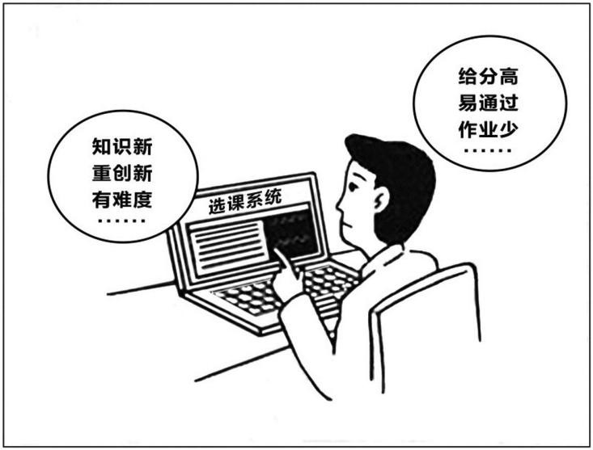

# 2018 年全国硕士研究生招生考试英语（一）试题

> 科目代码 201 ｜ 满分 100 分 ｜ 考试时间 180 分钟

> 说明：本文件由历年真题整理生成，供个人备考使用。**参考答案在文末**。

---

## Section I Use of English

> Directions:
> Read the following text. Choose the best word(s) for each numbered blank and mark
> A, B, C or D on the ANSWER SHEET. (10 points)

Trust is a tricky business. On the one hand, it’s a necessary condition \_\_\_(1)\_\_\_
many worthwhile things: child care, friendships, etc. On the other hand, putting your
\_\_\_(2)\_\_\_ in the wrong place often carries a high \_\_\_(3)\_\_\_ .

\_\_\_(4)\_\_\_ , why do we trust at all? Well, because it feels good. \_\_\_(5)\_\_\_ people place
their trust in an individual or an institution, their brains release oxytocin, a hormone
that \_\_\_(6)\_\_\_ pleasurable feelings and triggers the herding instinct that prompts
humans to \_\_\_(7)\_\_\_ with one another. Scientists have found that exposure \_\_\_(8)\_\_\_ this
hormone puts us in a trusting \_\_\_(9)\_\_\_ : In a Swiss study, researchers sprayed oxytocin into
the noses of half the subjects; those subjects were ready to lend significantly higher
amounts of money to strangers than were their \_\_\_(10)\_\_\_ who inhaled something else.

\_\_\_(11)\_\_\_ for us, we also have a sixth sense for dishonesty that may \_\_\_(12)\_\_\_ us. A
Canadian study found that children as young as 14 months can differentiate \_\_\_(13)\_\_\_ a
credible person and a dishonest one. Sixty toddlers were each \_\_\_(14)\_\_\_ to an adult
tester holding a plastic container. The tester would ask, “What’s in here?” before
looking into the container, smiling, and exclaiming, “Wow!” Each subject was then
invited to look \_\_\_(15)\_\_\_ . Half of them found a toy; the other half \_\_\_(16)\_\_\_ the
container was empty – and realized the tester had \_\_\_(17)\_\_\_ them.

Among the children who had not been tricked, the majority were \_\_\_(18)\_\_\_ to
cooperate with the tester in learning a new skill, demonstrating that they trusted his
leadership. \_\_\_(19)\_\_\_ , only five of the 30 children paired with the “ \_\_\_(20)\_\_\_ ” tester
participated in a follow-up activity.

**1.** **A.** on&nbsp;&nbsp;&nbsp;&nbsp;**B.** like&nbsp;&nbsp;&nbsp;&nbsp;**C.** for&nbsp;&nbsp;&nbsp;&nbsp;**D.** from

**2.** **A.** faith&nbsp;&nbsp;&nbsp;&nbsp;**B.** concern&nbsp;&nbsp;&nbsp;&nbsp;**C.** attention&nbsp;&nbsp;&nbsp;&nbsp;**D.** interest

**3.** **A.** benefit&nbsp;&nbsp;&nbsp;&nbsp;**B.** debt&nbsp;&nbsp;&nbsp;&nbsp;**C.** hope&nbsp;&nbsp;&nbsp;&nbsp;**D.** price

**4.** **A.** Therefore&nbsp;&nbsp;&nbsp;&nbsp;**B.** Then&nbsp;&nbsp;&nbsp;&nbsp;**C.** Instead&nbsp;&nbsp;&nbsp;&nbsp;**D.** Again

**5.** **A.** Until&nbsp;&nbsp;&nbsp;&nbsp;**B.** Unless&nbsp;&nbsp;&nbsp;&nbsp;**C.** Although&nbsp;&nbsp;&nbsp;&nbsp;**D.** When

**6.** **A.** selects&nbsp;&nbsp;&nbsp;&nbsp;**B.** produces&nbsp;&nbsp;&nbsp;&nbsp;**C.** applies&nbsp;&nbsp;&nbsp;&nbsp;**D.** maintains

**7.** **A.** consult&nbsp;&nbsp;&nbsp;&nbsp;**B.** compete&nbsp;&nbsp;&nbsp;&nbsp;**C.** connect&nbsp;&nbsp;&nbsp;&nbsp;**D.** compare

**8.** **A.** at&nbsp;&nbsp;&nbsp;&nbsp;**B.** by&nbsp;&nbsp;&nbsp;&nbsp;**C.** of&nbsp;&nbsp;&nbsp;&nbsp;**D.** to

**9.** **A.** context&nbsp;&nbsp;&nbsp;&nbsp;**B.** mood&nbsp;&nbsp;&nbsp;&nbsp;**C.** period&nbsp;&nbsp;&nbsp;&nbsp;**D.** circle

**10.** **A.** counterparts&nbsp;&nbsp;&nbsp;&nbsp;**B.** substitutes&nbsp;&nbsp;&nbsp;&nbsp;**C.** colleagues&nbsp;&nbsp;&nbsp;&nbsp;**D.** supporters

**11.** **A.** Funny&nbsp;&nbsp;&nbsp;&nbsp;**B.** Lucky&nbsp;&nbsp;&nbsp;&nbsp;**C.** Odd&nbsp;&nbsp;&nbsp;&nbsp;**D.** Ironic

**12.** **A.** monitor&nbsp;&nbsp;&nbsp;&nbsp;**B.** protect&nbsp;&nbsp;&nbsp;&nbsp;**C.** surprise&nbsp;&nbsp;&nbsp;&nbsp;**D.** delight

**13.** **A.** between&nbsp;&nbsp;&nbsp;&nbsp;**B.** within&nbsp;&nbsp;&nbsp;&nbsp;**C.** toward&nbsp;&nbsp;&nbsp;&nbsp;**D.** over

**14.** **A.** transferred&nbsp;&nbsp;&nbsp;&nbsp;**B.** added&nbsp;&nbsp;&nbsp;&nbsp;**C.** introduced&nbsp;&nbsp;&nbsp;&nbsp;**D.** entrusted

**15.** **A.** out&nbsp;&nbsp;&nbsp;&nbsp;**B.** back&nbsp;&nbsp;&nbsp;&nbsp;**C.** around&nbsp;&nbsp;&nbsp;&nbsp;**D.** inside

**16.** **A.** discovered&nbsp;&nbsp;&nbsp;&nbsp;**B.** proved&nbsp;&nbsp;&nbsp;&nbsp;**C.** insisted&nbsp;&nbsp;&nbsp;&nbsp;**D.** remembered

**17.** **A.** betrayed&nbsp;&nbsp;&nbsp;&nbsp;**B.** wronged&nbsp;&nbsp;&nbsp;&nbsp;**C.** fooled&nbsp;&nbsp;&nbsp;&nbsp;**D.** mocked

**18.** **A.** forced&nbsp;&nbsp;&nbsp;&nbsp;**B.** willing&nbsp;&nbsp;&nbsp;&nbsp;**C.** hesitant&nbsp;&nbsp;&nbsp;&nbsp;**D.** entitled

**19.** **A.** In contrast&nbsp;&nbsp;&nbsp;&nbsp;**B.** As a result&nbsp;&nbsp;&nbsp;&nbsp;**C.** On the whole&nbsp;&nbsp;&nbsp;&nbsp;**D.** For instance

**20.** **A.** inflexible&nbsp;&nbsp;&nbsp;&nbsp;**B.** incapable&nbsp;&nbsp;&nbsp;&nbsp;**C.** unreliable&nbsp;&nbsp;&nbsp;&nbsp;**D.** unsuitable

## Section II Reading Comprehension — Part A

> Part A
> Directions:
> Read the following four texts. Answer the questions after each text by choosing A, B,
> C or D. Mark your answers on the ANSWER SHEET. (40 points)

Among the annoying challenges facing the middle class is one that will probably
go unmentioned in the next presidential campaign: What happens when the robots
come for their jobs?

Don’t dismiss that possibility entirely. About half of U.S. jobs are at high risk of
being automated, according to a University of Oxford study, with the middle class
disproportionately squeezed. Lower-income jobs like gardening or day care don’t
appeal to robots. But many middle-class occupations – trucking, financial advice,
software engineering – have aroused their interest, or soon will. The rich own the
robots, so they will be fine.

This isn’t to be alarmist. Optimists point out that technological upheaval has
benefited workers in the past. The Industrial Revolution didn’t go so well for Luddites
whose jobs were displaced by mechanized looms, but it eventually raised living
standards and created more jobs than it destroyed. Likewise, automation should
eventually boost productivity, stimulate demand by driving down prices, and free
workers from hard, boring work. But in the medium term, middle-class workers may
need a lot of help adjusting.

The first step, as Erik Brynjolfsson and Andrew McAfee argue in The Second
Machine Age, should be rethinking education and job training. Curriculums – from
grammar school to college – should evolve to focus less on memorizing facts and
more on creativity and complex communication. Vocational schools should do a
better job of fostering problem-solving skills and helping students work alongside
robots. Online education can supplement the traditional kind. It could make extra
training and instruction affordable. Professionals trying to acquire new skills will be
able to do so without going into debt.

The challenge of coping with automation underlines the need for the U.S. to
revive its fading business dynamism: Starting new companies must be made easier. In
previous eras of drastic technological change, entrepreneurs smoothed the transition
by dreaming up ways to combine labor and machines. The best uses of 3D printers
and virtual reality haven’t been invented yet. The U.S. needs the new companies that
will invent them.

Finally, because automation threatens to widen the gap between capital income
and labor income, taxes and the safety net will have to be rethought. Taxes on low-
wage labor need to be cut, and wage subsidies such as the earned income tax credit
should be expanded: This would boost incomes, encourage work, reward companies
for job creation, and reduce inequality.

Technology will improve society in ways big and small over the next few years,
yet this will be little comfort to those who find their lives and careers upended by
automation. Destroying the machines that are coming for our jobs would be nuts. But
policies to help workers adapt will be indispensable.

**21.** Who will be most threatened by automation?

- **A.** Leading politicians.
- **B.** Low-wage laborers.
- **C.** Robot owners.
- **D.** Middle-class workers.

**22.** Which of the following best represents the author’s view?

- **A.** Worries about automation are in fact groundless.
- **B.** Optimists’ opinions on new tech find little support.
- **C.** Issues arising from automation need to be tackled.
- **D.** Negative consequences of new tech can be avoided.

**23.** Education in the age of automation should put more emphasis on

- **A.** creative potential.
- **B.** job-hunting skills.
- **C.** individual needs.
- **D.** cooperative spirit.

**24.** The author suggests that tax policies be aimed at

- **A.** encouraging the development of automation.
- **B.** increasing the return on capital investment.
- **C.** easing the hostility between rich and poor.
- **D.** preventing the income gap from widening.

**25.** In this text, the author presents a problem with

- **A.** opposing views on it.
- **B.** possible solutions to it.
- **C.** its alarming impacts.
- **D.** its major variations.

A new survey by Harvard University finds more than two-thirds of young
Americans disapprove of President Trump’s use of Twitter. The implication is that
Millennials prefer news from the White House to be filtered through other sources,
not a president’s social media platform.

Most Americans rely on social media to check daily headlines. Yet as distrust has
risen toward all media, people may be starting to beef up their media literacy skills.
Such a trend is badly needed. During the 2016 presidential campaign, nearly a quarter
of web content shared by Twitter users in the politically critical state of Michigan was
fake news, according to the University of Oxford. And a survey conducted for
BuzzFeed News found 44 percent of Facebook users rarely or never trust news from
the media giant.

Young people who are digital natives are indeed becoming more skillful at
separating fact from fiction in cyberspace. A Knight Foundation focus-group survey
of young people between ages 14 and 24 found they use “distributed trust” to verify
stories. They cross-check sources and prefer news from different perspectives –
especially those that are open about any bias. “Many young people assume a great
deal of personal responsibility for educating themselves and actively seeking out
opposing viewpoints,” the survey concluded.

Such active research can have another effect. A 2014 survey conducted in
Australia, Britain, and the United States by the University of Wisconsin-Madison
found that young people’s reliance on social media led to greater political
engagement.

Social media allows users to experience news events more intimately and
immediately while also permitting them to re-share news as a projection of their
values and interests. This forces users to be more conscious of their role in passing
along information. A survey by Barna research group found the top reason given by
Americans for the fake news phenomenon is “reader error,” more so than made-up
stories or factual mistakes in reporting. About a third say the problem of fake news
lies in “misinterpretation or exaggeration of actual news” via social media. In other
words, the choice to share news on social media may be the heart of the issue. “This
indicates there is a real personal responsibility in counteracting this problem,” says
Roxanne Stone, editor in chief at Barna Group.

So when young people are critical of an over-tweeting president, they reveal a
mental discipline in thinking skills – and in their choices on when to share on social
media.

**26.** According to Paragraphs 1 and 2, many young Americans cast doubts on

- **A.** the justification of the news-filtering practice.
- **B.** people’s preference for social media platforms.
- **C.** the administration’s ability to handle information.
- **D.** social media as a reliable source of news.

**27.** The phrase “beef up” (Line 2, Para. 2) is closest in meaning to

- **A.** sharpen.
- **B.** define.
- **C.** boast.
- **D.** share.

**28.** According to the Knight Foundation survey, young people

- **A.** tend to voice their opinions in cyberspace.
- **B.** verify news by referring to diverse sources.
- **C.** have a strong sense of responsibility.
- **D.** like to exchange views on “distributed trust”.

**29.** The Barna survey found that a main cause for the fake news problem is

- **A.** readers’ outdated values.
- **B.** journalists’ biased reporting.
- **C.** readers’ misinterpretation.
- **D.** journalists’ made-up stories.

**30.** Which of the following would be the best title for the text?

- **A.** A Rise in Critical Skills for Sharing News Online.
- **B.** A Counteraction Against the Over-tweeting Trend.
- **C.** The Accumulation of Mutual Trust on Social Media.
- **D.** The Platforms for Projection of Personal Interests.

Any fair-minded assessment of the dangers of the deal between Britain’s
National Health Service (NHS) and DeepMind must start by acknowledging that both
sides mean well. DeepMind is one of the leading artificial intelligence (AI)
companies in the world. The potential of this work applied to healthcare is very great,
but it could also lead to further concentration of power in the tech giants. It is against
that background that the information commissioner, Elizabeth Denham, has issued her
damning verdict against the Royal Free hospital trust under the NHS, which handed
over to DeepMind the records of 1.6 million patients in 2015 on the basis of a vague
agreement which took far too little account of the patients’ rights and their
expectations of privacy.

DeepMind has almost apologized. The NHS trust has mended its ways. Further
arrangements – and there may be many – between the NHS and DeepMind will be
carefully scrutinised to ensure that all necessary permissions have been asked of
patients and all unnecessary data has been cleaned. There are lessons about informed
patient consent to learn. But privacy is not the only angle in this case and not even the
most important. Ms Denham chose to concentrate the blame on the NHS trust, since
under existing law it “controlled” the data and DeepMind merely “processed” it. But
this distinction misses the point that it is processing and aggregation, not the mere
possession of bits, that gives the data value.

The great question is who should benefit from the analysis of all the data that our
lives now generate. Privacy law builds on the concept of damage to an individual
from identifiable knowledge about them. That misses the way the surveillance
economy works. The data of an individual there gains its value only when it is
compared with the data of countless millions more.

The use of privacy law to curb the tech giants in this instance feels slightly
maladapted. This practice does not address the real worry. It is not enough to say that
the algorithms DeepMind develops will benefit patients and save lives. What matters
is that they will belong to a private monopoly which developed them using public
resources. If software promises to save lives on the scale that drugs now can, big data
may be expected to behave as a big pharma has done. We are still at the beginning of
this revolution and small choices now may turn out to have gigantic consequences
later. A long struggle will be needed to avoid a future of digital feudalism. Ms
Denham’s report is a welcome start.

**31.** What is true of the agreement between the NHS and DeepMind?

- **A.** It caused conflicts among tech giants.
- **B.** It failed to pay due attention to patients’ rights.
- **C.** It fell short of the latter’s expectations.
- **D.** It put both sides into a dangerous situation.

**32.** The NHS trust responded to Denham’s verdict with

- **A.** empty promises.
- **B.** tough resistance.
- **C.** necessary adjustments.
- **D.** sincere apologies.

**33.** The author argues in Paragraph 2 that

- **A.** privacy protection must be secured at all costs.
- **B.** leaking patients’ data is worse than selling it.
- **C.** making profits from patients’ data is illegal.
- **D.** the value of data comes from the processing of it.

**34.** According to the last paragraph, the real worry arising from this deal is

- **A.** the vicious rivalry among big pharmas.
- **B.** the ineffective enforcement of privacy law.
- **C.** the uncontrolled use of new software.
- **D.** the monopoly of big data by tech giants.

**35.** The author’s attitude toward the application of AI to healthcare is

- **A.** ambiguous.
- **B.** cautious.
- **C.** appreciative.
- **D.** contemptuous.

The U.S. Postal Service (USPS) continues to bleed red ink. It reported a net loss
of $5.6 billion for fiscal 2016, the 10th straight year its expenses have exceeded
revenue. Meanwhile, it has more than $120 billion in unfunded liabilities, mostly for
employee health and retirement costs. There are many reasons this formerly stable
federal institution finds itself at the brink of bankruptcy. Fundamentally, the USPS is
in a historic squeeze between technological change that has permanently decreased
demand for its bread-and-butter product, first-class mail, and a regulatory structure
that denies management the flexibility to adjust its operations to the new reality.

And interest groups ranging from postal unions to greeting-card makers exert
self-interested pressure on the USPS’s ultimate overseer – Congress – insisting that
whatever else happens to the Postal Service, aspects of the status quo they depend on
get protected. This is why repeated attempts at reform legislation have failed in recent
years, leaving the Postal Service unable to pay its bills except by deferring vital
modernization.

Now comes word that everyone involved – Democrats, Republicans, the Postal
Service, the unions and the system’s heaviest users – has finally agreed on a plan to
fix the system. Legislation is moving through the House that would save USPS an
estimated $28.6 billion over five years, which could help pay for new vehicles,
among other survival measures. Most of the money would come from a penny-per-
letter permanent rate increase and from shifting postal retirees into Medicare. The
latter step would largely offset the financial burden of annually pre-funding retiree
health care, thus addressing a long-standing complaint by the USPS and its unions.

If it clears the House, this measure would still have to get through the Senate –
where someone is bound to point out that it amounts to the bare, bare minimum
necessary to keep the Postal Service afloat, not comprehensive reform. There’s no
change to collective bargaining at the USPS, a major omission considering that
personnel accounts for 80 percent of the agency’s costs. Also missing is any
discussion of eliminating Saturday letter delivery. That common-sense change enjoys
wide public support and would save the USPS $2 billion per year. But postal special-
interest groups seem to have killed it, at least in the House. The emerging consensus
around the bill is a sign that legislators are getting frightened about a politically
embarrassing short-term collapse at the USPS. It is not, however, a sign that they’re
getting serious about transforming the postal system for the 21st century.

**36.** The financial problem with the USPS is caused partly by

- **A.** its unbalanced budget.
- **B.** its rigid management.
- **C.** the cost for technical upgrading.
- **D.** the withdrawal of bank support.

**37.** According to Paragraph 2, the USPS fails to modernize itself due to

- **A.** the interference from interest groups.
- **B.** the inadequate funding from Congress.
- **C.** the shrinking demand for postal service.
- **D.** the incompetence of postal unions.

**38.** The long-standing complaint by the USPS and its unions can be addressed by

- **A.** removing its burden of retiree health care.
- **B.** making more investment in new vehicles.
- **C.** adopting a new rate-increase mechanism.
- **D.** attracting more first-class mail users.

**39.** In the last paragraph, the author seems to view legislators with

- **A.** respect.
- **B.** tolerance.
- **C.** discontent.
- **D.** gratitude.

**40.** Which of the following would be the best title for the text?

- **A.** The USPS Starts to Miss Its Good Old Days.
- **B.** The Postal Service: Keep Away from My Cheese.
- **C.** The USPS: Chronic Illness Requires a Quick Cure.
- **D.** The Postal Service Needs More Than a Band-Aid.

## Section II Reading Comprehension — Part B

> Part B
> Directions:
> The following paragraphs are given in a wrong order. For Questions 41-45, you are
> required to reorganize these paragraphs into a coherent article by choosing from the
> list A-G and filling them into the numbered boxes. Paragraphs C and F have been
> correctly placed. Mark your answers on the ANSWER SHEET. (10 points)

**文章顺序（方框处需从 A–G 中择段填入）**

**(41)** &nbsp;\_\_\_\_\_\_\_\_\_\_\_\_\_\_\_\_\_\_

> **[已给出段落 C]** The State, War, and Navy Building, as it was originally known, housed the three
Executive Branch Departments most intimately associated with formulating and
conducting the nation’s foreign policy in the last quarter of the nineteenth century
and the first quarter of the twentieth century – the period when the United States
emerged as an international power. The building has housed some of the nation’s
most significant diplomats and politicians and has been the scene of many
historic events.

**(42)** &nbsp;\_\_\_\_\_\_\_\_\_\_\_\_\_\_\_\_\_\_

**(43)** &nbsp;\_\_\_\_\_\_\_\_\_\_\_\_\_\_\_\_\_\_

> **[已给出段落 F]** Construction took 17 years as the building slowly rose wing by wing. When the
EEOB was finished, it was the largest office building in Washington, with nearly
2 miles of black and white tiled corridors. Almost all of the interior detail is of
cast iron or plaster; the use of wood was minimized to insure fire safety. Eight
monumental curving staircases of granite with over 4,000 individually cast bronze
balusters are capped by four skylight domes and two stained glass rotundas.

**(44)** &nbsp;\_\_\_\_\_\_\_\_\_\_\_\_\_\_\_\_\_\_

**(45)** &nbsp;\_\_\_\_\_\_\_\_\_\_\_\_\_\_\_\_\_\_

**待选段落**

- **A.** In December of 1869, Congress appointed a commission to select a site and
prepare plans and cost estimates for a new State Department Building. The
commission was also to consider possible arrangements for the War and Navy
Departments. To the horror of some who expected a Greek Revival twin of the
Treasury Building to be erected on the other side of the White House, the
elaborate French Second Empire style design by Alfred Mullett was selected, and
construction of a building to house all three departments began in June of 1871.
- **B.** Completed in 1875, the State Department’s south wing was the first to be
occupied, with its elegant four-story library (completed in 1876), Diplomatic
Reception Room, and Secretary’s office decorated with carved wood, Oriental
rugs, and stenciled wall patterns. The Navy Department moved into the east wing
in 1879, where elaborate wall and ceiling stenciling and marquetry floors
decorated the office of the Secretary.
- **D.** Many of the most celebrated national figures have participated in historical events
that have taken place within the EEOB’s granite walls. Theodore and Franklin D.
Roosevelt, William Howard Taft, Dwight D. Eisenhower, Lyndon B. Johnson,
Gerald Ford, and George H. W. Bush all had offices in this building before
becoming president. It has housed 16 Secretaries of the Navy, 21 Secretaries of
War, and 24 Secretaries of State. Winston Churchill once walked its corridors and
Japanese emissaries met here with Secretary of State Cordell Hull after the
bombing of Pearl Harbor.
- **E.** The Eisenhower Executive Office Building (EEOB) commands a unique position
in both the national history and the architectural heritage of the United States.
Designed by Supervising Architect of the Treasury, Alfred B. Mullett, it was built
from 1871 to 1888 to house the growing staffs of the State, War, and Navy
Departments, and is considered one of the best examples of French Second
Empire architecture in the country.
- **G.** The history of the EEOB began long before its foundations were laid. The first
executive offices were constructed between 1799 and 1820. A series of fires
(including those set by the British in 1814) and overcrowded conditions led to the
construction of the existing Treasury Building. In 1866, the construction of the
North Wing of the Treasury Building necessitated the demolition of the State
Department building.

## Section II Reading Comprehension — Part C

> Part C
> Directions:
> Read the following text carefully and then translate the underlined segments into
> Chinese. Write your answers on the ANSWER SHEET. (10 points)

Shakespeare’s lifetime was coincident with a period of extraordinary activity and achievement in the drama. (46) <u>By the date of his birth Europe was witnessing the passing of the religious drama, and the creation of new forms under the incentive of classical tragedy and comedy.</u> These new forms were at first mainly written by scholars and performed by amateurs, but in England, as everywhere else in western Europe, the growth of a class of professional actors was threatening to make the drama popular, whether it should be new or old, classical or medieval, literary or farcical. Court, school, organizations of amateurs, and the traveling actors were all rivals in supplying a widespread desire for dramatic entertainment; and (47) <u>no boy who went to a grammar school could be ignorant that the drama was a form of literature which gave glory to Greece and Rome and might yet bring honor to England.</u>

When Shakespeare was twelve years old the first public playhouse was built in London. For a time literature showed no interest in this public stage. Plays aiming at literary distinction were written for schools or court, or for the choir boys of St.Paul’s and the royal chapel, who, however, gave plays in public as well as at court. (48) <u>But the professional companies prospered in their permanent theaters, and university men with literary ambitions were quick to turn to these theaters as offering a means of livelihood.</u> By the time that Shakespeare was twenty-five, Lyly, Peele, and Greene had made comedies that were at once popular and literary; Kyd had written a tragedy that crowded the pit; and Marlowe had brought poetry and genius to triumph on the common stage – where they had played no part since the death of Euripides. (49) <u>A native literary drama had been created, its alliance with the public playhouses established, and at least some of its great traditions had been begun .</u>

The development of the Elizabethan drama for the next twenty-five years is of exceptional interest to students of literary history, for in this brief period we may trace the beginning, growth, blossoming, and decay of many kinds of plays, and of many great careers. We are amazed today at the mere number of plays produced, as well as by the number of dramatists writing at the same time for this London of two hundred thousand inhabitants. (50) <u>To realize how great was the dramatic activity, we must remember further that hosts of plays have been lost, and that probably there is no author of note whose entire work has survived.</u>

**46.** By the date of his birth Europe was witnessing the passing of the religious drama, and the creation of new forms under the incentive of classical tragedy and comedy.

**47.** no boy who went to a grammar school could be ignorant that the drama was a form of literature which gave glory to Greece and Rome and might yet bring honor to England.

**48.** But the professional companies prospered in their permanent theaters, and university men with literary ambitions were quick to turn to these theaters as offering a means of livelihood.

**49.** A native literary drama had been created, its alliance with the public playhouses established, and at least some of its great traditions had been begun .

**50.** To realize how great was the dramatic activity, we must remember further that hosts of plays have been lost, and that probably there is no author of note whose entire work has survived.

## Section III Writing — Part A

51. Directions:
Write an email to all international experts on campus inviting them to attend the
graduation ceremony. In your email you should include time, place and other relevant
information about the ceremony.
You should write about 100 words neatly on the ANSWER SHEET.
Do not use your own name at the end of the email. Use “Li Ming” instead.
(10 points)

## Section III Writing — Part B

52. Directions:
Write an essay of 160-200 words based on the picture below. In your essay, you
should
1) describe the picture briefly,
2) interpret the meaning, and
3) give your comments.
You should write neatly on the ANSWER SHEET.（20 points）
选课进行时

---

## 参考答案

### Section I Use of English

**1.** C · for
**2.** A · faith
**3.** D · price
**4.** B · Then
**5.** D · When
**6.** B · produces
**7.** C · connect
**8.** D · to
**9.** B · mood
**10.** A · counterparts
**11.** B · Lucky
**12.** B · protect
**13.** A · between
**14.** C · introduced
**15.** D · inside
**16.** A · discovered
**17.** C · fooled
**18.** B · willing
**19.** A · In contrast
**20.** C · unreliable

### Section II Reading Comprehension — Part A

**21.** D · Middle-class workers.
**22.** C · Issues arising from automation need to be tackled.
**23.** A · creative potential.
**24.** D · preventing the income gap from widening.
**25.** B · possible solutions to it.

**26.** D · social media as a reliable source of news.
**27.** A · sharpen.
**28.** B · verify news by referring to diverse sources.
**29.** C · readers’ misinterpretation.
**30.** A · A Rise in Critical Skills for Sharing News Online.

**31.** B · It failed to pay due attention to patients’ rights.
**32.** C · necessary adjustments.
**33.** D · the value of data comes from the processing of it.
**34.** D · the monopoly of big data by tech giants.
**35.** B · cautious.

**36.** B · its rigid management.
**37.** A · the interference from interest groups.
**38.** A · removing its burden of retiree health care.
**39.** C · discontent.
**40.** D · The Postal Service Needs More Than a Band-Aid.

### Section II Reading Comprehension — Part B

**41–45**：E  G  A  B  D

### Section II Reading Comprehension — Part C

**46.** 他出生时，欧洲正见证着宗教剧的消亡，以及在古典悲剧和喜剧启发之下新型戏剧形式的诞生。
> **采分点**：`By the date of his birth`（0.5） ｜ `Europe was witnessing the passing of the religious drama`（0.5） ｜ `and the creation of new forms`（0.5） ｜ `under the incentive of classical tragedy and comedy`（0.5）

**47.** 凡是文法学校的学童就不会不知道，戏剧这种文学形式曾给希腊和罗马带来辉煌，或也将为英国带来荣耀。
> **采分点**：`no boy who went to a grammar school could be ignorant`（0.5） ｜ `that the drama was a form of literature`（0.5） ｜ `which gave glory to Greece and Rome`（0.5） ｜ `and might yet bring honor to England`（0.5）

**48.** 但是专业剧团在他们的固定剧场里蓬勃发展，而大学里有文学抱负的人们迅速转向这些剧场，视其为一种谋生手段。
> **采分点**：`But the professional companies prospered in their permanent theaters`（0.5） ｜ `and university men with literary ambitions`（0.5） ｜ `were quick to turn to these theaters`（0.5） ｜ `as offering a means of livelihood`（0.5）

**49.** 一种本土的文学戏剧已然形成，它与公共剧场的联盟已然建立，它的伟大传统中至少有一部分也已然开启。
> **采分点**：`A native literary drama had been created`（0.5） ｜ `its alliance with the public playhouses established`（1） ｜ `and at least some of its great traditions had been begun`（0.5）

**50.** 要明白当时的戏剧活动是何等繁荣，我们还必须记住，大量剧作都已散失，恐怕没有哪位知名作家的全部作品幸存至今。
> **采分点**：`To realize how great was the dramatic activity`（0.5） ｜ `we must remember further that hosts of plays have been lost`（0.5） ｜ `and that probably there is no author of note`（0.5） ｜ `whose entire work has survived`（0.5）

### Section III Writing — Part A

**51 参考范文**

Dear Sir or Madam,

The 2018 Graduation and Degree Conferring Ceremony of our university will be held at the auditorium from 9:00 to 11:00 on June 28th.

With your remarkable expert knowledge, you have contributed a lot to the development of our university and the growth of our students. So I, on behalf of the Office of Student Affairs, sincerely extend to you an invitation to this ceremony. We will be greatly honored if you could be present at the grand ceremony, to witness this important moment in our students' life. And, on the occasion, there will be volunteers guiding you to your seat.

The schedule of the ceremony is attached for your reference. It would be much appreciated if you could please send back the reply slip before June 21st to inform us of your attendance. We look forward to your reply.

Yours faithfully,
Li Ming

### Section III Writing — Part B

**52 参考范文**

In the cartoon, a college student is sitting seriously in front of a laptop, selecting his next terms' courses. He "smartly" divides the courses into two groups: those offering cutting-edge knowledge, inspiring innovation, but requiring hard work, and those with little academic pressure and an easy high-score pass. The cartoon reflects a common phenomenon among today's college students, which is actually against the purpose of our course selection system.

Why does this happen? It can be mainly attributed to a social climate which puts too much emphasis on "utility". The current achievement assessment system in colleges which takes credits as the only indicator is also responsible for the phenomenon. However, neither of them is the excuse for students to shrink back from demanding courses and choose easy ones. Avoiding demanding courses will prevent them from building knowledge hierarchy and improving personal competence. Further, as the youth are the hope of a country, that will make our goal of constructing an innovative nation remain a remote dream.

It's not an overnight affair to solve the problem, and long-process concerted efforts are in need. First of all, students should put personal development high on the agenda, striving to be a man of courage, capabilities and responsibilities. Besides, colleges should diversify assessment standards and motivate teachers to deliver knowledge in interesting and illuminating ways. Meanwhile, a new tendency of daring to challenge and innovate should be cultivated. We sincerely believe that the Chinese dream of achieving great rejuvenation will surely be realized by the youth with the joint efforts.
