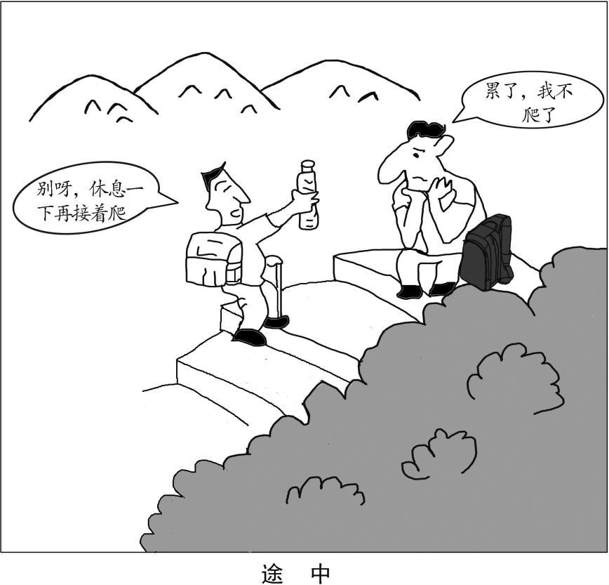

# 2019 年全国硕士研究生招生考试英语（一）试题

> 科目代码 201 ｜ 满分 100 分 ｜ 考试时间 180 分钟

> 说明：本文件由历年真题整理生成，供个人备考使用。**参考答案在文末**。

---

## Section I Use of English

> Directions:
> Read the following text. Choose the best word(s) for each numbered blank and mark
> A, B, C or D on the ANSWER SHEET. (10 points)

Today we live in a world where GPS systems, digital maps, and other navigation
apps are available on our smartphones. \_\_\_(1)\_\_\_ of us just walk straight into the woods
without a phone. But phones \_\_\_(2)\_\_\_ on batteries, and batteries can die faster than we
realize. \_\_\_(3)\_\_\_ you get lost without a phone or a compass, and you \_\_\_(4)\_\_\_ can’t find
north, we have a few tricks to help you navigate \_\_\_(5)\_\_\_ to civilization, one of which is
to follow the land.

When you find yourself well \_\_\_(6)\_\_\_ a trail, but not in a completely \_\_\_(7)\_\_\_ area,
you have to answer two questions: Which \_\_\_(8)\_\_\_ is downhill, in this particular area?
And where is the nearest water source? Humans overwhelmingly live in valleys, and
on supplies of fresh water. \_\_\_(9)\_\_\_ , if you head downhill, and follow any H O you find,
2
you should \_\_\_(10)\_\_\_ see signs of people.

If you’ve explored the area before, keep an eye out for familiar sights – you may
be \_\_\_(11)\_\_\_ how quickly identifying a distinctive rock or tree can restore your bearings.
Another \_\_\_(12)\_\_\_ : Climb high and look for signs of human habitation. \_\_\_(13)\_\_\_ ,
even in dense forest, you should be able to \_\_\_(14)\_\_\_ gaps in the tree line due to roads,
train tracks, and other paths people carve \_\_\_(15)\_\_\_ the woods. Head toward these
\_\_\_(16)\_\_\_ to find a way out. At night, scan the horizon for \_\_\_(17)\_\_\_ light sources, such as fires
and streetlights, then walk toward the glow of light pollution.

\_\_\_(18)\_\_\_ , assuming you’re lost in an area humans tend to frequent, look for
the \_\_\_(19)\_\_\_ we leave on the landscape. Trail blazes, tire tracks, and other features
can \_\_\_(20)\_\_\_ you to civilization.

**1.** **A.** Some&nbsp;&nbsp;&nbsp;&nbsp;**B.** Most&nbsp;&nbsp;&nbsp;&nbsp;**C.** Few&nbsp;&nbsp;&nbsp;&nbsp;**D.** All

**2.** **A.** put&nbsp;&nbsp;&nbsp;&nbsp;**B.** take&nbsp;&nbsp;&nbsp;&nbsp;**C.** run&nbsp;&nbsp;&nbsp;&nbsp;**D.** come

**3.** **A.** Since&nbsp;&nbsp;&nbsp;&nbsp;**B.** If&nbsp;&nbsp;&nbsp;&nbsp;**C.** Though&nbsp;&nbsp;&nbsp;&nbsp;**D.** Until

**4.** **A.** formally&nbsp;&nbsp;&nbsp;&nbsp;**B.** relatively&nbsp;&nbsp;&nbsp;&nbsp;**C.** gradually&nbsp;&nbsp;&nbsp;&nbsp;**D.** literally

**5.** **A.** back&nbsp;&nbsp;&nbsp;&nbsp;**B.** next&nbsp;&nbsp;&nbsp;&nbsp;**C.** around&nbsp;&nbsp;&nbsp;&nbsp;**D.** away

**6.** **A.** onto&nbsp;&nbsp;&nbsp;&nbsp;**B.** off&nbsp;&nbsp;&nbsp;&nbsp;**C.** across&nbsp;&nbsp;&nbsp;&nbsp;**D.** alone

**7.** **A.** unattractive&nbsp;&nbsp;&nbsp;&nbsp;**B.** uncrowded&nbsp;&nbsp;&nbsp;&nbsp;**C.** unchanged&nbsp;&nbsp;&nbsp;&nbsp;**D.** unfamiliar

**8.** **A.** site&nbsp;&nbsp;&nbsp;&nbsp;**B.** point&nbsp;&nbsp;&nbsp;&nbsp;**C.** way&nbsp;&nbsp;&nbsp;&nbsp;**D.** place

**9.** **A.** So&nbsp;&nbsp;&nbsp;&nbsp;**B.** Yet&nbsp;&nbsp;&nbsp;&nbsp;**C.** Instead&nbsp;&nbsp;&nbsp;&nbsp;**D.** Besides

**10.** **A.** immediately&nbsp;&nbsp;&nbsp;&nbsp;**B.** intentionally&nbsp;&nbsp;&nbsp;&nbsp;**C.** unexpectedly&nbsp;&nbsp;&nbsp;&nbsp;**D.** eventually

**11.** **A.** surprised&nbsp;&nbsp;&nbsp;&nbsp;**B.** annoyed&nbsp;&nbsp;&nbsp;&nbsp;**C.** frightened&nbsp;&nbsp;&nbsp;&nbsp;**D.** confused

**12.** **A.** problem&nbsp;&nbsp;&nbsp;&nbsp;**B.** option&nbsp;&nbsp;&nbsp;&nbsp;**C.** view&nbsp;&nbsp;&nbsp;&nbsp;**D.** result

**13.** **A.** Above all&nbsp;&nbsp;&nbsp;&nbsp;**B.** In contrast&nbsp;&nbsp;&nbsp;&nbsp;**C.** On average&nbsp;&nbsp;&nbsp;&nbsp;**D.** For example

**14.** **A.** bridge&nbsp;&nbsp;&nbsp;&nbsp;**B.** avoid&nbsp;&nbsp;&nbsp;&nbsp;**C.** spot&nbsp;&nbsp;&nbsp;&nbsp;**D.** separate

**15.** **A.** from&nbsp;&nbsp;&nbsp;&nbsp;**B.** through&nbsp;&nbsp;&nbsp;&nbsp;**C.** beyond&nbsp;&nbsp;&nbsp;&nbsp;**D.** under

**16.** **A.** posts&nbsp;&nbsp;&nbsp;&nbsp;**B.** links&nbsp;&nbsp;&nbsp;&nbsp;**C.** shades&nbsp;&nbsp;&nbsp;&nbsp;**D.** breaks

**17.** **A.** artificial&nbsp;&nbsp;&nbsp;&nbsp;**B.** mysterious&nbsp;&nbsp;&nbsp;&nbsp;**C.** hidden&nbsp;&nbsp;&nbsp;&nbsp;**D.** limited

**18.** **A.** Finally&nbsp;&nbsp;&nbsp;&nbsp;**B.** Consequently&nbsp;&nbsp;&nbsp;&nbsp;**C.** Incidentally&nbsp;&nbsp;&nbsp;&nbsp;**D.** Generally

**19.** **A.** memories&nbsp;&nbsp;&nbsp;&nbsp;**B.** marks&nbsp;&nbsp;&nbsp;&nbsp;**C.** notes&nbsp;&nbsp;&nbsp;&nbsp;**D.** belongings

**20.** **A.** restrict&nbsp;&nbsp;&nbsp;&nbsp;**B.** adopt&nbsp;&nbsp;&nbsp;&nbsp;**C.** lead&nbsp;&nbsp;&nbsp;&nbsp;**D.** expose

## Section II Reading Comprehension — Part A

> Part A
> Directions:
> Read the following four texts. Answer the questions after each text by choosing A, B,
> C or D. Mark your answers on the ANSWER SHEET. (40 points)

### Text 1

Financial regulators in Britain have imposed a rather unusual rule on the bosses
of big banks. Starting next year, any guaranteed bonus of top executives could be
delayed 10 years if their banks are under investigation for wrongdoing. The main
purpose of this “clawback” rule is to hold bankers accountable for harmful risk-taking
and to restore public trust in financial institutions. Yet officials also hope for a much
larger benefit: more long-term decision-making, not only by banks but by all
corporations, to build a stronger economy for future generations.

“Short-termism” or the desire for quick profits, has worsened in publicly traded
companies, says the Bank of England’s top economist, Andrew Haldane. He quotes a
giant of classical economics, Alfred Marshall, in describing this financial impatience
as acting like “children who pick the plums out of their pudding to eat them at once”
rather than putting them aside to be eaten last.

The average time for holding a stock in both the United States and Britain, he
notes, has dropped from seven years to seven months in recent decades. Transient
investors, who demand high quarterly profits from companies, can hinder a firm’s
efforts to invest in long-term research or to build up customer loyalty. This has been
dubbed “quarterly capitalism.”

In addition, new digital technologies have allowed more rapid trading of equities,
quicker use of information, and thus shorter attention spans in financial markets.
“There seems to be a predominance of short-term thinking at the expense of long-
term investing,” said Commissioner Daniel Gallagher of the US Securities and
Exchange Commission in a speech this week.

In the US, the Sarbanes-Oxley Act of 2002 has pushed most public companies to
defer performance bonuses for senior executives by about a year, slightly helping
reduce “short-termism.” In its latest survey of CEO pay, The Wall Street Journal finds
that “a substantial part” of executive pay is now tied to performance.

Much more could be done to encourage “long-termism,” such as changes in the
tax code and quicker disclosure of stock acquisitions. In France, shareholders who
hold onto a company investment for at least two years can sometimes earn more
voting rights in a company.

Within companies, the right compensation design can provide incentives for
executives to think beyond their own time at the company and on behalf of all
stakeholders. Britain’s new rule is a reminder to bankers that society has an interest in
their performance, not just for the short term but for the long term.

**21.** According to Paragraph 1, one motive in imposing the new rule is to

- **A.** enhance bankers’ sense of responsibility.
- **B.** help corporations achieve larger profits.
- **C.** build a new system of financial regulation.
- **D.** guarantee the bonuses of top executives.

**22.** Alfred Marshall is quoted to indicate

- **A.** the conditions for generating quick profits.
- **B.** governments’ impatience in decision-making.
- **C.** the solid structure of publicly traded companies.
- **D.** “short-termism” in economic activities.

**23.** It is argued that the influence of transient investment on public companies can be

- **A.** indirect.
- **B.** adverse.
- **C.** minimal.
- **D.** temporary.

**24.** The US and France examples are used to illustrate

- **A.** the obstacles to preventing “short-termism”.
- **B.** the significance of long-term thinking.
- **C.** the approaches to promoting “long-termism”.
- **D.** the prevalence of short-term thinking.

**25.** Which of the following would be the best title for the text?

- **A.** Failure of Quarterly Capitalism
- **B.** Patience as a Corporate Virtue
- **C.** Decisiveness Required of Top Executives
- **D.** Frustration of Risk-taking Bankers

### Text 2

Grade inflation – the gradual increase in average GPAs (grade-point averages)
over the past few decades – is often considered a product of a consumer era in higher
education, in which students are treated like customers to be pleased. But another,
related force – a policy often buried deep in course catalogs called “grade
forgiveness” – is helping raise GPAs.

Grade forgiveness allows students to retake a course in which they received a
low grade, and the most recent grade or the highest grade is the only one that counts
in calculating a student’s overall GPA.

The use of this little-known practice has accelerated in recent years, as colleges
continue to do their utmost to keep students in school (and paying tuition) and
improve their graduation rates. When this practice first started decades ago, it was
usually limited to freshmen, to give them a second chance to take a class in their first
year if they struggled in their transition to college-level courses. But now most
colleges, save for many selective campuses, allow all undergraduates, and even
graduate students, to get their low grades forgiven.

College officials tend to emphasize that the goal of grade forgiveness is less
about the grade itself and more about encouraging students to retake courses critical
to their degree program and graduation without incurring a big penalty. “Ultimately,”
said Jack Miner, Ohio State University’s registrar, “we see students achieve more
success because they retake a course and do better in subsequent courses or master
the content that allows them to graduate on time.”

That said, there is a way in which grade forgiveness satisfies colleges’ own needs as
well. For public institutions, state funds are sometimes tied partly to their success on metrics
such as graduation rates and student retention – so better grades can, by boosting figures
like those, mean more money. And anything that raises GPAs will likely make
students – who, at the end of the day, are paying the bill – feel they’ve gotten a better value
for their tuition dollars, which is another big concern for colleges.

Indeed, grade forgiveness is just another way that universities are responding to
consumers’ expectations for higher education. Since students and parents expect a
college degree to lead to a job, it is in the best interest of a school to turn out
graduates who are as qualified as possible – or at least appear to be. On this, students’
and colleges’ incentives seem to be aligned.

**26.** What is commonly regarded as the cause of grade inflation?

- **A.** The change of course catalogs.
- **B.** Students’ indifference to GPAs.
- **C.** Colleges’ neglect of GPAs.
- **D.** The influence of consumer culture.

**27.** What was the original purpose of grade forgiveness?

- **A.** To help freshmen adapt to college learning.
- **B.** To maintain colleges’ graduation rates.
- **C.** To prepare graduates for a challenging future.
- **D.** To increase universities’ income from tuition.

**28.** According to Paragraph 5, grade forgiveness enables colleges to

- **A.** obtain more financial support.
- **B.** boost their student enrollments.
- **C.** improve their teaching quality.
- **D.** meet local governments’ needs.

**29.** What does the phrase “to be aligned” (Line 5, Para. 6) most probably mean?

- **A.** To counterbalance each other.
- **B.** To complement each other.
- **C.** To be identical with each other.
- **D.** To be contradictory to each other.

**30.** The author examines the practice of grade forgiveness by

- **A.** assessing its feasibility.
- **B.** analyzing the causes behind it.
- **C.** comparing different views on it.
- **D.** listing its long-run effects.

### Text 3

This year marks exactly two centuries since the publication of “Frankenstein; or,
The Modern Prometheus,” by Mary Shelley. Even before the invention of the electric
light bulb, the author produced a remarkable work of speculative fiction that would
foreshadow many ethical questions to be raised by technologies yet to come.

Today the rapid growth of artificial intelligence (AI) raises fundamental questions:
“What is intelligence, identity, or consciousness? What makes humans humans? ”

What is being called artificial general intelligence, machines that would imitate
the way humans think, continues to evade scientists. Yet humans remain fascinated by
the idea of robots that would look, move, and respond like humans, similar to those
recently depicted on popular sci-fi TV series such as “Westworld” and “Humans.”

Just how people think is still far too complex to be understood, let alone
reproduced, says David Eagleman, a Stanford University neuroscientist. “We are just
in a situation where there are no good theories explaining what consciousness actually
is and how you could ever build a machine to get there.”

But that doesn’t mean crucial ethical issues involving AI aren’t at hand. The
coming use of autonomous vehicles, for example, poses thorny ethical questions.
Human drivers sometimes must make split-second decisions. Their reactions may be
a complex combination of instant reflexes, input from past driving experiences, and
what their eyes and ears tell them in that moment. AI “vision” today is not nearly as
sophisticated as that of humans. And to anticipate every imaginable driving situation
is a difficult programming problem.

Whenever decisions are based on masses of data, “you quickly get into a lot of
ethical questions,” notes Tan Kiat How, chief executive of a Singapore-based agency
that is helping the government develop a voluntary code for the ethical use of AI.
Along with Singapore, other governments and mega-corporations are beginning to
establish their own guidelines. Britain is setting up a data ethics center. India released
its AI ethics strategy this spring.

On June 7 Google pledged not to “design or deploy AI” that would cause “overall
harm,” or to develop AI-directed weapons or use AI for surveillance that would
violate international norms. It also pledged not to deploy AI whose use would violate
international laws or human rights.

While the statement is vague, it represents one starting point. So does the idea
that decisions made by AI systems should be explainable, transparent, and fair.
To put it another way: How can we make sure that the thinking of intelligent
machines reflects humanity’s highest values? Only then will they be useful servants
and not Frankenstein’s out-of-control monster.

**31.** Mary Shelley’s novel Frankenstein is mentioned because it

- **A.** fascinates AI scientists all over the world.
- **B.** has remained popular for as long as 200 years.
- **C.** involves some concerns raised by AI today.
- **D.** has sparked serious ethical controversies.

**32.** In David Eagleman’s opinion, our current knowledge of consciousness

- **A.** helps explain artificial intelligence.
- **B.** can be misleading to robot making.
- **C.** inspires popular sci-fi TV series.
- **D.** is too limited for us to reproduce it.

**33.** The solution to the ethical issues brought by autonomous vehicles

- **A.** can hardly ever be found.
- **B.** is still beyond our capacity.
- **C.** causes little public concern.
- **D.** has aroused much curiosity.

**34.** The author’s attitude toward Google’s pledges is one of

- **A.** affirmation.
- **B.** skepticism.
- **C.** contempt.
- **D.** respect.

**35.** Which of the following would be the best title for the text?

- **A.** AI’s Future: In the Hands of Tech Giants
- **B.** Frankenstein, the Novel Predicting the Age ofAI
- **C.** The Conscience of AI: Complex But Inevitable
- **D.** AI Shall Be Killers Once Out of Control

### Text 4

States will be able to force more people to pay sales tax when they make online
purchases under a Supreme Court decision Thursday that will leave shoppers with
lighter wallets but is a big financial win for states.

The Supreme Court’s opinion Thursday overruled a pair of decades-old decisions that
states said cost them billions of dollars in lost revenue annually. The decisions made it more
difficult for states to collect sales tax on certain online purchases.

The cases the court overturned said that if a business was shipping a customer’s
purchase to a state where the business didn’t have a physical presence such as a
warehouse or office, the business didn’t have to collect sales tax for the state.
Customers were generally responsible for paying the sales tax to the state themselves
if they weren’t charged it, but most didn’t realize they owed it and few paid.

Justice Anthony Kennedy wrote that the previous decisions were flawed. “Each year
the physical presence rule becomes further removed from economic reality and results in
significant revenue losses to the States,” he wrote in an opinion joined by four other justices.
Kennedy wrote that the rule “limited states’ ability to seek long-term prosperity and has
prevented market participants from competing on an even playing field.”

The ruling is a victory for big chains with a presence in many states, since they
usually collect sales tax on online purchases already. Now, rivals will be charging
sales tax where they hadn’t before. Big chains have been collecting sales tax
nationwide because they typically have physical stores in whatever state a purchase is
being shipped to. Amazon.com, with its network of warehouses, also collects sales tax
in every state that charges it, though third-party sellers who use the site don’t have to.

Until now, many sellers that have a physical presence in only a single state or a
few states have been able to avoid charging sales taxes when they ship to addresses
outside those states. Sellers that use eBay and Etsy, which provide platforms for
smaller sellers, also haven’t been collecting sales tax nationwide. Under the ruling
Thursday, states can pass laws requiring out-of-state sellers to collect the state’s sales
tax from customers and send it to the state.

Retail trade groups praised the ruling, saying it levels the playing field for local
and online businesses. The losers, said retail analyst Neil Saunders, are online-only
retailers, especially smaller ones. Those retailers may face headaches complying with
various state sales tax laws. The Small Business & Entrepreneurship Council
advocacy group said in a statement, “Small businesses and internet entrepreneurs are
not well served at all by this decision.”

**36.** The Supreme Court decision Thursday will

- **A.** better businesses’ relations with states.
- **B.** put most online businesses in a dilemma.
- **C.** make more online shoppers pay sales tax.
- **D.** force some states to cut sales tax.

**37.** It can be learned from paragraphs 2 and 3 that the overruled decisions

- **A.** have led to the dominance of e-commerce.
- **B.** have cost consumers a lot over the years.
- **C.** were widely criticized by online purchasers.
- **D.** were considered unfavorable by states.

**38.** According to Justice Anthony Kennedy, the physical presence rule has

- **A.** hindered economic development.
- **B.** brought prosperity to the country.
- **C.** harmed fair market competition.
- **D.** boosted growth in states’ revenue.

**39.** Who are most likely to welcome the Supreme Court ruling?

- **A.** Internet entrepreneurs.
- **B.** Big-chain owners.
- **C.** Third-party sellers.
- **D.** Small retailers.

**40.** In dealing with the Supreme Court decision Thursday, the author

- **A.** gives a factual account of it and discusses its consequences.
- **B.** describes the long and complicated process of its making.
- **C.** presents its main points with conflicting views on them.
- **D.** cites some cases related to it and analyzes their implications.

## Section II Reading Comprehension — Part B

> Part B
> Directions:
> The following paragraphs are given in a wrong order. For Questions 41-45, you are
> required to reorganize these paragraphs into a coherent text by choosing from the list
> A-G and filling them into the numbered boxes. Paragraphs C and F have been
> correctly placed. Mark your answers on the ANSWER SHEET. (10 points)

**文章顺序（方框处需从 A–G 中择段填入）**

**(41)** &nbsp;\_\_\_\_\_\_\_\_\_\_\_\_\_\_\_\_\_\_

**(42)** &nbsp;\_\_\_\_\_\_\_\_\_\_\_\_\_\_\_\_\_\_

> **[已给出段落 F]** These views of arguments also undermine reason. If you see a conversation as a
fight or competition, you can win by cheating as long as you don’t get caught.
You will be happy to convince people with bad arguments. You can call their
views stupid, or joke about how ignorant they are. None of these tricks will help
you understand them, their positions or the issues that divide you, but they can
help you win – in one way.

**(43)** &nbsp;\_\_\_\_\_\_\_\_\_\_\_\_\_\_\_\_\_\_

**(44)** &nbsp;\_\_\_\_\_\_\_\_\_\_\_\_\_\_\_\_\_\_

> **[已给出段落 C]** None of these will be easy but you can start even if others refuse to. Next time
you state your position, formulate an argument for what you claim and honestly
ask yourself whether your argument is any good. Next time you talk with
someone who takes a stand, ask them to give you a reason for their view. Spell
out their argument fully and charitably. Assess its strength impartially. Raise
objections and listen carefully to their replies.

**(45)** &nbsp;\_\_\_\_\_\_\_\_\_\_\_\_\_\_\_\_\_\_

**待选段落**

- **A.** These tools can help you win every argument – not in the unhelpful sense of
beating your opponents but in the better sense of learning about the issues that
divide people. Learning why they disagree with us and learning to talk and work
together with them. If we readjust our view of arguments – from a verbal fight or
tennis game to a reasoned exchange through which we all gain mutual respect, and
understanding – then we change the very nature of what it means to “win” an
argument.
- **B.** Of course, many discussions are not so successful. Still, we need to be careful not
to accuse opponents of bad arguments too quickly. We need to learn how to
evaluate them properly. A large part of evaluation is calling out bad arguments,
but we also need to admit good arguments by opponents and to apply the same
critical standards to ourselves. Humility requires you to recognize weakness in
your own arguments and sometimes also to accept reasons on the opposite side.
- **D.** Carnegie would be right if arguments were fights, which is how we often think of
them. Like physical fights, verbal fights can leave both sides bloodied. Even
when you win, you end up no better off. Your prospects would be almost as
dismal if arguments were even just competitions – like, say, tennis games. Pairs
of opponents hit the ball back and forth until one winner emerges from all who
entered. Everybody else loses. This kind of thinking is why so many people try to
avoid arguments, especially about politics and religion.
- **E.** In his 1936 work How to Win Friends and Influence People, Dale Carnegie wrote:
“There is only one way…to get the best of an argument – and that is to avoid it.”
This aversion to arguments is common, but it depends on a mistaken view of
arguments that causes profound problems for our personal and social lives – and
in many ways misses the point of arguing in the first place.
- **G.** There is a better way to win arguments. Imagine that you favor increasing the
minimum wage in our state, and I do not. If you yell, “Yes,” and I yell, “No,”
neither of us learns anything. We neither understand nor respect each other, and
we have no basis for compromise or cooperation. In contrast, suppose you give a
reasonable argument: that full-time workers should not have to live in poverty.
Then I counter with another reasonable argument: that a higher minimum wage
will force businesses to employ fewer people for less time. Now we can
understand each other’s positions and recognize our shared values, since we both
care about needy workers.

## Section II Reading Comprehension — Part C

> Part C
> Directions:
> Read the following text carefully and then translate the underlined segments into Chinese.
> Your translation should be written neatly on the ANSWER SHEET. (10 points)

It was only after I started to write a weekly column about the medical journals, and began to read scientific papers from beginning to end, that I realised just how bad much of the medical literature frequently was. I came to recognise various signs of a bad paper: the kind of paper that purports to show that people who eat more than one kilo of broccoli a week were 1.17 times more likely than those who eat less to suffer late in life from pernicious anaemia. (46) <u>There is a great deal of this kind of nonsense in the medical journals which, when taken up by broadcasters and the lay press, generates both health scares and short-lived dietary enthusiasms.</u>

Why is so much bad science published? A recent paper, titled “The Natural Selection of Bad Science”, published on the Royal Society’s open science website, attempts to answer this intriguing and important question. It says that the problem is not merely that people do bad science, but that our current system of career advancement positively encourages it. What is important is not truth, but publication, which has become almost an end in itself. There has been a kind of inflationary process at work: (47) <u>nowadays anyone applying for a research post has to have published twice the number of papers that would have been required for the same post only 10 years ago.</u> Never mind the quality, then, count the number.

(48) <u>Attempts have been made to curb this tendency, for example, by trying to incorporate some measure of quality as well as quantity into the assessment of an applicant’s papers.</u> This is the famed citation index, that is to say the number of times a paper has been quoted elsewhere in the scientific literature, the assumption being that an important paper will be cited more often than one of small account. (49) <u>This would be reasonable if it were not for the fact that scientists can easily arrange to cite themselves in their future publications, or get associates to do so for them in return for similar favours.</u>

Boiling down an individual’s output to simple metrics, such as number of publications or journal impacts, entails considerable savings in time, energy and ambiguity. Unfortunately, the long-term costs of using simple quantitative metrics to assess researcher merit are likely to be quite great. (50) <u>If we are serious about ensuring that our science is both meaningful and reproducible, we must ensure that our institutions encourage that kind of science.</u>

**46.** There is a great deal of this kind of nonsense in the medical journals which, when taken up by broadcasters and the lay press, generates both health scares and short-lived dietary enthusiasms.

**47.** nowadays anyone applying for a research post has to have published twice the number of papers that would have been required for the same post only 10 years ago.

**48.** Attempts have been made to curb this tendency, for example, by trying to incorporate some measure of quality as well as quantity into the assessment of an applicant’s papers.

**49.** This would be reasonable if it were not for the fact that scientists can easily arrange to cite themselves in their future publications, or get associates to do so for them in return for similar favours.

**50.** If we are serious about ensuring that our science is both meaningful and reproducible, we must ensure that our institutions encourage that kind of science.

## Section III Writing — Part A

51. Directions:
Suppose you are working for the “Aiding Rural Primary School” project of your
university. Write an email to answer the inquiry from an international student
volunteer, specifying the details of the project.
You should write about 100 words on the ANSWER SHEET.
Do not use your own name in the email. Use “Li Ming” instead. (10 points)

## Section III Writing — Part B

52. Directions:
Write an essay of 160-200 words based on the picture below. In your essay, you
should
1) describe the picture briefly,
2) interpret the implied meaning, and
3) give your comments.
You should write neatly on the ANSWER SHEET. (20 points)

---

## 参考答案

### Section I Use of English

**1.** C · Few
**2.** C · run
**3.** B · If
**4.** D · literally
**5.** A · back
**6.** B · off
**7.** D · unfamiliar
**8.** C · way
**9.** A · So
**10.** D · eventually
**11.** A · surprised
**12.** B · option
**13.** D · For example
**14.** C · spot
**15.** B · through
**16.** D · breaks
**17.** A · artificial
**18.** A · Finally
**19.** B · marks
**20.** C · lead

### Section II Reading Comprehension — Part A

*Text 1*

**21.** A · enhance bankers’ sense of responsibility.
**22.** D · “short-termism” in economic activities.
**23.** B · adverse.
**24.** C · the approaches to promoting “long-termism”.
**25.** B · Patience as a Corporate Virtue

*Text 2*

**26.** D · The influence of consumer culture.
**27.** A · To help freshmen adapt to college learning.
**28.** A · obtain more financial support.
**29.** C · To be identical with each other.
**30.** B · analyzing the causes behind it.

*Text 3*

**31.** C · involves some concerns raised by AI today.
**32.** D · is too limited for us to reproduce it.
**33.** B · is still beyond our capacity.
**34.** A · affirmation.
**35.** C · The Conscience of AI: Complex But Inevitable

*Text 4*

**36.** C · make more online shoppers pay sales tax.
**37.** D · were considered unfavorable by states.
**38.** C · harmed fair market competition.
**39.** B · Big-chain owners.
**40.** A · gives a factual account of it and discusses its consequences.

### Section II Reading Comprehension — Part B

**41–45**：E  D  G  B  A

### Section II Reading Comprehension — Part C

**46.** 医学期刊中充斥着这类无稽之谈，这些东西一经广播和非专业报刊传播，就会引起健康方面的恐慌和对某些饮食的短暂追捧。
> **采分点**：`There is a great deal of this kind of nonsense in the medical journals`（1） ｜ `which, when taken up by broadcasters and the lay press`（0.5） ｜ `generates both health scares and short-lived dietary enthusiasms`（0.5）

**47.** 今天，任何一个科研岗位的申请者需要发表文章的数量比短短十年前申报同一岗位时整整翻了一番。
> **采分点**：`nowadays anyone applying for a research post`（0.5） ｜ `has to have published twice the number of papers`（0.5） ｜ `that would have been required for the same post only 10 years ago`（1）

**48.** 为遏制这一倾向已经采取了若干措施，比如在评定岗位申请者的论文时，尝试引入一项兼顾数量和质量的评估指标。
> **采分点**：`Attempts have been made to curb this tendency`（1） ｜ `for example, by trying to incorporate some measure of quality as well as quantity into the assessment of an applicant's papers`（1）

**49.** 要不是因为科研人员轻易就能在将来的论文里自我引用，或找同行引用以回报自己提供的类似好处，这项措施本该是合理的。
> **采分点**：`This would be reasonable`（0.5） ｜ `if it were not for the fact`（0.5） ｜ `that scientists can easily arrange to cite themselves in their future publications`（0.5） ｜ `or get associates to do so for them in return for similar favours`（0.5）

**50.** 如果我们真想保证我们的科研既有意义又可复制，就必须确保我们的体制能激励这样的科研。
> **采分点**：`If we are serious about ensuring that our science is both meaningful and reproducible`（1） ｜ `we must ensure that our institutions encourage that kind of science`（1）

### Section III Writing — Part A

**51 参考范文**

Dear Volunteer,

With the sincere appreciation for your dedication to our project, “Aiding Rural Primary Schools”, I’d like to answer your inquiry regarding the forthcoming voluntary activity.

Each summer holiday, we organize ten volunteers to teach for three weeks in rural primary schools mostly understaffed and seriously lacking in resources. International students are often assigned to teach English and assist local teachers during classes, which will greatly benefit pupils there who often struggle in their English study. Besides, there will be a brief training session before leaving, during which you should decide teaching plans and submit them in advance for overall arrangement. And surely, our university will pay all volunteers' expenses on meals, accommodation and transportation.

It is hoped that my reply will be of help and please email me if you have any further questions.

Yours sincerely,
Li Ming

### Section III Writing — Part B

**52 参考范文**

In the picture, there are two climbers on their way to the top of a mountain. One of them, sitting on a stone step with his backpack aside, says in slight frustration, “I’m too tired to go any further.” His travel companion hands him a bottle of drink and replies encouragingly, “Come on! Take a break and keep climbing.” The picture intends to illustrate the irreplaceable role persistence plays in realizing great ambitions.

Just as mountaineers have to climb up rocky and steep slopes before reaching the peak, we will inevitably encounter numerous obstacles on our way to success. What is needed then is a sustained effort to conquer them rather than an excuse to give up. After all, surrender means all previous efforts come to naught while hanging on certainly brings rewards. High achievers in competitive sports understand that very well and, almost without exception, attribute their glories to their perseverance with intensive training day after day.

As an old Chinese saying goes, the last leg of a journey marks the halfway point. The closer we get to the finishing line, the more fatigued and lazier we feel. At such tough moments, we can only achieve our goals by being strong-willed and gritting our teeth. In other words, the virtue of persistence is the key to success and thus needs to be cultivated consciously.
