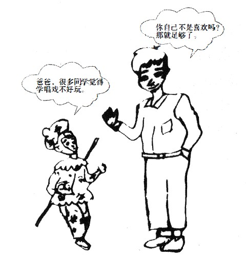

# 2021 年全国硕士研究生招生考试英语（一）试题

> 科目代码 201 ｜ 满分 100 分 ｜ 考试时间 180 分钟

> 说明：本文件由历年真题整理生成，供个人备考使用。**参考答案在文末**。

---

## Section I Use of English

> Directions:
> Read the following text. Choose the best word(s) for each numbered blank and mark
> A, B, C or D on the ANSWER SHEET. (10 points)

Fluid intelligence is the type of intelligence that has to do with short-term
memory and the ability to think quickly, logically, and abstractly in order to
solve new problems.It \_\_\_(1)\_\_\_ in young adulthood, levels out for a period of
time, and then \_\_\_(2)\_\_\_ starts to slowly decline as we age. But \_\_\_(3)\_\_\_ aging is
inevitable, scientists are finding out that certain changes in brain function may
not be.

One study found that muscle loss and the \_\_\_(4)\_\_\_ of body fat around the
abdomen are associated with a decline in fluid intelligence. This suggests the
\_\_\_(5)\_\_\_ that lifestyle factors might help prevent or \_\_\_(6)\_\_\_ this type of decline.

The researchers looked at data that \_\_\_(7)\_\_\_ measurements of lean muscle
and abdominal fat from more than 4,000 middle-to-older-aged men and women
and \_\_\_(8)\_\_\_ that data to reported changes in fluid intelligence over a six-year
period. They found that middle-aged people \_\_\_(9)\_\_\_ higher measures of
abdominal fat \_\_\_(10)\_\_\_ worse on measures of fluid intelligence as the years \_\_\_(11)\_\_\_
.

For women, the association may be \_\_\_(12)\_\_\_ to changes in immunity that
resulted from excess abdominal fat; in men, the immune system did not appear
to be \_\_\_(13)\_\_\_ . It is hoped that future studies could \_\_\_(14)\_\_\_ these differences
and perhaps lead to different \_\_\_(15)\_\_\_ for men and women.

\_\_\_(16)\_\_\_ , there are steps you can \_\_\_(17)\_\_\_ to help reduce abdominal fat and
maintain lean muscle mass as you age in order to protect both your physical
and mental \_\_\_(18)\_\_\_ The two highly recommended lifestyle approaches are
maintaining or increasing your \_\_\_(19)\_\_\_ of aerobic exercise and following a
Mediterranean-style \_\_\_(20)\_\_\_ that is high in fiber and eliminates highly
processed foods.

**1.** **A.** pauses&nbsp;&nbsp;&nbsp;&nbsp;**B.** peaks&nbsp;&nbsp;&nbsp;&nbsp;**C.** returns&nbsp;&nbsp;&nbsp;&nbsp;**D.** fades

**2.** **A.** alternatively&nbsp;&nbsp;&nbsp;&nbsp;**B.** formally&nbsp;&nbsp;&nbsp;&nbsp;**C.** generally&nbsp;&nbsp;&nbsp;&nbsp;**D.** accidentally

**3.** **A.** until&nbsp;&nbsp;&nbsp;&nbsp;**B.** since&nbsp;&nbsp;&nbsp;&nbsp;**C.** once&nbsp;&nbsp;&nbsp;&nbsp;**D.** while

**4.** **A.** accumulation&nbsp;&nbsp;&nbsp;&nbsp;**B.** detection&nbsp;&nbsp;&nbsp;&nbsp;**C.** consumption&nbsp;&nbsp;&nbsp;&nbsp;**D.** separation

**5.** **A.** requirement&nbsp;&nbsp;&nbsp;&nbsp;**B.** decision&nbsp;&nbsp;&nbsp;&nbsp;**C.** goal&nbsp;&nbsp;&nbsp;&nbsp;**D.** possibility

**6.** **A.** utilize&nbsp;&nbsp;&nbsp;&nbsp;**B.** ensure&nbsp;&nbsp;&nbsp;&nbsp;**C.** seek&nbsp;&nbsp;&nbsp;&nbsp;**D.** delay

**7.** **A.** modified&nbsp;&nbsp;&nbsp;&nbsp;**B.** included&nbsp;&nbsp;&nbsp;&nbsp;**C.** supported&nbsp;&nbsp;&nbsp;&nbsp;**D.** predicted

**8.** **A.** compared&nbsp;&nbsp;&nbsp;&nbsp;**B.** devoted&nbsp;&nbsp;&nbsp;&nbsp;**C.** converted&nbsp;&nbsp;&nbsp;&nbsp;**D.** applied

**9.** **A.** against&nbsp;&nbsp;&nbsp;&nbsp;**B.** above&nbsp;&nbsp;&nbsp;&nbsp;**C.** by&nbsp;&nbsp;&nbsp;&nbsp;**D.** with

**10.** **A.** lived&nbsp;&nbsp;&nbsp;&nbsp;**B.** scored&nbsp;&nbsp;&nbsp;&nbsp;**C.** managed&nbsp;&nbsp;&nbsp;&nbsp;**D.** played

**11.** **A.** ran out&nbsp;&nbsp;&nbsp;&nbsp;**B.** set off&nbsp;&nbsp;&nbsp;&nbsp;**C.** went by&nbsp;&nbsp;&nbsp;&nbsp;**D.** drew in

**12.** **A.** attributable&nbsp;&nbsp;&nbsp;&nbsp;**B.** superior&nbsp;&nbsp;&nbsp;&nbsp;**C.** parallel&nbsp;&nbsp;&nbsp;&nbsp;**D.** resistant

**13.** **A.** restored&nbsp;&nbsp;&nbsp;&nbsp;**B.** involved&nbsp;&nbsp;&nbsp;&nbsp;**C.** isolated&nbsp;&nbsp;&nbsp;&nbsp;**D.** controlled

**14.** **A.** alter&nbsp;&nbsp;&nbsp;&nbsp;**B.** spread&nbsp;&nbsp;&nbsp;&nbsp;**C.** explain&nbsp;&nbsp;&nbsp;&nbsp;**D.** remove

**15.** **A.** compensations&nbsp;&nbsp;&nbsp;&nbsp;**B.** symptoms&nbsp;&nbsp;&nbsp;&nbsp;**C.** treatments&nbsp;&nbsp;&nbsp;&nbsp;**D.** demands

**16.** **A.** Meanwhile&nbsp;&nbsp;&nbsp;&nbsp;**B.** Likewise&nbsp;&nbsp;&nbsp;&nbsp;**C.** Therefore&nbsp;&nbsp;&nbsp;&nbsp;**D.** Instead

**17.** **A.** change&nbsp;&nbsp;&nbsp;&nbsp;**B.** watch&nbsp;&nbsp;&nbsp;&nbsp;**C.** take&nbsp;&nbsp;&nbsp;&nbsp;**D.** count

**18.** **A.** coordination&nbsp;&nbsp;&nbsp;&nbsp;**B.** process&nbsp;&nbsp;&nbsp;&nbsp;**C.** formation&nbsp;&nbsp;&nbsp;&nbsp;**D.** wellbeing

**19.** **A.** space&nbsp;&nbsp;&nbsp;&nbsp;**B.** love&nbsp;&nbsp;&nbsp;&nbsp;**C.** knowledge&nbsp;&nbsp;&nbsp;&nbsp;**D.** level

**20.** **A.** design&nbsp;&nbsp;&nbsp;&nbsp;**B.** diet&nbsp;&nbsp;&nbsp;&nbsp;**C.** routine&nbsp;&nbsp;&nbsp;&nbsp;**D.** prescription

## Section II Reading Comprehension — Part A

> Directions:
> Read the following four texts. Answer the questions after each text by choosing A, B,
> C or D. Mark your answers on the ANSWER SHEET. (40 points)

### Text 1

How can Britain’s train operators possibly justify yet another increase to rail passenger fares? It has become a grimly reliable annual ritual: every January the cost of travelling by train rises, imposing a significant extra burden on those who have no option but to use the rail network to get to work or otherwise. This year’s rise, an average of 2.7 per cent, may be a fraction lower than last year’s, but it is still well above the official Consumer Price Index (CPI) measure of inflation.

Successive governments have permitted such increases on the grounds that the cost of investing in and running the rail network should be borne by those who use it, rather than the general taxpayer. Why, the argument goes, should a car-driving pensioner from Lincolnshire have to subsidise the daily commute of a stockbroker from Surrey? Equally, there is a sense that the travails of commuters in the South East, many of whom will face among the biggest rises, have received too much attention compared to those who must endure the relatively poor infrastructure of the Midlands and the North.

However, over the past 12 months, those commuters have also experienced some of the worst rail strikes in years. It is all very well train operators trumpeting the improvements they are making to the network, but passengers should be able to expect a basic level of service for the substantial sums they are now paying to travel. The responsibility for the latest wave of strikes rests on the unions. However, there is a strong case that those who have been worst affected by industrial action should receive compensation for the disruption they have suffered.

The Government has pledged to change the law to introduce a minimum service requirement so that, even when strikes occur, services can continue to operate.This should form part of a wider package of measures to address the long- running problems on Britain’s railways.Yes, more investment is needed, but passengers will not be willing to pay more indefinitely if they must also endure cramped, unreliable services, interrupted by regular chaos when timetables are changed,or planned maintenance is managed incompetently. The threat of nationalisation may have been seen off for now, but it will return with a vengeance if the justified anger of passengers is not addressed in short order.

**21.** The author holds that this year’s increase in rail passenger fares

- **A.** will ease train operators’ burden.
- **B.** has kept pace with inflation.
- **C.** is a big surprise to commuters.
- **D.** remains an unreasonable measure.

**22.** The stockbroker in Paragraph 2 is used to stand for

- **A.** car drivers.
- **B.** rail travellers.
- **C.** local investors.
- **D.** ordinary taxpayers.

**23.** It is indicated in Paragraph 3 that train operators

- **A.** are offering compensation to commuters.
- **B.** are trying to repair relations with the unions.
- **C.** have failed to provide an adequate service.
- **D.** have suffered huge losses owing to the strikes.

**24.** If unable to calm down passengers, the railways may have to face

- **A.** a change of ownership.
- **B.** a reduction of revenue.
- **C.** the loss of investment.
- **D.** the collapse of operations.

**25.** Which of the following would be the best title for the text?

- **A.** Ever-rising Fares Aren’t Sustainable
- **B.** Who Are to Blame for the Strikes?
- **C.** Constant Complaining Doesn’t Work
- **D.** Can Nationalisation Bring Hope?

### Text 2

Last year marked the third year in a row that Indonesia’s bleak rate of deforestation has slowed in pace. One reason for the turnaround may be the country’s antipoverty program.

In 2007, Indonesia started phasing in a program that gives money to its poorest residents under certain conditions, such as requiring people to keep kids in school or get regular medical care. Called conditional cash transfers or CCTs, these social assistance programs are designed to reduce inequality and break the cycle of poverty.They’re already used in dozens of countries worldwide. In Indonesia, the program has provided enough food and medicine to substantially reduce severe growth problems among children.

But CCT programs don’t generally consider effects on the environment. In fact, poverty alleviation and environmental protection are often viewed as conflicting goals, says Paul Ferraro , an economist at Johns Hopkins University.

That’s because economic growth can be correlated with environmental degradation, while protecting the environment is sometimes correlated with greater poverty.However, those correlations don’t prove cause and effect. The only previous study analyzing causality, based on an area in Mexico that had instituted CCTs, supported the traditional view. There, as people got more money, some of them may have more cleared land for cattle to raise for meat,Ferraro says.

Such programs do not have to negatively affect the environment, though. Ferraro wanted to see if Indonesia’s poverty-alleviation program was affecting deforestation. Indonesia has the third-largest area of tropical forest in the world and one of the highest deforestation rates.

Ferraro analyzed satellite data showing annual forest loss from 2008 to 2012 —including during Indonesia’s phase-in of the antipoverty program—in 7,468 forested villages across 15 provinces. “We see that the program is associated with a 30 percent reduction in deforestation,” Ferraro says.

That’s likely because the rural poor are using the money as makeshift insurance policies against inclement weather, Ferraro says. Typically, if rains are delayed, people may clear land to plant more rice to supplement their harvests.With the CCTs, individuals instead can use the money to supplement their harvests.

Whether this research translates elsewhere is anybody’s guess.Ferraro suggests the results may transfer to other parts of Asia, due to commonalities such as the importance of growing rice and market access.And regardless of transferability, the study shows that what’s good for people may also be good for the environment. Even if this program didn’t reduce poverty, Ferraro says, “the value of the avoided deforestation just for carbon dioxide emissions alone is more than the program costs.”

**26.** According to the first two paragraphs, CCT programs aim to

- **A.** improve local education systems.
- **B.** lower deforestation rates.
- **C.** help poor families get better off.
- **D.** facilitate healthcare reform.

**27.** The study based on an area in Mexico is cited to show that

- **A.** economic growth tends to cause environmental degradation.
- **B.** cattle rearing has been a major means of livelihood for the poor.
- **C.** CCT programs have helped preserve traditional lifestyles.
- **D.** antipoverty efforts require the participation of local farmers.

**28.** In his study about Indonesia, Ferraro intends to find out

- **A.** its acceptance level of CCTs.
- **B.** its annual rate of poverty alleviation.
- **C.** the role of its forests in climate change.
- **D.** the relation of CCTs to its forest loss.

**29.** According to Ferraro, the CCT program in Indonesia is most valuable in that

- **A.** it will benefit other Asian countries.
- **B.** it will reduce regional inequality.
- **C.** it can boost grain production.
- **D.** it can protect the environment.

**30.** What is the text centered on?

- **A.** The debates over a program.
- **B.** The effects of a program.
- **C.** The transferability of a study.
- **D.** The process of a study.

### Text 3

As a historian who’s always searching for the text or the image that makes us re-evaluate the past,I’ve become preoccupied with looking for photographs that show our Victorian ancestors smiling ( what better way to shatter the image of 19th-century prudery?). I’ve found quite a few, and—since I started posting them on Twitter—they have been causing quite a stir. People have been surprised to see evidence that Victorians had fun and could,and did, laugh. They are noting that the Victorians suddenly seem to become more human as the hundred-or-so years that separate us fade away through our common experience of laughter.

Of course, I need to concede that my collection of ‘Smiling Victorians’ makes up only a tiny percentage of the vast catalogue of photographic portraiture created between 1840 and 1900, the majority of which show sitters posing miserably and stiffly in front of painted backdrops, or staring absently into the middle distance.How do we explain this trend?

During the 1840s and 1850s, in the early days of photography, exposure times were notoriously long: the daguerreotype photographic method (producing an image on a silvered copper plate) could take several minutes to complete, resulting in blurred images as sitters shifted position or adjusted their limbs. The thought of holding a fixed grin as the camera performed its magical duties was too much to contemplate, and so anon-committal blank stare became the norm.

But exposure times were much quicker by the 1880s, and the introduction of the Box Brownie and other portable cameras meant that, though slow by today’s digital standards, the exposure was almost instantaneous.Spontaneous smiles were relatively easy to capture by the 1890s, so we must look elsewhere for an explanation of why Victorians still hesitated to smile.

One explanation might be the loss of dignity displayed through a cheesy grin. “Nature gave us lips to conceal our teeth,” ran one popular Victorian saying, alluding to the fact that before the birth of proper dentistry, mouths were often in a shocking state of hygiene. A flashing set of healthy and clean, regular ‘pearly whites’ was a rare sight in Victorian society, the preserve of the super-rich (and even then,dental hygiene was not guaranteed).

A toothy grin ( especially when there were gaps or blackened teeth) lacked class: drunks,tramps and music hall performers might gurn and grin with a smile as wide as Lewis Carroll’s gum-exposing Cheshire Cat, but it was not a becoming look for properly bred persons. Even Mark Twain, a man who enjoyed a hearty laugh, said that when it came to photographic portraits there could be “nothing more damning than a silly, foolish smile fixed forever”.

**31.** According to Paragraph 1, the author’s posts on Twitter

- **A.** illustrated the development of Victorian photography.
- **B.** changed people’s impression of the Victorians.
- **C.** highlighted social media’s role in Victorian studies.
- **D.** re-evaluated the Victorians’ notion of public image.

**32.** What does the author say about the Victorian portraits he has collected?

- **A.** They are in popular use among historians.
- **B.** They show effects of different exposure times.
- **C.** They are rare among photographs of that age.
- **D.** They mirror 19th-century social conventions.

**33.** What might have kept the Victorians from smiling for pictures in the 1890s?

- **A.** Their unhealthy dental condition.
- **B.** Their inherent social sensitiveness.
- **C.** Their tension before the camera.
- **D.** Their distrust of new inventions.

**34.** Mark Twain is quoted to show that the disapproval of smiles in pictures was

- **A.** a thought-provoking idea.
- **B.** a deep-rooted belief.
- **C.** a misguided attitude.
- **D.** a controversial view.

**35.** Which of the following questions does the text answer?

- **A.** When did the Victorians start to view photography differently?
- **B.** What made photography develop slowly in the Victorian period?
- **C.** Why did most Victorians look stem in photographs?
- **D.** How did smiling in photographs become a post-Victorian norm?

### Text 4

From the early days of broadband, advocates for consumers and web-based companies worried that the cable and phone companies selling broadband connections had the power and incentive to favor affiliated websites over their rivals’. That’s why there has been such a strong demand for rules that would prevent broadband providers from picking winners and losers online, preserving the freedom and innovation that have been the lifeblood of the Internet.

Yet that demand has been almost impossible to fill—in part because of pushback from broadband providers, anti-regulatory conservatives and the courts. A federal appeals court weighed in again Tuesday, but instead of providing a badly needed resolution, it only prolonged the fight. At issue before the U.S. Court of Appeals for the District of Columbia Circuit was the latest take of the Federal Communications Commission (FCC) on net neutrality, adopted on a party-line vote in 2017. The Republican-penned order not only eliminated the strict net neutrality rules the FCC had adopted when it had a Democratic majority in 2015, but rejected the commission’s authority to require broadband providers to do much of anything. The order also declared that state and local governments couldn’t regulate broadband providers either.

The commission argued that other agencies would protect against anti- competitive behavior, such as a broadband-providing conglomerate like AT&T favoring its own video-streaming service at the expense of Netflix and Apple TV.Yet the FCC also ended the investigations of broadband providers that imposed data caps on their rivals’ streaming services but not their own.

On Tuesday, the appeals court unanimously upheld the 2017 order deregulating broadband providers, citing a Supreme Court ruling from 2005 that upheld a similarly deregulatory move.But Judge Patricia Millett rightly argued in a concurring opinion that “the result is unhinged from the realities of modern broadband service,” and said Congress or the Supreme Court could intervene to “ avoid trapping Internet regulation in technological anachronism.”

In the meantime, the court threw out the FCC’s attempt to block all state rules on net neutrality, while preserving the commission’s power to preempt individual state laws that undermine its order. That means more battles like the one now going on between the Justice Department and California, which enacted a tough net neutrality law in the wake of the FCC’s abdication.

The endless legal battles and back-and-forth at the FCC cry out for Congress to act. It needs to give the commission explicit authority once and for all to bar broadband providers from meddling in the traffic on their network and to create clear rules protecting openness and innovation online.

**36.** There has long been concern that broadband providers would

- **A.** show partiality in treating clients.
- **B.** bring web-based firms under control.
- **C.** slow down the traffic on their network.
- **D.** intensify competition with their rivals.

**37.** Faced with the demand for net neutrality rules, the FCC

- **A.** sticks to an out-of-date order.
- **B.** has allowed the states to intervene.
- **C.** has issued a special resolution.
- **D.** takes an anti-regulatory stance.

**38.** What can be learned about AT&T from Paragraph 3?

- **A.** It is in pursuit of quality service.
- **B.** It is under the FCC’s investigation.
- **C.** It protects against unfair competition.
- **D.** It engages in anti-competitive practices.

**39.** Judge Patricia Millett argues that the appeals court’s decision

- **A.** conveys an ambiguous message.
- **B.** is out of touch with reality.
- **C.** is at odds with its earlier rulings.
- **D.** focuses on trivialities.

**40.** What does the author argue in the last paragraph?

- **A.** Broadband providers’rights should be protected.
- **B.** The FCC should be put under strict supervision.
- **C.** Congress needs to take action to ensure net neutrality.
- **D.** Rules need to be set to diversify online services.

## Section II Reading Comprehension — Part B

> Directions:
> Read the following text and answer the questions by choosing the most suitable
> subheading from the list A-G for each of the numbered paragraphs (41-45). There
> are two extra subheadings. Mark your answers on the ANSWER SHEET. (10
> points)

In the movies and on television, artificial intelligence(AI) is typically depicted as something sinister that will upend our way of life. When it comes to AI in business, we often hear about it in relation to automation and the impending loss of jobs, but in what ways is AI changing companies and the larger economy that don’t involve doom-andgloom mass unemployment predictions?

A recent survey of manufacturing and service industries from Tata Consultancy Services found that companies currently use AI more often in computer-to-computeractivities than in automating human activities. Here are a few ways AI is aiding companies without replacing employees:

Better hiring practices
Companies are using artificial intelligence to remove some of the unconscious bias from hiring decisions. “There are experiments that show that, naturally, the results of interviews are much more biased than what AI does,” says Pedro Domingos, author of The Master Algorithm: How the Quest for the Ultimate Learning Machine Will Remake Our World and a computer science professor at the University of Washington. In addition,“(\_\_\_(41)\_\_\_) ” One company that’s doing this is called Blendoor. It uses analytics to help identify where there may be bias in the hiring process.

More effective marketing
Some AI software can analyze and optimize marketing email subject lines to increase open rates. One company in the UK, Phrasee, claims their software can outperform humans by up to 10 percent when it comes to email open rates. This can mean millions more in revenue. (\_\_\_(42)\_\_\_) _________ These are "tools that help people use data, not a replacement for people,” says Patrick H. Winston, a professor of artificial intelligence and computer science at MIT.

Saving customers money
Energy companies can use AI to help customers reduce their electricity bills, saving them money while helping the environment.Companies can also optimize their own energy use and cut down on the cost of electricity. Insurance companies, meanwhile, can base their premiums on AI models that more accurately assess risk.

Domingos says, “ (\_\_\_(43)\_\_\_) ”

Improved accuracy
“ Machine learning often provides a more reliable form of statistics which makes data more valuable,” says Winston. It “helps people make smarter decisions.” (\_\_\_(44)\_\_\_) __

Protecting and maintaining infrastructure
A number of companies, particularly in energy and transportation, use AI image processing technology to inspect infrastructure and prevent equipment failure or leaks before they happen. "If they fail first and then you fix them , it’s very expensive,” says Domingos. “(\_\_\_(45)\_\_\_) ”

**备选项 A–G**

- **A.** AI replaces the boring parts of your job. If you’re doing research, you can have AIgo out and look for relevant sources and information that otherwise you just wouldn’t have time for.
- **B.** There are also companies like Acquisio, which analyzes advertising performance across multiple channels like Adwords, Bing and social media and makes adjustments or suggestions about where advertising funds will yield best results.
- **C.** We’re also giving our customers better channels versus picking up the phone to accomplish something beyond human scale.
- **D.** One accounting firm, BY, uses an AI system that helps review contracts during an audit. This process, along with employees reviewing the contracts, is faster and more accurate.
- **E.** AI looks at resumes in greater numbers than humans would be able to, and selects the more promising candidates.
- **F.** You want to predict if something needs attention now and point to where it’s useful for employees to go to.
- **G.** Before, they might not insure the ones who felt like a high risk or charge them too much, or they would charge them too little and then it would cost the company money.

**41.** &nbsp;\_\_\_\_\_\_\_\_\_\_\_\_\_\_\_\_\_\_

**42.** &nbsp;\_\_\_\_\_\_\_\_\_\_\_\_\_\_\_\_\_\_

**43.** &nbsp;\_\_\_\_\_\_\_\_\_\_\_\_\_\_\_\_\_\_

**44.** &nbsp;\_\_\_\_\_\_\_\_\_\_\_\_\_\_\_\_\_\_

**45.** &nbsp;\_\_\_\_\_\_\_\_\_\_\_\_\_\_\_\_\_\_

## Section II Reading Comprehension — Part C

> Directions:
> Read the following text carefully and then translate the underlined segments into
> Chinese. Your translation should be written neatly on the ANSWER SHEET. (10
> points)

World War II was the watershed event for higher education in modern Western societies.(46) <u>Those societies came out of the war with levels of enrollment that had been roughly constant at 3-5% of the relevant age groups during the decades before the war.</u> But after the war, great social and political changes arising out of the successful war against Fascism created a growing demand in European and American economies for increasing numbers of graduates with more than a secondary school education. (47) <u>And the demand that rose in those societies for entry to higher education extended to groups and social classes that had not thought of attending a university before the war.</u> These demands resulted in a very rapid expansion of the systems of higher education, beginning in the 1960s and developing very rapidly (though unevenly) during the 1970s and 1980s.

The growth of higher education manifests itself in at least three quite different ways, and these in turn have given rise to different sets of problems. There was first the rate of growth: (48) <u>in many countries of Western Europe, the numbers of students in higher education doubled within five-year periods during the 1960s and doubled again in seven , eight, or 10 years by the middle of the 1970s.</u> Second, growth obviously affected the absolute size both of systems and individual institutions. And third, growth was reflected in changes in the proportion of the relevant age group enrolled in institutions of higher education.

Each of these manifestations of growth carried its own peculiar problems in its wake. For example, a high growth rate placed great strains on the existing structures of governance, of administration, and above all of socialization. When a faculty or department grows from, say, five to 20 members within three or four years, (49) <u>and when the new staff are predominantly young men and women fresh from postgraduate study , they largely define the norms of academic life in that faculty.</u> And if the postgraduate student population also grows rapidly and there is loss of a close apprenticeship relationship between faculty members and students, the student culture becomes the chief socializing force for new postgraduate students, with consequences for the intellectual and academic life of the institution-this was seen in America as well as in France, Italy, West Germany, and Japan. (50) <u>High growth rates increased the chances for academic innovation; they also weakened the forms and processes by which teachers and students are admitted into a community of scholars during periods of stability or slow growth.</u> In the 1960s and 1970s, European universities saw marked changes in their governance arrangements, with empowerment of junior faculty and to some degree of students as well.

**46.** Those societies came out of the war with levels of enrollment that had been roughly constant at 3-5% of the relevant age groups during the decades before the war.

**47.** And the demand that rose in those societies for entry to higher education extended to groups and social classes that had not thought of attending a university before the war.

**48.** in many countries of Western Europe, the numbers of students in higher education doubled within five-year periods during the 1960s and doubled again in seven , eight, or 10 years by the middle of the 1970s.

**49.** and when the new staff are predominantly young men and women fresh from postgraduate study , they largely define the norms of academic life in that faculty.

**50.** High growth rates increased the chances for academic innovation; they also weakened the forms and processes by which teachers and students are admitted into a community of scholars during periods of stability or slow growth.

## Section III Writing — Part A

51. Directions:
A foreign friend of yours has recently graduated from college and intends to find a
job in China. Write him/her an e-mail to make some suggestions .
You should write about 100 words on the ANSWER SHEET.
Do not sign your own name in the email. Use “Li Ming” instead.
Do not write the address. ( 10 points)

## Section III Writing — Part B

52. Directions:
Write an essay of 160 - 200 words based on the following picture. In your essay,
you should
1) describe the picture briefly,
2) interpret the implied meaning, and
3) give your comments.
You should write neatly on the ANSWER SHEET. (20 points)

---

## 参考答案

### Section I Use of English

**1.** B · peaks
**2.** C · generally
**3.** D · while
**4.** A · accumulation
**5.** D · possibility
**6.** D · delay
**7.** B · included
**8.** A · compared
**9.** D · with
**10.** B · scored
**11.** C · went by
**12.** A · attributable
**13.** B · involved
**14.** C · explain
**15.** C · treatments
**16.** A · Meanwhile
**17.** C · take
**18.** D · wellbeing
**19.** D · level
**20.** B · diet

### Section II Reading Comprehension — Part A

*Text 1*

**21.** D · remains an unreasonable measure.
**22.** B · rail travellers.
**23.** C · have failed to provide an adequate service.
**24.** A · a change of ownership.
**25.** A · Ever-rising Fares Aren’t Sustainable

*Text 2*

**26.** C · help poor families get better off.
**27.** A · economic growth tends to cause environmental degradation.
**28.** D · the relation of CCTs to its forest loss.
**29.** D · it can protect the environment.
**30.** B · The effects of a program.

*Text 3*

**31.** B · changed people’s impression of the Victorians.
**32.** C · They are rare among photographs of that age.
**33.** A · Their unhealthy dental condition.
**34.** B · a deep-rooted belief.
**35.** C · Why did most Victorians look stem in photographs?

*Text 4*

**36.** A · show partiality in treating clients.
**37.** D · takes an anti-regulatory stance.
**38.** D · It engages in anti-competitive practices.
**39.** B · is out of touch with reality.
**40.** C · Congress needs to take action to ensure net neutrality.

### Section II Reading Comprehension — Part B

**41–45**：E  B  G  D  F

### Section II Reading Comprehension — Part C

**46.** 战争结束时，那些社会的高校入学率为相应年龄人群的 3%—5%,这一水平在战前数十年里大致保持稳定。
> **采分点**：`Those societies came out of the war`（0.5） ｜ `with levels of enrollment`（0.5） ｜ `that had been roughly constant at 3%–5% of the relevant age groups during the decades before the war`（1）

**47.** 那些社会中对于接受高等教育的需求增长了，其范围扩大到战前没有考虑过上大学的群体和社会阶层。
> **采分点**：`And the demand that rose in those societies for entry to higher education`（1） ｜ `extended to groups and social classes`（0.5） ｜ `that had not thought of attending a university before the war`（0.5）

**48.** 在许多西欧国家，高等院校的学生数量在二十世纪六十年代期间五年翻了一番，之后经过七、八或十年的时间到七十年代中期又翻了一番。
> **采分点**：`in many countries of Western Europe the numbers of students in higher education doubled within five-year periods during the 1960s`（1） ｜ `and doubled again in seven, eight, or 10 years by the middle of the 1970s`（1）

**49.** 当绝大多数新教职员工是刚刚完成研究生学业的年轻人时，他们就在很大程度上确立了所在院系的学术生活规范。
> **采分点**：`and when the new staff are predominantly young men and women`（0.5） ｜ `fresh from postgraduate study`（0.5） ｜ `they largely define the norms of academic life in that faculty`（1）

**50.** 高增长率增加了学术创新的可能性；同时也弱化了在稳定时期或缓慢增长时期接纳教师和学生进入学者群体的那些形式和流程。
> **采分点**：`High growth rates increased the chances for academic innovation`（0.5） ｜ `they also weakened the forms and processes`（0.5） ｜ `by which teachers and students are admitted into a community of scholars during periods of stability or slow growth`（1）

### Section III Writing — Part A

**51 参考范文**

My Dear Friend,
Congratulations on your graduation from college! I am glad to hear that you plan on starting your career in China, and I would like to offer several suggestions that may be conducive to your job seeking.

Firstly, I hope you have done your career planning by taking your education, strengths and interests into account, based on which you may set about collecting information regarding your dream industries and companies. Secondly, a variety of talent recruitment websites, including those specially designed for foreigners in China, are viable options, as you can receive first-hand job information and submit your job applications online. Thirdly, do not forget to apply for a post-study work visa. Otherwise, you will not be allowed to work in China.

Hopefully my suggestions above are helpful and wish you all the best!

Yours sincerely,
Li Ming

### Section III Writing — Part B

**52 参考范文**

In the picture, a boy in the Monkey King costume tells his father that many of his classmates find it boring to learn traditional Chinese opera. “Aren’t you yourself fond of it? That is all that matters,” his father replies in a tone of encouragement.

The picture is aimed at inspiring us to chase our passions and dreams regardless of what others may say. The original purpose of pursuing a hobby or a dream is by no means to please others, but to lead ourselves to a more fulfilling and meaningful life. It is thus totally unnecessary for us to hesitate to do what we enjoy for fear of disapproval from others. Admittedly, remaining open to constructive advice is conducive to our growth and future success. But we will never be able to take charge of our own destiny if we are easily swayed by throwaway or even biased remarks of others.

To sum up, having a distinctive hobby is nothing to be ashamed of. Different strokes for different folks, after all. Instead of giving in to pressure to follow the herd, we should be determined and courageous to stick to what we feel enthusiastic about.
