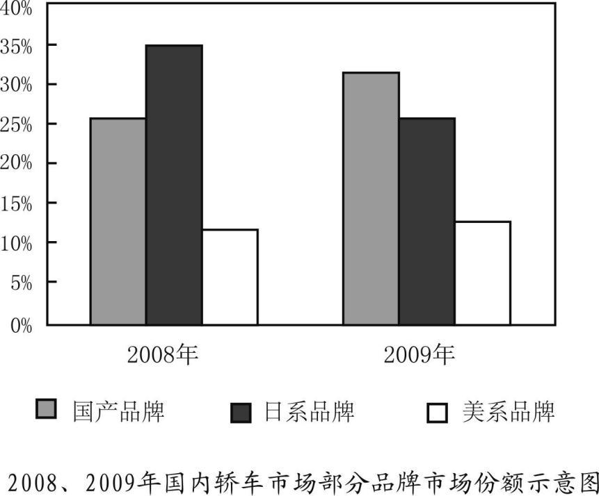

# 2011 年全国硕士研究生招生考试英语（二）试题

> 科目代码 204 ｜ 满分 100 分 ｜ 考试时间 180 分钟

> 说明：本文件由历年真题整理生成，供个人备考使用。**参考答案在文末**。

---

## Section I Use of English

> Read the following text. Choose the best word(s) for each numbered blank and mark A, B, C or D on ANSWER SHEET 1. (10 points)

The Internet affords anonymity to its users, a blessing to privacy and freedom of speech. But that very anonymity is also behind the explosion of cyber-crime that has \_\_\_(1)\_\_\_ across the Web.

Can privacy be preserved \_\_\_(2)\_\_\_ bringing safety and security to a world that seems increasingly \_\_\_(3)\_\_\_?

Last month, Howard Schmidt, the nation’s cyber-czar, offered the federal government a \_\_\_(4)\_\_\_ to make the Web a safer place – a “voluntary trusted identity” system that would be the high-tech \_\_\_(5)\_\_\_ of a physical key, a fingerprint and a photo ID card, all rolled \_\_\_(6)\_\_\_ one. The system might use a smart identity card, or a digital credential \_\_\_(7)\_\_\_ to a specific computer, and would authenticate users at a range of online services.

The idea is to \_\_\_(8)\_\_\_ a federation of private online identity systems. Users could \_\_\_(9)\_\_\_ which system to join, and only registered users whose identities have been authenticated could navigate those systems. The approach contrasts with one that would require an Internet driver’s license \_\_\_(10)\_\_\_ by the government.

Google and Microsoft are among companies that already have these “single sign-on” systems that make it possible for users to \_\_\_(11)\_\_\_ just once but use many different services.

\_\_\_(12)\_\_\_, the approach would create a “walled garden” in cyberspace, with safe “neighborhoods” and bright “streetlights” to establish a sense of a \_\_\_(13)\_\_\_ community.

Mr. Schmidt described it as a “voluntary ecosystem” in which “individuals and organizations can complete online transactions with \_\_\_(14)\_\_\_, trusting the identities of each other and the identities of the infrastructure \_\_\_(15)\_\_\_ which the transaction runs.”

Still, the administration’s plan has \_\_\_(16)\_\_\_ privacy rights activists. Some applaud the approach; others are concerned. It seems clear that such a scheme is an initiative push toward what would \_\_\_(17)\_\_\_ be a compulsory Internet “driver’s license” mentality.

The plan has also been greeted with \_\_\_(18)\_\_\_ by some computer security experts, who worry that the “voluntary ecosystem” envisioned by Mr. Schmidt would still leave much of the Internet \_\_\_(19)\_\_\_. They argue that all Internet users should be \_\_\_(20)\_\_\_ to register and identify themselves, in the same way that drivers must be licensed to drive on public roads.

**1.** **A.** swept&nbsp;&nbsp;&nbsp;&nbsp;**B.** skipped&nbsp;&nbsp;&nbsp;&nbsp;**C.** walked&nbsp;&nbsp;&nbsp;&nbsp;**D.** ridden

**2.** **A.** for&nbsp;&nbsp;&nbsp;&nbsp;**B.** within&nbsp;&nbsp;&nbsp;&nbsp;**C.** while&nbsp;&nbsp;&nbsp;&nbsp;**D.** though

**3.** **A.** careless&nbsp;&nbsp;&nbsp;&nbsp;**B.** lawless&nbsp;&nbsp;&nbsp;&nbsp;**C.** pointless&nbsp;&nbsp;&nbsp;&nbsp;**D.** helpless

**4.** **A.** reason&nbsp;&nbsp;&nbsp;&nbsp;**B.** reminder&nbsp;&nbsp;&nbsp;&nbsp;**C.** compromise&nbsp;&nbsp;&nbsp;&nbsp;**D.** proposal

**5.** **A.** information&nbsp;&nbsp;&nbsp;&nbsp;**B.** interference&nbsp;&nbsp;&nbsp;&nbsp;**C.** entertainment&nbsp;&nbsp;&nbsp;&nbsp;**D.** equivalent

**6.** **A.** by&nbsp;&nbsp;&nbsp;&nbsp;**B.** into&nbsp;&nbsp;&nbsp;&nbsp;**C.** from&nbsp;&nbsp;&nbsp;&nbsp;**D.** over

**7.** **A.** linked&nbsp;&nbsp;&nbsp;&nbsp;**B.** directed&nbsp;&nbsp;&nbsp;&nbsp;**C.** chained&nbsp;&nbsp;&nbsp;&nbsp;**D.** compared

**8.** **A.** dismiss&nbsp;&nbsp;&nbsp;&nbsp;**B.** discover&nbsp;&nbsp;&nbsp;&nbsp;**C.** create&nbsp;&nbsp;&nbsp;&nbsp;**D.** improve

**9.** **A.** recall&nbsp;&nbsp;&nbsp;&nbsp;**B.** suggest&nbsp;&nbsp;&nbsp;&nbsp;**C.** select&nbsp;&nbsp;&nbsp;&nbsp;**D.** realize

**10.** **A.** released&nbsp;&nbsp;&nbsp;&nbsp;**B.** issued&nbsp;&nbsp;&nbsp;&nbsp;**C.** distributed&nbsp;&nbsp;&nbsp;&nbsp;**D.** delivered

**11.** **A.** carry on&nbsp;&nbsp;&nbsp;&nbsp;**B.** linger on&nbsp;&nbsp;&nbsp;&nbsp;**C.** set in&nbsp;&nbsp;&nbsp;&nbsp;**D.** log in

**12.** **A.** In vain&nbsp;&nbsp;&nbsp;&nbsp;**B.** In effect&nbsp;&nbsp;&nbsp;&nbsp;**C.** In return&nbsp;&nbsp;&nbsp;&nbsp;**D.** In contrast

**13.** **A.** trusted&nbsp;&nbsp;&nbsp;&nbsp;**B.** modernized&nbsp;&nbsp;&nbsp;&nbsp;**C.** thriving&nbsp;&nbsp;&nbsp;&nbsp;**D.** competing

**14.** **A.** caution&nbsp;&nbsp;&nbsp;&nbsp;**B.** delight&nbsp;&nbsp;&nbsp;&nbsp;**C.** confidence&nbsp;&nbsp;&nbsp;&nbsp;**D.** patience

**15.** **A.** on&nbsp;&nbsp;&nbsp;&nbsp;**B.** after&nbsp;&nbsp;&nbsp;&nbsp;**C.** beyond&nbsp;&nbsp;&nbsp;&nbsp;**D.** across

**16.** **A.** divided&nbsp;&nbsp;&nbsp;&nbsp;**B.** disappointed&nbsp;&nbsp;&nbsp;&nbsp;**C.** protected&nbsp;&nbsp;&nbsp;&nbsp;**D.** united

**17.** **A.** frequently&nbsp;&nbsp;&nbsp;&nbsp;**B.** incidentally&nbsp;&nbsp;&nbsp;&nbsp;**C.** occasionally&nbsp;&nbsp;&nbsp;&nbsp;**D.** eventually

**18.** **A.** skepticism&nbsp;&nbsp;&nbsp;&nbsp;**B.** tolerance&nbsp;&nbsp;&nbsp;&nbsp;**C.** indifference&nbsp;&nbsp;&nbsp;&nbsp;**D.** enthusiasm

**19.** **A.** manageable&nbsp;&nbsp;&nbsp;&nbsp;**B.** defendable&nbsp;&nbsp;&nbsp;&nbsp;**C.** vulnerable&nbsp;&nbsp;&nbsp;&nbsp;**D.** invisible

**20.** **A.** invited&nbsp;&nbsp;&nbsp;&nbsp;**B.** appointed&nbsp;&nbsp;&nbsp;&nbsp;**C.** allowed&nbsp;&nbsp;&nbsp;&nbsp;**D.** forced

## Section II Reading Comprehension — Part A

> Read the following four texts. Answer the questions after each text by choosing A, B, C or D. Mark your answers on ANSWER SHEET 1. (40 points)

### Text 1

Ruth Simmons joined Goldman Sachs’s board as an outside director in January 2000; a year later she became president of Brown University. For the rest of the decade she apparently managed both roles without attracting much criticism. But by the end of 2009 Ms. Simmons was under fire for having sat on Goldman’s compensation committee; how could she have let those enormous bonus payouts pass unremarked? By February the next year Ms. Simmons had left the board. The position was just taking up too much time, she said.

Outside directors are supposed to serve as helpful, yet less biased, advisers on a firm’s board. Having made their wealth and their reputations elsewhere, they presumably have enough independence to disagree with the chief executive’s proposals. If the sky, and the share price is falling, outside directors should be able to give advice based on having weathered their own crises.

The researchers from Ohio University used a database that covered more than 10,000 firms and more than 64,000 different directors between 1989 and 2004. Then they simply checked which directors stayed from one proxy statement to the next. The most likely reason for departing a board was age, so the researchers concentrated on those “surprise” disappearances by directors under the age of 70. They found that after a surprise departure, the probability that the company will subsequently have to restate earnings increases by nearly 20%. The likelihood of being named in a federal class-action lawsuit also increases, and the stock is likely to perform worse. The effect tended to be larger for larger firms. Although a correlation between them leaving and subsequent bad performance at the firm is suggestive, it does not mean that such directors are always jumping off a sinking ship. Often they “trade up,” leaving riskier, smaller firms for larger and more stable firms.

But the researchers believe that outside directors have an easier time of avoiding a blow to their reputations if they leave a firm before bad news breaks, even if a review of history shows they were on the board at the time any wrongdoing occurred. Firms who want to keep their outside directors through tough times may have to create incentives. Otherwise outside directors will follow the example of Ms. Simmons, once again very popular on campus.

**21.** According to Paragraph 1, Ms. Simmons was criticized for .

- **A.** gaining excessive profits
- **B.** failing to fulfill her duty
- **C.** refusing to make compromises
- **D.** leaving the board in tough times

**22.** We learn from Paragraph 2 that outside directors are supposed to be .

- **A.** generous investors
- **B.** unbiased executives
- **C.** share price forecasters
- **D.** independent advisers

**23.** According to the researchers from Ohio University, after an outside director’s surprise departure, the firm is likely to .

- **A.** become more stable
- **B.** report increased earnings
- **C.** do less well in the stock market
- **D.** perform worse in lawsuits

**24.** It can be inferred from the last paragraph that outside directors .

- **A.** may stay for the attractive offers from the firm
- **B.** have often had records of wrongdoings in the firm
- **C.** are accustomed to stress-free work in the firm
- **D.** will decline incentives from the firm

**25.** The author’s attitude toward the role of outside directors is .

- **A.** permissive
- **B.** positive
- **C.** scornful
- **D.** critical

### Text 2

Whatever happened to the death of newspapers? A year ago the end seemed near. The recession threatened to remove the advertising and readers that had not already fled to the internet. Newspapers like the San Francisco Chronicle were chronicling their own doom. America’s Federal Trade Commission launched a round of talks about how to save newspapers. Should they become charitable corporations? Should the state subsidize them? It will hold another meeting soon. But the discussions now seem out of date.

In much of the world there is little sign of crisis. German and Brazilian papers have shrugged off the recession. Even American newspapers, which inhabit the most troubled corner of the global industry, have not only survived but often returned to profit. Not the 20% profit margins that were routine a few years ago, but profit all the same.

It has not been much fun. Many papers stayed afloat by pushing journalists overboard. The American Society of News Editors reckons that 13,500 newsroom jobs have gone since 2007. Readers are paying more for slimmer products. Some papers even had the nerve to refuse delivery to distant suburbs. Yet these desperate measures have proved the right ones and, sadly for many journalists, they can be pushed further.

Newspapers are becoming more balanced businesses, with a healthier mix of revenues from readers and advertisers. American papers have long been highly unusual in their reliance on ads. Fully 87% of their revenues came from advertising in 2008, according to the Organization for Economic Cooperation & Development (OECD). In Japan the proportion is 35%. Not surprisingly, Japanese newspapers are much more stable.

The whirlwind that swept through newsrooms harmed everybody, but much of the damage has been concentrated in areas where newspapers are least distinctive. Car and film reviewers have gone. So have science and general business reporters. Foreign bureaus have been savagely cut off. Newspapers are less complete as a result. But completeness is no longer a virtue in the newspaper business.

**26.** By saying “Newspapers like ... their own doom” (Lines3-4, Para.1), the author indicates that newspapers .

- **A.** neglected the sign of crisis
- **B.** failed to get state subsidies
- **C.** were not charitable corporations
- **D.** were in a desperate situation

**27.** Some newspapers refused delivery to distant suburbs probably because .

- **A.** readers threatened to pay less
- **B.** newspapers wanted to reduce costs
- **C.** journalists reported little about these areas
- **D.** subscribers complained about slimmer products

**28.** Compared with their American counterparts, Japanese newspapers are much more stable because they .

- **A.** have more sources of revenue
- **B.** have more balanced newsrooms
- **C.** are less dependent on advertising
- **D.** are less affected by readership

**29.** What can be inferred from the last paragraph about the current newspaper business?

- **A.** Distinctiveness is an essential feature of newspapers.
- **B.** Completeness is to blame for the failure of newspaper.
- **C.** Foreign bureaus play a crucial role in the newspaper business.
- **D.** Readers have lost their interest in car and film reviews.

**30.** The most appropriate title for this text would be .

- **A.** American Newspapers: Struggling for Survival
- **B.** American Newspapers: Gone with the Wind
- **C.** American Newspapers: A ThrivingBusiness
- **D.** American Newspapers: A HopelessStory

### Text 3

We tend to think of the decades immediately following World War II as a time of prosperity and growth, with soldiers returning home by the millions, going off to college on the G. I. Bill and lining up at the marriage bureaus.

But when it came to their houses, it was a time of common sense and a belief that less could truly be more. During the Depression and the war, Americans had learned to live with less, and that restraint, in combination with the postwar confidence in the future, made small, efficient housing positively stylish.

Economic condition was only a stimulus for the trend toward efficient living. The phrase “less is more” was actually first popularized by a German, the architect Ludwig Mies van der Rohe, who like other people associated with the Bauhaus, a school of design, emigrated to the United States before World War II and took up posts at American architecture schools. These designers came to exert enormous influence on the course of American architecture, but none more so than Mies.

Mies’s signature phrase means that less decoration, properly organized, has more impact than a lot. Elegance, he believed, did not derive from abundance. Like other modern architects, he employed metal, glass and laminated wood – materials that we take for granted today but that in the 1940s symbolized the future. Mies’s sophisticated presentation masked the fact that the spaces he designed were small and efficient, rather than big and often empty.

The apartments in the elegant towers Mies built on Chicago’s Lake Shore Drive, for example, were smaller – two-bedroom units under 1,000 square feet – than those in their older neighbors along the city’s Gold Coast. But they were popular because of their airy glass walls, the views they afforded and the elegance of the buildings’ details and proportions, the architectural equivalent of the abstract art so popular at the time.

The trend toward “less” was not entirely foreign. In the 1930s Frank Lloyd Wright started building more modest and efficient houses – usually around 1,200 square feet – than the spreading two-story ones he had designed in the 1890s and the early 20th century.

The “Case Study Houses” commissioned from talented modern architects by California Arts & Architecture magazine between 1945 and 1962 were yet another homegrown influence on the “less is more” trend. Aesthetic effect came from the landscape, new materials and forthright detailing. In his Case Study House, Ralph Rapson may have mispredicted just how the mechanical revolution would impact everyday life – few American families acquired helicopters, though most eventually got clothes dryers – but his belief that self-sufficiency was both desirable and inevitable was widely shared.

**31.** The postwar American housing style largely reflected the Americans’ .

- **A.** prosperity and growth
- **B.** efficiency and practicality
- **C.** restraint and confidence
- **D.** pride and faithfulness

**32.** Which of the following can be inferred from Paragraph 3 about the Bauhaus?

- **A.** It was founded by Ludwig Mies van der Rohe.
- **B.** Its designing concept was affected by World War II.
- **C.** Most American architects used to be associated with it.
- **D.** It had a great influence upon American architecture.

**33.** Mies held that elegance of architectural design .

- **A.** was related to large space
- **B.** was identified with emptiness
- **C.** was not reliant on abundant decoration
- **D.** was not associated with efficiency

**34.** What is true about the apartments Mies built on Chicago’s Lake Shore Drive?

- **A.** They ignored details and proportions.
- **B.** They were built with materials popular at that time.
- **C.** They were more spacious than neighboring buildings.
- **D.** They shared some characteristics of abstract art.

**35.** What can we learn about the design of the “Case Study Houses”?

- **A.** Mechanical devices were widely used.
- **B.** Natural scenes were taken into consideration.
- **C.** Details were sacrificed for the overall effect.
- **D.** Eco-friendly materials were employed.

### Text 4

Will the European Union make it? The question would have sounded strange not long ago. Now even the project’s greatest cheerleaders talk of a continent facing a “Bermuda triangle” of debt, population decline and lower growth.

As well as those chronic problems, the EU faces an acute crisis in its economic core, the 16 countries that use the single currency. Markets have lost faith that the euro zone’s economies, weaker or stronger, will one day converge thanks to the discipline of sharing a single currency, which denies uncompetitive members the quick fix of devaluation.

Yet the debate about how to save Europe’s single currency from disintegration is stuck. It is stuck because the euro zone’s dominant powers, France and Germany, agree on the need for greater harmonisation within the euro zone, but disagree about what to harmonise.

Germany thinks the euro must be saved by stricter rules on borrowing, spending and competitiveness, backed by quasi-automatic sanctions for governments that do not obey. These might include threats to freeze EU funds for poorer regions and EU mega-projects, and even the suspension of a country’s voting rights in EU ministerial councils. It insists that economic co-ordination should involve all 27 members of the EU club, among whom there is a small majority for free-market liberalism and economic rigour; in the inner core alone, Germany fears, a small majority favour French interference.

A “southern” camp headed by France wants something different: “European economic government” within an inner core of euro-zone members. Translated, that means politicians intervening in monetary policy and a system of redistribution from richer to poorer members, via cheaper borrowing for governments through common Eurobonds or complete fiscal transfers. Finally, figures close to the Franch government have murmured, euro-zone members should agree to some fiscal and social harmonisation: e.g., curbing competition in corporate-tax rates or labour costs.

It is too soon to write off the EU. It remains the world’s largest trading block. At its best, the European project is remarkably liberal: built around a single market of 27 rich and poor countries, its internal borders are far more open to goods, capital and labour than any comparable trading area. It is an ambitious attempt to blunt the sharpest edges of globalisation, and make capitalism benign.

**36.** The EU is faced with so many problems that .

- **A.** it has more or less lost faith in markets
- **B.** even its supporters begin to feel concerned
- **C.** some of its member countries plan to abandon euro
- **D.** it intends to deny the possibility of devaluation

**37.** The debate over the EU’s single currency is stuck because the dominant powers _____.

- **A.** are competing for the leading position
- **B.** are busy handling their own crises
- **C.** fail to reach an agreement on harmonisation
- **D.** disagree on the steps towards disintegration

**38.** To solve the euro problem, Germany proposed that .

- **A.** EU funds for poor regions be increased
- **B.** stricter regulations be imposed
- **C.** only core members be involved in economic co-ordination
- **D.** voting rights of the EU members be guaranteed

**39.** The French proposal of handling the crisis implies that .

- **A.** poor countries are more likely to get funds
- **B.** strict monetary policy will be applied to poor countries
- **C.** loans will be readily available to rich countries
- **D.** rich countries will basically control Eurobonds

**40.** Regarding the future of the EU, the author seems to feel .

- **A.** pessimistic
- **B.** desperate
- **C.** conceited
- **D.** hopeful

## Section II Reading Comprehension — Part B

> Read the following text and answer the questions by finding information from the right column that corresponds to each of the marked details given in the left column. There are two extra choices in the right column. Mark your answers on ANSWER SHEET 1. (10 points)

Leading doctors today weigh in on the debate over the government’s role in promoting public health by demanding that ministers impose “fat taxes” on unhealthy food and introduce cigarette-style warnings to children about the dangers of a poor diet.

The demands follow comments made last week by the health secretary, Andrew Lansley, who insisted the government could not force people to make healthy choices and promised to free businesses from public health regulations.

But senior medical figures want to stop fast-food outlets opening near schools, restrict advertising of products high in fat, salt or sugar, and limit sponsorship of sports events by fast-food producers such as McDonald’s.

They argue that government action is necessary to curb Britain’s addiction to unhealthy food and help halt spiraling rates of obesity, diabetes and heart disease. Professor Terence Stephenson, president of the Royal College of Paediatrics and Child Health, said that the consumption of unhealthy food should be seen to be just as damaging as smoking or excessive drinking.

“Thirty years ago, it would have been inconceivable to have imagined a ban on smoking in the workplace or in pubs, and yet that is what we have now. Are we willing to be just as courageous in respect of obesity? I would suggest that we should be,” said the leader of the UK’s children’s doctors.

Lansley has alarmed health campaigners by suggesting he wants industry rather than government to take the lead. He said that manufacturers of crisps and candies could play a central role in the Change4Life campaign, the centrepiece of government efforts to boost healthy eating and fitness. He has also criticised the celebrity chef Jamie Oliver’s high-profile attempt to improve school lunches in England as an example of how “lecturing” people was not the best way to change their behaviour.

Stephenson suggested potential restrictions could include banning TV advertisements for foods high in fat, salt or sugar before 9 pm and limiting them on billboards or in cinemas. “If we were really bold, we might even begin to think of high-calorie fast food in the same way as cigarettes – by setting strict limits on advertising, product placement and sponsorship of sports events,” he said.

Such a move could affect firms such as McDonald’s, which sponsors the youth coaching scheme run by the Football Association. Fast-food chains should also stop offering “inducements” such as toys, cute animals and mobile phone credit to lure young customers, Stephenson said.

Professor Dinesh Bhugra, president of the Royal College of Psychiatrists, said: “If children are taught about the impact that food has on their growth, and that some things can harm, at least information is available up front.”

He also urged councils to impose “fast-food-free zones” around schools and hospitals – areas within which takeaways cannot open.

A Department of Health spokesperson said: “We need to create a new vision for public health where all of society works together to get healthy and live longer. This includes creating a new ‘responsibility deal’ with business, built on social responsibility, not state regulation. Later this year, we will publish a white paper setting out exactly how we will achieve this.”

The food industry will be alarmed that such senior doctors back such radical moves, especially the call to use some of the tough tactics that have been deployed against smoking over the last decade.

**备选项 A–G**

- **A.** “fat taxes” should be imposed on fast-food producers such as McDonald’s.
- **B.** the government should ban fast-food outlets in the neighborhood of schools.
- **C.** “lecturing” was an effective way to improve school lunches in England.
- **D.** cigarette-style warnings should be introduced to children about the dangers of a poor diet.
- **E.** the producers of crisps and candies could contribute significantly to the Change4Life campaign.
- **F.** parents should set good examples for their children by keeping a healthy diet at home.
- **G.** the government should strengthen the sense of responsibility among businesses.

**41.** &nbsp;\_\_\_\_\_\_\_\_\_\_\_\_\_\_\_\_\_\_

> Andrew Lansley held that

**42.** &nbsp;\_\_\_\_\_\_\_\_\_\_\_\_\_\_\_\_\_\_

> Terence Stephenson agreed that

**43.** &nbsp;\_\_\_\_\_\_\_\_\_\_\_\_\_\_\_\_\_\_

> Jamie Oliver seemed to believe that

**44.** &nbsp;\_\_\_\_\_\_\_\_\_\_\_\_\_\_\_\_\_\_

> Dinesh Bhugra suggested that

**45.** &nbsp;\_\_\_\_\_\_\_\_\_\_\_\_\_\_\_\_\_\_

> A Department of Health spokesperson proposed that

## Section III Translation

> In this section there is a text in English. Translate it into Chinese. Write your translation on ANSWER SHEET 2. (15 points)

Who would have thought that, globally, the IT industry produces about the same volume of greenhouse gases as the world’s airlines do – roughly 2 percent of all CO2 emissions?

Many everyday tasks take a surprising toll on the environment. A Google search can leak between 0.2 and 7.0 grams of CO2, depending on how many attempts are needed to get the “right” answer. To deliver results to its users quickly, then, Google has to maintain vast data centres around the world, packed with powerful computers. While producing large quantities of CO2, these computers emit a great deal of heat, so the centres need to be well air-conditioned, which uses even more energy.

However, Google and other big tech providers monitor their efficiency closely and make improvements. Monitoring is the first step on the road to reduction, but there is much more to be done, and not just by big companies.

**46.**

## Section IV Writing — Part A

**47.** Suppose your cousin Li Ming has just been admitted to a university. Write him/her a letter to
1) congratulate him/her, and
2) give him/her suggestions on how to get prepared for university life.
You should write about 100 words on ANSWER SHEET 2.
Do not sign your own name at the end of the letter. Use “Zhang Wei” instead.
Do not write the address. (10 points)

## Section IV Writing — Part B

**48.** Write an essay based on the following chart. In your writing, you should
1) interpret the chart and
2) give your comments.
You should write at least 150 words.
Write your essay on ANSWER SHEET 2. (15 points)

---

## 参考答案

### Section I Use of English

**1.** A · swept
**2.** C · while
**3.** B · lawless
**4.** D · proposal
**5.** D · equivalent
**6.** B · into
**7.** A · linked
**8.** C · create
**9.** C · select
**10.** B · issued
**11.** D · log in
**12.** B · In effect
**13.** A · trusted
**14.** C · confidence
**15.** A · on
**16.** A · divided
**17.** D · eventually
**18.** A · skepticism
**19.** C · vulnerable
**20.** D · forced

### Section II Reading Comprehension — Part A

*Text 1*

**21.** B · failing to fulfill her duty
**22.** D · independent advisers
**23.** C · do less well in the stock market
**24.** A · may stay for the attractive offers from the firm
**25.** B · positive

*Text 2*

**26.** D · were in a desperate situation
**27.** B · newspapers wanted to reduce costs
**28.** C · are less dependent on advertising
**29.** A · Distinctiveness is an essential feature of newspapers.
**30.** A · American Newspapers: Struggling for Survival

*Text 3*

**31.** C · restraint and confidence
**32.** D · It had a great influence upon American architecture.
**33.** C · was not reliant on abundant decoration
**34.** D · They shared some characteristics of abstract art.
**35.** B · Natural scenes were taken into consideration.

*Text 4*

**36.** B · even its supporters begin to feel concerned
**37.** C · fail to reach an agreement on harmonisation
**38.** B · stricter regulations be imposed
**39.** A · poor countries are more likely to get funds
**40.** D · hopeful

### Section II Reading Comprehension — Part B

**41–45**：E  D  C  B  G

### Section III Translation

> **关键词**：`Who would have thought that...?` ｜ `about the same...as...` ｜ `take a toll on...` ｜ `depending on...` ｜ `To deliver results...` ｜ `packed with powerful computers` ｜ `While producing...` ｜ `so...which...` ｜ `monitor their efficiency closely` ｜ `there is much more to be done`
谁会想到信息技术行业产生的温室气体总量会与航空业不相上下，约占全球二氧化碳排放量的2%?

信息技术行业的许多日常工作对环境造成了意想不到的危害。每用谷歌搜索一次就会释放出0.2克至7.0克的二氧化碳，释放量的多少取决于使用者需要搜索多少次才能得到“正确”答案。为了把搜索结果迅速传输给用户，谷歌不得不在全世界范围内建立大型数据中心，并配备大功率计算机。除了排放大量二氧化碳，这些计算机还释放许多热量，因此数据中心还需要良好的空调环境，而这又会消耗更多的能量。

不过，谷歌和其他大型技术供应商已在密切监控其数据中心的工作效率并做出改进。监控只是减排的第一步，需要做的还有很多，而且这不单单是大公司的事情。

### Section IV Writing — Part A

**47 参考范文**

Dear Li Ming,

I must congratulate you for winning the fierce competition for admission to a prestigious university. This success means that you have acquired extraordinary learning capacity and, if this capacity can be further developed and purposefully used in university, you will become competent to build a glittering career.

However, I must also warn you that the approaching university life is different to your previous school life. You should make important adjustment for it; that is, you should mentally and practically prepare to be independent and learn not for examination but for your life purpose. I wish you could learn to manage life and study by yourself in the following four years, and gradually grow into an adult wholly responsible for yourself.

Yours,
Zhang Wei

### Section IV Writing — Part B

**48 参考范文**

China's auto market was still dominated by Japanese, Chinese and American brands. American cars remained the third most popular in the market with a slight increase in market share. A noticeable change occurred in Japanese and Chinese brands. Japanese brands, whose share of market slipped by almost 10%, were displaced from their leading position by Chinese brands, which expanded their share by nearly the same margin.

The performance of American brand cars is to be expected, given their worldwide fame and reliable quality. The big change in the performance of Japanese and Chinese brands seems sudden but is not unexpected. Chinese auto producers had narrowed the technology gap between themselves and foreign competitors, and cleverly switched their promotion strategies to satisfy Chinese customers' appetite for a bargain. When Chinese brands were growing, Japanese brands were hit by reputation crisis caused by frequent quality complaints.

The plight of Japanese brands is the reminder that quality is the soul of products. Hopefully, Chinese automakers will consistently guarantee high quality, thereby protecting their own reputation to maintain market popularity.
