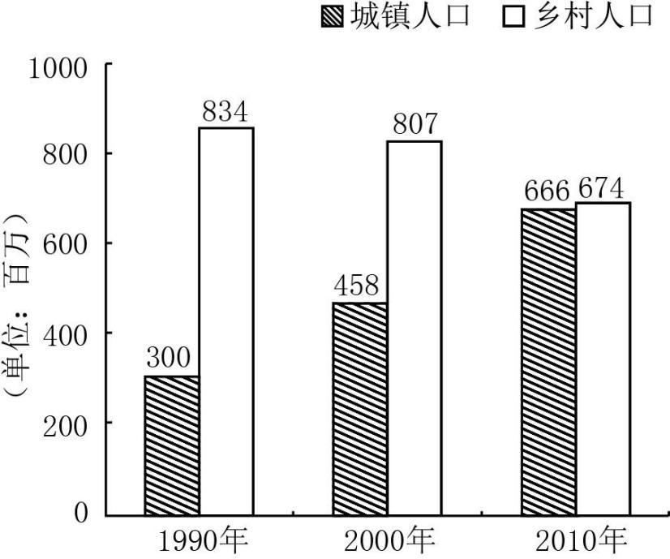

# 2014 年全国硕士研究生招生考试英语（二）试题

> 科目代码 204 ｜ 满分 100 分 ｜ 考试时间 180 分钟

> 说明：本文件由历年真题整理生成，供个人备考使用。**参考答案在文末**。

---

## Section I Use of English

> Read the following text. Choose the best word(s) for each numbered blank and mark A, B, C or D on the ANSWER SHEET.

Thinner isn’t always better. A number of studies have \_\_\_(1)\_\_\_ that normal-weight people are in fact at higher risk of some diseases compared to those who are overweight. And there are health conditions for which being overweight is actually \_\_\_(2)\_\_\_. For example, heavier women are less likely to develop calcium deficiency than thin women. \_\_\_(3)\_\_\_, among the elderly, being somewhat overweight is often an \_\_\_(4)\_\_\_ of good health.

Of even greater \_\_\_(5)\_\_\_ is the fact that obesity turns out to be very difficult to define. It is often defined \_\_\_(6)\_\_\_ body mass index, or BMI. BMI \_\_\_(7)\_\_\_ body mass divided by the square of height. An adult with a BMI of 18 to 25 is often considered to be normal weight. Between 25 and 30 is overweight. And over 30 is considered obese. Obesity, \_\_\_(8)\_\_\_, can be divided into moderately obese, severely obese, and very severely obese.

While such numerical standards seem \_\_\_(9)\_\_\_, they are not. Obesity is probably less a matter of weight than body fat. Some people with a high BMI are in fact extremely fit, \_\_\_(10)\_\_\_ others with a low BMI may be in poor \_\_\_(11)\_\_\_. For example, many collegiate and professional football players \_\_\_(12)\_\_\_ as obese, though their percentage body fat is low. Conversely, someone with a small frame may have high body fat but a \_\_\_(13)\_\_\_ BMI.

Today we have a(n) \_\_\_(14)\_\_\_ to label obesity as a disgrace. The overweight are sometimes \_\_\_(15)\_\_\_ in the media with their faces covered. Stereotypes \_\_\_(16)\_\_\_ with obesity include laziness, lack of will power, and lower prospects for success. Teachers, employers, and health professionals have been shown to harbor biases against the obese. \_\_\_(17)\_\_\_ very young children tend to look down on the overweight, and teasing about body build has long been a problem in schools.

Negative attitudes toward obesity, \_\_\_(18)\_\_\_ in health concerns, have stimulated a number of anti-obesity \_\_\_(19)\_\_\_. My own hospital system has banned sugary drinks from its facilities. Many employers have instituted weight loss and fitness initiatives. Michelle Obama has launched a high-visibility campaign \_\_\_(20)\_\_\_ childhood obesity, even claiming that it represents our greatest national security threat.

**1.** **A.** denied&nbsp;&nbsp;&nbsp;&nbsp;**B.** concluded&nbsp;&nbsp;&nbsp;&nbsp;**C.** doubted&nbsp;&nbsp;&nbsp;&nbsp;**D.** ensured

**2.** **A.** protective&nbsp;&nbsp;&nbsp;&nbsp;**B.** dangerous&nbsp;&nbsp;&nbsp;&nbsp;**C.** sufficient&nbsp;&nbsp;&nbsp;&nbsp;**D.** troublesome

**3.** **A.** Instead&nbsp;&nbsp;&nbsp;&nbsp;**B.** However&nbsp;&nbsp;&nbsp;&nbsp;**C.** Likewise&nbsp;&nbsp;&nbsp;&nbsp;**D.** Therefore

**4.** **A.** indicator&nbsp;&nbsp;&nbsp;&nbsp;**B.** objective&nbsp;&nbsp;&nbsp;&nbsp;**C.** origin&nbsp;&nbsp;&nbsp;&nbsp;**D.** example

**5.** **A.** impact&nbsp;&nbsp;&nbsp;&nbsp;**B.** relevance&nbsp;&nbsp;&nbsp;&nbsp;**C.** assistance&nbsp;&nbsp;&nbsp;&nbsp;**D.** concern

**6.** **A.** in terms of&nbsp;&nbsp;&nbsp;&nbsp;**B.** in case of&nbsp;&nbsp;&nbsp;&nbsp;**C.** in favor of&nbsp;&nbsp;&nbsp;&nbsp;**D.** in respects of

**7.** **A.** measures&nbsp;&nbsp;&nbsp;&nbsp;**B.** determines&nbsp;&nbsp;&nbsp;&nbsp;**C.** equals&nbsp;&nbsp;&nbsp;&nbsp;**D.** modifies

**8.** **A.** in essence&nbsp;&nbsp;&nbsp;&nbsp;**B.** in contrast&nbsp;&nbsp;&nbsp;&nbsp;**C.** in turn&nbsp;&nbsp;&nbsp;&nbsp;**D.** in part

**9.** **A.** complicated&nbsp;&nbsp;&nbsp;&nbsp;**B.** conservative&nbsp;&nbsp;&nbsp;&nbsp;**C.** variable&nbsp;&nbsp;&nbsp;&nbsp;**D.** straightforward

**10.** **A.** so&nbsp;&nbsp;&nbsp;&nbsp;**B.** while&nbsp;&nbsp;&nbsp;&nbsp;**C.** since&nbsp;&nbsp;&nbsp;&nbsp;**D.** unless

**11.** **A.** shape&nbsp;&nbsp;&nbsp;&nbsp;**B.** spirit&nbsp;&nbsp;&nbsp;&nbsp;**C.** balance&nbsp;&nbsp;&nbsp;&nbsp;**D.** taste

**12.** **A.** start&nbsp;&nbsp;&nbsp;&nbsp;**B.** qualify&nbsp;&nbsp;&nbsp;&nbsp;**C.** retire&nbsp;&nbsp;&nbsp;&nbsp;**D.** stay

**13.** **A.** strange&nbsp;&nbsp;&nbsp;&nbsp;**B.** changeable&nbsp;&nbsp;&nbsp;&nbsp;**C.** normal&nbsp;&nbsp;&nbsp;&nbsp;**D.** constant

**14.** **A.** option&nbsp;&nbsp;&nbsp;&nbsp;**B.** reason&nbsp;&nbsp;&nbsp;&nbsp;**C.** opportunity&nbsp;&nbsp;&nbsp;&nbsp;**D.** tendency

**15.** **A.** employed&nbsp;&nbsp;&nbsp;&nbsp;**B.** pictured&nbsp;&nbsp;&nbsp;&nbsp;**C.** imitated&nbsp;&nbsp;&nbsp;&nbsp;**D.** monitored

**16.** **A.** compared&nbsp;&nbsp;&nbsp;&nbsp;**B.** combined&nbsp;&nbsp;&nbsp;&nbsp;**C.** settled&nbsp;&nbsp;&nbsp;&nbsp;**D.** associated

**17.** **A.** Even&nbsp;&nbsp;&nbsp;&nbsp;**B.** Still&nbsp;&nbsp;&nbsp;&nbsp;**C.** Yet&nbsp;&nbsp;&nbsp;&nbsp;**D.** Only

**18.** **A.** despised&nbsp;&nbsp;&nbsp;&nbsp;**B.** corrected&nbsp;&nbsp;&nbsp;&nbsp;**C.** ignored&nbsp;&nbsp;&nbsp;&nbsp;**D.** grounded

**19.** **A.** discussions&nbsp;&nbsp;&nbsp;&nbsp;**B.** businesses&nbsp;&nbsp;&nbsp;&nbsp;**C.** policies&nbsp;&nbsp;&nbsp;&nbsp;**D.** studies

**20.** **A.** for&nbsp;&nbsp;&nbsp;&nbsp;**B.** against&nbsp;&nbsp;&nbsp;&nbsp;**C.** with&nbsp;&nbsp;&nbsp;&nbsp;**D.** without

## Section II Reading Comprehension — Part A

> Read the following four texts. Answer the questions after each text by choosing A, B, C or D. Mark your answers on the ANSWER SHEET.

### Text 1

What would you do with $590m? This is now a question for Gloria MacKenzie, an 84-year-old widow who recently emerged from her small, tin-roofed house in Florida to collect the biggest undivided lottery jackpot in history. If she hopes her new-found fortune will yield lasting feelings of fulfilment, she could do worse than read Happy Money by Elizabeth Dunn and Michael Norton.

These two academics use an array of behavioral research to show that the most rewarding ways to spend money can be counterintuitive. Fantasies of great wealth often involve visions of fancy cars and extravagant homes. Yet satisfaction with these material purchases wears off fairly quickly. What was once exciting and new becomes old-hat; regret creeps in. It is far better to spend money on experiences, say Ms Dunn and Mr Norton, like interesting trips, unique meals or even going to the cinema. These purchases often become more valuable with time – as stories or memories – particularly if they involve feeling more connected to others.

This slim volume is packed with tips to help wage slaves as well as lottery winners get the most “happiness bang for your buck.” It seems most people would be better off if they could shorten their commutes to work, spend more time with friends and family and less of it watching television (something the average American spends a whopping two months a year doing, and is hardly jollier for it). Buying gifts or giving to charity is often more pleasurable than purchasing things for oneself, and luxuries are most enjoyable when they are consumed sparingly. This is apparently the reason McDonald’s restricts the availability of its popular McRib – a marketing trick that has turned the pork sandwich into an object of obsession.

Readers of Happy Money are clearly a privileged lot, anxious about fulfilment, not hunger. Money may not quite buy happiness, but people in wealthier countries are generally happier than those in poor ones. Yet the link between feeling good and spending money on others can be seen among rich and poor people around the world, and scarcity enhances the pleasure of most things for most people. Not everyone will agree with the authors’ policy ideas, which range from mandating more holiday time to reducing tax incentives for American homebuyers. But most people will come away from this book believing it was money well spent.

**21.** According to Dunn and Norton, which of the following is the most rewarding purchase?

- **A.** A big house.
- **B.** A special tour.
- **C.** A stylish car.
- **D.** A rich meal.

**22.** The author’s attitude toward Americans’ watching TV is .

- **A.** critical
- **B.** supportive
- **C.** sympathetic
- **D.** ambiguous

**23.** McRib is mentioned in Paragraph 3 to show that .

- **A.** consumers are sometimes irrational
- **B.** popularity usually comes after quality
- **C.** marketing tricks are often effective
- **D.** rarity generally increases pleasure

**24.** According to the last paragraph, Happy Money .

- **A.** has left much room for readers’criticism
- **B.** may prove to be a worthwhile purchase
- **C.** has predicted a wider income gap in the US
- **D.** may give its readers a sense of achievement

**25.** This text mainly discusses how to .

- **A.** balance feeling good and spending money
- **B.** spend large sums of money won in lotteries
- **C.** obtain lasting satisfaction from money spent
- **D.** become more reasonable in spending on luxuries

### Text 2

An article in Scientific American has pointed out that empirical research says that, actually, you think you’re more beautiful than you are. We have a deep-seated need to feel good about ourselves and we naturally employ a number of self-enhancing strategies to achieve this. Social psychologists have amassed oceans of research into what they call the “above average effect”, or “illusory superiority”, and shown that, for example, 70% of us rate ourselves as above average in leadership, 93% in driving and 85% at getting on well with others – all obviously statistical impossibilities.

We rose-tint our memories and put ourselves into self-affirming situations. We become defensive when criticised, and apply negative stereotypes to others to boost our own esteem. We stalk around thinking we’re hot stuff.

Psychologist and behavioural scientist Nicholas Epley oversaw a key study into self-enhancement and attractiveness. Rather than have people simply rate their beauty compared with others, he asked them to identify an original photograph of themselves from a lineup including versions that had been altered to appear more and less attractive. Visual recognition, reads the study, is “an automatic psychological process, occurring rapidly and intuitively with little or no apparent conscious deliberation”. If the subjects quickly chose a falsely flattering image – which most did – they genuinely believed it was really how they looked.

Epley found no significant gender difference in responses. Nor was there any evidence that those who self-enhanced the most (that is, the participants who thought the most positively doctored pictures were real) were doing so to make up for profound insecurities. In fact, those who thought that the images higher up the attractiveness scale were real directly corresponded with those who showed other markers for having higher self-esteem. “I don’t think the findings that we have are any evidence of personal delusion,” says Epley. “It’s a reflection simply of people generally thinking well of themselves.” If you are depressed, you won’t be self-enhancing.

Knowing the results of Epley’s study, it makes sense that many people hate photographs of themselves viscerally – on one level, they don’t even recognise the person in the picture as themselves. Facebook, therefore, is a self-enhancer’s paradise, where people can share only the most flattering photos, the cream of their wit, style, beauty, intellect and lifestyles. It’s not that people’s profiles are dishonest, says Catalina Toma of Wisconsin-Madison University, “but they portray an idealised version of themselves.”

**26.** According to the first paragraph, social psychologists have found that .

- **A.** our self-ratings are unrealistically high
- **B.** illusory superiority is a baseless effect
- **C.** our need for leadership is unnatural
- **D.** self-enhancing strategies are ineffective

**27.** Visual recognition is believed to be people’s .

- **A.** rapid matching
- **B.** conscious choice
- **C.** intuitive response
- **D.** automatic self-defence

**28.** Epley found that people with higher self-esteem tended to .

- **A.** underestimate their insecurities
- **B.** believe in their attractiveness
- **C.** cover up their depressions
- **D.** oversimplify their illusions

**29.** The word “viscerally” (Line 2, Para.5) is closest in meaning to .

- **A.** instinctively
- **B.** occasionally
- **C.** particularly
- **D.** aggressively

**30.** It can be inferred that Facebook is a self-enhancer’s paradise because people can .

- **A.** present their dishonest profiles
- **B.** define their traditional lifestyles
- **C.** share their intellectual pursuits
- **D.** withhold their unflattering sides

### Text 3

The concept of man versus machine is at least as old as the industrial revolution, but this phenomenon tends to be most acutely felt during economic downturns and fragile recoveries. And yet, it would be a mistake to think we are right now simply experiencing the painful side of a boom and bust cycle. Certain jobs have gone away for good, outmoded by machines. Since technology has such an insatiable appetite for eating up human jobs, this phenomenon will continue to restructure our economy in ways we cannot immediately foresee.

When there is rapid improvement in the price and performance of technology, jobs that were once thought to be immune from automation suddenly become threatened. This argument has attracted a lot of attention, via the success of the book Race Against the Machine, by Erik Brynjolfsson and Andrew McAfee, who both hail from MIT’s Center for Digital Business.

This is a powerful argument, and a scary one. And yet, John Hagel, author of The Power of Pull and other books, says Brynjolfsson and McAfee miss the reason why these jobs are so vulnerable to technology in the first place.

Hagel says we have designed jobs in the U.S. that tend to be “tightly scripted” and “highly standardized” ones that leave no room for “individual initiative or creativity”. In short, these are the types of jobs that machines can perform much better at than human beings. That is how we have put a giant target sign on the backs of American workers, Hagel says.

It’s time to reinvent the formula for how work is conducted, since we are still relying on a very 20th century notion of work, Hagel says. In our rapidly changing economy, we more than ever need people in the workplace who can take initiative and exercise their imagination “to respond to unexpected events”. That is not something machines are good at. They are designed to perform very predictable activities.

As Hagel notes, Brynjolfsson and McAfee indeed touched on this point in their book. We need to reframe race against the machine as race with the machine. In other words, we need to look at the ways in which machines can augment human labor rather than replace it. So then the problem is not really about technology, but rather, “how do we innovate our institutions and our work practices?”

**31.** According to the first paragraph, economic downturns would .

- **A.** ease the competition of man vs. machine
- **B.** highlight machines’ threat to human jobs
- **C.** provoke a painful technological revolution
- **D.** outmode our current economic structure

**32.** The authors of Race Against the Machine argue that .

- **A.** technology is diminishing man’s job opportunities
- **B.** automation is accelerating technological development
- **C.** certain jobs will remain intact after automation
- **D.** man will finally win the race against machine

**33.** Hagel argues that jobs in the U.S. are often .

- **A.** performed by innovative minds
- **B.** scripted with an individual style
- **C.** standardized without a clear target
- **D.** designed against human creativity

**34.** According to the last paragraph, Brynjolfsson and McAfee discussed .

- **A.** the predictability of machine behavior in practice
- **B.** the formula for how work is conducted efficiently
- **C.** the ways machines replace human labor in modern times
- **D.** the necessity of human involvement in the workplace

**35.** Which of the following could be the most appropriate title for the text?

- **A.** How to Innovate Our Work Practices?
- **B.** Machines Will Replace Human Labor
- **C.** Can We Win the Race Against Machines?
- **D.** Economic Downturns Stimulate Innovations

### Text 4

When the government talks about infrastructure contributing to the economy the focus is usually on roads, railways, broadband and energy. Housing is seldom mentioned.

Why is that? To some extent the housing sector must shoulder the blame. We have not been good at communicating the real value that housing can contribute to economic growth. Then there is the scale of the typical housing project. It is hard - to shove for attention among multibillion pound infrastructure projects, so it is inevitable that the attention is focused elsewhere. But perhaps the most significant reason is that the issue has always been so politically charged.

Nevertheless, the affordable housing situation is desperate. Waiting lists increase all the time and we are simply notbuilding enough new homes.

The comprehensive spending review offers an opportunity for the government to help rectify this. It needs to put historical prejudices to one side and take some steps to address our urgent housing need.

There are some indications that it is preparing to do just that. The communities minister, Don Foster, has hinted that George Osborne, Chancellor of the Exchequer, may introduce more flexibility to the current cap on the amount that local authorities can borrow against their housing stock debt. Evidence shows that 60,000 extra new homes could be built over the next five years if the cap were lifted, increasing GDP by 0.6%.

Ministers should also look at creating greater certainty in the rental environment, which would have a significant impact on the ability of registered providers to fund new developments from revenues.

But it is not just down to the government. While these measures would be welcome in the short term, we must face up to the fact that the existing £ 4.5bn programme of grants to fund new affordable housing, set to expire in 2015, is unlikely to be extended beyond then. The Labour party has recently announced that it will retain a large part of the coalition’s spending plans if it returns to power. The housing sector needs to accept that we are very unlikely to ever return to the era of large-scale public grants. We need to adjust to this changing climate.

While the government’s commitment to long-term funding may have changed, the very pressing need for more affordable housing is real and is not going away.

**36.** The author believes that the housing sector .

- **A.** has attracted much attention
- **B.** involves certain political factors
- **C.** shoulders too much responsibility
- **D.** has lost its real value in economy

**37.** It can be learned that affordable housing has .

- **A.** increased its home supply
- **B.** offered spending opportunities
- **C.** suffered government biases
- **D.** disappointed the government

**38.** According to Paragraph 5, George Osborne may .

- **A.** allow greater government debt for housing
- **B.** stop local authorities from building homes
- **C.** prepare to reduce housing stock debt
- **D.** release a lifted GDP growth forecast

**39.** It can be inferred that a stable rental environment would .

- **A.** lower the costs of registered providers
- **B.** lessen the impact of government interference
- **C.** contribute to funding new developments
- **D.** relieve the ministers of responsibilities

**40.** The author believes that after 2015, the government may .

- **A.** implement more policies to support housing
- **B.** review the need for large-scale public grants
- **C.** renew the affordable housing grants programme
- **D.** stop generous funding to the housing sector

## Section II Reading Comprehension — Part B

> Read the following text and match each of the numbered items in the left column to its corresponding information in the right column. There are two extra choices in the right column. Mark your answers on the ANSWER SHEERT.

Emerging in the late Sixties and reaching a peak in the Seventies, Land Art was one of a range of new forms, including Body Art, Performance Art, Action Art and Installation Art, which pushed art beyond the traditional confines of the studio and gallery. Rather than portraying landscape, land artists used the physical substance of the land itself as their medium.

The British land art, typified by Richard Long’s piece, was not only more domestically scaled, but a lot quirkier than its American counterpart. Indeed, while you might assume that an exhibition of Land Art would consist only of records of works rather than the works themselves, Long’s photograph of his work is the work. Since his “action” is in the past, the photograph is its sole embodiment.

That might seem rather an obscure point, but it sets the tone for an exhibition that contains a lot of black-and-white photographs and relatively few natural objects.

Long is Britain’s best-known Land Artist and his Stone Circle, a perfect ring of purplish rocks from Portishead beach laid out on the gallery floor, represents the elegant, rarefied side of the form. The Boyle Family, on the other hand, stand for its dirty, urban aspect. Comprising artists Mark Boyle and Joan Hills and their children, they recreated random sections of the British landscape on gallery walls. Their Olaf Street Study, a square of brick-strewn waste ground, is one of the few works here to embrace the commonplaceness that characterises most of our experience of the landscape most of the time.

Parks feature, particularly in the earlier works, such as John Hilliard’s very funny Across the Park, in which a long-haired stroller is variously smiled at by a pretty girl and unwittingly assaulted in a sequence of images that turn out to be different parts of the same photograph.

Generally however British land artists preferred to get away from towns, gravitating towards landscapes that are traditionally considered beautiful such as the Lake District or the Wiltshire Downs. While it probably wasn’t apparent at the time, much of this work is permeated by a spirit of romantic escapism that the likes of Wordsworth would have readily understood. Derek Jarman’s yellow-tinted film Towards Avebury, a collection of long, mostly still shots of the Wiltshire landscape, evokes a tradition of English landscape painting stretching from Samuel Palmer to Paul Nash.

In the case of Hamish Fulton, you can’t help feeling that the Scottish artist has simply found a way of making his love of walking pay. A typical work, such as Seven Days, consists of a single beautiful black-and-white photograph taken on an epic walk, with the mileage and number of days taken listed beneath. British Land Art as shown in this well selected, but relatively modestly scaled exhibition wasn’t about imposing on the landscape, more a kind of landscape-orientated light conceptual art created passing through. It had its origins in the great outdoors, but the results were as gallery-bound as the paintings of Turner and Constable.

**备选项 A–G**

- **A.** originates from a long walk that the artist took.
- **B.** illustrates a kind of landscape-orientated light conceptual art.
- **C.** reminds people of the English landscape painting tradition.
- **D.** represents the elegance of the British land art.
- **E.** depicts the ordinary side of the British land art.
- **F.** embodies a romantic escape into the Scottish outdoors.
- **G.** contains images from different parts of the same photograph.

**41.** &nbsp;\_\_\_\_\_\_\_\_\_\_\_\_\_\_\_\_\_\_

> Stone Circle

**42.** &nbsp;\_\_\_\_\_\_\_\_\_\_\_\_\_\_\_\_\_\_

> Olaf Street Study

**43.** &nbsp;\_\_\_\_\_\_\_\_\_\_\_\_\_\_\_\_\_\_

> Across the Park

**44.** &nbsp;\_\_\_\_\_\_\_\_\_\_\_\_\_\_\_\_\_\_

> Towards Avebury

**45.** &nbsp;\_\_\_\_\_\_\_\_\_\_\_\_\_\_\_\_\_\_

> Seven Days

## Section III Translation

> Translate the following text into Chinese. Write your translation on the ANSWER SHEET.

Most people would define optimism as being endlessly happy, with a glass that’s perpetually half full. But that’s exactly the kind of false cheerfulness that positive psychologists wouldn’t recommend. “Healthy optimism means being in touch with reality,” says Tal Ben-Shahar, a Harvard professor. According to Ben-Shahar, realistic optimists are those who make the best of things that happen, but not those who believe everything happens for the best.

Ben-Shahar uses three optimistic exercises. When he feels down – say, after giving a bad lecture – he grants himself permission to be human. He reminds himself that not every lecture can be a Nobel winner; some will be less effective than others. Next is reconstruction. He analyzes the weak lecture, learning lessons for the future about what works and what doesn’t. Finally, there is perspective, which involves acknowledging that in the grand scheme of life, one lecture really doesn’t matter.

**46.**

## Section IV Writing — Part A

47. Directions:
Suppose you are going to study abroad and share an apartment with John, a local student. Write him an email to
1) tell him about your living habits, and
2) ask for advice about living there.
You should write about 100 words on the ANSWER SHEET.
Do not use your own name. Use “Li Ming” instead.
Do not write your address.

## Section IV Writing — Part B

48. Directions:
Write an essay based on the following chart. In your writing, you should
1) interpret the chart, and
2) give your comments.
You should write about 150 words on the ANSWER SHEET.

---

## 参考答案

### Section I Use of English

**1.** B · concluded
**2.** A · protective
**3.** C · Likewise
**4.** A · indicator
**5.** D · concern
**6.** A · in terms of
**7.** C · equals
**8.** C · in turn
**9.** D · straightforward
**10.** B · while
**11.** A · shape
**12.** B · qualify
**13.** C · normal
**14.** D · tendency
**15.** B · pictured
**16.** D · associated
**17.** A · Even
**18.** D · grounded
**19.** C · policies
**20.** B · against

### Section II Reading Comprehension — Part A

*Text 1*

**21.** B · A special tour.
**22.** A · critical
**23.** D · rarity generally increases pleasure
**24.** B · may prove to be a worthwhile purchase
**25.** C · obtain lasting satisfaction from money spent

*Text 2*

**26.** A · our self-ratings are unrealistically high
**27.** C · intuitive response
**28.** B · believe in their attractiveness
**29.** A · instinctively
**30.** D · withhold their unflattering sides

*Text 3*

**31.** B · highlight machines’ threat to human jobs
**32.** A · technology is diminishing man’s job opportunities
**33.** D · designed against human creativity
**34.** D · the necessity of human involvement in the workplace
**35.** C · Can We Win the Race Against Machines?

*Text 4*

**36.** B · involves certain political factors
**37.** C · suffered government biases
**38.** A · allow greater government debt for housing
**39.** C · contribute to funding new developments
**40.** D · stop generous funding to the housing sector

### Section II Reading Comprehension — Part B

**41–45**：D  E  G  C  A

### Section III Translation

> **关键词**：`define A as B` ｜ `a glass that’s perpetually half full` ｜ `false cheerfulness` ｜ `be in touch with reality` ｜ `realistic optimists` ｜ `make the best of things that happen` ｜ `make the best of...` ｜ `feel down` ｜ `say` ｜ `grant himself permission to be human` ｜ `not every...` ｜ `a Nobel winner` ｜ `reconstruction` ｜ `learning lessons for the future`
大多数人都会把乐观定义为永远快乐，觉得杯子里总有半杯水。但这恰恰不是真正的快乐，积极心理学家们并不提倡。哈佛大学教授 Tal Ben-Shahar 说：“健康的乐观意味着不脱离现实。”按照 Ben-Shahar 的说法，现实的乐观主义者是那些不管发生什么事情都力求从中得到最大收获的人，而不是那些指望凡事都有最好结局的人。

Ben-Shahar 运用三种方法保持乐观。当他情绪低落时——比如说一次课没讲好——他宽容自己，承认自己是凡人。他提醒自己，不是每堂课都有获诺贝尔奖的水准；总会有一些课的效果不如别的课。第二种方法是回顾。他分析讲得不好的课，为以后汲取有用的经验和失败的教训。最后，还有视角问题，要认识到在宏大的生命长卷里，一堂课真的不算什么。

### Section IV Writing — Part A

**47 参考范文**

Dear John, I am glad that it is you who will be my roommate during my overseas study and cannot wait to meet you. Before my moving in, I think it is necessary to arrive at a basic understanding about each other's living habits.
As a typical Chinese, I observe traditional living rules, sleeping and getting up early, having gorgeous breakfast, good lunch and humble supper and keeping room tidy and clean. In addition, I prefer cooking Chinese dishes at home and hope to get your tolerance for occasional spicy smell during dish preparation. There must also be some special living rules to be respected in your country. Can you explain them to me in advance? Hope to get your early reply.
Yours,
Li Ming

### Section IV Writing — Part B

**48 参考范文**

From 1990 to 2010 while moderate increase occurred in total population in China, population distribution experienced a dramatic shift. Urban population increased considerably from 300 million to 670 million; contrastingly rural population declined from 820 million to 680 million.

The population gap narrowed largely because of the joint effects of urbanization and unequal economic opportunities. The 20 years' urban sprawl caused millions of peasants to be passively transformed into city residents. Meanwhile, many more peasants initiatively chose to leave their hometown. In the 20 years, while urban living standards were largely improved, few economic opportunities fell on rural areas, making most peasants remain at the poverty line. Poverty prompted the call for change and healthy young peasants were driven to flock to cities to make a better living.

The increase in urban population is a sure indication of economic achievement. However, we should not ignore the inability of many urban newcomers to integrate into cities due to lack of education and civilized habits. They wandered around in the cities as urban paupers, isolated from cities' prosperity and convenience. In this sense, we cannot be superficially satisfied with the optimistic figure, but should endeavor to foster integration of newcomers.
