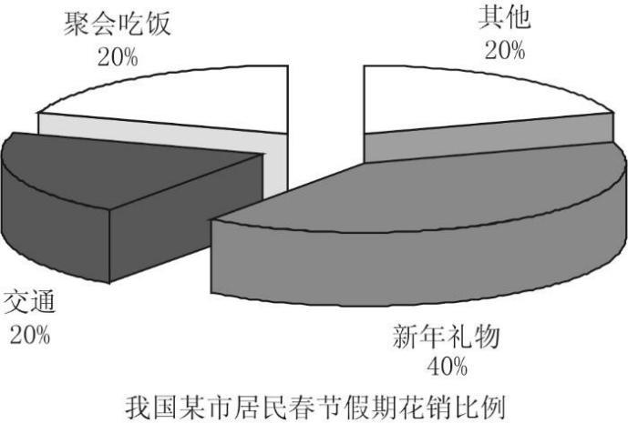

# 2015 年全国硕士研究生招生考试英语（二）试题

> 科目代码 204 ｜ 满分 100 分 ｜ 考试时间 180 分钟

> 说明：本文件由历年真题整理生成，供个人备考使用。**参考答案在文末**。

---

## Section I Use of English

> Directions:
> Read the following text. Choose the best word(s) for each numbered blank and mark
> A, B, C or D on the ANSWER SHEET. (10 points)

In our contemporary culture, the prospect of communicating with – or even looking at – a stranger is virtually unbearable. Everyone around us seems to agree by the way they cling to their phones, even without a \_\_\_(1)\_\_\_ on a subway.

It’s a sad reality – our desire to avoid interacting with other human beings – because there’s \_\_\_(2)\_\_\_ to be gained from talking to the stranger standing by you. But you wouldn’t know it, \_\_\_(3)\_\_\_ into your phone. This universal protection sends the \_\_\_(4)\_\_\_ : “Please don’t approach me.”

What is it that makes us feel we need to hide \_\_\_(5)\_\_\_ our screens?

One answer is fear, according to Jon Wortmann, an executive mental coach. We fear rejection, or that our innocent social advances will be \_\_\_(6)\_\_\_ as “weird.” We fear we’ll be \_\_\_(7)\_\_\_ . We fear we’ll be disruptive.

Strangers are inherently \_\_\_(8)\_\_\_ to us, so we are more likely to feel \_\_\_(9)\_\_\_ when communicating with them compared with our friends and acquaintances. To avoid this uneasiness, we \_\_\_(10)\_\_\_ to our phones. “Phones become our security blanket,” Wortmann says. “They are our happy glasses that protect us from what we perceive is going to be more \_\_\_(11)\_\_\_ .”

But once we rip off the band-aid, tuck our smartphones in our pockets and look up, it doesn’t \_\_\_(12)\_\_\_ so bad. In one 2011 experiment, behavioral scientists Nicholas Epley and Juliana Schroeder asked commuters to do the unthinkable: Start a \_\_\_(13)\_\_\_ . They had Chicago train commuters talk to their fellow \_\_\_(14)\_\_\_ . “When Dr. Epley and Ms. Schroeder asked other people in the same train station to \_\_\_(15)\_\_\_ how they would feel after talking to a stranger, the commuters thought their \_\_\_(16)\_\_\_ would be more pleasant if they sat on their own,” The New York Times summarizes. Though the participants didn’t expect a positive experience, after they \_\_\_(17)\_\_\_ with the experiment, “not a single person reported having been embarrassed.”

\_\_\_(18)\_\_\_ , these commutes were reportedly more enjoyable compared with those without communication, which makes absolute sense, \_\_\_(19)\_\_\_ human beings thrive off of social connections. It’s that \_\_\_(20)\_\_\_ : Talking to strangers can make you feel connected.

**1.** **A.** signal&nbsp;&nbsp;&nbsp;&nbsp;**B.** permit&nbsp;&nbsp;&nbsp;&nbsp;**C.** ticket&nbsp;&nbsp;&nbsp;&nbsp;**D.** record

**2.** **A.** nothing&nbsp;&nbsp;&nbsp;&nbsp;**B.** little&nbsp;&nbsp;&nbsp;&nbsp;**C.** another&nbsp;&nbsp;&nbsp;&nbsp;**D.** much

**3.** **A.** beaten&nbsp;&nbsp;&nbsp;&nbsp;**B.** plugged&nbsp;&nbsp;&nbsp;&nbsp;**C.** guided&nbsp;&nbsp;&nbsp;&nbsp;**D.** brought

**4.** **A.** message&nbsp;&nbsp;&nbsp;&nbsp;**B.** code&nbsp;&nbsp;&nbsp;&nbsp;**C.** notice&nbsp;&nbsp;&nbsp;&nbsp;**D.** sign

**5.** **A.** under&nbsp;&nbsp;&nbsp;&nbsp;**B.** beyond&nbsp;&nbsp;&nbsp;&nbsp;**C.** behind&nbsp;&nbsp;&nbsp;&nbsp;**D.** from

**6.** **A.** misapplied&nbsp;&nbsp;&nbsp;&nbsp;**B.** misinterpreted&nbsp;&nbsp;&nbsp;&nbsp;**C.** misadjusted&nbsp;&nbsp;&nbsp;&nbsp;**D.** mismatched

**7.** **A.** judged&nbsp;&nbsp;&nbsp;&nbsp;**B.** fired&nbsp;&nbsp;&nbsp;&nbsp;**C.** replaced&nbsp;&nbsp;&nbsp;&nbsp;**D.** delayed

**8.** **A.** unreasonable&nbsp;&nbsp;&nbsp;&nbsp;**B.** ungrateful&nbsp;&nbsp;&nbsp;&nbsp;**C.** unconventional&nbsp;&nbsp;&nbsp;&nbsp;**D.** unfamiliar

**9.** **A.** comfortable&nbsp;&nbsp;&nbsp;&nbsp;**B.** confident&nbsp;&nbsp;&nbsp;&nbsp;**C.** anxious&nbsp;&nbsp;&nbsp;&nbsp;**D.** angry

**10.** **A.** attend&nbsp;&nbsp;&nbsp;&nbsp;**B.** turn&nbsp;&nbsp;&nbsp;&nbsp;**C.** take&nbsp;&nbsp;&nbsp;&nbsp;**D.** point

**11.** **A.** dangerous&nbsp;&nbsp;&nbsp;&nbsp;**B.** mysterious&nbsp;&nbsp;&nbsp;&nbsp;**C.** violent&nbsp;&nbsp;&nbsp;&nbsp;**D.** boring

**12.** **A.** bend&nbsp;&nbsp;&nbsp;&nbsp;**B.** resist&nbsp;&nbsp;&nbsp;&nbsp;**C.** hurt&nbsp;&nbsp;&nbsp;&nbsp;**D.** decay

**13.** **A.** lecture&nbsp;&nbsp;&nbsp;&nbsp;**B.** debate&nbsp;&nbsp;&nbsp;&nbsp;**C.** conversation&nbsp;&nbsp;&nbsp;&nbsp;**D.** negotiation

**14.** **A.** trainees&nbsp;&nbsp;&nbsp;&nbsp;**B.** employees&nbsp;&nbsp;&nbsp;&nbsp;**C.** researchers&nbsp;&nbsp;&nbsp;&nbsp;**D.** passengers

**15.** **A.** reveal&nbsp;&nbsp;&nbsp;&nbsp;**B.** choose&nbsp;&nbsp;&nbsp;&nbsp;**C.** predict&nbsp;&nbsp;&nbsp;&nbsp;**D.** design

**16.** **A.** voyage&nbsp;&nbsp;&nbsp;&nbsp;**B.** flight&nbsp;&nbsp;&nbsp;&nbsp;**C.** walk&nbsp;&nbsp;&nbsp;&nbsp;**D.** ride

**17.** **A.** went through&nbsp;&nbsp;&nbsp;&nbsp;**B.** did away&nbsp;&nbsp;&nbsp;&nbsp;**C.** caught up&nbsp;&nbsp;&nbsp;&nbsp;**D.** put up

**18.** **A.** In turn&nbsp;&nbsp;&nbsp;&nbsp;**B.** In fact&nbsp;&nbsp;&nbsp;&nbsp;**C.** In particular&nbsp;&nbsp;&nbsp;&nbsp;**D.** In consequence

**19.** **A.** unless&nbsp;&nbsp;&nbsp;&nbsp;**B.** whereas&nbsp;&nbsp;&nbsp;&nbsp;**C.** if&nbsp;&nbsp;&nbsp;&nbsp;**D.** since

**20.** **A.** funny&nbsp;&nbsp;&nbsp;&nbsp;**B.** simple&nbsp;&nbsp;&nbsp;&nbsp;**C.** logical&nbsp;&nbsp;&nbsp;&nbsp;**D.** rare

## Section II Reading Comprehension — Part A

> Part A
> Directions:
> Read the following four texts. Answer the questions below each text by choosing A, B,
> C or D. Mark your answers on the ANSWER SHEET. (40 points)

### Text 1

A new study suggests that contrary to most surveys, people are actually more stressed at home than at work. Researchers measured people’s cortisol, which is a stress marker, while they were at work and while they were at home and found it higher at what is supposed to be a place of refuge.

“Further contradicting conventional wisdom, we found that women as well as men have lower levels of stress at work than at home,” writes one of the researchers, Sarah Damaske. In fact women even say they feel better at work, she notes. “It is men, not women, who report being happier at home than at work.” Another surprise is that the findings hold true for both those with children and without, but more so for nonparents. This is why people who work outside the home have better health.

What the study doesn’t measure is whether people are still doing work when they’re at home, whether it is household work or work brought home from the office. For many men, the end of the workday is a time to kick back. For women who stay home, they never get to leave the office. And for women who work outside the home, they often are playing catch-up-with-household tasks. With the blurring of roles, and the fact that the home front lags well behind the workplace in making adjustments for working women, it’s not surprising that women are more stressed at home.

But it’s not just a gender thing. At work, people pretty much know what they’re supposed to be doing: working, making money, doing the tasks they have to do in order to draw an income. The bargain is very pure: Employee puts in hours of physical or mental labor and employee draws out life-sustaining moola.

On the home front, however, people have no such clarity. Rare is the household in which the division of labor is so clinically and methodically laid out. There are a lot of tasks to be done, there are inadequate rewards for most of them. Your home colleagues – your family – have no clear rewards for their labor; they need to be talked into it, or if they’re teenagers, threatened with complete removal of all electronic devices. Plus, they’re your family. You cannot fire your family. You never really get to go home from home.

So it’s not surprising that people are more stressed at home. Not only are the tasks apparently infinite, the co-workers are much harder to motivate.

**21.** According to Paragraph 1, most previous surveys found that home .

- **A.** offered greater relaxation than the workplace
- **B.** was an ideal place for stress measurement
- **C.** generated more stress than the workplace
- **D.** was an unrealistic place for relaxation

**22.** According to Damaske, who are likely to be the happiest at home?

- **A.** Working mothers.
- **B.** Childless husbands.
- **C.** Working fathers.
- **D.** Childless wives.

**23.** The blurring of working women’s roles refers to the fact that .

- **A.** their home is also a place for kicking back
- **B.** they are both bread winners and housewives
- **C.** there is often much housework left behind
- **D.** it is difficult for them to leave their office

**24.** The word “moola” (Line 4, Para. 4) most probably means .

- **A.** skills
- **B.** energy
- **C.** earnings
- **D.** nutrition

**25.** The home front differs from the workplace in that .

- **A.** family labor is often adequately rewarded
- **B.** home is hardly a cozier working environment
- **C.** household tasks are generally more motivating
- **D.** division of labor at home is seldom clear-cut

### Text 2

For years, studies have found that first-generation college students – those who do not have a parent with a college degree – lag other students on a range of education achievement factors. Their grades are lower and their dropout rates are higher. But since such students are most likely to advance economically if they succeed in higher education, colleges and universities have pushed for decades to recruit more of them. This has created “a paradox” in that recruiting first-generation students, but then watching many of them fail, means that higher education has “continued to reproduce and widen, rather than close” an achievement gap based on social class, according to the depressing beginning of a paper forthcoming in the journal Psychological Science.

But the article is actually quite optimistic, as it outlines a potential solution to this problem, suggesting that an approach (which involves a one-hour, next-to-no-cost program) can close 63 percent of the achievement gap (measured by such factors as grades) between first-generation and other students.

The authors of the paper are from different universities, and their findings are based on a study involving 147 students (who completed the project) at an unnamed private university. First generation was defined as not having a parent with a four-year college degree. Most of the first-generation students (59.1 percent) were recipients of Pell Grants, a federal grant for undergraduates with financial need, while this was true only for 8.6 percent of the students with at least one parent with a four-year degree.

Their thesis – that a relatively modest intervention could have a big impact – was based on the view that first-generation students may be most lacking not in potential but in practical knowledge about how to deal with the issues that face most college students. They cite past research by several authors to show that this is the gap that must be narrowed to close the achievement gap.

Many first-generation students “struggle to navigate the middle-class culture of higher education, learn the ‘rules of the game,’ and take advantage of college resources,” they write. And this becomes more of a problem when colleges don’t talk about the class advantages and disadvantages of different groups of students.

“Because US colleges and universities seldom acknowledge how social class can affect students’ educational experiences, many first-generation students lack insight about why they are struggling and do not understand how students ‘like them’ can improve.”

**26.** Recruiting more first-generation students has .

- **A.** reduced their dropout rates
- **B.** narrowed the achievement gap
- **C.** missed its original purpose
- **D.** depressed college students

**27.** The authors of the research article are optimistic because .

- **A.** their findings appeal to students
- **B.** the recruiting rate has increased
- **C.** the problem is solvable
- **D.** their approach is costless

**28.** The study suggests that most first-generation students .

- **A.** are from single-parent families
- **B.** study at private universities
- **C.** are in need of financial support
- **D.** have failed their college

**29.** The authors of the paper believe that first-generation students .

- **A.** may lack opportunities to apply for research projects
- **B.** are inexperienced in handling their issues at college
- **C.** can have a potential influence on other students
- **D.** are actually indifferent to the achievement gap

**30.** We may infer from the last paragraph that .

- **A.** universities often reject the culture of the middle-class
- **B.** students are usually to blame for their lack of resources
- **C.** social class greatly helps enrich educational experiences
- **D.** colleges are partly responsible for the problem in question

### Text 3

Even in traditional offices, “the lingua franca of corporate America has gotten much more emotional and much more right-brained than it was 20 years ago,” said Harvard Business School professor Nancy Koehn. She started spinning off examples. “If you and I parachuted back to Fortune 500 companies in 1990, we would see much less frequent use of terms like journey, mission, passion. There were goals, there were strategies, there were objectives, but we didn’t talk about energy; we didn’t talk about passion.”

Koehn pointed out that this new era of corporate vocabulary is very “team”-oriented – and not by coincidence. “Let’s not forget sports – in male-dominated corporate America, it’s still a big deal. It’s not explicitly conscious; it’s the idea that I’m a coach, and you’re my team, and we’re in this together. There are lots and lots of CEOs in very different companies, but most think of themselves as coaches and this is their team and they want to win. ”

These terms are also intended to infuse work with meaning – and, as Rakesh Khurana, another professor, points out, increase allegiance to the firm. “You have the importation of terminology that historically used to be associated with non-profit organizations and religious organizations: terms like vision, values, passion, and purpose,” said Khurana.

This new focus on personal fulfillment can help keep employees motivated amid increasingly loud debates over work-life balance. The “mommy wars” of the 1990s are still going on today, prompting arguments about why women still can’t have it all and books like Sheryl Sandberg’s Lean In, whose title has become a buzzword in its own right. Terms like unplug, offline, life-hack, bandwidth, and capacity are all about setting boundaries between the office and the home. But if your work is your “passion,” you’ll be more likely to devote yourself to it, even if that means going home for dinner and then working long after the kids are in bed.

But this seems to be the irony of office speak: Everyone makes fun of it, but managers love it, companies depend on it, and regular people willingly absorb it. As a linguist once said, “You can get people to think it’s nonsense at the same time that you buy into it.” In a workplace that’s fundamentally indifferent to your life and its meaning, office speak can help you figure out how you relate to your work – and how your work defines who you are.

**31.** According to Nancy Koehn, office language has become .

- **A.** less strategic
- **B.** less energetic
- **C.** more objective
- **D.** more emotional

**32.** “Team”-oriented corporate vocabulary is closelyrelated to .

- **A.** sports culture
- **B.** gender difference
- **C.** historical incidents
- **D.** athletic executives

**33.** Khurana believes that the importation of terminology aims to .

- **A.** revive historical terms
- **B.** promote company image
- **C.** foster corporate cooperation
- **D.** strengthen employee loyalty

**34.** It can be inferred that Lean In .

- **A.** voices for working women
- **B.** appeals to passionate workaholics
- **C.** triggers debates among mommies
- **D.** praises motivated employees

**35.** Which of the following statements is true about office speak?

- **A.** Linguists believe it to be nonsense.
- **B.** Regular people mock it but accept it.
- **C.** Companies find it to be fundamental.
- **D.** Managers admire it but avoid it.

### Text 4

Many people talked of the 288,000 new jobs the Labor Department reported for June, along with the drop in the unemployment rate to 6.1 percent, as good news. And they were right. For now it appears the economy is creating jobs at a decent pace. We still have a long way to go to get back to full employment, but at least we are now finally moving forward at a faster pace.

However, there is another important part of the jobs picture that was largely overlooked. There was a big jump in the number of people who report voluntarily working part-time. This figure is now 830,000（4.4 percent）above its year ago level.

Before explaining the connection to the Obamacare, it is worth making an important distinction. Many people who work part-time jobs actually want full-time jobs. They take part-time work because this is all they can get. An increase in involuntary part-time work is evidence of weakness in the labor market and it means that many people will be having a very hard time making ends meet.

There was an increase in involuntary part-time in June, but the general direction has been down. Involuntary part-time employment is still far higher than before the recession, but it is down by 640,000 (7.9 percent) from its year ago level.

We know the difference between voluntary and involuntary part-time employment because people tell us. The survey used by the Labor Department asks people if they worked less than 35 hours in the reference week. If the answer is “yes,” they are classified as working part-time. The survey then asks whether they worked less than 35 hours in that week because they wanted to work less than full time or because they had no choice. They are only classified as voluntary part-time workers if they tell the survey taker they chose to work less than 35 hours a week.

The issue of voluntary part-time relates to Obamacare because one of the main purposes was to allow people to get insurance outside of employment. For many people, especially those with serious health conditions or family members with serious health conditions, before Obamacare the only way to get insurance was through a job that provided health insurance.

However, Obamacare has allowed more than 12 million people to either get insurance through Medicaid or the exchanges. These are people who may previously have felt the need to get a full-time job that provided insurance in order to cover themselves and their families. With Obamacare there is no longer a link between employment and insurance.

**36.** Which part of the jobs picture was neglected?

- **A.** The prospect of a thriving job market.
- **B.** The increase of voluntary part-time jobs.
- **C.** The possibility of full employment.
- **D.** The acceleration of job creation.

**37.** Many people work part-time because they .

- **A.** prefer part-time jobs to full-time jobs
- **B.** feel that is enough to make ends meet
- **C.** cannot get their hands on full-time jobs
- **D.** haven’ t seen the weakness of the market

**38.** Involuntary part-time employment in the US .

- **A.** shows a general tendency of decline
- **B.** is harder to acquire than one year ago
- **C.** satisfies the real need of the jobless
- **D.** is lower than before the recession

**39.** It can be learned that with Obamacare, .

- **A.** it is no longer easy for part-timers to get insurance
- **B.** full-time employment is still essential for insurance
- **C.** it is still challenging to get insurance for family members
- **D.** employment is no longer a precondition to get insurance

**40.** The text mainly discusses .

- **A.** employment in the US
- **B.** part-timer classification
- **C.** insurance through Medicaid
- **D.** Obamacare’s trouble

## Section II Reading Comprehension — Part B

> Part B
> Directions:
> Read the following text and answer the questions by choosing the most suitable
> subheading from the list A-G for each of the numbered paragraphs (41-45). There are
> two extra subheadings which you do not need to use. Mark your answers on the
> ANSWER SHEET. (10 points)

Some Old Truths to Help You Overcome Tough Times

Unfortunately, life is not a bed of roses. We are going through life facing sad experiences. Moreover, we are grieving various kinds of loss: a friendship, a romantic relationship or a house. Hard times may hold you down at what usually seems like the most inopportune time, but you should remember that they won’t last forever.

When our time of mourning is over, we press forward, stronger with a greater understanding and respect for life. Furthermore, these losses make us mature and eventually move us toward future opportunities for growth and happiness. I want to share these old truths I’ve learned along the way.

\_\_\_(41)\_\_\_

Fear is both useful and harmful. This normal human reaction is used to protect us by signaling danger and preparing us to deal with it. Unfortunately, people create inner barriers with a help of exaggerating fears. My favorite actor Will Smith once said, “Fear is not real. It is a product of thoughts you create. Do not misunderstand me. Danger is very real. But fear is a choice.” I do completely agree that fears are just the product of our luxuriant imagination.

\_\_\_(42)\_\_\_

If you are surrounded by problems and cannot stop thinking about the past, try to focus on the present moment. Many of us are weighed down by the past or anxious about the future. You may feel guilt over your past, but you are poisoning the present with the things and circumstances you cannot change. Value the present moment and remember how fortunate you are to be alive. Enjoy the beauty of the world around and keep the eyes open to see the possibilities before you. Happiness is not a point of future and not a moment from the past, but a mindset that can be designed into the present.

\_\_\_(43)\_\_\_

Sometimes it is easy to feel bad because you are going through tough times. You can be easily caught up by life problems that you forget to pause and appreciate the things you have. Only strong people prefer to smile and value their life instead of crying and complaining about something.

\_\_\_(44)\_\_\_

No matter how isolated you might feel and how serious the situation is, you should always remember that you are not alone. Try to keep in mind that almost everyone respects and wants to help you if you are trying to make a good change in your life, especially your dearest and nearest people. You may have a circle of friends who provide constant good humor, help and companionship. If you have no friends or relatives, try to participate in several online communities, full of people who are always willing to share advice and encouragement.

\_\_\_(45)\_\_\_

Today many people find it difficult to trust their own opinion and seek balance by gaining objectivity from external sources. This way you devalue your opinion and show that you are incapable of managing your own life. When you are struggling to achieve something important you should believe in yourself and be sure that your decision is the best. You live in your skin, think your own thoughts, have your own values and make your own choices.

**备选项 A–G**

- **A.** You are not alone
- **B.** Experience helps you grow
- **C.** Pave your own unique path
- **D.** Most of your fears are unreal
- **E.** Think about the present moment
- **F.** Don’t fear responsibility for your life
- **G.** There are many things to be grateful for

**41.** &nbsp;\_\_\_\_\_\_\_\_\_\_\_\_\_\_\_\_\_\_

**42.** &nbsp;\_\_\_\_\_\_\_\_\_\_\_\_\_\_\_\_\_\_

**43.** &nbsp;\_\_\_\_\_\_\_\_\_\_\_\_\_\_\_\_\_\_

**44.** &nbsp;\_\_\_\_\_\_\_\_\_\_\_\_\_\_\_\_\_\_

**45.** &nbsp;\_\_\_\_\_\_\_\_\_\_\_\_\_\_\_\_\_\_

## Section III Translation

> Translate the following text into Chinese. Write your translation on the ANSWER
> SHEET. (15 points)

Think about driving a route that’s very familiar. It could be your commute to work, a trip into town or the way home. Whichever it is, you know every twist and turn like the back of your hand. On these sorts of trips it’s easy to lose concentration on the driving and pay little attention to the passing scenery. The consequence is that you perceive that the trip has taken less time than it actually has.

This is the well-travelled road effect: People tend to underestimate the time it takes to travel a familiar route.

The effect is caused by the way we allocate our attention. When we travel down a well-known route, because we don’t have to concentrate much, time seems to flow more quickly. And afterwards, when we come to think back on it, we can’t remember the journey well because we didn’t pay much attention to it. So we assume it was shorter.

**46.**

## Section IV Writing — Part A

47. Directions:
Suppose your university is going to host a summer camp for high school students.
Write a notice to
1) briefly introduce the camp activities, and
2) call for volunteers.
You should write about 100 words on the ANSWER SHEET.
Do not use your name or the name of your university.
Do not write your address. (10 points)

## Section IV Writing — Part B

**48.** Write an essay based on the following chart. In your writing, you should
1) interpret the chart, and
2) give your comments.
You should write about 150 words on the ANSWER SHEET. (15 points)

---

## 参考答案

### Section I Use of English

**1.** A · signal
**2.** D · much
**3.** B · plugged
**4.** A · message
**5.** C · behind
**6.** B · misinterpreted
**7.** A · judged
**8.** D · unfamiliar
**9.** C · anxious
**10.** B · turn
**11.** A · dangerous
**12.** C · hurt
**13.** C · conversation
**14.** D · passengers
**15.** C · predict
**16.** D · ride
**17.** A · went through
**18.** B · In fact
**19.** D · since
**20.** B · simple

### Section II Reading Comprehension — Part A

*Text 1*

**21.** A · offered greater relaxation than the workplace
**22.** B · Childless husbands.
**23.** B · they are both bread winners and housewives
**24.** C · earnings
**25.** D · division of labor at home is seldom clear-cut

*Text 2*

**26.** C · missed its original purpose
**27.** C · the problem is solvable
**28.** C · are in need of financial support
**29.** B · are inexperienced in handling their issues at college
**30.** D · colleges are partly responsible for the problem in question

*Text 3*

**31.** D · more emotional
**32.** A · sports culture
**33.** D · strengthen employee loyalty
**34.** A · voices for working women
**35.** B · Regular people mock it but accept it.

*Text 4*

**36.** B · The increase of voluntary part-time jobs.
**37.** C · cannot get their hands on full-time jobs
**38.** A · shows a general tendency of decline
**39.** D · employment is no longer a precondition to get insurance
**40.** A · employment in the US

### Section II Reading Comprehension — Part B

**41–45**：D  E  G  A  C

### Section III Translation

> **关键词**：`Think about doing...` ｜ `commute to work` ｜ `Whichever it is` ｜ `know every twist and turn like the back of your hand` ｜ `lose concentration on... / pay little attention to...` ｜ `passing scenery` ｜ `The consequence is that...` ｜ `perceive` ｜ `the well-travelled road effect` ｜ `tend to underestimate` ｜ `the time it takes to travel...` ｜ `allocate our attention` ｜ `time seems to flow more quickly` ｜ `come to think back on it`
试想开车走一条非常熟悉的路。可以是上下班、进城或是回家的路。不管是哪条路，你对每一处曲曲弯弯都了如指掌。在这种路上，很容易不专注于驾驶，很少注意沿途的景色。结果你就觉得旅途所花的时间比实际的要短。

这就是熟路效应：人们走熟路时往往会低估所需的时间。

这种效应是由我们分配注意力的方式造成的。我们走很熟的路时，由于不必非常专注，时间似乎就过得快些。之后，我们回想起这段旅程时，由于当时没怎么注意，所以记得不很清楚。这样，我们就觉得时间短了。

### Section IV Writing — Part A

**47 参考范文**

Recruitment Announcement

We are looking for some volunteers for the summer camp for high school students. The summer camp is organized to facilitate high school students' academic learning and more importantly cultivate their cooperation ability and practical skills through activities including but not limited to reading salon and business-starting competition.

Volunteers are required to help organize activities and cope with daily affairs during the summer camp. Ideal candidates should be patient, active, warm-hearted and responsible. Having relevant experience is preferred. Anyone interested please contact us by students' union@abcuniversity.edu.cn or reach us at 12345678.

### Section IV Writing — Part B

**48 参考范文**

The chart reflects the Spring Festival spending types and their respective proportions. Chinese people's money is mainly used for three purposes during the Spring Festival: traveling, New Year's gift giving and having dinners with friends or relatives. They account for 80% of total spending.

Most spending is used to maintain or facilitate interpersonal relationship. This finding is not strange, since the Spring Festival is a Chinese traditional festival for family reunion. Developing relationship is beneficial and necessary for a person's fulfillment and investing on people we love is sweet and happy.

However, we should not go to extremes. In China, there are many people fond of appearing extraordinary and hating to be known as weaker and poorer. They use handsome money to blindly pursue pride. Such intention causes huge waste of money and imposes heavy economic burden on people involved. The pride gotten by squandering money is transient and can only be a topic for gossip soon forgotten by others. Therefore, we should think rationally before opening our purses. We should remember it is happiness that is the main concern.
