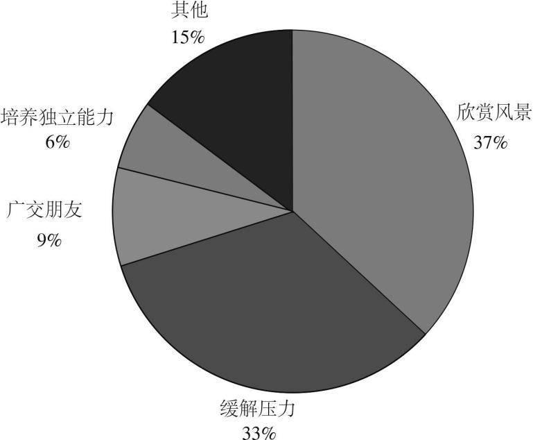

# 2016 年全国硕士研究生招生考试英语（二）试题

> 科目代码 204 ｜ 满分 100 分 ｜ 考试时间 180 分钟

> 说明：本文件由历年真题整理生成，供个人备考使用。**参考答案在文末**。

---

## Section I Use of English

> Read the following text. Choose the best word(s) for each numbered blank and mark A, B, C or D on the ANSWER SHEET. (10points)

Happy people work differently. They’re more productive, more creative, and willing to take greater risks. And new research suggests that happiness might influence \_\_\_(1)\_\_\_ firms work, too.

Companies located in places with happier people invest more, according to a recent research paper. \_\_\_(2)\_\_\_ , firms in happy places spend more on R&D (research and development). That’s because happiness is linked to the kind of longer-term thinking \_\_\_(3)\_\_\_ for making investments for the future.

The researchers wanted to know if the \_\_\_(4)\_\_\_ and inclination for risk-taking that come with happiness would \_\_\_(5)\_\_\_ the way companies invested. So they compared U.S. cities’ average happiness \_\_\_(6)\_\_\_ by Gallup polling with the investment activity of publicly traded firms in those areas.

\_\_\_(7)\_\_\_ enough, firms’ investment and R&D intensity were correlated with the happiness of the area in which they were \_\_\_(8)\_\_\_ . But is it really happiness that’s linked to investment, or could something else about happier cities \_\_\_(9)\_\_\_ why firms there spend more on R&D? To find out, the researchers controlled for various \_\_\_(10)\_\_\_ that might make firms more likely to invest – like size, industry, and sales – and for indicators that a place was \_\_\_(11)\_\_\_ to live in, like growth in wages or population. The link between happiness and investment generally \_\_\_(12)\_\_\_ even after accounting for these things.

The correlation between happiness and investment was particularly strong for younger firms, which the authors \_\_\_(13)\_\_\_ to “less codified decision making process” and the possible presence of “younger and less \_\_\_(14)\_\_\_ managers who are more likely to be influenced by sentiment.” The relationship was \_\_\_(15)\_\_\_ stronger in places where happiness was spread more \_\_\_(16)\_\_\_ . Firms seem to invest more in places where most people are relatively happy, rather than in places with happiness inequality.

\_\_\_(17)\_\_\_ this doesn’t prove that happiness causes firms to invest more or to take a longer-term view, the authors believe it at least \_\_\_(18)\_\_\_ at that possibility. It’s not hard to imagine that local culture and sentiment would help \_\_\_(19)\_\_\_ how executives think about the future. “It surely seems plausible that happy people would be more forward-thinking and creative and \_\_\_(20)\_\_\_ R&D more than the average,” said one researcher.

**1.** **A.** why&nbsp;&nbsp;&nbsp;&nbsp;**B.** how&nbsp;&nbsp;&nbsp;&nbsp;**C.** where&nbsp;&nbsp;&nbsp;&nbsp;**D.** when

**2.** **A.** In return&nbsp;&nbsp;&nbsp;&nbsp;**B.** In particular&nbsp;&nbsp;&nbsp;&nbsp;**C.** In contrast&nbsp;&nbsp;&nbsp;&nbsp;**D.** In conclusion

**3.** **A.** necessary&nbsp;&nbsp;&nbsp;&nbsp;**B.** famous&nbsp;&nbsp;&nbsp;&nbsp;**C.** perfect&nbsp;&nbsp;&nbsp;&nbsp;**D.** sufficient

**4.** **A.** individualism&nbsp;&nbsp;&nbsp;&nbsp;**B.** realism&nbsp;&nbsp;&nbsp;&nbsp;**C.** optimism&nbsp;&nbsp;&nbsp;&nbsp;**D.** modernism

**5.** **A.** miss&nbsp;&nbsp;&nbsp;&nbsp;**B.** echo&nbsp;&nbsp;&nbsp;&nbsp;**C.** spoil&nbsp;&nbsp;&nbsp;&nbsp;**D.** change

**6.** **A.** imagined&nbsp;&nbsp;&nbsp;&nbsp;**B.** measured&nbsp;&nbsp;&nbsp;&nbsp;**C.** assumed&nbsp;&nbsp;&nbsp;&nbsp;**D.** invented

**7.** **A.** Sure&nbsp;&nbsp;&nbsp;&nbsp;**B.** Odd&nbsp;&nbsp;&nbsp;&nbsp;**C.** Unfortunate&nbsp;&nbsp;&nbsp;&nbsp;**D.** Often

**8.** **A.** divided&nbsp;&nbsp;&nbsp;&nbsp;**B.** advertised&nbsp;&nbsp;&nbsp;&nbsp;**C.** overtaxed&nbsp;&nbsp;&nbsp;&nbsp;**D.** headquartered

**9.** **A.** summarize&nbsp;&nbsp;&nbsp;&nbsp;**B.** overstate&nbsp;&nbsp;&nbsp;&nbsp;**C.** explain&nbsp;&nbsp;&nbsp;&nbsp;**D.** emphasize

**10.** **A.** factors&nbsp;&nbsp;&nbsp;&nbsp;**B.** stages&nbsp;&nbsp;&nbsp;&nbsp;**C.** levels&nbsp;&nbsp;&nbsp;&nbsp;**D.** methods

**11.** **A.** desirable&nbsp;&nbsp;&nbsp;&nbsp;**B.** sociable&nbsp;&nbsp;&nbsp;&nbsp;**C.** reliable&nbsp;&nbsp;&nbsp;&nbsp;**D.** reputable

**12.** **A.** resumed&nbsp;&nbsp;&nbsp;&nbsp;**B.** emerged&nbsp;&nbsp;&nbsp;&nbsp;**C.** held&nbsp;&nbsp;&nbsp;&nbsp;**D.** broke

**13.** **A.** assign&nbsp;&nbsp;&nbsp;&nbsp;**B.** attribute&nbsp;&nbsp;&nbsp;&nbsp;**C.** transfer&nbsp;&nbsp;&nbsp;&nbsp;**D.** compare

**14.** **A.** serious&nbsp;&nbsp;&nbsp;&nbsp;**B.** civilized&nbsp;&nbsp;&nbsp;&nbsp;**C.** ambitious&nbsp;&nbsp;&nbsp;&nbsp;**D.** experienced

**15.** **A.** instead&nbsp;&nbsp;&nbsp;&nbsp;**B.** thus&nbsp;&nbsp;&nbsp;&nbsp;**C.** also&nbsp;&nbsp;&nbsp;&nbsp;**D.** never

**16.** **A.** rapidly&nbsp;&nbsp;&nbsp;&nbsp;**B.** directly&nbsp;&nbsp;&nbsp;&nbsp;**C.** regularly&nbsp;&nbsp;&nbsp;&nbsp;**D.** equally

**17.** **A.** While&nbsp;&nbsp;&nbsp;&nbsp;**B.** Until&nbsp;&nbsp;&nbsp;&nbsp;**C.** After&nbsp;&nbsp;&nbsp;&nbsp;**D.** Since

**18.** **A.** arrives&nbsp;&nbsp;&nbsp;&nbsp;**B.** jumps&nbsp;&nbsp;&nbsp;&nbsp;**C.** hints&nbsp;&nbsp;&nbsp;&nbsp;**D.** strikes

**19.** **A.** share&nbsp;&nbsp;&nbsp;&nbsp;**B.** rediscover&nbsp;&nbsp;&nbsp;&nbsp;**C.** simplify&nbsp;&nbsp;&nbsp;&nbsp;**D.** shape

**20.** **A.** pray for&nbsp;&nbsp;&nbsp;&nbsp;**B.** lean towards&nbsp;&nbsp;&nbsp;&nbsp;**C.** send out&nbsp;&nbsp;&nbsp;&nbsp;**D.** give away

## Section II Reading Comprehension — Part A

> Read the following four texts. Answer the questions after each text by choosing A, B, C or D. Mark your answers on the ANSWER SHEET. (40 points)

### Text 1

It’s true that high-school coding classes aren’t essential for learning computer science in college. Students without experience can catch up after a few introductory courses, said Tom Cortina, the assistant dean at Carnegie Mellon’s School of Computer Science.

However, Cortina said, early exposure is beneficial. When younger kids learn computer science, they learn that it’s not just a confusing, endless string of letters and numbers – but a tool to build apps, or create artwork, or test hypotheses. It’s not as hard for them to transform their thought processes as it is for older students. Breaking down problems into bite-sized chunks and using code to solve them becomes normal. Giving more children this training could increase the number of people interested in the field and help fill the jobs gap, Cortina said.

Students also benefit from learning something about coding before they get to college, where introductory computer-science classes are packed to the brim, which can drive the less-experienced or -determined students away.

The Flatiron School, where people pay to learn programming, started as one of the many coding bootcamps that’s become popular for adults looking for a career change. The high-schoolers get the same curriculum, but “we try to gear lessons toward things they’re interested in,” said Victoria Friedman, an instructor. For instance, one of the apps the students are developing suggests movies based on your mood.

The students in the Flatiron class probably won’t drop out of high school and build the next Facebook. Programming languages have a quick turnover, so the “Ruby on Rails” language they learned may not even be relevant by the time they enter the job market. But the skills they learn – how to think logically through a problem and organize the results – apply to any coding language, said Deborah Seehorn, an education consultant for the state of North Carolina.

Indeed, the Flatiron students might not go into IT at all. But creating a future army of coders is not the sole purpose of the classes. These kids are going to be surrounded by computers – in their pockets, in their offices, in their homes – for the rest of their lives. The younger they learn how computers think, how to coax the machine into producing what they want – the earlier they learn that they have the power to do that – the better.

**21.** Cortina holds that early exposure to computer science makes it easier to .

- **A.** complete future job training
- **B.** remodel the way of thinking
- **C.** formulate logical hypotheses
- **D.** perfect artwork production

**22.** In delivering lessons for high-schoolers, Flatiron has considered their .

- **A.** experience
- **B.** interest
- **C.** career prospects
- **D.** academic backgrounds

**23.** Deborah Seehorn believes that the skills learned at Flatiron will .

- **A.** help students learn other computer languages
- **B.** have to be upgraded when new technologies come
- **C.** need improving when students look for jobs
- **D.** enable students to make big quick money

**24.** According to the last paragraph, Flatiron students are expected to .

- **A.** bring forth innovative computer technologies
- **B.** stay longer in the information technology industry
- **C.** become better prepared for the digitalized world
- **D.** compete with a future army of programmers

**25.** The word “coax” (Line 4, Para. 6) is closest in meaning to .

- **A.** persuade
- **B.** frighten
- **C.** misguide
- **D.** challenge

### Text 2

Biologists estimate that as many as 2 million lesser prairie chickens – a kind of bird living on stretching grasslands – once lent red to the often grey landscape of the midwestern and southwestern United States. But just some 22,000 birds remain today, occupying about 16% of the species’ historic range.

The crash was a major reason the U.S. Fish and Wildlife Service (USFWS) decided to formally list the bird as threatened. “The lesser prairie chicken is in a desperate situation,” said USFWS Director Daniel Ashe. Some environmentalists, however, were disappointed. They had pushed the agency to designate the bird as “endangered,” a status that gives federal officials greater regulatory power to crack down on threats. But Ashe and others argued that the “threatened” tag gave the federal government flexibility to try out new, potentially less confrontational conservation approaches. In particular, they called for forging closer collaborations with western state governments, which are often uneasy with federal action, and with the private landowners who control an estimated 95% of the prairie chicken’s habitat.

Under the plan, for example, the agency said it would not prosecute landowners or businesses that unintentionally kill, harm, or disturb the bird, as long as they had signed a range-wide management plan to restore prairie chicken habitat. Negotiated by USFWS and the states, the plan requires individuals and businesses that damage habitat as part of their operations to pay into a fund to replace every acre destroyed with 2 new acres of suitable habitat. The fund will also be used to compensate landowners who set aside habitat. USFWS also set an interim goal of restoring prairie chicken populations to an annual average of 67,000 birds over the next 10 years. And it gives the Western Association of Fish and Wildlife Agencies (WAFWA), a coalition of state agencies, the job of monitoring progress. Overall, the idea is to let “states remain in the driver’s seat for managing the species,” Ashe said.

Not everyone buys the win-win rhetoric. Some Congress members are trying to block the plan, and at least a dozen industry groups, four states, and three environmental groups are challenging it in federal court. Not surprisingly, industry groups and states generally argue it goes too far; environmentalists say it doesn’t go far enough. “The federal government is giving responsibility for managing the bird to the same industries that are pushing it to extinction,” says biologist Jay Lininger.

**26.** The major reason for listing the lesser prairie chicken as threatened is .

- **A.** its drastically decreased population
- **B.** the underestimate of the grassland acreage
- **C.** a desperate appeal from some biologists
- **D.** the insistence of private landowners

**27.** The “threatened” tag disappointed some environmentalists in that it .

- **A.** was a give-in to governmental pressure
- **B.** would involve fewer agencies in action
- **C.** granted less federal regulatory power
- **D.** went against conservation policies

**28.** It can be learned from Paragraph 3 that unintentional harm-doers will not be prosecuted if they .

- **A.** agree to pay a sum for compensation
- **B.** volunteer to set up an equally big habitat
- **C.** offer to support the WAFWA monitoring job
- **D.** promise to raise funds for USFWS operations

**29.** According to Ashe, the leading role in managing thespecies is .

- **A.** the federal government
- **B.** the wildlife agencies
- **C.** the landowners
- **D.** the states

**30.** Jay Lininger would most likely support .

- **A.** industry groups
- **B.** the win-win rhetoric
- **C.** environmental groups
- **D.** the plan under challenge

### Text 3

That everyone’s too busy these days is a cliché. But one specific complaint is made especially mournfully: There’s never any time to read.

What makes the problem thornier is that the usual time-management techniques don’t seem sufficient. The web’s full of articles offering tips on making time to read: “Give up TV” or “Carry a book with you at all times.” But in my experience, using such methods to free up the odd 30 minutes doesn’t work. Sit down to read and the flywheel of work-related thoughts keeps spinning – or else you’re so exhausted that a challenging book’s the last thing you need. The modern mind, Tim Parks, a novelist and critic, writes, “is overwhelmingly inclined toward communication... It is not simply that one is interrupted; it is that one is actually inclined to interruption.” Deep reading requires not just time, but a special kind of time which can’t be obtained merely by becoming more efficient.

In fact, “becoming more efficient” is part of the problem. Thinking of time as a resource to be maximised means you approach it instrumentally, judging any given moment as well spent only in so far as it advances progress toward some goal. Immersive reading, by contrast, depends on being willing to risk inefficiency, goallessness, even time-wasting. Try to slot it in as a to-do list item and you’ll manage only goal-focused reading – useful, sometimes, but not the most fulfilling kind. “The future comes at us like empty bottles along an unstoppable and nearly infinite conveyor belt,” writes Gary Eberle in his book Sacred Time, and “we feel a pressure to fill these different-sized bottles (days, hours, minutes) as they pass, for if they get by without being filled, we will have wasted them.” No mind-set could be worse for losing yourself in a book.

So what does work? Perhaps surprisingly, scheduling regular times for reading. You’d think this might fuel the efficiency mind-set, but in fact, Eberle notes, such ritualistic behaviour helps us “step outside time’s flow” into “soul time.” You could limit distractions by reading only physical books, or on single-purpose e-readers. “Carry a book with you at all times” can actually work, too – providing you dip in often enough, so that reading becomes the default state from which you temporarily surface to take care of business, before dropping back down. On a really good day, it no longer feels as if you’re “making time to read,” but just reading, and making time for everything else.

**31.** The usual time-management techniques don’t work because .

- **A.** what they can offer does not ease the modern mind
- **B.** what challenging books demand is repetitive reading
- **C.** what people often forget is carrying a book with them
- **D.** what deep reading requires cannot be guaranteed

**32.** The “empty bottles” metaphor illustrates that people feel a pressure to .

- **A.** update their to-do lists
- **B.** make passing time fulfilling
- **C.** carry their plans through
- **D.** pursue carefree reading

**33.** Eberle would agree that scheduling regular times for reading helps .

- **A.** encourage the efficiency mind-set
- **B.** develop online reading habits
- **C.** promote ritualistic reading
- **D.** achieve immersive reading

**34.** “Carry a book with you at all times” can work if .

- **A.** reading becomes your primary business of the day
- **B.** all the daily business has been promptly dealt with
- **C.** you are able to drop back to business after reading
- **D.** time can be evenly split for reading and business

**35.** The best title for this text could be .

- **A.** How to Enjoy Easy Reading
- **B.** How to Find Time to Read
- **C.** How to Set Reading Goals
- **D.** How to Read Extensively

### Text 4

Against a backdrop of drastic changes in economy and population structure, younger Americans are drawing a new 21st-century road map to success, a latest poll has found.

Across generational lines, Americans continue to prize many of the same traditional milestones of a successful life, including getting married, having children, owning a home, and retiring in their sixties. But while young and old mostly agree on what constitutes the finish line of a fulfilling life, they offer strikingly different paths for reaching it.

Young people who are still getting started in life were more likely than older adults to prioritize personal fulfillment in their work, to believe they will advance their careers most by regularly changing jobs, to favor communities with more public services and a faster pace of life, to agree that couples should be financially secure before getting married or having children, and to maintain that children are best served by two parents working outside the home, the survey found.

From career to community and family, these contrasts suggest that in the aftermath of the searing Great Recession, those just starting out in life are defining priorities and expectations that will increasingly spread through virtually all aspects of American life, from consumer preferences to housing patterns to politics.

Young and old converge on one key point: Overwhelming majorities of both groups said they believe it is harder for young people today to get started in life than it was for earlier generations. While younger people are somewhat more optimistic than their elders about the prospects for those starting out today, big majorities in both groups believe those “just getting started in life” face a tougher climb than earlier generations in reaching such signpost achievements as securing a good-paying job, starting a family, managing debt, and finding affordable housing.

Pete Schneider considers the climb tougher today. Schneider, a 27-year-old auto technician from the Chicago suburbs, says he struggled to find a job after graduating from college. Even now that he is working steadily, he said, “I can’t afford to pay my monthly mortgage payments on my own, so I have to rent rooms out to people to make that happen.” Looking back, he is struck that his parents could provide a comfortable life for their children even though neither had completed college when he was young. “I still grew up in an upper middle-class home with parents who didn’t have college degrees,” Schneider said. “I don’t think people are capable of that anymore.”

**36.** One cross-generation mark of a successful life is .

- **A.** trying out different lifestyles
- **B.** having a family with children
- **C.** working beyond retirement age
- **D.** setting up a profitable business

**37.** It can be learned from Paragraph 3 that young people tend to .

- **A.** favor a slower life pace
- **B.** hold an occupation longer
- **C.** attach importance to pre-marital finance
- **D.** give priority to childcare outside the home

**38.** The priorities and expectations defined by the young will .

- **A.** become increasingly clear
- **B.** focus on materialistic issues
- **C.** depend largely on political preferences
- **D.** reach almost all aspects of American life

**39.** Both young and old agree that .

- **A.** good-paying jobs are less available
- **B.** the old made more life achievements
- **C.** housing loans today are easy to obtain
- **D.** getting established is harder for the young

**40.** Which of the following is true about Schneider?

- **A.** He found a dream job after graduating from college.
- **B.** His parents believe working steadily is a must for success.
- **C.** His parents’ good life has little to do with a college degree.
- **D.** He thinks his job as a technician quite challenging.

## Section II Reading Comprehension — Part B

> Read the following text and answer the questions by choosing the most suitable subheading from the list A-G for each of the numbered paragraphs (41-45). There are two extra subheadings which you do not need to use. Mark your answers on the ANSWER SHEET. (10 points)

Act Your Shoe Size, Not Your Age

As adults, it seems that we are constantly pursuing happiness, often with mixed results. Yet children appear to have it down to an art – and for the most part they don’t need self-help books or therapy. Instead, they look after their wellbeing instinctively, and usually more effectively than we do as grownups. Perhaps it’s time to learn a few lessons from them.

\_\_\_(41)\_\_\_

What does a child do when he’s sad? He cries. When he’s angry? He shouts. Scared? Probably a bit of both. As we grow up, we learn to control our emotions so they are manageable and don’t dictate our behaviours, which is in many ways a good thing. But too often we take this process too far and end up suppressing emotions, especially negative ones. That’s about as effective as brushing dirt under a carpet and can even make us ill. What we need to do is find a way to acknowledge and express what we feel appropriately, and then – again, like children – move on.

\_\_\_(42)\_\_\_

A couple of Christmases ago, my youngest stepdaughter, who was nine years old at the time, got a Superman T-shirt for Christmas. It cost less than a fiver but she was overjoyed, and couldn’t stop talking about it. Too often we believe that a new job, bigger house or better car will be the magic silver bullet that will allow us to finally be content, but the reality is these things have very little lasting impact on our happiness levels. Instead, being grateful for small things every day is a much better way to improve wellbeing.

\_\_\_(43)\_\_\_

Have you ever noticed how much children laugh? If we adults could indulge in a bit of silliness and giggling, we would reduce the stress hormones in our bodies, increase good hormones like endorphins, improve blood flow to our hearts and even have a greater chance of fighting off infection. All of which would, of course, have a positive effect on our happiness levels.

\_\_\_(44)\_\_\_

The problem with being a grownup is that there’s an awful lot of serious stuff to deal with – work, mortgage payments, figuring out what to cook for dinner. But as adults we also have the luxury of being able to control our own diaries and it’s important that we schedule in time to enjoy the things we love. Those things might be social, sporting, creative or completely random (dancing around the living room, anyone?) – it doesn’t matter, so long as they’re enjoyable, and not likely to have negative side effects, such as drinking too much alcohol or going on a wild spending spree if you’re on a tight budget.

\_\_\_(45)\_\_\_

Having said all of the above, it’s important to add that we shouldn’t try too hard to be happy. Scientists tell us this can backfire and actually have a negative impact on our wellbeing. As the Chinese philosopher Chuang Tzu is reported to have said: “Happiness is the absence of striving for happiness.” And in that, once more, we need to look to the example of our children, to whom happiness is not a goal but a natural byproduct of the way they live.

**备选项 A–G**

- **A.** Be silly
- **B.** Have fun
- **C.** Ask for help
- **D.** Express your emotions
- **E.** Don’t overthink it
- **F.** Be easily pleased
- **G.** Notice things

**41.** &nbsp;\_\_\_\_\_\_\_\_\_\_\_\_\_\_\_\_\_\_

**42.** &nbsp;\_\_\_\_\_\_\_\_\_\_\_\_\_\_\_\_\_\_

**43.** &nbsp;\_\_\_\_\_\_\_\_\_\_\_\_\_\_\_\_\_\_

**44.** &nbsp;\_\_\_\_\_\_\_\_\_\_\_\_\_\_\_\_\_\_

**45.** &nbsp;\_\_\_\_\_\_\_\_\_\_\_\_\_\_\_\_\_\_

## Section III Translation

> Translate the following text into Chinese. Write your translation on the ANSWER SHEET. (15 points)

The supermarket is designed to lure customers into spending as much time as possible within its doors. The reason for this is simple: The longer you stay in the store, the more stuff you’ll see, and the more stuff you see, the more you’ll buy. And supermarkets contain a lot of stuff. The average supermarket, according to the Food Marketing Institute, carries some 44,000 different items, and many carry tens of thousands more. The sheer volume of available choice is enough to send shoppers into a state of information overload. According to brain-scan experiments, the demands of so much decision-making quickly become too much for us. After about 40 minutes of shopping, most people stop struggling to be rationally selective, and instead begin shopping emotionally – which is the point at which we accumulate the 50 percent of stuff in our cart that we never intended buying.

**46.**

## Section IV Writing — Part A

**47.** Suppose you won a translation contest and your friend, Jack, wrote an email to congratulate you and ask for advice on translation. Write him a reply to
1) thank him, and
2) give your advice.
You should write about 100 words on the ANSWER SHEET.
Do not use your own name. Use “Li Ming” instead.
Do not write your address. (10 points)

## Section IV Writing — Part B

**48.** Write an essay based on the chart below. In your writing, you should
1) interpret the chart, and
2) give your comments.
You should write about 150 words on the ANSWER SHEET. (15 points)

---

## 参考答案

### Section I Use of English

**1.** B · how
**2.** B · In particular
**3.** A · necessary
**4.** C · optimism
**5.** D · change
**6.** B · measured
**7.** A · Sure
**8.** D · headquartered
**9.** C · explain
**10.** A · factors
**11.** A · desirable
**12.** C · held
**13.** B · attribute
**14.** D · experienced
**15.** C · also
**16.** D · equally
**17.** A · While
**18.** C · hints
**19.** D · shape
**20.** B · lean towards

### Section II Reading Comprehension — Part A

*Text 1*

**21.** B · remodel the way of thinking
**22.** B · interest
**23.** A · help students learn other computer languages
**24.** C · become better prepared for the digitalized world
**25.** A · persuade

*Text 2*

**26.** A · its drastically decreased population
**27.** C · granted less federal regulatory power
**28.** A · agree to pay a sum for compensation
**29.** D · the states
**30.** C · environmental groups

*Text 3*

**31.** D · what deep reading requires cannot be guaranteed
**32.** B · make passing time fulfilling
**33.** D · achieve immersive reading
**34.** A · reading becomes your primary business of the day
**35.** B · How to Find Time to Read

*Text 4*

**36.** B · having a family with children
**37.** C · attach importance to pre-marital finance
**38.** D · reach almost all aspects of American life
**39.** D · getting established is harder for the young
**40.** C · His parents’ good life has little to do with a college degree.

### Section II Reading Comprehension — Part B

**41–45**：D  F  A  B  E

### Section III Translation

> **关键词**：`lure`（引诱，诱使） ｜ `carry`（备有(货物)供销售） ｜ `item`（商品(物品),货品） ｜ `sheer`（十足的，彻底的，纯粹的） ｜ `overload`（超载，超负荷） ｜ `demand`（困难的(烦人的，累人的)事情，[对技术的]要求） ｜ `rationally`（理性地） ｜ `selective`（认真挑选的） ｜ `accumulate`（堆积，聚集）
超市的设计就是要诱使顾客尽可能久地待在店内。其理由很简单：你在店里逗留越久，看到的东西就越多，看到的东西越多，买的就越多。而超市里的东西多得很。按食品营销研究院所说，普通超市售卖约44,000种各式货品，而且许多超市的货品还要多出成千上万种。单是可供选择的货品数量就足以让购物者陷入信息超负荷的状态。根据大脑扫描实验，如此之大的决策量带来的负担会很快令我们无法承受。购物约40分钟后，大多数人就不再费心去理性选购，而是开始冲动购物了——就是从这一刻起，我们把本来根本没打算买的那一半东西堆进了购物车。

### Section IV Writing — Part A

**47 参考范文**

Dear Jack,

I'm writing to express my gratitude for your congratulation on my success in the translation contest. Since you asked for my advice, I'd like to share with you some of my thoughts on how to improve translation skills.

To begin with, it is vital that you appreciate the beauty of language and hone your reading skills. Besides, a good translator usually reads extensively and constantly exposes himself to quality reading materials. One should cultivate a broad knowledge base and keep abreast of current events and issues. Moreover, be persistent. Language learning is not a task that can be accomplished within a short time. Only with a lot of sustained efforts can we improve our translation skills.

I wish you find these suggestions useful and I'm more than willing to discuss it with you about further details. I'm looking forward to your reply.

Yours sincerely,

Li Ming

### Section IV Writing — Part B

**48 参考范文**

This pie chart, simple yet illuminating, illustrates the purposes of travel for students polled in a certain university. As is reflected by the chart, 37 percent of college students travel to appreciate the beauty of the scenery; next comes the aim of relieving pressure, accounting for 33 percent. Students' other objectives — making more friends, fostering greater independence, and other aims respectively account for 9%, 6% and 15%.

The survey reveals that most students go on a journey to enjoy the view as well as to unwind and recharge. On the one hand, with the prosperity of tourism, college students who have ample time, curiosity and energy to explore their individuality and see the outside world are lured to go out of campus and come into contact with grandeur and beauty. On the other hand, college students have their share of pressure coming from academic study, employment and interpersonal relationship, to which travelling is a wonderful antidote. One usually comes back from a trip feeling refreshed and revitalized.

In my opinion, though it's natural for college students to seek fun and enjoyment, they should attach deeper meaning to travelling. In the journey one can try to interact with local people and experience their culture in-depth, make friends with people from different cultural backgrounds and feel a sense of independence and self-reliance from the bottom of heart. Travelling truly could benefit a lot.
