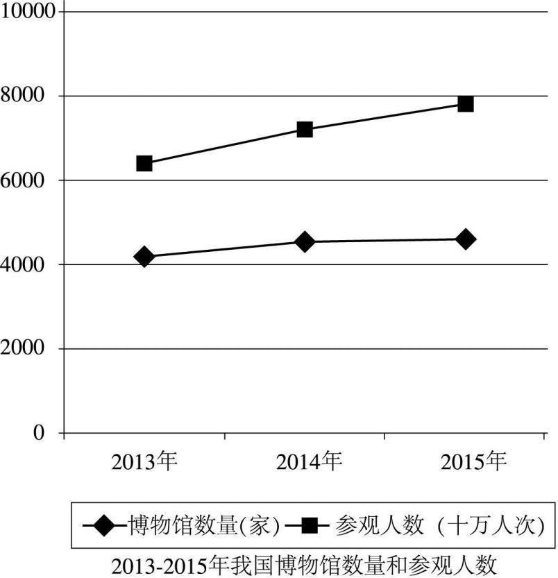

# 2017 年全国硕士研究生招生考试英语（二）试题

> 科目代码 204 ｜ 满分 100 分 ｜ 考试时间 180 分钟

> 说明：本文件由历年真题整理生成，供个人备考使用。**参考答案在文末**。

---

## Section I Use of English

> Read the following text. Choose the best word(s) for each numbered blank and mark A, B, C or D on the ANSWER SHEET. (10points)

People have speculated for centuries about a future without work. Today is no different, with academics, writers, and activists once again \_\_\_(1)\_\_\_ that technology is replacing human workers. Some imagine that the coming work-free world will be defined by \_\_\_(2)\_\_\_ : A few wealthy people will own all the capital, and the masses will struggle in an impoverished wasteland.

A different and not mutually exclusive \_\_\_(3)\_\_\_ holds that the future will be a wasteland of a different sort, one \_\_\_(4)\_\_\_ by purposelessness: Without jobs to give their lives \_\_\_(5)\_\_\_ , people will simply become lazy and depressed. \_\_\_(6)\_\_\_ , today’s unemployed don’t seem to be having a great time. One Gallup poll found that 20 percent of Americans who have been unemployed for at least a year report having depression, double the rate for \_\_\_(7)\_\_\_ Americans. Also, some research suggests that the \_\_\_(8)\_\_\_ for rising rates of mortality, mental-health problems, and addiction \_\_\_(9)\_\_\_ poorly-educated, middle-aged people is a shortage of well-paid jobs. Perhaps this is why many \_\_\_(10)\_\_\_ the agonizing dullness of a jobless future.

But it doesn’t \_\_\_(11)\_\_\_ follow from findings like these that a world without work would be filled with unease. Such visions are based on the \_\_\_(12)\_\_\_ of being unemployed in a society built on the concept of employment. In the \_\_\_(13)\_\_\_ of work, a society designed with other ends in mind could \_\_\_(14)\_\_\_ strikingly different circumstances for the future of labor and leisure. Today, the \_\_\_(15)\_\_\_ of work may be a bit overblown. “Many jobs are boring, degrading, unhealthy, and a waste of human potential,” says John Danaher, a lecturer at the National University of Ireland in Galway.

These days, because leisure time is relatively \_\_\_(16)\_\_\_ for most workers, people use their free time to counterbalance the intellectual and emotional \_\_\_(17)\_\_\_ of their jobs. “When I come home from a hard day’s work, I often feel \_\_\_(18)\_\_\_ ,” Danaher says, adding, “In a world in which I don’t have to work, I might feel rather different” – perhaps different enough to throw himself \_\_\_(19)\_\_\_ a hobby or a passion project with the intensity usually reserved for \_\_\_(20)\_\_\_ matters.

**1.** **A.** boasting&nbsp;&nbsp;&nbsp;&nbsp;**B.** denying&nbsp;&nbsp;&nbsp;&nbsp;**C.** warning&nbsp;&nbsp;&nbsp;&nbsp;**D.** ensuring

**2.** **A.** inequality&nbsp;&nbsp;&nbsp;&nbsp;**B.** instability&nbsp;&nbsp;&nbsp;&nbsp;**C.** unreliability&nbsp;&nbsp;&nbsp;&nbsp;**D.** uncertainty

**3.** **A.** policy&nbsp;&nbsp;&nbsp;&nbsp;**B.** guideline&nbsp;&nbsp;&nbsp;&nbsp;**C.** resolution&nbsp;&nbsp;&nbsp;&nbsp;**D.** prediction

**4.** **A.** characterized&nbsp;&nbsp;&nbsp;&nbsp;**B.** divided&nbsp;&nbsp;&nbsp;&nbsp;**C.** balanced&nbsp;&nbsp;&nbsp;&nbsp;**D.** measured

**5.** **A.** wisdom&nbsp;&nbsp;&nbsp;&nbsp;**B.** meaning&nbsp;&nbsp;&nbsp;&nbsp;**C.** glory&nbsp;&nbsp;&nbsp;&nbsp;**D.** freedom

**6.** **A.** Instead&nbsp;&nbsp;&nbsp;&nbsp;**B.** Indeed&nbsp;&nbsp;&nbsp;&nbsp;**C.** Thus&nbsp;&nbsp;&nbsp;&nbsp;**D.** Nevertheless

**7.** **A.** rich&nbsp;&nbsp;&nbsp;&nbsp;**B.** urban&nbsp;&nbsp;&nbsp;&nbsp;**C.** working&nbsp;&nbsp;&nbsp;&nbsp;**D.** educated

**8.** **A.** explanation&nbsp;&nbsp;&nbsp;&nbsp;**B.** requirement&nbsp;&nbsp;&nbsp;&nbsp;**C.** compensation&nbsp;&nbsp;&nbsp;&nbsp;**D.** substitute

**9.** **A.** under&nbsp;&nbsp;&nbsp;&nbsp;**B.** beyond&nbsp;&nbsp;&nbsp;&nbsp;**C.** alongside&nbsp;&nbsp;&nbsp;&nbsp;**D.** among

**10.** **A.** leave behind&nbsp;&nbsp;&nbsp;&nbsp;**B.** make up&nbsp;&nbsp;&nbsp;&nbsp;**C.** worry about&nbsp;&nbsp;&nbsp;&nbsp;**D.** set aside

**11.** **A.** statistically&nbsp;&nbsp;&nbsp;&nbsp;**B.** occasionally&nbsp;&nbsp;&nbsp;&nbsp;**C.** necessarily&nbsp;&nbsp;&nbsp;&nbsp;**D.** economically

**12.** **A.** chances&nbsp;&nbsp;&nbsp;&nbsp;**B.** downsides&nbsp;&nbsp;&nbsp;&nbsp;**C.** benefits&nbsp;&nbsp;&nbsp;&nbsp;**D.** principles

**13.** **A.** absence&nbsp;&nbsp;&nbsp;&nbsp;**B.** height&nbsp;&nbsp;&nbsp;&nbsp;**C.** face&nbsp;&nbsp;&nbsp;&nbsp;**D.** course

**14.** **A.** disturb&nbsp;&nbsp;&nbsp;&nbsp;**B.** restore&nbsp;&nbsp;&nbsp;&nbsp;**C.** exclude&nbsp;&nbsp;&nbsp;&nbsp;**D.** yield

**15.** **A.** model&nbsp;&nbsp;&nbsp;&nbsp;**B.** practice&nbsp;&nbsp;&nbsp;&nbsp;**C.** virtue&nbsp;&nbsp;&nbsp;&nbsp;**D.** hardship

**16.** **A.** tricky&nbsp;&nbsp;&nbsp;&nbsp;**B.** lengthy&nbsp;&nbsp;&nbsp;&nbsp;**C.** mysterious&nbsp;&nbsp;&nbsp;&nbsp;**D.** scarce

**17.** **A.** demands&nbsp;&nbsp;&nbsp;&nbsp;**B.** standards&nbsp;&nbsp;&nbsp;&nbsp;**C.** qualities&nbsp;&nbsp;&nbsp;&nbsp;**D.** threats

**18.** **A.** ignored&nbsp;&nbsp;&nbsp;&nbsp;**B.** tired&nbsp;&nbsp;&nbsp;&nbsp;**C.** confused&nbsp;&nbsp;&nbsp;&nbsp;**D.** starved

**19.** **A.** off&nbsp;&nbsp;&nbsp;&nbsp;**B.** against&nbsp;&nbsp;&nbsp;&nbsp;**C.** behind&nbsp;&nbsp;&nbsp;&nbsp;**D.** into

**20.** **A.** technological&nbsp;&nbsp;&nbsp;&nbsp;**B.** professional&nbsp;&nbsp;&nbsp;&nbsp;**C.** educational&nbsp;&nbsp;&nbsp;&nbsp;**D.** interpersonal

## Section II Reading Comprehension — Part A

> Read the following four texts. Answer the questions after each text by choosing A, B, C or D. Mark your answers on the ANSWER SHEET. (40 points)

### Text 1

Every Saturday morning, at 9 am, more than 50,000 runners set off to run 5km around their local park. The Parkrun phenomenon began with a dozen friends and has inspired 400 events in the UK and more abroad. Events are free, staffed by thousands of volunteers. Runners range from four years old to grandparents; their times range from Andrew Baddeley’s world record 13 minutes 48 seconds up to an hour.

Parkrun is succeeding where London’s Olympic “legacy” is failing. Ten years ago on Monday, it was announced that the Games of the 30th Olympiad would be in London. Planning documents pledged that the great legacy of the Games would be to lever a nation of sport lovers away from their couches. The population would be fitter, healthier and produce more winners. It has not happened. The number of adults doing weekly sport did rise, by nearly 2 million in the run-up to 2012 – but the general population was growing faster. Worse, the numbers are now falling at an accelerating rate. The opposition claims primary school pupils doing at least two hours of sport a week have nearly halved. Obesity has risen among adults and children. Official retrospections continue as to why London 2012 failed to “inspire a generation.” The success of Parkrun offers answers.

Parkun is not a race but a time trial: Your only competitor is the clock. The ethos welcomes anybody. There is as much joy over a puffed-out first-timer being clapped over the line as there is about top talent shining. The Olympic bidders, by contrast, wanted to get more people doing sport and to produce more elite athletes. The dual aim was mixed up: The stress on success over taking part was intimidating for newcomers.

Indeed, there is something a little absurd in the state getting involved in the planning of such a fundamentally “grassroots” concept as community sports associations. If there is a role for government, it should really be getting involved in providing common goods – making sure there is space for playing fields and the money to pave tennis and netball courts, and encouraging the provision of all these activities in schools. But successive governments have presided over selling green spaces, squeezing money from local authorities and declining attention on sport in education. Instead of wordy, worthy strategies, future governments need to do more to provide the conditions for sport to thrive. Or at least not make them worse.

**21.** According to Paragraph 1, Parkrun has .

- **A.** gained great popularity
- **B.** created many jobs
- **C.** strengthened community ties
- **D.** become an official festival

**22.** The author believes that London’s Olympic “legacy” has failed to .

- **A.** boost population growth
- **B.** promote sport participation
- **C.** improve the city’s image
- **D.** increase sport hours in schools

**23.** Parkrun is different from Olympic games in that it .

- **A.** aims at discovering talents
- **B.** focuses on mass competition
- **C.** does not emphasize elitism
- **D.** does not attract first-timers

**24.** With regard to mass sports, the author holds that governments should .

- **A.** organize “grassroots” sports events
- **B.** supervise local sports associations
- **C.** increase funds for sports clubs
- **D.** invest in public sports facilities

**25.** The author’s attitude to what UK governments have done for sports is .

- **A.** tolerant
- **B.** critical
- **C.** uncertain
- **D.** sympathetic

### Text 2

With so much focus on children’s use of screens, it’s easy for parents to forget about their own screen use. “Tech is designed to really suck you in,” says Jenny Radesky in her study of digital play, “and digital products are there to promote maximal engagement. It makes it hard to disengage, and leads to a lot of bleed-over into the family routine.”

Radesky has studied the use of mobile phones and tablets at mealtimes by giving mother-child pairs a food-testing exercise. She found that mothers who used devices during the exercise started 20 per cent fewer verbal and 39 per cent fewer nonverbal interactions with their children. During a separate observation, she saw that phones became a source of tension in the family. Parents would be looking at their emails while the children would be making excited bids for their attention.

Infants are wired to look at parents’ faces to try to understand their world, and if those faces are blank and unresponsive – as they often are when absorbed in a device – it can be extremely disconcerting for the children. Radesky cites the “still face experiment” devised by developmental psychologist Ed Tronick in the 1970s. In it, a mother is asked to interact with her child in a normal way before putting on a blank expression and not giving them any visual social feedback: The child becomes increasingly distressed as she tries to capture her mother’s attention. “Parents don’t have to be exquisitely present at all times, but there needs to be a balance and parents need to be responsive and sensitive to a child’s verbal or nonverbal expressions of an emotional need,” says Radesky.

On the other hand, Tronick himself is concerned that the worries about kids’ use of screens are born out of an “oppressive ideology that demands that parents should always be interacting” with their children: “It’s based on a somewhat fantasised, very white, very upper-middle-class ideology that says if you’re failing to expose your child to 30,000 words you are neglecting them.” Tronick believes that just because a child isn’t learning from the screen doesn’t mean there’s no value to it – particularly if it gives parents time to have a shower, do housework or simply have a break from their child. Parents, he says, can get a lot out of using their devices to speak to a friend or get some work out of the way. This can make them feel happier, which lets them be more available to their child the rest of the time.

**26.** According to Jenny Radesky, digital products aredesigned to .

- **A.** simplify routine matters
- **B.** absorb user attention
- **C.** better interpersonal relations
- **D.** increase work efficiency

**27.** Radesky’s food-testing exercise shows that mothers’use of devices .

- **A.** takes away babies’ appetite
- **B.** distracts children’s attention
- **C.** slows down babies’ verbal development
- **D.** reduces mother-child communication

**28.** Radesky cites the “still face experiment” to show that .

- **A.** it is easy for children to get used to blank expressions
- **B.** verbal expressions are unnecessary for emotional exchange
- **C.** children are insensitive to changes in their parents’mood
- **D.** parents need to respond to children’s emotional needs

**29.** The oppressive ideology mentioned by Tronick requires parents to .

- **A.** protect kids from exposure to wild fantasies
- **B.** teach their kids at least 30,000 words a year
- **C.** ensure constant interaction with their children
- **D.** remain concerned about kids’ use of screens

**30.** According to Tronick, kids’ use ofscreens may .

- **A.** give their parents some free time
- **B.** make their parents more creative
- **C.** help them with their homework
- **D.** help them become more attentive

### Text 3

Today, widespread social pressure to immediately go to college in conjunction with increasingly high expectations in a fast-moving world often causes students to completely overlook the possibility of taking a gap year. After all, if everyone you know is going to college in the fall, it seems silly to stay back a year, doesn’t it? And after going to school for 12 years, it doesn’t feel natural to spend a year doing something that isn’t academic.

But while this may be true, it’s not a good enough reason to condemn gap years. There’s always a constant fear of falling behind everyone else on the socially perpetuated “race to the finish line,” whether that be toward graduate school, medical school or a lucrative career. But despite common misconceptions, a gap year does not hinder the success of academic pursuits – in fact, it probably enhances it.

Studies from the United States and Australia show that students who take a gap year are generally better prepared for and perform better in college than those who do not. Rather than pulling students back, a gap year pushes them ahead by preparing them for independence, new responsibilities and environmental changes – all things that first-year students often struggle with the most. Gap year experiences can lessen the blow when it comes to adjusting to college and being thrown into a brand new environment, making it easier to focus on academics and activities rather than acclimation blunders.

If you’re not convinced of the inherent value in taking a year off to explore interests, then consider its financial impact on future academic choices. According to the National Center for Education Statistics, nearly 80 percent of college students end up changing their majors at least once. This isn’t surprising, considering the basic mandatory high school curriculum leaves students with a poor understanding of the vast academic possibilities that await them in college. Many students find themselves listing one major on their college applications, but switching to another after taking college classes. It’s not necessarily a bad thing, but depending on the school, it can be costly to make up credits after switching too late in the game. At Boston College, for example, you would have to complete an extra year were you to switch to the nursing school from another department. Taking a gap year to figure things out initially can help prevent stress and save money later on.

**31.** One of the reasons for high-school graduates not taking a gap year is that .

- **A.** they think it academically misleading
- **B.** they have a lot of fun to expect in college
- **C.** it feels strange to do differently from others
- **D.** it seems worthless to take off-campus courses

**32.** Studies from the US and Australia imply that taking a gapyear helps .

- **A.** keep students from being unrealistic
- **B.** lower risks in choosing careers
- **C.** ease freshmen’s financial burdens
- **D.** relieve freshmen of pressures

**33.** The word “acclimation” (Para. 3) is closest in meaning to .

- **A.** adaptation
- **B.** application
- **C.** motivation
- **D.** competition

**34.** A gap year may save money for students by helping them .

- **A.** avoid academic failures
- **B.** establish long-term goals
- **C.** switch to another college
- **D.** decide on the right major

**35.** The most suitable title for this text would be .

- **A.** In Favor of the Gap Year
- **B.** The ABCs of the Gap Year
- **C.** The Gap Year Comes Back
- **D.** The Gap Year: ADilemma

### Text 4

Though often viewed as a problem for western states, the growing frequency of wildfires is a national concern because of its impact on federal tax dollars, says Professor Max Moritz, a specialist in fire ecology and management.

In 2015, the US Forest Service for the first time spent more than half of its $5.5 billion annual budget fighting fires – nearly double the percentage it spent on such efforts 20 years ago. In effect, fewer federal funds today are going towards the agency’s other work – such as forest conservation, watershed and cultural resources management, and infrastructure upkeep – that affect the lives of all Americans.

Another nationwide concern is whether public funds from other agencies are going into construction in fire-prone districts. As Moritz puts it, how often are federal dollars building homes that are likely to be lost to a wildfire?

“It’s already a huge problem from a public expenditure perspective for the whole country,” he says. “We need to take a magnifying glass to that. Like, ‘Wait a minute, is this OK?’ Do we want instead to redirect those funds to concentrate on lower-hazard parts of the landscape?”

Such a view would require a corresponding shift in the way US society today views fire, researchers say.

For one thing, conversations about wildfires need to be more inclusive. Over the past decade, the focus has been on climate change – how the warming of the Earth from greenhouse gases is leading to conditions that worsen fires.

While climate is a key element, Moritz says, it shouldn’t come at the expense of the rest of the equation.

“The human systems and the landscapes we live on are linked, and the interactions go both ways,” he says. Failing to recognize that, he notes, leads to “an overly simplified view of what the solutions might be. Our perception of the problem and of what the solution is becomes very limited.”

At the same time, people continue to treat fire as an event that needs to be wholly controlled and unleashed only out of necessity, says Professor Balch at the University of Colorado. But acknowledging fire’s inevitable presence in human life is an attitude crucial to developing the laws, policies, and practices that make it as safe as possible, she says.

“We’ve disconnected ourselves from living with fire,” Balch says. “It is really important to understand and try and tease out what is the human connection with fire today.”

**36.** More frequentwildfires have become a nationalconcern because in 2015 they .

- **A.** exhausted unprecedented management efforts
- **B.** consumed a record-high percentage of budget
- **C.** severely damaged the ecology of western states
- **D.** caused a huge rise of infrastructure expenditure

**37.** Moritz calls for the use of “a magnifying glass” to .

- **A.** raise more funds for fire-prone areas
- **B.** avoid the redirection of federal money
- **C.** find wildfire-free parts of the landscape
- **D.** guarantee safer spending of public funds

**38.** While admitting that climate is a key element, Moritz notes that .

- **A.** public debates have not settled yet
- **B.** fire-fighting conditions are improving
- **C.** other factors should not be overlooked
- **D.** a shift in the view of fire has taken place

**39.** The overly simplified view Moritz mentions is a result of failing to .

- **A.** discover the fundamental makeup of nature
- **B.** explore the mechanism of the human systems
- **C.** maximize the role of landscape in human life
- **D.** understand the interrelations of man and nature

**40.** Professor Balch points out that fire is something man should .

- **A.** do away with
- **B.** come to terms with
- **C.** pay a price for
- **D.** keep away from

## Section II Reading Comprehension — Part B

> Read the following text and match each of the numbered items in the left column to its corresponding information in the right column. There are two extra choices in the right column. Mark your answers on the ANSWER SHEET. (10points)

The decline in American manufacturing is a common refrain, particularly from Donald Trump. “We don’t make anything anymore,” he told Fox News, while defending his own made-in-Mexico clothing line.

Without question, manufacturing has taken a significant hit during recent decades, and further trade deals raise questions about whether new shocks could hit manufacturing.

But there is also a different way to look at the data.

Across the country, factory owners are now grappling with a new challenge: Instead of having too many workers, they may end up with too few. Despite trade competition and outsourcing, American manufacturing still needs to replace tens of thousands of retiring boomers every year. Millennials may not be that interested in taking their place. Other industries are recruiting them with similar or better pay.

For factory owners, it all adds up to stiff competition for workers – and upward pressure on wages. “They’re harder to find and they have job offers,” says Jay Dunwell, president of Wolverine Coil Spring, a family-owned firm, “They may be coming [into the workforce], but they’ve been plucked by other industries that are also doing as well as manufacturing.” Mr. Dunwell has begun bringing high school juniors to the factory so they can get exposed to its culture.

At RoMan Manufacturing, a maker of electrical transformers and welding equipment that his father cofounded in 1980, Robert Roth keeps a close eye on the age of his nearly 200 workers. Five are retiring this year. Mr. Roth has three community-college students enrolled in a work-placement program, with a starting wage of $13 an hour that rises to $17 after two years.

At a worktable inside the transformer plant, young Jason Stenquist looks flustered by the copper coils he’s trying to assemble and the arrival of two visitors. It’s his first week on the job. Asked about his choice of career, he says at high school he considered medical school before switching to electrical engineering. “I love working with tools. I love creating,” he says.

But to win over these young workers, manufacturers have to clear another major hurdle: parents, who lived through the worst US economic downturn since the Great Depression, telling them to avoid the factory. Millennials “remember their father and mother both were laid off. They blame it on the manufacturing recession,” says Birgit Klohs, chief executive of The Right Place, a business development agency for western Michigan.

These concerns aren’t misplaced: Employment in manufacturing has fallen from 17 million in 1970 to 12 million in 2015. When the recovery began, worker shortages first appeared in the high-skilled trades. Now shortages are appearing at the mid-skill levels.

“The gap is between the jobs that take no skills and those that require a lot of skill,” says Rob Spohr, a business professor at Montcalm Community College. “There’re enough people to fill the jobs at McDonalds and other places where you don’t need to have much skill. It’s that gap in between, and that’s where the problem is.”

Julie Parks of Grand Rapids Community College points to another key to luring Millennials into manufacturing: a work/life balance. While their parents were content to work long hours, young people value flexibility. “Overtime is not attractive to this generation. They really want to live their lives,” she says.

**备选项 A–G**

- **A.** says that he switched to electrical engineering because he loves working with tools.
- **B.** points out that there are enough people to fill the jobs that don’t need much skill.
- **C.** points out that the US doesn’t manufacture anything anymore.
- **D.** believes that it is important to keep a close eye on the age of his workers.
- **E.** says that for factory owners, workers are harder to find because of stiff competition.
- **F.** points out that a work/life balance can attract young people into manufacturing.
- **G.** says that the manufacturing recession is to blame for the lay-off of the young people’s parents.

**41.** &nbsp;\_\_\_\_\_\_\_\_\_\_\_\_\_\_\_\_\_\_

> Jay Dunwell

**42.** &nbsp;\_\_\_\_\_\_\_\_\_\_\_\_\_\_\_\_\_\_

> Jason Stenquist

**43.** &nbsp;\_\_\_\_\_\_\_\_\_\_\_\_\_\_\_\_\_\_

> Birgit Klohs

**44.** &nbsp;\_\_\_\_\_\_\_\_\_\_\_\_\_\_\_\_\_\_

> Rob Spohr

**45.** &nbsp;\_\_\_\_\_\_\_\_\_\_\_\_\_\_\_\_\_\_

> Julie Parks

## Section III Translation

> Translate the following text into Chinese. Write your translation on the ANSWER SHEET. (15 points)

My dream has always been to work somewhere in an area between fashion and publishing. Two years before graduating from secondary school, I took a sewing and design course thinking that I would move on to a fashion design course. However, during that course I realized I was not good enough in this area to compete with other creative personalities in the future, so I decided that it was not the right path for me. Before applying for university I told everyone that I would study journalism, because writing was, and still is, one of my favourite activities. But, to be honest, I said it, because I thought that fashion and me together was just a dream – I knew that no one could imagine me in the fashion industry at all! So I decided to look for some fashion-related courses that included writing. This is when I noticed the course “Fashion Media & Promotion.”

**46.**

## Section IV Writing — Part A

**47.** Suppose you are invited by Professor Williams to give a presentation about Chinese culture to a group of international students. Write a reply to
1) accept the invitation, and
2) introduce the key points of your presentation.
You should write about 100 words on the ANSWER SHEET.
Do not use your own name. Use “Li Ming” instead.
Do not write your address. (10 points)

## Section IV Writing — Part B

**48.** Write an essay based on the chart below. In your writing, you should
1) interpret the chart, and
2) give your comments.
You should write about 150 words on the ANSWER SHEET. (15 points)

---

## 参考答案

### Section I Use of English

**1.** C · warning
**2.** A · inequality
**3.** D · prediction
**4.** A · characterized
**5.** B · meaning
**6.** B · Indeed
**7.** C · working
**8.** A · explanation
**9.** D · among
**10.** C · worry about
**11.** C · necessarily
**12.** B · downsides
**13.** A · absence
**14.** D · yield
**15.** C · virtue
**16.** D · scarce
**17.** A · demands
**18.** B · tired
**19.** D · into
**20.** B · professional

### Section II Reading Comprehension — Part A

*Text 1*

**21.** A · gained great popularity
**22.** B · promote sport participation
**23.** C · does not emphasize elitism
**24.** D · invest in public sports facilities
**25.** B · critical

*Text 2*

**26.** B · absorb user attention
**27.** D · reduces mother-child communication
**28.** D · parents need to respond to children’s emotional needs
**29.** C · ensure constant interaction with their children
**30.** A · give their parents some free time

*Text 3*

**31.** C · it feels strange to do differently from others
**32.** D · relieve freshmen of pressures
**33.** A · adaptation
**34.** D · decide on the right major
**35.** A · In Favor of the Gap Year

*Text 4*

**36.** B · consumed a record-high percentage of budget
**37.** D · guarantee safer spending of public funds
**38.** C · other factors should not be overlooked
**39.** D · understand the interrelations of man and nature
**40.** B · come to terms with

### Section II Reading Comprehension — Part B

**41–45**：E  A  G  B  F

### Section III Translation

> **关键词**：`take`（攻读，修(某一课程)） ｜ `sewing`（缝纫） ｜ `personality`（有突出个性的人） ｜ `apply`（申请） ｜ `promotion`（推广）
我的梦想一直是在时尚和出版之间的领域工作。中学毕业前两年，我选了一门缝纫与设计课，心想以后会接着修一门时装设计课。然而，在学习那门课程期间，我意识到自己在这个领域不够出色，日后不足以与其他有创造力的人士竞争，因此我认定，这条路不适合我。申请上大学之前，我跟所有人说我要学新闻，因为写作曾经是——现在依然是——我最喜欢的活动之一。可是，说实话，当时我那么说是因为我觉得时尚和我结缘仅仅是个梦——我知道，别人根本无法想象我能进入时尚行业！于是，我决定找些含有写作的与时尚相关的课程。就在这个时候，我注意到了“时尚传媒与推广”这门课。

### Section IV Writing — Part A

**47 参考范文**

Dear Professor Williams,

I am honored to give a presentation about Chinese culture to international students at your invitation. I am pleased to take this opportunity to communicate with foreign friends about cultures.

My presentation will be focused on Chinese martial arts, which is an important component of Chinese culture. To begin with, I will briefly introduce it and its development over millennia. Then, I will focus on some common styles of Chinese martial arts, each of which has its own set of techniques and ideas. Furthermore, I will show some photos of relevant historical locations and figures. I believe graphic visual depiction will be more impressive than boring language.

Thank you for your invitation. I am looking forward to seeing you.

Sincerely yours,
Li Ming

### Section IV Writing — Part B

**48 参考范文**

The given chart reveals China's consecutive growth of museums and museum visitors from 2013 to 2015. The growth of museum experienced a slowdown in 2014, while the growth of museum visitors maintained a dynamic momentum.

This phenomenon can be attributed to the following reasons. Firstly, thanks to national endeavor at cultural undertakings, numerous museums have been constructed and opened freely to the public. Moreover, China's rapid economic growth underpins the cultural progress. With living-standard improving, the public demand increasingly varied spiritual nutrition, thus visiting museums and galleries has become a willing choice for more people.

However, this encouraging sign also presents challenges, like how to address the supply deficiency posed by decelerated growth of museum and people's increasingly diverse need for exhibitions. Museums can improve efficiency by embracing mobile and digital technologies like e-museum. Meanwhile, through digital pictures and interactive videos, visitors can appreciate numerous exhibits from around the world and obtain fresh visiting experiences. It's believed that through joint efforts, China's museums will constitute a bigger driving force advancing cultural development and the important means to enhance people's well-being, thus further boosting economic and social development.
