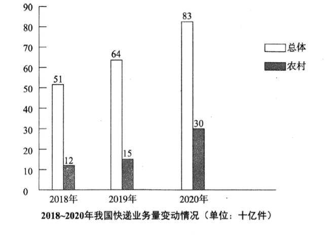

# 2022 年全国硕士研究生招生考试英语（二）试题

> 科目代码 204 ｜ 满分 100 分 ｜ 考试时间 180 分钟

> 说明：本文件由历年真题整理生成，供个人备考使用。**参考答案在文末**。

---

## Section I Use of English

> Read the following text. Choose the best word(s) for each numbered blank and mark A, B, C or D on the ANSWER SHEET. (10 points)

Harlan Coben believes that if you’re a writer, you’ll find the time; and that if you can’t find the time, then writing isn’t a priority and you’re not a writer. For him writing is a \_\_\_(1)\_\_\_ job—a job like any other. He has \_\_\_(2)\_\_\_ it with plumbing, pointing out that a plumber doesn’t wake up and say that he can’t work with pipes today.

\_\_\_(3)\_\_\_ , like most writers these days, you’re holding down a job to pay the bills, it’s not \_\_\_(4)\_\_\_ to find the time to write. But it’s not impossible. It requires determination and single-mindedness. \_\_\_(5)\_\_\_ that most bestselling authors began writing when they were doing other things to earn a living. And today, even writers who are fairly \_\_\_(6)\_\_\_ often have to do other work to \_\_\_(7)\_\_\_ their writing income.

As Harlan Coben has suggested, it’s a \_\_\_(8)\_\_\_ of priorities. To make writing a priority, you’ll have to \_\_\_(9)\_\_\_ some of your day-to-day activities and some things you really enjoy. Depending on your \_\_\_(10)\_\_\_ and your lifestyle, that might mean spending less time watching television or listening to music, though some people can write \_\_\_(11)\_\_\_ they listen to music. You might have to \_\_\_(12)\_\_\_ the amount of exercise or sport you do. You’ll have to make social media an \_\_\_(13)\_\_\_ activity rather than a daily, time-consuming \_\_\_(14)\_\_\_ . There’ll probably have to be less socialising with your friends and less time with your family. Ifs a \_\_\_(15)\_\_\_ learning curve and it won’t always make you popular.

There’s just one thing you should try to keep at least some time for, \_\_\_(16)\_\_\_ your writing—and that’s reading. Any writer needs to read as much and as widely as they can; it’s the one \_\_\_(17)\_\_\_ supporter—something you can’t do without.

Time is finite. The older you get, the \_\_\_(18)\_\_\_ it seems to go. We need to use it as carefully and as \_\_\_(19)\_\_\_ as we can, that means prioritising our activities so that we spend most time on the things we really want to do. If you're a writer, that means— \_\_\_(20)\_\_\_ writing.

**1.** **A.** difficult&nbsp;&nbsp;&nbsp;&nbsp;**B.** normal&nbsp;&nbsp;&nbsp;&nbsp;**C.** steady&nbsp;&nbsp;&nbsp;&nbsp;**D.** pleasant

**2.** **A.** combined&nbsp;&nbsp;&nbsp;&nbsp;**B.** compared&nbsp;&nbsp;&nbsp;&nbsp;**C.** confused&nbsp;&nbsp;&nbsp;&nbsp;**D.** confronted

**3.** **A.** If&nbsp;&nbsp;&nbsp;&nbsp;**B.** Though&nbsp;&nbsp;&nbsp;&nbsp;**C.** Once&nbsp;&nbsp;&nbsp;&nbsp;**D.** Unless

**4.** **A.** enough&nbsp;&nbsp;&nbsp;&nbsp;**B.** strange&nbsp;&nbsp;&nbsp;&nbsp;**C.** wrong&nbsp;&nbsp;&nbsp;&nbsp;**D.** easy

**5.** **A.** Accept&nbsp;&nbsp;&nbsp;&nbsp;**B.** Explain&nbsp;&nbsp;&nbsp;&nbsp;**C.** Remember&nbsp;&nbsp;&nbsp;&nbsp;**D.** Suppose

**6.** **A.** well-known&nbsp;&nbsp;&nbsp;&nbsp;**B.** well-advised&nbsp;&nbsp;&nbsp;&nbsp;**C.** well-informed&nbsp;&nbsp;&nbsp;&nbsp;**D.** well-chosen

**7.** **A.** donate&nbsp;&nbsp;&nbsp;&nbsp;**B.** generate&nbsp;&nbsp;&nbsp;&nbsp;**C.** supplement&nbsp;&nbsp;&nbsp;&nbsp;**D.** calculate

**8.** **A.** cause&nbsp;&nbsp;&nbsp;&nbsp;**B.** purpose&nbsp;&nbsp;&nbsp;&nbsp;**C.** question&nbsp;&nbsp;&nbsp;&nbsp;**D.** condition

**9.** **A.** highlight&nbsp;&nbsp;&nbsp;&nbsp;**B.** sacrifice&nbsp;&nbsp;&nbsp;&nbsp;**C.** continue&nbsp;&nbsp;&nbsp;&nbsp;**D.** explore

**10.** **A.** relations&nbsp;&nbsp;&nbsp;&nbsp;**B.** interests&nbsp;&nbsp;&nbsp;&nbsp;**C.** memories&nbsp;&nbsp;&nbsp;&nbsp;**D.** skills

**11.** **A.** until&nbsp;&nbsp;&nbsp;&nbsp;**B.** because&nbsp;&nbsp;&nbsp;&nbsp;**C.** while&nbsp;&nbsp;&nbsp;&nbsp;**D.** before

**12.** **A.** put up with&nbsp;&nbsp;&nbsp;&nbsp;**B.** make up for&nbsp;&nbsp;&nbsp;&nbsp;**C.** hang on to&nbsp;&nbsp;&nbsp;&nbsp;**D.** cut down on

**13.** **A.** intelligent&nbsp;&nbsp;&nbsp;&nbsp;**B.** occasional&nbsp;&nbsp;&nbsp;&nbsp;**C.** intensive&nbsp;&nbsp;&nbsp;&nbsp;**D.** emotional

**14.** **A.** habit&nbsp;&nbsp;&nbsp;&nbsp;**B.** test&nbsp;&nbsp;&nbsp;&nbsp;**C.** decision&nbsp;&nbsp;&nbsp;&nbsp;**D.** plan

**15.** **A.** tough&nbsp;&nbsp;&nbsp;&nbsp;**B.** gentle&nbsp;&nbsp;&nbsp;&nbsp;**C.** rapid&nbsp;&nbsp;&nbsp;&nbsp;**D.** funny

**16.** **A.** in place of&nbsp;&nbsp;&nbsp;&nbsp;**B.** in charge of&nbsp;&nbsp;&nbsp;&nbsp;**C.** in response to&nbsp;&nbsp;&nbsp;&nbsp;**D.** in addition to

**17.** **A.** indispensable&nbsp;&nbsp;&nbsp;&nbsp;**B.** innovative&nbsp;&nbsp;&nbsp;&nbsp;**C.** invisible&nbsp;&nbsp;&nbsp;&nbsp;**D.** instant

**18.** **A.** duller&nbsp;&nbsp;&nbsp;&nbsp;**B.** harder&nbsp;&nbsp;&nbsp;&nbsp;**C.** quieter&nbsp;&nbsp;&nbsp;&nbsp;**D.** quicker

**19.** **A.** peacefully&nbsp;&nbsp;&nbsp;&nbsp;**B.** generously&nbsp;&nbsp;&nbsp;&nbsp;**C.** productively&nbsp;&nbsp;&nbsp;&nbsp;**D.** gratefully

**20.** **A.** at most&nbsp;&nbsp;&nbsp;&nbsp;**B.** in turn&nbsp;&nbsp;&nbsp;&nbsp;**C.** on average&nbsp;&nbsp;&nbsp;&nbsp;**D.** above all

## Section II Reading Comprehension — Part A

> Read the following four texts. Answer the questions below each text by choosing A, B, C or D. Mark your answers on the ANSWER SHEET. (40 points)

### Text 1

On a recent sunny day, 13,000 chickens roam over Larry Brown’s 40 windswept acres in Shiner, Texas. Some rest in the shade of a parked car. Others drink water with the cows. This all seems random, but it's by design, part of what the $ 6.1 billion U.S. egg industry bets will be its next big thing: climate-friendly eggs.

These eggs, which are making their debut now on shelves for as much as $ 8 a dozen, are still labeled organic and animal-friendly, but they’re also from birds that live on farms using regenerative agriculture—special techniques to cultivate rich soils that can trap greenhouse gases. Such eggs could be marketed as helping to fight climate change.

“I’m excited about our progress,” says Brown, who harvests eggs for Denver-based Nest Fresh Eggs and is adding more cover crops that draw worms and crickets for the chickens to eat. The birds’ waste then fertilizes fields. Such improvements “allow our hens to forage for higher-quality natural feed that will be good for the land, the hens, and the eggs that we supply to our customers.”

The egg industry’s push is the first major test of whether animal products from regenerative farms can become the next premium offering. In barely more than a decade, organic eggs went from being dismissed as a niche product in natural foods stores to being sold at Walmart. More recently there were similar doubts about probiotics and plant-based meats, but both have exploded into major supermarket categories. If the sustainable-egg rollout is successful, it could open the floodgates for regenerative beef, broccoli, and beyond.

Regenerative products could be a hard sell, because the concept is tough to define quickly, says Julie Stanton, associate professor of agricultural economics at Pennsylvania State University Brandywine. Such farming also brings minimal, if any, improvement to the food products (though some producers say their eggs have more protein).

The industry is betting that the same consumers paying more for premium attributes such as free-range, non-GMO, and pasture-raised eggs will embrace sustainability. Surveys show that younger generations are more concerned about climate change, and some of the success of plant-based meat can be chalked up to shoppers wanting to signal their desire to protect the environment. Young adults “ really care about the planet,” says John Brunnquell, president of Egg Innovations. “ They are absolutely altering the food chain beyond what I think even they understand what they’re doing.”

**21.** The climate-friendly eggs are produced

- **A.** at a considerably low cost.
- **B.** at the demand of regular shoppers.
- **C.** as a replacement for organic eggs.
- **D.** on specially designed farms.

**22.** Larry Brown is excited about his progress in

- **A.** reducing the damage of worms.
- **B.** accelerating the disposal of waste.
- **C.** creating a sustainable system.
- **D.** attracting customers to his products.

**23.** The example of organic eggs is used in Paragraph 4 to suggest

- **A.** the doubts over natural feeds.
- **B.** the setbacks in the egg industry.
- **C.** the potential of regenerative products.
- **D.** the promotional success of supermarkets.

**24.** It can be learned from the last paragraph that young people

- **A.** are reluctant to change their diet.
- **B.** are likely to buy climate-friendly eggs.
- **C.** are curious about new food.
- **D.** are amazed at agriculture advances.

**25.** John Brunnquell would disagree with Julie Stanton over regenerative products’

- **A.** market prospects.
- **B.** standard definition.
- **C.** nutritional value.
- **D.** moral implication.

### Text 2

More Americans are opting to work well into retirement, a growing trend that threatens to upend the old workforce model.

One in three Americans who are at least 40 have or plan to have a job in retirement to prepare for a longer life, according to a survey conducted by Harris Poll for TD Ameritrade. Even more surprising is that more than half of “unretirees”—those who plan to work in retirement or went back to work after retiring—said they would be employed in their later years even if they had enough money to settle down, the survey showed.

Financial needs aren’t the only culprit for the “unretirement” trend. Other reasons, according to the study, include personal fulfillment such as staying mentally fit, preventing boredom or avoiding depression. About 72% of “unretiree” respondents said that they would return to work once retired to keep mentally fit while 59% said it would be tied to making ends meet.

“The concept of retirement is evolving,” said Christine Russell, senior manager of retirement at TD Ameritrade. “It’s not just about finances. The value of work is also driving folks to continue working past retirement.”

One reason for the change in retirement patterns: Americans are living longer. The share of the population 65 and older was 16% in 2018, up 32% from the prior year, according to the US. Census Bureau. That’s also up 302% since 2010. Older Americans are also the fastest-growing segment of the US. workforce, and boomers are expected to live longer than previous generations. The percentage of retirement-age people in the labor force has doubled over the past three decades. About 20% of people 65 and older were in the workforce in February, up from an all-time low of 10% in January 1985, according to money manager United Income.

Because of longer life spans, Americans are also boosting their savings to preserve their nest eggs, the TD Ameritrade study showed, which surveyed 2000 adults between 40 to 79. Six in 10 “unretirees” are increasing their savings in anticipation of a longer life, according to the survey. Among the most popular ways they are doing this, the company said, is by reducing their overall expenses, securing life insurance or maximizing their contributions to retirement accounts.

Unfortunately, many people who are opting to work in retirement are preparing to do so because they are worried about making ends meet in their later years, said Brent Weiss, a co-founder at Baltimore-based financial-planning firm Facet Wealth. He suggested that preretirees should speak with a financial adviser to set long-term financial goals.

“The most challenging moments in life are getting married, starting a family and ultimately retiring,” Weiss said. “It’s not just a financial decision, but an emotional one. Many people believe they can’t retire”

**26.** The survey conducted by Harris Poll indicates that

- **A.** over half of the retirees are physically fit for work.
- **B.** the old workforce is as active as the younger one.
- **C.** one in three Americans enjoy earlier retirement.
- **D.** more Americans are willing to work in retirement.

**27.** It can be inferred from Paragraph 3 that Americans tend to think that

- **A.** retirement may cause problems for them.
- **B.** boredom can be relieved after retirement.
- **C.** the mental health of retirees is overlooked.
- **D.** “unretirement” contributes to the economy.

**28.** Retirement patterns are changing partly due to

- **A.** labor shortage.
- **B.** population growth.
- **C.** longer life expectancy.
- **D.** rising living costs.

**29.** Many “ unretirees ” are increasing their savings by

- **A.** investing more in stocks.
- **B.** taking up odd jobs.
- **C.** getting well-paid work.
- **D.** spending less.

**30.** With regard to retirement, Brent Weiss thinks that many people are

- **A.** unprepared.
- **B.** unafraid.
- **C.** disappointed.
- **D.** enthusiastic.

### Text 3

We have all encountered them, in both our personal and professional lives. Think about the times you felt tricked or frustrated by a membership or subscription that had a seamless sign-up process but was later difficult to cancel. Something that should be simple and transparent can be complicated, intentionally or unintentionally, in ways that impair consumer choice. These are examples of dark patterns.

First coined in 2010 by user experience expert Harry Brignull, “ dark patterns” is a catch-all term for practices that manipulate user interfaces to influence the decision-making ability of users. Brignull identifies 12 types of common dark patterns, ranging from misdirection and hidden costs to “roach motel,” where a user experience seems easy and intuitive at the start, but turns difficult when the user tries to get out.

In a 2019 study of 53,000 product pages and 11,000 websites, researchers found that about one in 10 employs these design practices. Though widely prevalent, the concept o f dark patterns is still not well understood. Business and nonprofit leaders should be aware of dark patterns and try to avoid the gray areas they engender.

Where is the line between ethical, persuasive design and dark patterns? Businesses should engage in conversations with IT, compliance, risk, and legal teams to review their privacy policy, and include in the discussion the customer/user experience designers and coders responsible for the company’s user interface, as well as the marketers and advertisers responsible for sign-ups, checkout baskets, pricing, and promotions. Any or all these teams can play a role in creating or avoiding “digital deception.”

Lawmakers and regulators are slowly starting to address the ambiguity around dark patterns, most recently at the state level. In March, the California Attorney General announced the approval of additional regulations under the California Consumer Privacy Act (CCPA) that “ensure that consumers will not be confused or misled when seeking to exercise their data privacy rights.” The regulations aim to ban dark patterns— this means prohibiting companies from using u confusing language or unnecessary steps such as forcing them to click through multiple screens or listen to reasons why they shouldn’t opt out.”

As more states consider promulgating additional regulations, there is a need for greater accountability from within the business community. Dark patterns also can be addressed on a self-regulatory basis, but only if organizations hold themselves accountable, not just to legal requirements but also to industry best practices and standards.

**31.** It can be learned from the first two paragraphs that dark patterns

- **A.** improve user experiences
- **B.** leak user information for profit
- **C.** undermine users’ decision-making
- **D.** remind users of hidden costs

**32.** The 2019 study on dark patterns is mentioned to show

- **A.** their major flaws
- **B.** their complex designs
- **C.** their severe damage
- **D.** their strong presence

**33.** To handle digital deception, businesses should

- **A.** listen to customer feedback
- **B.** talk with relevant teams
- **C.** turn to independent agencies
- **D.** rely on professional training

**34.** The additional regulations under the CCPA are intended to

- **A.** guide users through opt-out processes
- **B.** protect consumers from being tricked
- **C.** grant companies data privacy rights
- **D.** restrict access to problematic content

**35.** According to the last paragraph, a key to coping with dark patterns is

- **A.** new legal requirements
- **B.** businesses’ self-discipline
- **C.** strict regulatory standards
- **D.** consumers’ safety awareness

### Text 4

Although ethics classes are common around the world, scientists are unsure if their lessons can actually change behavior; evidence either way is weak, relying on contrived laboratory tests or sometimes unreliable self-reports. But a new study published in Cognition found that, in at least one real-world situation, a single ethics lesson may have had lasting effects.

The researchers investigated one class session’s impact on eating meat. They chose this particular behavior for three reasons, according to study co-author Eric Schwitzgebel, a philosopher at the University of California, Riverside: students’ attitudes on the topic are variable and unstable, behavior is easily measurable, and ethics literature largely agrees that eating less meat is good because it reduces environmental harm and animal suffering. Half of the students in four large philosophy classes read an article on the ethics of factory-farmed meat, optionally watched an 11-minute video on the topic and joined a 50-minute discussion. The other half focused on charitable giving instead. Then, unknown to the students, the researchers studied their anonymized meal-card purchases for that semester—nearly 14,000 receipts for almost 500 students.

Schwitzgebel predicted the intervention would have no effect; he had previously found that ethics professors do not differ from other professors on a range of behaviors, including voting rates, blood donation and returning library books. But among student subjects who discussed meat ethics, meal purchases containing meat decreased from 52 to 45 percent—and this effect held steady for the study’s duration of several weeks. Purchases from the other group remained at 52 percent.

“That’s actually a pretty large effect for a pretty small intervention,” Schwitzgebel says. Psychologist Nina Strohminger at the University of Pennsylvania, who was not involved in the study, says she wants the effect to be real but cannot rule out some unknown confounding variable. And if real, she notes, it might be reversible by another nudge: “Easy come, easy go.”

Schwitzgebel suspects the greatest impact came from social influence-classmates or teaching assistants leading the discussions may have shared their own vegetarianism, showing it as achievable or more common. Second, the video may have had an emotional impact. Least rousing, he thinks, was rational argument, although his co-authors say reason might play a bigger role. Now the researchers are probing the specific effects of teaching style, teaching assistants’ eating habits and students’ video exposure. Meanwhile, Schwitzgebel—who had predicted no effect—will be eating his words.

**36.** Scientists generally believe that the effects of ethics classes are

- **A.** hard to determine.
- **B.** narrowly interpreted.
- **C.** difficult to ignore.
- **D.** poorly summarized.

**37.** Which of the following is a reason for the researchers to study meat eating?

- **A.** It is common among students.
- **B.** It is a behavior easy to measure.
- **C.** It is important to students’ health.
- **D.** It is a hot topic in ethics classes.

**38.** Eric Schwitzgebel’s previous findings suggest that ethics professors

- **A.** are seldom critical of their students.
- **B.** are less sociable than other professors.
- **C.** are not sensitive to political issues.
- **D.** are not necessarily ethically better.

**39.** Nina Strohminger thinks that the effect of the intervention is

- **A.** permanent.
- **B.** predictable.
- **C.** uncertain.
- **D.** unrepeatable.

**40.** Eric Schwitzgebel suspects that the students’ change in behavior

- **A.** can bring psychological benefits.
- **B.** can be analyzed statistically.
- **C.** is a result of multiple factors.
- **D.** is a sign of self-development.

## Section II Reading Comprehension — Part B

> Read the following text and answer the questions by choosing the most suitable subheading from the list A -G for each numbered paragraph (41 - 45). There are two extra subheadings which you do not need to use. Mark your answers on the ANSWER SHEET. (10 points)

How to Get Active Again

Getting back into exercise can be a challenge in the best of times, but with gyms and in-person exercise classes off-limits to many people these days, it can be tricky to know where to start. And it’s important to get the right dose of activity. “Too much too soon either results in injury or burnout,” says Mary Yoke, PhD, a faculty member in the kinesiology department at Indiana University in Bloomington. The following simple strategies will help you return to exercise safely after a break.

\_\_\_(41)\_\_\_

Don’t try to go back to what you were doing before your break. If you were walking 3 miles a day, playing 18 holes of golf three times a week, or lifting 10-pound dumbbells for three sets of 10 reps, reduce activity to half a mile every other day, or nine holes of golf once a week with short walks on other days, or use 5-pound dumbbells for one set of 10 reps. Increase time, distance, and intensity gradually. “This isn’t something you can do overnight,” says Keri L. Denay, MD, lead author of a recent American College of Sports Medicine advisory that encourages Americans to not overlook the benefits of activity during the pandemic. But you will reap benefits such as less anxiety and improve sleep right away.

\_\_\_(42)\_\_\_

If you’re breathing too hard to talk in complete sentences, back off. If you feel good, go a little longer or faster. Feeling wiped out after a session? Go easier next time. And stay alert to serious symptoms, such as chest pain or pressure, severe shortness of breath or dizziness, or faintness, and seek medical attention immediately.

\_\_\_(43)\_\_\_

Consistency is the key to getting stronger and building endurance and stamina. Ten minutes of activity per day is a good start, says Marcus Jackovitz, DPT, a physical therapist at the University of Miami Hospital. All the experts we spoke with highly recommend walking because ifs the easiest, most accessible form of exercise. Althoughit can be a workout on its own, if your goal is to get back to Zumba classes, tennis, cycling, or any other activity, walking is also a great first step.

\_\_\_(44)\_\_\_

Even if you can’t yet do a favorite activity, you can practice the moves. With or without a club or racket, swing like you’re hitting the ball. Paddle like you’re in a kayak or canoe. Mimic your favorite swimming strokes. The action will remind you of the joy the activity brought you and prime your muscles for when you can get out there again.

\_\_\_(45)\_\_\_

Exercising with others “ can keep you accountable and make it more fun, so you’re more likely to do it again,” Jackovitz says. You can do activities such as golf and tennis or take a walk with others and still be socially distant. But when you can’t connect in person, consider using technology. Chat on the phone with a friend while you walk around your neighborhood. FaceTime with a relative as you strength train or stretch at home. You can also join a livestream or on-demand exercise class.

**备选项 A–G**

- **A.** Make It a Habit.
- **B.** Don’t Go It Alone.
- **C.** Start Low, Go Slow.
- **D.** Talk With Your Doctor.
- **E.** Listen to Your Body.
- **F.** Go Through the Motions.
- **G.** Round Out Your Routine.

**41.** &nbsp;\_\_\_\_\_\_\_\_\_\_\_\_\_\_\_\_\_\_

**42.** &nbsp;\_\_\_\_\_\_\_\_\_\_\_\_\_\_\_\_\_\_

**43.** &nbsp;\_\_\_\_\_\_\_\_\_\_\_\_\_\_\_\_\_\_

**44.** &nbsp;\_\_\_\_\_\_\_\_\_\_\_\_\_\_\_\_\_\_

**45.** &nbsp;\_\_\_\_\_\_\_\_\_\_\_\_\_\_\_\_\_\_

## Section III Translation

> Translate the following text into Chinese. Write your translation on the ANSWER SHEET. (15 points)

Although we try our best, sometimes our paintings rarely turn out as originally planned. Changes in the light, the limitations of your painting materials, and the lack of experience and technique mean that what you start out trying to achieve may not come to life the way that you expected.

Although this can be frustrating and disappointing, it turns out that this can actually be good for you. Unexpected results have two benefits: you pretty quickly learn to deal with disappointment, and realise that when one door closes, another opens. You also quickly learn to adapt and come up with creative solutions to the problems the painting presents, and thinking outside the box will become your second nature.

In fact, creative problem-solving skills are incredibly useful in daily life, with which you’re more likely to be able to find a solution when a problem arises.

**46.**

## Section IV Writing — Part A

**47.** Suppose you are planning a campus food festival. Write an e-mail to the international students in your university to
1) introduce the food festival, and
2) invite them to participate.
You should write about 100 words on the ANSWER SHEET.
Do not use your own name. Use “Li Ming” instead. (10 points)

## Section IV Writing — Part B

**48.** Write an essay based on the following chart. In your writing, you should
1) interpret the chart, and
2) give your comments.
You should write about 150 words on the ANSWER SHEET. (15 points)

---

## 参考答案

### Section I Use of English

**1.** B · normal
**2.** B · compared
**3.** A · If
**4.** D · easy
**5.** C · Remember
**6.** A · well-known
**7.** C · supplement
**8.** C · question
**9.** B · sacrifice
**10.** B · interests
**11.** C · while
**12.** D · cut down on
**13.** B · occasional
**14.** A · habit
**15.** A · tough
**16.** D · in addition to
**17.** A · indispensable
**18.** D · quicker
**19.** C · productively
**20.** D · above all

### Section II Reading Comprehension — Part A

*Text 1*

**21.** D · on specially designed farms.
**22.** C · creating a sustainable system.
**23.** C · the potential of regenerative products.
**24.** B · are likely to buy climate-friendly eggs.
**25.** A · market prospects.

*Text 2*

**26.** D · more Americans are willing to work in retirement.
**27.** A · retirement may cause problems for them.
**28.** C · longer life expectancy.
**29.** D · spending less.
**30.** A · unprepared.

*Text 3*

**31.** C · undermine users’ decision-making
**32.** D · their strong presence
**33.** B · talk with relevant teams
**34.** B · protect consumers from being tricked
**35.** B · businesses’ self-discipline

*Text 4*

**36.** A · hard to determine.
**37.** B · It is a behavior easy to measure.
**38.** D · are not necessarily ethically better.
**39.** C · uncertain.
**40.** C · is a result of multiple factors.

### Section II Reading Comprehension — Part B

**41–45**：C  E  A  F  B

### Section III Translation

> **关键词**：`rarely`（很少） ｜ `originally`（原来） ｜ `technique`（技巧） ｜ `frustrating`（令人沮丧的） ｜ `adapt`（适应(新情况)） ｜ `present`（使发生） ｜ `incredibly`（极端地） ｜ `arise`（发生）
虽然我们竭尽所能，但有时我们的画作很少符合最初的计划。光线的改变、绘画材料的限制以及经验和技巧的不足，都意味着起初想要达到的效果未必能够如你所愿地呈现出来。

尽管这难免让人沮丧失望，但结果其实可能对你有益。意料之外的结果有两个好处：你会很快学会处理失望情绪，并意识到当一扇门关上时，另一扇门就会打开。你也会很快学会适应，想出创造性的解决方案，解决画作中出现的问题，跳出常规进行思考会成为你的第二天性。

事实上，创造性解决问题的技能在日常生活中极为有用，有了这种技能，发生问题时你就更有可能找到解决办法。

### Section IV Writing — Part A

**47 参考范文**

Dear international students,

There will be a multicultural food festival at the Main Dining Hall from 10 a. m. to 3 p. m. on May 27th. You are cordially invited to this occasion.

The event features a variety of local specialties, ranging from traditional homely delicacies to popular street snacks, all elaborately prepared by our catering staff. If interested, you are also encouraged to cook your hometown dishes in groups with the ingredients provided on site. This will definitely be a highlight of the event. After preparation, all participants can move along the booths, sampling these delicious foods with cheerful music.

Don't miss this golden opportunity to get a taste of different cultures and experience more joy in life! We keenly look forward to your participation.

Yours sincerely,
Li Ming

### Section IV Writing — Part B

**48 参考范文**

According to the bar chart, the volume of express parcels across China surged from 51 billion pieces in 2018 to 83 billion pieces in 2020. When it comes to the rural areas, the trend is particularly striking, which doubled to 30 billion pieces in the last one year alone.

This chart reveals the robust growth of China's express delivery sector. It is closely tied to the e-commerce boom. To be specific, as livestreaming e-commerce takes off amid the pandemic, people sheltered at home are more inclined to purchase online, thereby giving impetus to the delivery business. Moreover, the government has made sustained efforts to improve infrastructure in the countryside, which paves the way for the extension of courier services to the vast rural markets. Add to this the increased efficiency of logistics, and it is hardly surprising that the volume of express delivery should continue to soar in recent years.

The burgeoning courier sector not only facilitates people's lives, but also provides a massive boost to the country's economy. More significantly, by opening up new employment opportunities for rural residents and promoting sales of agricultural produce, it makes a huge contribution to rural revitalization.
