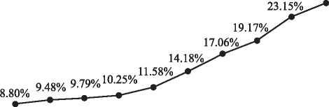

# 2023 年全国硕士研究生招生考试英语（二）试题

> 科目代码 204 ｜ 满分 100 分 ｜ 考试时间 180 分钟

> 说明：本文件由历年真题整理生成，供个人备考使用。**参考答案在文末**。

---

## Section I Use of English

Here’s a common scenario that any number of entrepreneurs face today: you’re the CEO of a small business, and though you’re making a nice \_\_\_(1)\_\_\_ , you need to find a way to take it to the next level. What you need to do is \_\_\_(2)\_\_\_ growth by establishing a growth team. A growth team is made up of members from different departments within your company, and it harnesses the power of collaboration to focus \_\_\_(3)\_\_\_ on finding ways to grow.

Let’s look at a real-world \_\_\_(4)\_\_\_ . Prior to forming a growth team, the software company BitTorrent had 50 employees working in the \_\_\_(5)\_\_\_ departments of engineering, marketing and product development. This brought them good results until 2012, when their growth plateaued. The \_\_\_(6)\_\_\_ was that too many customers were using the basic, free version of their product. And \_\_\_(7)\_\_\_ improvements to the premium, paid version, few people were making the upgrade.

Things changed, \_\_\_(8)\_\_\_ , when an innovative project-marketing manager came aboard, \_\_\_(9)\_\_\_ a growth team and sparked the kind of \_\_\_(10)\_\_\_ perspective they needed. By looking at engineering issues from a marketing point of view, it became clear that the \_\_\_(11)\_\_\_ of upgrades wasn’t due to a quality issue. Most customers were simply unaware of the premium version and what it offered.

Armed with this \_\_\_(12)\_\_\_ , the marketing and engineering teams joined forces to raise awareness by prominently \_\_\_(13)\_\_\_ the premium version to users of the free version. \_\_\_(14)\_\_\_ , upgrades skyrocketed, and revenue increased by 92 percent.

But in order for your growth team to succeed, it needs to have a strong leader. It needs someone who can \_\_\_(15)\_\_\_ the interdisciplinary team and keep them on course for improvement. This leader will \_\_\_(16)\_\_\_ the target area, set clear goals and establish a time frame for the \_\_\_(17)\_\_\_ of these goals.

The growth leader is also \_\_\_(18)\_\_\_ for keeping the team focused on moving forward and steering them clear of distractions. \_\_\_(19)\_\_\_ attractive, new ideas can be distracting; the team leader must recognize when these ideas don’t \_\_\_(20)\_\_\_ the current goal and need to be put on the back burner.

**1.** **A.** purchase&nbsp;&nbsp;&nbsp;&nbsp;**B.** profit&nbsp;&nbsp;&nbsp;&nbsp;**C.** connection&nbsp;&nbsp;&nbsp;&nbsp;**D.** bet

**2.** **A.** define&nbsp;&nbsp;&nbsp;&nbsp;**B.** predict&nbsp;&nbsp;&nbsp;&nbsp;**C.** prioritize&nbsp;&nbsp;&nbsp;&nbsp;**D.** appreciate

**3.** **A.** exclusively&nbsp;&nbsp;&nbsp;&nbsp;**B.** temporarily&nbsp;&nbsp;&nbsp;&nbsp;**C.** potentially&nbsp;&nbsp;&nbsp;&nbsp;**D.** initially

**4.** **A.** experiment&nbsp;&nbsp;&nbsp;&nbsp;**B.** proposal&nbsp;&nbsp;&nbsp;&nbsp;**C.** debate&nbsp;&nbsp;&nbsp;&nbsp;**D.** example

**5.** **A.** identical&nbsp;&nbsp;&nbsp;&nbsp;**B.** marginal&nbsp;&nbsp;&nbsp;&nbsp;**C.** provisional&nbsp;&nbsp;&nbsp;&nbsp;**D.** traditional

**6.** **A.** rumor&nbsp;&nbsp;&nbsp;&nbsp;**B.** secret&nbsp;&nbsp;&nbsp;&nbsp;**C.** myth&nbsp;&nbsp;&nbsp;&nbsp;**D.** problem

**7.** **A.** despite&nbsp;&nbsp;&nbsp;&nbsp;**B.** unlike&nbsp;&nbsp;&nbsp;&nbsp;**C.** through&nbsp;&nbsp;&nbsp;&nbsp;**D.** besides

**8.** **A.** moreover&nbsp;&nbsp;&nbsp;&nbsp;**B.** however&nbsp;&nbsp;&nbsp;&nbsp;**C.** therefore&nbsp;&nbsp;&nbsp;&nbsp;**D.** again

**9.** **A.** inspected&nbsp;&nbsp;&nbsp;&nbsp;**B.** created&nbsp;&nbsp;&nbsp;&nbsp;**C.** expanded&nbsp;&nbsp;&nbsp;&nbsp;**D.** reformed

**10.** **A.** cultural&nbsp;&nbsp;&nbsp;&nbsp;**B.** objective&nbsp;&nbsp;&nbsp;&nbsp;**C.** fresh&nbsp;&nbsp;&nbsp;&nbsp;**D.** personal

**11.** **A.** end&nbsp;&nbsp;&nbsp;&nbsp;**B.** burden&nbsp;&nbsp;&nbsp;&nbsp;**C.** lack&nbsp;&nbsp;&nbsp;&nbsp;**D.** decrease

**12.** **A.** policy&nbsp;&nbsp;&nbsp;&nbsp;**B.** suggestion&nbsp;&nbsp;&nbsp;&nbsp;**C.** purpose&nbsp;&nbsp;&nbsp;&nbsp;**D.** insight

**13.** **A.** contributing&nbsp;&nbsp;&nbsp;&nbsp;**B.** allocating&nbsp;&nbsp;&nbsp;&nbsp;**C.** promoting&nbsp;&nbsp;&nbsp;&nbsp;**D.** transferring

**14.** **A.** As a result&nbsp;&nbsp;&nbsp;&nbsp;**B.** At any rate&nbsp;&nbsp;&nbsp;&nbsp;**C.** By the way&nbsp;&nbsp;&nbsp;&nbsp;**D.** In a sense

**15.** **A.** unite&nbsp;&nbsp;&nbsp;&nbsp;**B.** finance&nbsp;&nbsp;&nbsp;&nbsp;**C.** follow&nbsp;&nbsp;&nbsp;&nbsp;**D.** choose

**16.** **A.** share&nbsp;&nbsp;&nbsp;&nbsp;**B.** identify&nbsp;&nbsp;&nbsp;&nbsp;**C.** divide&nbsp;&nbsp;&nbsp;&nbsp;**D.** broaden

**17.** **A.** announcement&nbsp;&nbsp;&nbsp;&nbsp;**B.** assessment&nbsp;&nbsp;&nbsp;&nbsp;**C.** adjustment&nbsp;&nbsp;&nbsp;&nbsp;**D.** accomplishment

**18.** **A.** famous&nbsp;&nbsp;&nbsp;&nbsp;**B.** responsible&nbsp;&nbsp;&nbsp;&nbsp;**C.** available&nbsp;&nbsp;&nbsp;&nbsp;**D.** respectable

**19.** **A.** Before&nbsp;&nbsp;&nbsp;&nbsp;**B.** Once&nbsp;&nbsp;&nbsp;&nbsp;**C.** While&nbsp;&nbsp;&nbsp;&nbsp;**D.** Unless

**20.** **A.** serve&nbsp;&nbsp;&nbsp;&nbsp;**B.** limit&nbsp;&nbsp;&nbsp;&nbsp;**C.** summarize&nbsp;&nbsp;&nbsp;&nbsp;**D.** alter

## Section II Reading Comprehension — Part A

> Read the following four texts. Answer the questions below each text by choosing A, B, C or D. Mark your answers on the ANSWER SHEET. (40 points)

In the quest for the perfect lawn, homeowners across the country are taking a shortcut—and it is the environment that is paying the price. About eight million square metres of plastic grass is sold each year but opposition has now spread to the highest gardening circles. The Chelsea Flower Show has banned fake grass from this year’s event, declaring it to be not part of its ethos. The Royal Horticultural Society (RHS), which runs the annual show in west London, says it has introduced the ban because of the damage plastic grass does to the environment and biodiversity.

Ed Home, of the RHS, said: “We launched our sustainability strategy last year and fake grass is just not in line with our ethos and views on plastic. We recommend using real grass because of its environmental benefits, which include supporting wildlife, alleviating flooding and cooling the environment.”

The RHS’s decision comes as campaigners try to raise awareness of the problems fake grass causes. A Twitter account, which claims to “cut through the greenwash” of artificial grass, already has more than 20,000 followers. It is trying to encourage people to sign two petitions, one calling for a ban on the sale of plastic grass and another calling for an “ecological damage” tax on such lawns. They have gathered 7,276 and 11,282 signatures.

However, supporters of fake grass point out that there is also an environmental impact with natural lawns, which need mowing and therefore usually consume electricity or petrol. The industry also points out that real grass requires considerable amounts of water, weed killer or other treatments and that people who lay fake grass tend to use their garden more. The industry also claims that people who lay fake grass spend an average of £500 on trees or shrubs for their garden, which provides habitat for insects.

In response to another petition last year about banning fake lawns, which gathered 30,000 signatures, the government responded that it has “no plans to ban the use of artificial grass”.

It added: “We prefer to help people and organisations make the right choice rather than legislating on such matters. However, the use of artificial grass must comply with the legal and policy safeguards in place to protect biodiversity and ensure sustainable drainage, while measures such as the strengthened biodiversity duty should serve to encourage public authorities to consider sustainable alternatives.”

**21.**

**22.**

**23.**

**24.**

**25.**

It’s easy to dismiss as absurd the federal government’s ideas for plugging the chronic funding gap of our national parks. Can anyone really think ifs a good idea to allow Amazon deliveries to your tent in Yosemite or food trucks to line up under the redwood trees at Sequoia National Park?

But the government is right about one thing: U.S. national parks are in crisis. Collectively, they have a maintenance backlog of more than $ 12 billion. Roads, trails, restrooms, visitor centers and other infrastructure are crumbling.

But privatizing and commercializing the campgrounds would not be a cure-all. Campgrounds are a tiny portion of the overall infrastructure backlog, and businesses in the parks hand over, on average, only about 5% of their revenues to the National Park Service.

Moreover, increased privatization would certainly undercut one of the major reasons why 300 million visitors come to the parks each year: to enjoy nature and get a break from the commercial drumbeat that overwhelms daily life.

The real problem is that the parks have been chronically starved of funding. An economic survey of 700 U.S. taxpayers found that people would be willing to pay a significant amount of money to make sure the parks and their programs are kept intact. Some 81% of respondents said they would be willing to pay additional taxes for the next 10 years to avoid any cuts to the national parks.

The national parks provide great value to U.S. residents both as places to escape and as symbols of nature. On top of this, they produce value from their extensive educational programs, their positive impact on the climate through carbon sequestration, their contribution to our cultural and artistic life, and of course through tourism. The parks also help keep America’s past alive, working with thousands of local jurisdictions around the country to protect historical sites and to bring the stories of these places to life.

The parks do all this on a shoestring. Congress allocates only $ 3 billion a year to the national park system—an amount that has been flat since 2001 (in inflation-adjusted dollars) with the exception of a onetime boost in 2009. Meanwhile, the number of annual visitors has increased by more than 50% since 1980, and now stands at 330 million visitors per year.

**26.**

**27.**

**28.**

**29.**

**30.**

The Internet may be changing merely what we remember, not our capacity to do so, suggests Columbia University psychology professor Betsy Sparrow. In 2011, Sparrow led a study in which participants were asked to record 40 factoids in a computer (“an ostrich’s eye is bigger than its brain,” for example). Half of the participants were told the information would be erased, while the other half were told it would be saved. Guess what? The latter group made no effort to recall the information when quizzed on it later, because they knew they could find it on their computers. In the same study, a group was asked to remember both the information and the folders it was stored in. They didn’t remember the information, but they remembered how to find the folders. In other words, human memory is not deteriorating but “adapting to new communications technology,” Sparrow says.

In a very practical way, the Internet is becoming an external hard drive for our memories, a process known as “cognitive offloading.” Traditionally, this role was fulfilled by data banks, libraries, and other humans. Your father may never remember birthdays because your mother does, for instance. Some worry that this is having a destructive effect on society, but Sparrow sees an upside. Perhaps, she suggests, the trend will change our approach to learning from a focus on individual facts and memorization to an emphasis on more conceptual thinking—something that is not available on the Internet. “I personally have never seen all that much intellectual value in memorizing things,” Sparrow says, adding that we haven’t lost our ability to do it.

Still other experts say ifs too soon to understand how the Internet affects our brains. There is no experimental evidence showing that it interferes with our ability to focus, for instance, wrote psychologists Christopher Chabris and Daniel J. Simons. And surfing the web exercised the brain more than reading did among computer-savvy older adults in a 2008 study involving 24 participants at the Semel Institute for Neuroscience and Human Behavior at the University of California, Los Angeles.

“There may be costs associated with our increased reliance on the Internet, but I’d have to imagine that overall the benefits are going to outweigh those costs,” observes psychology professor Benjamin Storm. “It seems pretty clear that memory is changing, but is it changing for the better? At this point, we don’t know.”

**31.**

**32.**

**33.**

**34.**

**35.**

Teenagers are paradoxical. That’s a mild and detached way of saying something that parents often express with considerably stronger language. But the paradox is scientific as well as personal. In adolescence, helpless and dependent children who have relied on grown-ups for just about everything become independent people who can take care of themselves and help each other. At the same time, once cheerful and compliant children become rebellious teenage risk-takers.

A new study published in the journal Child Development, by Eveline Crone of the University of Leiden and colleagues, suggests that the positive and negative sides of teenagers go hand in hand. The study is part of a new wave of thinking about adolescence. For a long time, scientists and policy makers concentrated on the idea that teenagers were a problem that needed to be solved. The new work emphasizes that adolescence is a time of opportunity as well as risk.

The researchers studied “prosocial” and rebellious traits in more than 200 children and young adults, ranging from 11 to 28 years old. The participants filled out questionnaires about how often they did things that were altruistic and positive, like sacrificing their own interests to help a friend, or rebellious and negative, like getting drunk or staying out late.

Other studies have shown that rebellious behavior increases as you become a teenager and then fades away as you grow older. But the new study shows that, interestingly, the same pattern holds for prosocial behavior. Teenagers were more likely than younger children or adults to report that they did things like unselfishly helping a friend.

Most significantly, there was a positive correlation between prosociality and rebelliousness. The teenagers who were more rebellious were also more likely to help others. The good and bad sides of adolescence seem to develop together.

Is there some common factor that underlies these apparently contradictory developments? One idea is that teenage behavior is related to what researchers call “reward sensitivity.” Decision-making always involves balancing rewards and risks, benefits and costs. “Reward sensitivity” measures how much reward it takes to outweigh risk.

Teenagers are particularly sensitive to social rewards—winning the game, impressing a new friend, getting that boy to notice you. Reward sensitivity, like prosocial behavior and risk-taking, seems to go up in adolescence and then down again as we age. Somehow, when you hit 30, the chance that something exciting and new will happen at that party just doesn’t seem to outweigh the effort of getting up off the couch.

**36.**

**37.**

**38.**

**39.**

**40.**

## Section II Reading Comprehension — Part B

> Read the following text and match each of the numbered items in the left column to its corresponding information in the right column. There are two extra choices in the right column. Mark your answers on the ANSWER SHEET. (10 points)

Net-Zero Rules Set to Send Cost of New Homes and Extensions Soaring

New building regulations aimed at improving energy efficiency are set to increase the price of new homes, as well as those of extensions and loft conversions on existing ones.

The rules, which came into effect on Wednesday in England, are part of government plans to reduce the UK's carbon emissions to net zero by 2050. They set new standards for ventilation, energy efficiency and heating, and state that new residential buildings must have charging points for electric vehicles.

The moves are the most significant change to building regulations in years, and industry experts say they will inevitably lead to higher prices at a time when a shortage of materials and high labour costs are already driving up bills.

Brian Berry, chief executive of the Federation of Master Builders, says the measures will require new materials, testing methods, products and systems to be installed. “All this comes at an increased cost during a time when prices are already sky high. Inevitably, consumers will have to pay more,” he says.

Gareth Belsham, of surveyors Naismiths, says people who are upgrading, or extending their home, will be directly affected. “The biggest changes relate to heating and insulation,” he explains. “There are new rules concerning the amount of glazing used in extensions, and any new windows or doors must be highly insulated.”

Windows and doors will have to adhere to higher standards, while there are new limits on the amount of glazing you can have to reduce unwanted heat from the sun.

Thomas Goodman, of MyJobQuote, says this will bring in new restrictions for extensions. “Glazing on windows, doors and roof lights must cover no more than 25% of the floor area to prevent heat loss,” he says.

As the rules came into effect last Wednesday, property developers were rushing to file plans just before the deadline. Any plans submitted before that date are considered to be under the previous rules, and can go ahead as long as work starts before 15 June next year.

Builders which have costed projects, but have not filed the paperwork, may need to go back and submit fresh estimates, says Marcus Jefford of Build Aviator.

Materials prices are already up 25% in the last two years. How much overall prices will increase as a result of the rule changes is not clear. “Whilst admirable in their intentions, they will add to the cost of housebuilding at a time when many already feel that they are priced out of homeownership,” says Jonathan Rolande of the National Association of Property Buyers. “An average extension will probably see around £3,000 additional cost thanks to the new regs.”

John Kelly, a construction lawyer at Freeths law firm, believes prices will eventually come down. But not in the immediate future. “As the marketplace adapts to the new requirements, and the technologies that support them, the scaling up of these technologies will eventually bring costs down, but in the short term, we will all have to pay the price of the necessary transition,” he says.

However, the long-term effects of the changes will be more comfortable and energy-efficient homes, adds Andrew Mellor, of PRP architects. “Homeowners will probably recoup that cost over time in energy bill savings. It will obviously be very volatile at the moment, but they will have that benefit over time.”

**备选项 A–G**

- **A.** The rise of home prices is a temporary matter.
- **B.** Builders possibly need to submit new estimates of their
- **C.** There will be specific limits on home extensions to prevent heat loss.
- **D.** The new rules will take home prices to an even higher
- **E.** Many people feel that home prices are already beyond
- **F.** The new rules will affect people whose home extensions include new windows or doors.
- **G.** The rule changes will benefit homeowners eventually.

**41.** &nbsp;\_\_\_\_\_\_\_\_\_\_\_\_\_\_\_\_\_\_

> Brian Berry

**42.** &nbsp;\_\_\_\_\_\_\_\_\_\_\_\_\_\_\_\_\_\_

> Gareth Belsham

**43.** &nbsp;\_\_\_\_\_\_\_\_\_\_\_\_\_\_\_\_\_\_

> Marcus Jefford

**44.** &nbsp;\_\_\_\_\_\_\_\_\_\_\_\_\_\_\_\_\_\_

> John Kelly

**45.** &nbsp;\_\_\_\_\_\_\_\_\_\_\_\_\_\_\_\_\_\_

> Andrew Mellor

## Section III Translation

> Translate the following text into Chinese. Write your translation on the ANSWER SHEET. (15 points)

In the late 18th century, William Wordsworth became famous for his poems about nature. And he was one of the founders of a movement called Romanticism, which celebrated the wonders of the natural world.

Poetry is powerful. Its energy and rhythm can capture a reader, transport them to another world and make them see things differently. Through carefully selected words and phrases, poems can be dramatic, funny, beautiful, moving and inspiring.

No one knows for sure when poetry began but it has been around for thousands of years, even before people could write. It was a way to tell stories and pass down history. It is closely related to song and even when written it is usually created to be performed out loud. Poems really come to life when they are recited. This can also help with understanding them too, because the rhythm and sounds of the words become clearer.

**46.**

## Section IV Writing — Part A

**47.** An art exhibition and a robot show are to be held on Sunday, and your friend David asks you which one he should go to. Write him an email to
1) make a suggestion, and
2) give your reason(s).
Write your answer in about 100 words on the ANSWER SHEET.
Do not use your own name in your email; use “Li Ming" instead. (10 points)

## Section IV Writing — Part B

**48.** Write an essay based on the chart below. In your essay, you should
1) describe and interpret the chart, and
2) give your comments.
Write your answer in about 150 words on the ANSWER SHEET. (15 points)

---

## 参考答案

### Section I Use of English

**1.** B · profit
**2.** C · prioritize
**3.** A · exclusively
**4.** D · example
**5.** D · traditional
**6.** D · problem
**7.** A · despite
**8.** B · however
**9.** B · created
**10.** C · fresh
**11.** C · lack
**12.** D · insight
**13.** C · promoting
**14.** A · As a result
**15.** A · unite
**16.** B · identify
**17.** D · accomplishment
**18.** B · responsible
**19.** C · While
**20.** A · serve

### Section II Reading Comprehension — Part A

*Text 1*

**21.** A · is harmful to the environment
**22.** B · resistance to fake grass use
**23.** B · the disadvantages of growing real grass
**24.** C · Remind its users to obey existing rules.
**25.** D · has been a controversial product

*Text 2*

**26.** D · Poorly maintained infrastructure.
**27.** A · spoil visitor experience
**28.** C · agree to pay extra for the national parks
**29.** B · have historical significance
**30.** D · is in need of a funding increase

*Text 3*

**31.** C · switch its focus of memory
**32.** D · lessens our memory burdens
**33.** A · It may reform our learning approach.
**34.** A · requires further academic research
**35.** B · the Internet is weakening our memory

*Text 4*

**36.** A · develop opposite personality traits
**37.** C · provides a new insight into adolescence
**38.** D · It tends to peak in adolescence.
**39.** B · care a lot about social recognition
**40.** A · Why teenagers are self-contradictory.

### Section II Reading Comprehension — Part B

**41–45**：D  F  B  A  G

### Section III Translation

> **关键词**：`late`（末期的） ｜ `famous`（著名的） ｜ `poem`（诗） ｜ `nature`（自然界） ｜ `founder`（创建者） ｜ `movement`（运动） ｜ `Romanticism`（浪漫主义） ｜ `celebrate`（赞美） ｜ `wonder`（奇迹） ｜ `poetry`（诗集） ｜ `select`（选择） ｜ `powerful`（强有力的） ｜ `energy`（能量） ｜ `phrase`（短语）
十八世纪末，威廉·华兹华斯以其关于自然的诗歌而闻名遐迩。而他也是浪漫主义运动的缔造者之一，该运动颂扬自然世界的奇迹。

诗歌富有感染力。它的能量与韵律可以捕获读者的心，带他们去到另一个世界，让他们以不同的视角来看待事物。凭借精心挑选的字词和短语，诗歌或夸张戏剧，或诙谐幽默，或优美迷人，或动人心魄，或振奋人心。

没有人确切地知道诗歌于何时兴起，但是它已经存在了数千年，甚至在人们会书写之前就已存在。它是一种讲述故事和传承历史的方式。它与音乐密切相关，即使被书写出来，也通常是为了大声朗诵而创作。诗歌在被吟诵时才真正鲜活起来。吟诵也有助于理解诗歌，因为字词的韵律和发音会更加清晰明确。

### Section IV Writing — Part A

**47 参考范文**

Dear David,

I am so glad to hear from you. You mentioned in your previous email that you are torn between visiting an art exhibition and a robot show this Sunday. It seems to me that the latter is a better choice.

For one thing, it is said that a wide range of automated machines equipped with cutting-edge technologies will be on display at this event, among which an interactive humanoid robot is most anticipated. For tech lovers like you, this is an opportunity not to be missed. For another, the robot show will bring together researchers and innovators in related fields to share insights. Trying to establish contact with them is definitely conducive to your professional development in computer programming.

I hope my suggestion will help you make up your mind. Have a wonderful weekend!

Yours sincerely,
Li Ming

### Section IV Writing — Part B

**48 参考范文**

The line chart above illustrates the variation in the health literacy rate of Chinese residents from 2012 to 2021. As it shows, these years witnessed an uninterrupted rise in residents' health literacy rate from 8.80% to 25.40%. And notably, the year 2016 marked a watershed when the growth accelerated considerably.

The reasons behind the progress in Chinese people's health literacy are multifaceted. To begin with, as general living standards and educational levels improve, residents become more aware of their health and start to seek various ways to stay healthy. Secondly, the digitalization of many health services such as online consultation and AI diagnosis enabled residents to gain easy and fast access to professional health advice. Moreover, government campaigns to promote public hygiene and healthy lifestyles have also played a significant role in raising residents' health literacy.

The general public's improved health literacy is beneficial to the whole society in many ways. First and foremost, a society consisting of people who pay high regard to health is more likely to have a healthy workforce. In addition, this society would be well prepared in times of a health crisis such as a pandemic.
