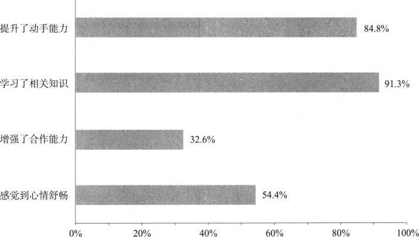

# 2024 年全国硕士研究生招生考试英语（二）试题

> 科目代码 204 ｜ 满分 100 分 ｜ 考试时间 180 分钟

> 说明：本文件由历年真题整理生成，供个人备考使用。**参考答案在文末**。

---

## Section I Use of English

> Read the following text. Choose the best word(s) for each numbered blank and mark A, B, C or D on the ANSWER SHEET. (10 points)

Your social life is defined as “the activities you do with other people, for pleasure, when you are not working”. It’s important to have a social life, but what’s right for one person won’t be right for another. Some of us feel energised by spending lots of time with others, \_\_\_(1)\_\_\_ some of us may feel drained, even if it’s doing something we enjoy.

This is why finding a \_\_\_(2)\_\_\_ in your social life is key. Spending too much time on your own, not \_\_\_(3)\_\_\_ others, can make you feel lonely and \_\_\_(4)\_\_\_ . Loneliness is known to impact on your mental health and \_\_\_(5)\_\_\_ a low mood. Anyone can feel lonely at any time. This might be especially true if, \_\_\_(6)\_\_\_ , you are working from home and you are \_\_\_(7)\_\_\_ on the usual social conversations that happen in an office. Other life changes can \_\_\_(8)\_\_\_ periods of loneliness too, such as retirement, changing jobs or becoming a parent.

It’s important to recognise these feelings of loneliness. There are ways to \_\_\_(9)\_\_\_ a social life, but it can feel overwhelming \_\_\_(10)\_\_\_ . It’s a great idea to start by thinking about hobbies you enjoy. You can then find groups and activities related to those where you will be able to meet \_\_\_(11)\_\_\_ people. There are groups aimed at new parents, at those who want to \_\_\_(12)\_\_\_ a new sport for the first time, or networking events for those in the same profession to meet up and \_\_\_(13)\_\_\_ ideas.

On the other hand, it’s \_\_\_(14)\_\_\_ possible to have too much of a social life. If you feel like you’re always doing something and there is never any \_\_\_(15)\_\_\_ in your calendar for downtime, you could suffer social burnout or social \_\_\_(16)\_\_\_ . We all have our own social limit and it’s important to recognise when you’re feeling like it’s all too much. Low mood, low energy, irritability and trouble sleeping could all be \_\_\_(17)\_\_\_ of poor social health. Make sure you \_\_\_(18)\_\_\_ some time in your diary when you’re \_\_\_(19)\_\_\_ for socialising and use this time to relax, \_\_\_(20)\_\_\_ and recover.

**1.** **A.** because&nbsp;&nbsp;&nbsp;&nbsp;**B.** unless&nbsp;&nbsp;&nbsp;&nbsp;**C.** whereas&nbsp;&nbsp;&nbsp;&nbsp;**D.** until

**2.** **A.** contrast&nbsp;&nbsp;&nbsp;&nbsp;**B.** balance&nbsp;&nbsp;&nbsp;&nbsp;**C.** link&nbsp;&nbsp;&nbsp;&nbsp;**D.** gap

**3.** **A.** seeing&nbsp;&nbsp;&nbsp;&nbsp;**B.** pleasing&nbsp;&nbsp;&nbsp;&nbsp;**C.** judging&nbsp;&nbsp;&nbsp;&nbsp;**D.** teaching

**4.** **A.** misguided&nbsp;&nbsp;&nbsp;&nbsp;**B.** surprised&nbsp;&nbsp;&nbsp;&nbsp;**C.** spoiled&nbsp;&nbsp;&nbsp;&nbsp;**D.** disconnected

**5.** **A.** contribute to&nbsp;&nbsp;&nbsp;&nbsp;**B.** rely on&nbsp;&nbsp;&nbsp;&nbsp;**C.** interfere with&nbsp;&nbsp;&nbsp;&nbsp;**D.** go against

**6.** **A.** in fact&nbsp;&nbsp;&nbsp;&nbsp;**B.** of course&nbsp;&nbsp;&nbsp;&nbsp;**C.** for example&nbsp;&nbsp;&nbsp;&nbsp;**D.** on average

**7.** **A.** cutting back&nbsp;&nbsp;&nbsp;&nbsp;**B.** missing out&nbsp;&nbsp;&nbsp;&nbsp;**C.** breaking in&nbsp;&nbsp;&nbsp;&nbsp;**D.** looking down

**8.** **A.** shorten&nbsp;&nbsp;&nbsp;&nbsp;**B.** trigger&nbsp;&nbsp;&nbsp;&nbsp;**C.** follow&nbsp;&nbsp;&nbsp;&nbsp;**D.** interrupt

**9.** **A.** assess&nbsp;&nbsp;&nbsp;&nbsp;**B.** interpret&nbsp;&nbsp;&nbsp;&nbsp;**C.** provide&nbsp;&nbsp;&nbsp;&nbsp;**D.** regain

**10.** **A.** at first&nbsp;&nbsp;&nbsp;&nbsp;**B.** in turn&nbsp;&nbsp;&nbsp;&nbsp;**C.** on time&nbsp;&nbsp;&nbsp;&nbsp;**D.** by chance

**11.** **A.** far-sighted&nbsp;&nbsp;&nbsp;&nbsp;**B.** strong-willed&nbsp;&nbsp;&nbsp;&nbsp;**C.** kind-hearted&nbsp;&nbsp;&nbsp;&nbsp;**D.** like-minded

**12.** **A.** try&nbsp;&nbsp;&nbsp;&nbsp;**B.** promote&nbsp;&nbsp;&nbsp;&nbsp;**C.** watch&nbsp;&nbsp;&nbsp;&nbsp;**D.** describe

**13.** **A.** test&nbsp;&nbsp;&nbsp;&nbsp;**B.** share&nbsp;&nbsp;&nbsp;&nbsp;**C.** accept&nbsp;&nbsp;&nbsp;&nbsp;**D.** revise

**14.** **A.** already&nbsp;&nbsp;&nbsp;&nbsp;**B.** thus&nbsp;&nbsp;&nbsp;&nbsp;**C.** also&nbsp;&nbsp;&nbsp;&nbsp;**D.** only

**15.** **A.** list&nbsp;&nbsp;&nbsp;&nbsp;**B.** order&nbsp;&nbsp;&nbsp;&nbsp;**C.** space&nbsp;&nbsp;&nbsp;&nbsp;**D.** boundary

**16.** **A.** fatigue&nbsp;&nbsp;&nbsp;&nbsp;**B.** criticism&nbsp;&nbsp;&nbsp;&nbsp;**C.** injustice&nbsp;&nbsp;&nbsp;&nbsp;**D.** dilemma

**17.** **A.** sources&nbsp;&nbsp;&nbsp;&nbsp;**B.** standards&nbsp;&nbsp;&nbsp;&nbsp;**C.** signs&nbsp;&nbsp;&nbsp;&nbsp;**D.** scores

**18.** **A.** take over&nbsp;&nbsp;&nbsp;&nbsp;**B.** wipe off&nbsp;&nbsp;&nbsp;&nbsp;**C.** add up&nbsp;&nbsp;&nbsp;&nbsp;**D.** mark out

**19.** **A.** ungrateful&nbsp;&nbsp;&nbsp;&nbsp;**B.** unavailable&nbsp;&nbsp;&nbsp;&nbsp;**C.** responsible&nbsp;&nbsp;&nbsp;&nbsp;**D.** regretful

**20.** **A.** react&nbsp;&nbsp;&nbsp;&nbsp;**B.** repeat&nbsp;&nbsp;&nbsp;&nbsp;**C.** return&nbsp;&nbsp;&nbsp;&nbsp;**D.** rest

## Section II Reading Comprehension — Part A

> Read the following four texts. Answer the questions after each text by choosing A, B, C or D. Mark your answers on the ANSWER SHEET. (40 points)

### Text 1

In her new book Cogs and Monsters: What Economics Is, and What It Should Be, Diane Coyle, an economist at Cambridge University, argues that the digital economy requires new ways of thinking about progress. “Whatever we mean by the economy growing, by things getting better, the gains will have to be more evenly shared than in the recent past,” she writes. “An economy of tech millionaires or billionaires and gig workers, with middle-income jobs undercut by automation, will not be politically sustainable.”

Improving living standards and increasing prosperity for more people will require greater use of digital technologies to boost productivity in various sectors, including health care and construction, says Coyle. But people can’t be expected to embrace the changes if they’re not seeing the benefits — if they’re just seeing good jobs being destroyed.

In a recent interview, Coyle said she fears that tech’s inequality problem could be a roadblock to deploying AI. “We’re talking about disruption,” she says. “These are transformative technologies that change the ways we spend our time every day, that change business models that succeed.” To make such “tremendous changes,” she adds, you need social buy-in.

Instead, says Coyle, resentment is simmering among many as the benefits are perceived to go to elites in a handful of prosperous cities.

According to the Brookings Institution, a short list of eight American cities that included San Francisco, San Jose, Boston, and Seattle had roughly 38% of all tech jobs by 2019. New AI technologies are particularly concentrated: Brookings’s Mark Muro and Sifan Liu estimate that just 15 cities account for two-thirds of the AI assets and capabilities in the United States.

The dominance of a few cities in the invention and commercialization of AI means that geographical disparities in wealth will continue to soar. Not only will this foster political and social unrest, but it could, as Coyle suggests, hold back the sorts of AI technologies needed for regional economies to grow.

Part of the solution could lie in somehow loosening the stranglehold that Big Tech has on defining the AI agenda. That will likely take increased federal funding for research independent of the tech giants.

A more immediate response is to broaden our digital imaginations to conceive of AI technologies that don’t simply replace jobs but expand opportunities in the sectors that different parts of the country care most about, like health care, education, and manufacturing.

**21.** Coyle argues in her new book that economic growth should

- **A.** give rise to innovations.
- **B.** diversify career choices.
- **C.** benefit people equally.
- **D.** be promoted forcefully.

**22.** According to Paragraph 2, digital technologies should be used to

- **A.** bring about instant prosperity.
- **B.** reduce people’s workload.
- **C.** raise overall work efficiency.
- **D.** enhance cross-sector cooperation.

**23.** What does Coyle fear about transformative technologies?

- **A.** They may affect work-life balance.
- **B.** They may be impractical to deploy.
- **C.** They may incur huge expenditure.
- **D.** They may be unwelcome to the public.

**24.** Several American cities are mentioned to show

- **A.** the uneven distribution of AI technologies in the US.
- **B.** the disappointing prospect of tech jobs in the US.
- **C.** the fast progress of US regional economies.
- **D.** the increasing significance of US AI assets.

**25.** With regard to Coyle’s concern, the author suggests

- **A.** raising funds to start new AI projects.
- **B.** encouraging collaboration in AI research.
- **C.** guarding against the side effects of AI.
- **D.** redefining the role of AI technologies.

### Text 2

The UK is facing a future construction crisis because of a failure to plant trees to produce wood, Confor has warned. The forestry and wood trade body has called for urgent action to reduce the country’s reliance on timber imports and provide a stable supply of wood for future generations. Currently only 20 per cent of the UK’s wood requirement is home-grown while it remains the second-largest net importer of timber in the world.

Coming at a time of fresh incentives from the UK government for landowners to grow more trees, the trade body says these don’t go far enough and fail to promote the benefits of planting them to boost timber supplies. “Not only are we facing a carbon crisis now, but we will also be facing a future construction crisis because of a failure to plant trees to produce wood,” said Stuart Goodall, chief executive of Confor. “For decades we have not taken responsibility for investing in our domestic wood supply, leaving us exposed to fluctuating prices and fighting for future supplies of wood as global demand rises and our own supplies fall.”

The UK has ideal conditions for growing wood to build low-carbon homes and is a global leader in certifying that its forests are sustainably managed, Confor says. While around three quarters of Scottish homes are built from Scottish timber, the use of home-grown wood in England is only around 25 per cent. The causes of the UK’s current position are complex and range from outdated perceptions of productive forestry to the decimation of trees by grey squirrels. It also encompasses significant hesitation on behalf of farmers and other landowners to invest in longer-term planting projects.

While productive tree planting can deliver real financial benefits to rural economies and contribute to the UK’s net-zero strategy, the focus of government support continues to be on food production and the rewilding and planting of native woodland solely for biodiversity. Goodall added: “While food production and biodiversity health are clearly of critical importance, we need our land to also provide secure supplies of wood for construction, manufacturing and contribute to net zero.”

“While the UK government has stated its ambition for more tree planting, there has been little action on the ground. Confor is now calling for much greater impetus behind those aspirations to ensure we have enough wood to meet increasing demand.”

**26.** It can be learned from Paragraph 1 that the UK needs to

- **A.** increase its domestic wood supply.
- **B.** reduce its demand for timber.
- **C.** lower its wood production costs.
- **D.** lift its control on timber imports.

**27.** According to Confdr, the UK government’s fresh incentives

- **A.** can hardly address a construction crisis.
- **B.** are believed to come at a wrong time.
- **C.** seem to be misleading for landowners.
- **D.** will be too costly to put into practice.

**28.** The UK’s exposure to fluctuating wood prices is a result of

- **A.** the government’s inaction on timber imports.
- **B.** inadequate investment in growing wood.
- **C.** the competition among timber traders at home.
- **D.** wood producers’ motive to maximise profits.

**29.** Which of the following causes the shortage of wood supply in the UK?

- **A.** Excessive timber consumption in construction.
- **B.** Unfavourable conditions for growing wood.
- **C.** Outdated technologies of the wood industry.
- **D.** Farmers’ unwillingness to plant trees.

**30.** What does Goodall think the UK government should do?

- **A.** Subsidise the building of low-carbon homes.
- **B.** Pay greater attention to boosting rural economies.
- **C.** Provide more support for productive tree planting.
- **D.** Give priority to pursuing its net-zero strategy.

### Text 3

One of the biggest challenges in keeping unsafe aging drivers off the road is convincing them that it’s time to turn over the keys. “It’s a complete life-changer” when someone stops—or is forced to stop—driving, said former risk manager Anne M. Menke.

“The American Medical Association advises physicians that ‘in situations where clear evidence of substantial driving impairment implies a strong threat to patient and public safety, and where the physician’s advice to discontinue driving privileges is ignored, it is desirable and ethical to notify the Department of Motor Vehicles,’” Menke wrote. “Some states require physicians to report, others allow but do not mandate reports, while a few consider a report a breach of confidentiality. There could be liability and penalties if a physician does not act in accordance with state laws on reporting and confidentiality,” she counseled.

Part of the problem in keeping older drivers safe is that the difficulties are addressed piecemeal by different professions with different focuses, including gerontologists, highway administration officials, automotive engineers and others, said gerontologist Elizabeth Dugan. “There’s not a National Institute of Older Driver Studies,” she said. “We need better evidence on what makes drivers unsafe” and what can help, said Dugan.

One thing that does seem to work is requiring drivers to report in person for license renewal. Mandatory in-person renewal was associated with a 31 per cent reduction in fatal crashes involving drivers 85 or older, according to one study. Passing vision tests also produced a similar decline in fatal crashes for those drivers, although there appeared to be no benefit from combining the two.

Many older drivers don’t see eye doctors or can’t afford to. Primary care providers have their hands full and may not be able to follow through with patients who have trouble driving because they can’t turn their heads or remember where they are going—or have gotten shorter and haven’t changed their seat settings sufficiently to reach car pedals easily.

As long as there are other cars on the roads, self-driving cars won’t solve the problems of crashes, said Dugan. Avoiding dangers posed by all those human drivers would require too many algorithms, she said. But we need to do more to improve safety, said Dugan. “If we’re going to have 100-year lives, we need cars that a 90-year-old can drive comfortably.

**31.** According to Paragraph 1, keeping unsafe aging drivers off the road

- **A.** is a new safety measure.
- **B.** has become a disputed issue.
- **C.** can be a tough task to complete.
- **D.** will be beneficial to their health.

**32.** The American Medical Association’s advice

- **A.** has won support from drivers.
- **B.** is generally considered unrealistic.
- **C.** is widely dismissed as unnecessary.
- **D.** has met with different responses.

**33.** According to Dugan, efforts to keep older drivers safe

- **A.** have brought about big changes.
- **B.** need to be well coordinated.
- **C.** have gained public recognition.
- **D.** call for relevant legal support.

**34.** Some older drivers have trouble driving because they tend to.

- **A.** stick with bad driving habits.
- **B.** have a weakened memory.
- **C.** suffer from chronic pains.
- **D.** neglect car maintenance.

**35.** Dugan thinks that the solution to the problems of crashes may lie in

- **A.** upgrading self-driving vehicles.
- **B.** developing senior-friendly cars.
- **C.** renovating transport facilities.
- **D.** adjusting the age limit for drivers.

### Text 4

If you look at the apps on your phone, chances are you have at least one related to your health—and probably several. Whether it is a mental health app, a fitness tracker, a connected health device or something else, many of us are taking advantage of this technology to keep better track of our health in some shape or form. Recent research from the Organization for the Review of Care and Health Applications found that 350,000 health apps were available on the market, 90,000 of which launched in 2020 alone.

While these apps have a great deal to offer, it is not always clear how the personal information we input is collected, safeguarded and shared online. Existing health privacy law, such as the Health Insurance Portability and Accountability Act, is primarily focused on the way hospitals, doctors’ offices, clinics and insurance companies store health records online. The health information these apps and health data tracking wearables are collecting typically does not receive the same legal protections.

Without additional protections in place, companies may share (and potentially monetize) personal health information in a way consumers may not have authorized or anticipated. In 2021, Flo Health faced a Federal Trade Commission (FTC) investigation. The FTC alleged in a complaint that “despite express privacy claims, the company took control of users’ sensitive fertility data and shared it with third parties.” Flo Health and the FTC settled the matter with a Consent Order requiring the company to get app users’ express affirmative consent before sharing their health information as well as to instruct the third parties to delete the data they had obtained.

Section 5 of the FTC Act empowers the FTC to initiate enforcement action against unfair or deceptive acts, meaning the FTC can only act after the fact if a company’s privacy practices are misleading or cause unjustified consumer harm. While the FTC is doing what it can to ensure apps are keeping their promises to consumers around the handling of their sensitive health information, the rate at which these health apps are hitting the market demonstrates just how immense of a challenge this is.

As to the prospects for federal legislation, commentators suggest that comprehensive federal privacy legislation seems unlikely in the short term. States have begun implementing their own solutions to shore up protections for consumer-generated health data. California has been at the forefront of state privacy efforts with the California Consumer Privacy Act of 2018. Virginia, Colorado and Utah have also recently passed state consumer data privacy legislation.

**36.** The research findings are cited in Paragraph 1 to show

- **A.** the prevalence of health apps.
- **B.** the public concern over health.
- **C.** the popularity of smartphones.
- **D.** the advancement of technology.

**37.** What does the author imply about existing health privacy law?

- **A.** Its coverage needs to be extended.
- **B.** Its enforcement needs strengthening.
- **C.** It has discouraged medical misconduct.
- **D.** It has disappointed insurance companies.

**38.** Before sharing its users’ health information, Flo Health is required to

- **A.** seek the approval of the FTC.
- **B.** find qualified third parties.
- **C.** remove irrelevant personal data.
- **D.** obtain their explicit permission.

**39.** What challenge is the FTC currently faced with?

- **A.** The complexity of health information.
- **B.** The rapid increase in new health apps.
- **C.** The subtle deceptiveness of health apps.
- **D.** The difficulty in assessing consumer harm.

**40.** It can be learned from the last paragraph that health data protection

- **A.** has been embraced by health app developers.
- **B.** has been a focus of federal policy-making.
- **C.** has encountered opposition in California.
- **D.** has gained legislative support in some states.

## Section II Reading Comprehension — Part B

> Read the following text and match each of the numbered items in the left column to its corresponding information in the right column. There are two extra choices in the right column. Mark your answers on the ANSWER SHEET. (10 points)

High school students eager to stand out in the college application process often participate in a litany of extracurricular activities hoping to bolster their chances of admission to a selective undergraduate institution.

However, college admissions experts say that the quality of a college hopeful’s extracurricular activities matters more than the number of activities he or she participates in.

Sue Rexford, the director of college guidance at the Charles E. Smith Jewish Day School, says it is not necessary for a student filling out the Common Application to list 10 activities in the application.

“No college will expect that a student has a huge laundry list of extracurriculars that they have been passionately involved in each for an extended period of time,” Rexford wrote in an email.

Experts say it is tougher to distinguish oneself in a school-affiliated extracurricular activity that is common among high school students than it is to stand out while doing an uncommon activity.

“The competition to stand out and make an impact is going to be much stiffer, and so if they’re going to do a popular activity, I’d say, be the best at it,” says Sara Harberson, a college admissions consultant.

High school students who have an impressive personal project they are working on independently often impress colleges, experts say.

“For example, a student with an interest in entrepreneurship could demonstrate skill and potential by starting a profitable small business,” Olivia Valdes, the founder of Zen Admissions consulting firm, wrote in an email.

Joseph Adegboyega-Edun, a Maryland high school guidance counselor, says unconventional extracurricular activities can help students impress college admissions offices, assuming they demonstrated serious commitment. “Again, since one of the big questions high school seniors must consider is ‘What makes you unique?,’ having an uncommon extracurricular activity vs. a conventional one is an advantage,” he wrote in an email.

Experts say demonstrating talent in at least one extracurricular activity can help in the college admissions process, especially at top-tier undergraduate institutions.

“Distinguishing yourself in one focused type of extracurricular activity can be a positive in the admissions process, especially for highly selective institutions, where having top grades and test scores is not enough,” Katie Kelley, admissions counselor at IvyWise admissions consultancy, wrote in an email. “Students need to have that quality or hook that will appeal to admissions officers and allow them to visualize how the student might come and enrich their campus community.”

Extracurricular activities related to the college major declared on a college application are beneficial, experts suggest. “If you already know your major, having an extracurricular that fits into that major can be a big plus,” says Mayghin Levine, the manager of educational opportunities with The Cabbage Patch Settlement House, a Louisville, Kentucky, nonprofit community center.

High school students who have had a strong positive influence on their community through an extracurricular activity may impress a college and win a scholarship, says Erica Gwyn, a former math and science magnet program assistant at a public high school who is now executive director of the Kaleidoscope Careers Academy in Atlanta, a nonprofit organization.

**备选项 A–G**

- **A.** Students who stand out in a specific extracurricular activity will be favored by top-tier institutions.
- **B.** Students whose extracurricular activity has benefited their community are likely to win a scholarship.
- **C.** Undertaking too many extracurricular activities will hardly be seen as a plus by colleges.
- **D.** A student who exhibits abilities in doing business can impress colleges.
- **E.** High school students participating in a popular activity should excel in it.
- **F.** Engaging in uncommon activities can demonstrate students’ determination and dedication.
- **G.** It is advisable for students to choose an extracurricular activity that is related to their future study at college.

**41.** &nbsp;\_\_\_\_\_\_\_\_\_\_\_\_\_\_\_\_\_\_

> Sue Rexford

**42.** &nbsp;\_\_\_\_\_\_\_\_\_\_\_\_\_\_\_\_\_\_

> Sara Harberson

**43.** &nbsp;\_\_\_\_\_\_\_\_\_\_\_\_\_\_\_\_\_\_

> Katie Kelley

**44.** &nbsp;\_\_\_\_\_\_\_\_\_\_\_\_\_\_\_\_\_\_

> Mayghin Levine

**45.** &nbsp;\_\_\_\_\_\_\_\_\_\_\_\_\_\_\_\_\_\_

> Erica Gwyn

## Section III Translation

> Translate the following text into Chinese. Write your translation on the ANSWER SHEET. (15 points)

With the smell of coffee and fresh bread floating in the air, stalls bursting with colourful vegetables and tempting cheeses, and the buzz of friendly chats, farmers’ markets are a feast for the senses. They also provide an opportunity to talk to the people responsible for growing or raising your food, support your local economy and pick up fresh seasonal produce—all at the same time.

Farmers’ markets are usually weekly or monthly events, most often with outdoor stalls, which allow farmers or producers to sell their food directly to customers. The size or regularity of markets can vary from season to season, depending on the area’s agricultural calendar, and you’re likely to find different produce on sale at different times of the year. By cutting out the middleman, the farmers secure more profit for their produce. Shoppers also benefit from seeing exactly where—and to who—their money is going.

**46.**

## Section IV Writing — Part A

**47.** Suppose you and Jack are going to do a survey on the protection of old houses in an ancient town. Write him an email to
1) put forward your plan, and
2) ask for his opinion.
Write your answer in about 100 words on the ANSWER SHEET.
Do not use your own name in your email; use “Li Ming” instead.

## Section IV Writing — Part B

**48.** Write an essay based on the chart below. In your essay, you should
1) describe and interpret the chart, and
2) give your comments.
Write your answer in about 150 words on the ANSWER SHEET.

某高校劳动实践课学生主要收获调查

---

## 参考答案

### Section I Use of English

**1.** C · whereas
**2.** B · balance
**3.** A · seeing
**4.** D · disconnected
**5.** A · contribute to
**6.** C · for example
**7.** B · missing out
**8.** B · trigger
**9.** D · regain
**10.** A · at first
**11.** D · like-minded
**12.** A · try
**13.** B · share
**14.** C · also
**15.** C · space
**16.** A · fatigue
**17.** C · signs
**18.** D · mark out
**19.** B · unavailable
**20.** D · rest

### Section II Reading Comprehension — Part A

*Text 1*

**21.** C · benefit people equally.
**22.** C · raise overall work efficiency.
**23.** D · They may be unwelcome to the public.
**24.** A · the uneven distribution of AI technologies in the US.
**25.** D · redefining the role of AI technologies.

*Text 2*

**26.** A · increase its domestic wood supply.
**27.** A · can hardly address a construction crisis.
**28.** B · inadequate investment in growing wood.
**29.** D · Farmers’ unwillingness to plant trees.
**30.** C · Provide more support for productive tree planting.

*Text 3*

**31.** C · can be a tough task to complete.
**32.** D · has met with different responses.
**33.** B · need to be well coordinated.
**34.** B · have a weakened memory.
**35.** B · developing senior-friendly cars.

*Text 4*

**36.** A · the prevalence of health apps.
**37.** A · Its coverage needs to be extended.
**38.** D · obtain their explicit permission.
**39.** B · The rapid increase in new health apps.
**40.** D · has gained legislative support in some states.

### Section II Reading Comprehension — Part B

*How Colleges Weigh Applicants’ Extracurricular Activities* ｜ **41–45**：C  E  A  G  B

### Section III Translation

> **关键词**：`farmers' markets are a feast for the senses` ｜ `stalls bursting with colourful vegetables and tempting cheeses` ｜ `the buzz of friendly chats` ｜ `provide an opportunity to ... support your local economy and pick up fresh seasonal produce` ｜ `sell their food directly to customers` ｜ `the size or regularity of markets can vary from season to season` ｜ `depending on the area's agricultural calendar` ｜ `cutting out the middleman` ｜ `secure more profit for their produce` ｜ `seeing exactly where—and to who—their money is going`
空气中弥漫着咖啡和新鲜面包的香味，摊位上摆满了五颜六色的蔬菜和令人垂涎的奶酪，友好的交谈声嘈杂而又喧闹着，农贸市场就是一场感官盛宴。它们还提供了一个机会，让人们既能与提供食物的种植者和养殖者交谈，又能（在经济上）支持地方经济，同时还能买到新鲜便宜的时令农产品。

农贸市场通常是每周或每月举行一次的活动，其中最常见的是户外摊位，这使得农民或生产者能够将他们的食物直接售卖给顾客。农贸市场的规模或规律因季节而异，这取决于当地的农历，你很可能会发现在一年中的不同时间点里会有不同的农产品在出售。通过省去中间商环节，农民可以从自己的农产品中获取更多的利润。顾客也能从中受益，因为他们能够清楚地看见自己的钱花在了哪里、付给了谁。

### Section IV Writing — Part A

**47 参考范文**

Dear Jack,

I am full of anticipation for our survey on the protection of old houses in the ancient town nearby. To ensure it goes well, I would like to outline my plan.

We could start by using online archives to find out about the history of these old houses before conducting a field investigation to document their current condition with photos. During our visit to the ancient town, we could interview a random sample of local residents and tourists, whose views may be a useful guideline for raising public awareness of historic preservation. Furthermore, it would be essential to ask experts to share their insights into how to tackle the challenges of heritage building protection.

This is my preliminary plan for the investigation. I would like to hear your thoughts, particularly on what questions to ask during interviews. Please feel free to share your feedback anytime.

Yours sincerely,
Li Ming

### Section IV Writing — Part B

**48 参考范文**

The bar chart illustrates the major gains students have obtained from a practical course at a certain university. Notably, 91.3% of students reported acquiring relevant knowledge, and 84.8% honed their hands-on skills. Additionally, a considerable 54.4% reported a boost in well-being. However, only a minority, 32.6%, felt their teamwork abilities improved.

The course's success in imparting theoretical knowledge and practical skills is clear, reflecting its strong emphasis on fostering individual competencies. However, the modern labor market demands not only professional expertise but also the ability to work effectively in teams. The underdevelopment of cooperative skills as indicated by the survey points to a need for more collaborative activities in the course. At the same time, the course's positive influence on students' well-being is a critical aspect that should be maintained and highlighted as a model for student-centered education.

To optimize the curriculum, it is recommended to integrate more group projects that encourage interaction and teamwork. This, combined with the benefits of the course in enhancing individual capabilities and well-being, would create a more comprehensive educational experience.
